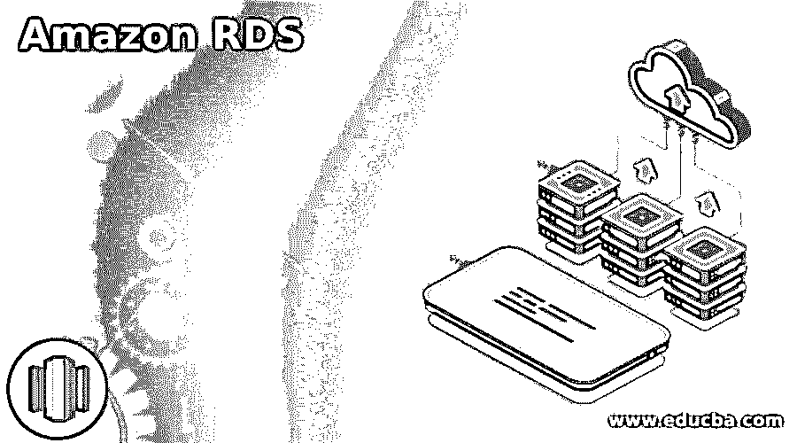

# 亚马逊 RDS

> 原文：<https://www.educba.com/amazon-rds/>

## 亚马逊 RDS 简介

Amazon RDS 使在云平台中设置、操作和扩展关系数据库变得很容易，它提供了经济高效、可调整大小的容量，同时自动化了耗时的管理任务，如硬件配置、云中的数据库设置、补丁安装和其他与业务数据相关的备份。它主要关注我们可以通过快速和高性能实现的应用程序，这与用户需要的可用性、安全性和更多兼容性相关。它一直在使用多个数据库实例及其类型进行操作。

### 什么是亚马逊 RDS？

*   亚马逊关系数据库服务是亚马逊提供的分布式关系数据库服务之一。
*   它通过使用 web 服务得到完全支持，并通过 SQL 数据库服务进行管理。
*   通常，它支持一系列数据库引擎来存储和组织数据，以帮助完成与数据库、迁移、备份、恢复和数据修补相关的管理任务。

### Amazon RDS 数据库实例

*   数据库实例是一个独立的数据库环境，有助于在云平台上运行，它是 Amazon RDS 的基本构建块。
*   db 实例包含使用相同的客户端工具访问的多个用户创建的数据库，这些客户端工具与可能用于访问独立应用程序的数据库实例的应用程序相关。使用 DB 实例，在 Amazon AWS 命令行工具、Amazon RDS API 操作和 AWS 管理控制台中创建和修改数据应该很简单。
*   当我们使用实例时，它有一些限制，如最多 40 个 Amazon RDS DB 实例，每个 SQL Server 版本 10 个。它涵盖了所有版本，如许可证包含模式下的企业、标准、Web 和 Express。然后，在包含许可证的模式下，Oracle 环境为 10，My SQL、MariaDB 和 PostgreSQL 等为 40。Oracle 环境还支持 BYOL(“自带许可证”)许可模式类型。

### 亚马逊 RDS 数据库引擎

*   在 Amazon RDS 服务中，它为各种客户运行数千个数据库，这使他们能够确定实现 CPU 优化、最佳利用率、安全性和 RDS 实例的其他性能的最佳实践。
*   基本上，RDS 客户会收到这些类型的建议，他们可以评估这些建议的有效性，并根据他们的首选途径采取适当的措施，或者忽略这些建议。
*   用户可以根据 Amazon RDS 上提供的计算和数据存储选项来决定 SSD 支持的存储支持一般用途和 IOPS 调配的使用情形。

### 目录

我们在 AWS 工具中使用了一些不同的表格内容，如下所示:

<small>Hadoop、数据科学、统计学&其他</small>

*   AWS 上的数据库:一般来说，WordPress 会在一个单独的数据库中存储所有的数据位，这些数据位使网站更加复杂。在公共区域，这种方法将被设置为受限访问，并与将创建实例以在独立环境中运行的任何类型的应用程序进行排序。
*   **AWS 用户:**它是 AWS 中的主要领域，主要概念是基于云的项目中的弹性、可伸缩性和高可用性。因此，如果在其他公共领域也可以访问这些数据，那么访问起来会更加安全。
*   **AWS 的作用:**主要是与混合存储解决方案相关联并一起使用，因此与其他流程相比，数据迁移将更加容易。因此，无论数据是否存储在硬盘上，数据中心都应该是基础架构的其余部分。
*   **AWS 开发人员工具:**在任何应用程序中，调试模式和开发人员工具都是使用 CLI(命令行界面)和其他编程工具完成许多重要工作的重要功能。开发者工具涵盖了 SDK(软件开发工具包)。IDE(集成开发环境)工具包。

### 亚马逊 RDS 的主要特性

*   Amazon RDS 是托管关系数据库服务，可以使用熟悉的数据库引擎提供，包括 Amazon Aurora、MySQL、MariaDB、Oracle、Microsoft SQL Server 和 PostgreSQL。
*   这种类型的功能目前用于现有的数据库，可以用于亚马逊 RDS。
*   以便处理日常数据库任务，如备份、修补、恢复、故障检测和修复。

### 亚马逊 RDS 的顶级替代品

它有一些不同的替代方法，其中一些如下所示:

*   Oracle 数据库、IBM Db2、SAP HANA、Microsoft SQL、Azure SQL 数据库、MySQL、PostgreSQL、Google Cloud SQL，这些是一些 RDS 替代工具方法，用于堆栈竞争，它检查信息技术和服务、计算机软件和金融服务领域的当前和以前用户的评论，以获得业务需求中的最佳产品。
*   当我们使用替代方法时，每种方法都有单独的服务提供商，如 DBaaS(数据库即服务),广泛用于不同的技术，许多人都在寻求简单、更强大的软件解决方案，包括数据库监控、异常检测和其他治理。

### 亚马逊 RDS 与 Xplenty

下面给出的是亚马逊 RDS vs Xplenty:

| **亚马逊 RDS** | **XPlenty** |
| RDS 使得在云中扩展关系数据库变得更加容易。 | 它是在云中设置和操作数据库的强大工具之一。 |
| RDS 是经济高效的解决方案，可以根据任何容量调整大小 | 因为它是 ETL 工具，所以它的成本效益很高。 |
| 它可以兼容多种数据库实例类型，能够高效地工作。 | 它确保每天编排流畅的编排数据流。 |
| AWS 负责基础设施和任务维护。 | 它有 CRM、内部部署、混合和云环境。 |

### 结论

一般来说，信息技术的发展是在 web 服务进入 IT 领域之后。它有大量的功能和服务可以在应用程序中实现，例如 AWS 在云平台中使用最广泛，将成为用户数据的更安全的网关。

### 推荐文章

这是亚马逊 RDS 的指南。在这里，我们讨论 amazon RDS 数据库实例、数据库引擎、目录、特性和替代方案。您也可以看看以下文章，了解更多信息–

1.  [亚马逊 EBS](https://www.educba.com/amazon-ebs/)
2.  [亚马逊 SQS](https://www.educba.com/amazon-sqs/)
3.  [亚马逊 53 号公路](https://www.educba.com/amazon-route-53/)
4.  什么是亚马逊 VPC？

