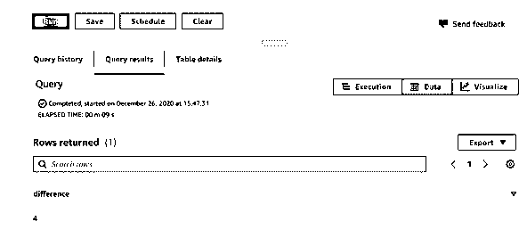
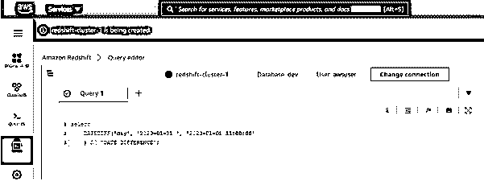
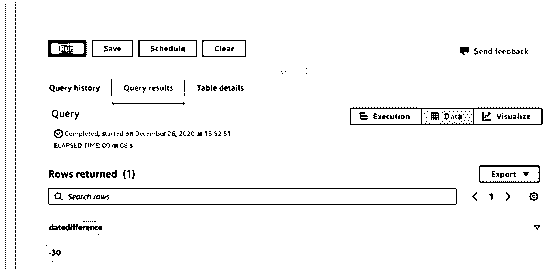
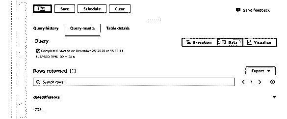
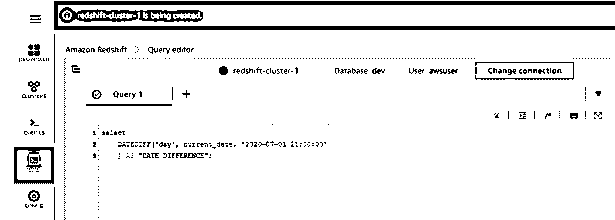
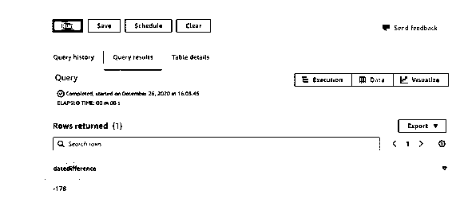
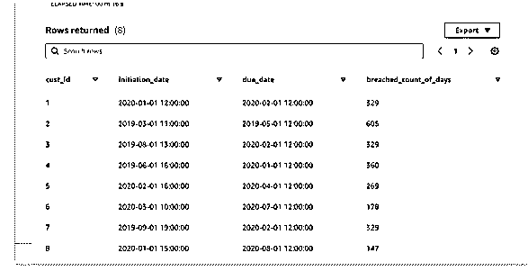
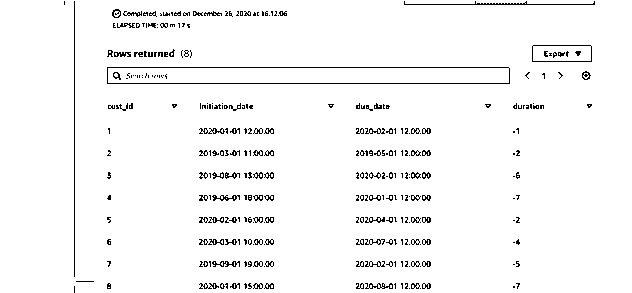

# 红移日期差

> 原文：<https://www.educba.com/redshift-datediff/>

## 红移日期差的定义

Redshift DateDiff 用于查找指定日期之间的差异。除了语法中使用的参数之外，datediff 在所有数据库中的用法都是相似的。redshift 中使用的 DateDiff 函数有三个参数，我们指定想要找出差异的日期。自变量是<date1>和<date2>。第三个参数是 datepart。日期部分只是日期或时间值，即年、月、日、小时、分钟、秒、毫秒或微秒。</date2></date1>

在本节中，我们将看到 DateDiff 是如何单独工作的，以及表格和示例:–

<small>Hadoop、数据科学、统计学&其他</small>

**语法:**

现在让我们看看 DateDiff 的语法如下:–

`SELECT DATEDIFF (‘datepart’, <date | time | timetz | timestamp>, <date | time | timetz | timestamp>);`

上面的语法用于查找表中指定日期的列之间的差异。

`SELECT DATEDIFF (‘datepart’, <COLUMN_NAME_1>, <COLUMN_NAME_2>) FROM TABLE_NAME;`

上面的语法用于查找指定列日期之间的差异。

### 红移 DateDiff 是如何工作的？

现在让我们看看 DateDiff 在红移中是如何工作的。

`select
DATEDIFF( 'qtr','2019-01-31 00:00:00', '2020-01-01 11:00:00'
) AS "DIFFERENCE";`

在上面的查询中，它返回日期之间的季度差异。这里只显示四分之一的差异。截图也是为了这个。

`select
DATEDIFF('day', '2020-01-31 ', '2020-01-01 11:00:00'
) AS "DATE DIFFERENCE";
/ * - - - DateDiff- - - * /`

在上面的查询中，它返回两个日期之间的时差。计算差异所基于的起始日期部分参数。即使在上面的 DateDiff 语句中，它也返回-30。截图也是为了这个。

`select
DATEDIFF('hour', '2020-01-31 12:00:00', '2020-01-01 '
) AS "DATE DIFFERENCE";
/ * - - - DateDiff- - - * /`

在上面的查询中，它返回两个提到的日期之间的时差。开始日期参数 datepart 被称为 datediff 函数计算这两个日期之间的时差的时间。它返回-732 小时有上述两个日期之间的差异。截图也是为了这个。

**使用 DATEDIFF()函数中的 CURRENT_DATE 函数**

现在，让我们使用 CURENT _ DATE 函数并尝试获得日期差异。

`select
DATEDIFF('day', current_date, '2020-07-01 11:00:00'
) AS "DATE DIFFERENCE";
/ * - - - DateDiff- - - * /`

这里我们已经提到了语句中的内置函数。这里的第一个参数是“Day”，这意味着 datediff 将计算当前日期和提到的日期之间的天差并返回输出。

截图同为:

这里 DateDiff 的输出已经指定了日期之间的天差。

### 例子

现在让我们看看 DateDiff 是如何处理表列的。让我们创建一个如下的表:–

`CREATE TABLE DUE_CUSTOMERS
(
CUST_ID INT,
INITIATION_DATE DATETIME,
DUE_DATE datetime
);`

上表包含到期日待定的客户的数据。这可以计算为当前日期-到期日期。

让我们将下面几行插入上表中:–

`INSERT INTO DUE_CUSTOMERS VALUES ( 1, '2020-01-01 12:00:00', '2020-02-01 12:00:00' );
INSERT INTO DUE_CUSTOMERS VALUES ( 2, '2019-03-01 11:00:00', '2019-05-01 12:00:00' );
INSERT INTO DUE_CUSTOMERS VALUES ( 3, '2019-08-01 13:00:00', '2020-02-01 12:00:00' );
INSERT INTO DUE_CUSTOMERS VALUES ( 4, '2019-06-01 18:00:00', '2020-01-01 12:00:00' );
INSERT INTO DUE_CUSTOMERS VALUES ( 5, '2020-02-01 16:00:00', '2020-04-01 12:00:00' );
INSERT INTO DUE_CUSTOMERS VALUES ( 6, '2020-03-01 10:00:00', '2020-07-01 12:00:00' );
INSERT INTO DUE_CUSTOMERS VALUES ( 7, '2019-09-01 19:00:00', '2020-02-01 12:00:00' );
INSERT INTO DUE_CUSTOMERS VALUES ( 8, '2020-01-01 15:00:00', '2020-08-01 12:00:00' );`

现在让我们在上面提到的表上执行 DateDiff 函数:-

在这里，我们计划获取已经违反了到期日的客户。正值表示客户仍有许多天的时间来违约。如果值为负值，则表明客户已经违反了上述天数的到期日。在我们的案例中，所有的客户都违反了到期日。

`SELECT
*, datediff('day', DUE_DATE, CURRENT_DATE) AS BREACHED_COUNT_OF_DAYS
FROM
DUE_CUSTOMERS;
/ * - - - DateDiff- - - * /`

截图同为:

这里，负值意味着客户违反了到期日。现在所有记录都有正值，这意味着所有客户都违反了到期日。

我们可以得到已经给予客户的到期时间的持续时间。

`SELECT
*, datediff( 'MONTH',DUE_DATE, INITIATION_DATE
) AS Duration
FROM
DUE_CUSTOMERS;
/ * - - - DateDiff- - - * /`

上面的查询获取给予客户 DUE _ DATE–INITIATION _ DATE 的持续时间。

截图也是一样的:

### 结论

上述会议需要记住的事项如下:

*   Redshift DateDiff 用于查找指定日期之间的差异。除了语法中使用的参数之外，datediff 在所有数据库中的用法都是相似的。
*   redshift 中使用的 DateDiff 函数有三个参数，我们指定想要找出差异的日期。自变量是<date1>和<date2>。第三个参数是 datepart。日期部分只是日期或时间值，即年、月、日、小时、分钟、秒、毫秒或微秒。</date2></date1>
*   记住 DateDiff 的语法如下:–

`SELECT DATEDIFF (‘datepart’, <date | time | timetz | timestamp>, <date | time | timetz | timestamp>);`

上面的语法用于查找表中指定日期的列之间的差异。

`SELECT DATEDIFF (‘datepart’, <COLUMN_NAME_1>, <COLUMN_NAME_2>) FROM TABLE_NAME;`

上面的语法用于查找指定列日期之间的差异。

### 推荐文章

这是红移 DateDiff 的指南。这里我们讨论红移 DateDiff 的定义、工作原理以及代码实现的例子。您也可以看看以下文章，了解更多信息–

1.  [什么是 AWS 红移？](https://www.educba.com/what-is-aws-redshift/)
2.  [AWS 竞争对手](https://www.educba.com/aws-competitors/)
3.  [AWS 中的 IAM 角色](https://www.educba.com/iam-roles-in-aws/)
4.  [AWS 数据管道](https://www.educba.com/aws-data-pipeline/)

