# 红移星团

> 原文：<https://www.educba.com/redshift-cluster/>

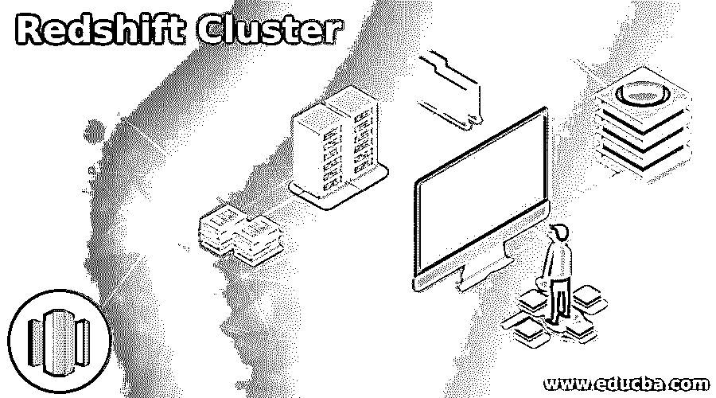

## 红移星团简介

红移集群用于处理大量数据，我们可以在红移中创建多达 128 个节点的集群。基本上，计算节点和主节点是可用的主要组件，计算节点有自己的专用 CPU、内存和存储设备。我们可以使用计算节点执行查询。我们可以在单个群集中创建多个节点。领导节点管理客户端应用程序和计算节点之间的通信。首节点首先编译代码，编译后将代码分发给计算节点，然后将数据分配给每个节点。

### 句法

下面给出了提到的语法:

<small>Hadoop、数据科学、统计学&其他</small>

**1。创建红移星团**

*   登录 AWS 管理控制台

`Amazon web services -> Amazon Redshift -> Create cluster`

*   亚马逊配置

`Provide name of cluster identifier -> Select node type -> Select number of node
-> Tick or untick on load sample data`

*   数据库配置

`Provide admin username -> Provide admin user password`

*   群集权限设置

`Provide IAM role name`

*   高级网络和安全配置

`Provide VPC name -> Provide VPC security group name -> Provide cluster subnet group name -> Provide availability zone name -> Enable or disable the enhanced VPC routing -> Enable or disable the public access of cluster endpoint`

*   高级数据库配置

`Provide database name -> Provide database port number -> provide parameter group -> Enable or disable the encryption of database`

*   维护。

`Provide the time of maintenance window -> Select the maintenance track.`

*   集群备份

`Select the snapshot backup schedule -> Provide the snapshot retention period -> Enable or disable the cross region snapshot -> Enable or disable the cluster relocation.`

*   创建集群

`Check all the selected value once -> click on create cluster button.`

**2。删除红移星团**

`Select the cluster -> Click on action tab -> Click on delete button -> click on take final snapshot button -> click on delete button.`

**3。修改**

`Select the cluster -> Click on edit tab -> modify the cluster -> click on save changes.`

**4。重启**

`Select the cluster -> Click on action button -> Click on reboot tab -> click on reboot cluster button.`

### 星系团如何在红移中工作？

我们可以在红移中创建单节点和多节点星团。基本上，它包含一个节点。每个红移星团都包含领导者和计算者节点。在启动时，我们需要指定节点类型等选项，节点类型指定集群的 RAM、CPU 和存储容量。根据节点类型，定义成本。

以下是 redshift 中可用的节点类型:

RA3 节点包含以下节点类型:

*   **ra3.xlplus:** 它将包含 4 个虚拟 CPU、32 GB RAM、32 TB 存储空间和 2-16 个节点范围。
*   **ra3.4xlarge:** 它将包含 12 个虚拟 CPU、96 GB RAM、128 TB 存储空间和 2-32 个节点范围。
*   **ra3.16xlarge:** 它将包含 48 个虚拟 CPU、384 GB RAM、128 TB 存储空间和 2-128 个节点范围。

密集节点包含以下节点类型:

*   **ds2.xlarge:** 它将包含 4 个虚拟 CPU、31 GB RAM、2 TB 存储空间和 2-32 个节点范围。
*   **ds2.xlarge:** 它将包含 36 个虚拟 CPU、244 GB RAM、16 TB 存储空间和 2-128 个节点范围。

密集计算节点包含以下节点类型:

*   **dc2.large:** 它将包含 2 个虚拟 CPU、15 GB RAM、160 GB 存储空间和 1-32 个节点范围。
*   **dc2.xlarge:** 它将包含 32 个虚拟 CPU、244 GB RAM、2.56 TB 存储空间和 2-128 个节点范围。
*   **dc1.large:** 它将包含 2 个虚拟 CPU、15 GB RAM、160 GB 存储空间和 1-32 个节点范围。
*   **ds1.8xlarge:** 它将包含 32 个虚拟 CPU、244 GB RAM、2.56 TB 存储空间和 2-128 个节点范围。

以下是集群管理时使用的主要参数。

*   分析阈值百分比
*   Json 配置
*   语句超时
*   搜索路径
*   需要 SSL
*   查询组
*   额外浮点数字
*   启用用户活动日志记录

我们可以快速获取大量数据。此外，它对于分析工作负载非常有用。Amazon Redshift 集群可根据数据增长进行线性扩展。我们可以使用控制台。

### 红移星团的例子

下面是提到的例子:

#### 示例#1

形容词（adjective 的缩写）首先，我们已经配置了集群信息。

**集群标识符:**亚马逊-红移-集群
T3】节点类型:ra3xlplus
T6】节点: 2

**输出:**

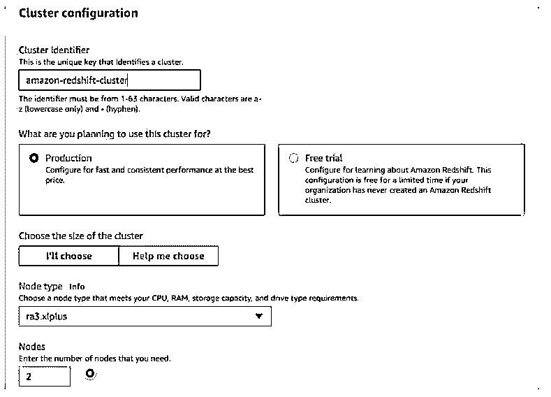

b.为集群配置示例数据。

**样本数据:**是

**输出:**

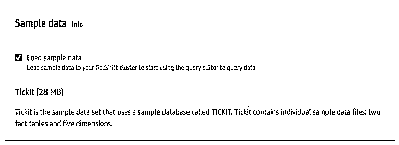

碳（carbon 的缩写）在数据库配置中，我们需要提供用户名和密码。

**管理员用户名:**awsclusteradmin
T3】管理员用户名: ***********

**输出:**

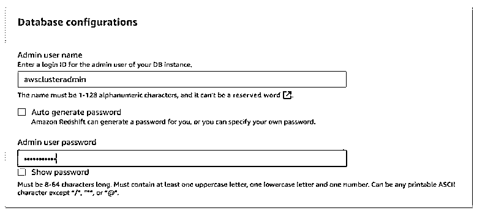

d.配置群集权限。

**可用的 IAM 角色:** AWSServiceRoleForRedshift

**输出:**

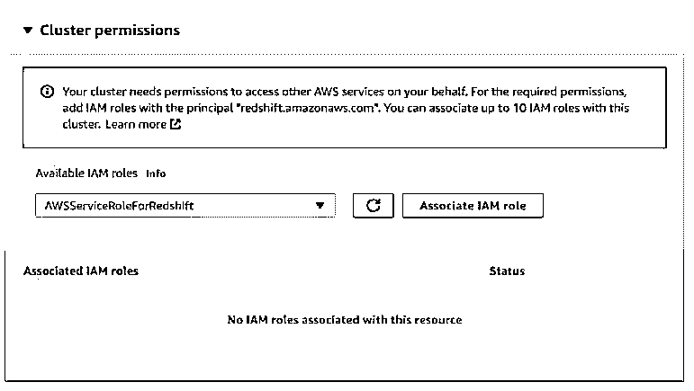

e.配置网络和安全选项。

**虚拟私有云:**默认 VPC
**VPC 安全组:**默认
**集群子网组:**默认
**可用性区域:**无首选项
**增强 VPC 路由:**禁用
**公共可访问:**禁用

**输出:**

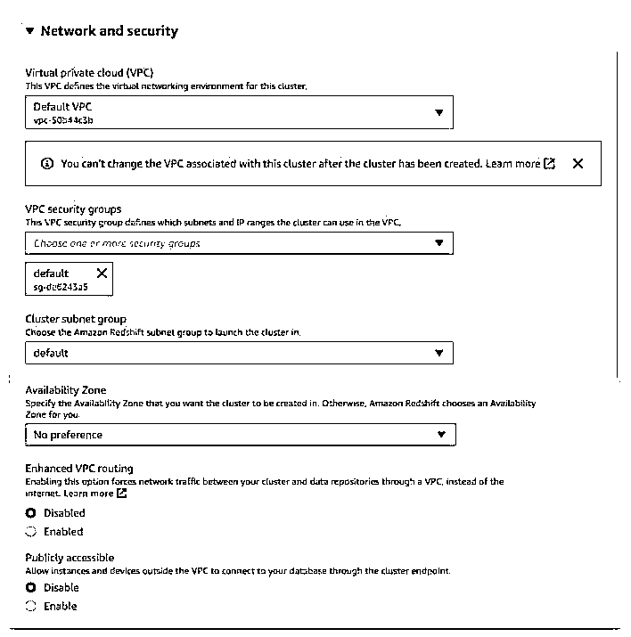

氟（fluorine 的缩写）配置数据库详细信息。

**数据库名称:**测试
**数据库端口:** 5439
**参数组:** default.redshift-1.0
**加密:**禁用

**输出:**

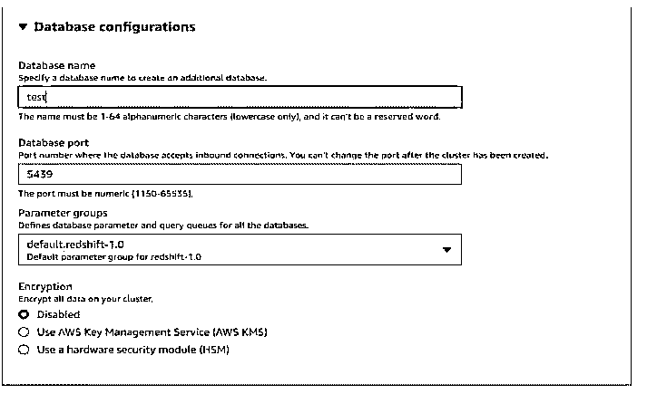

g.为集群配置维护窗口。

**维护窗口:**周一 00:00 UTC+05:30
**维护跟踪:**当前

**输出:**

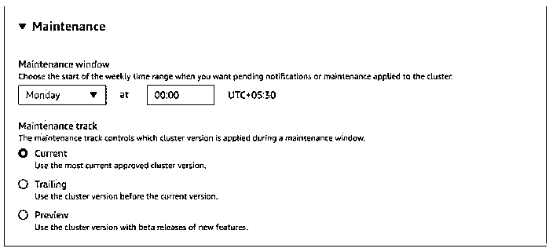

h.配置备份。

**自动快照计划:**默认计划
**快照保留:** 1 天
**配置—跨区域快照:**禁用
**集群重定位:**否

**输出:**

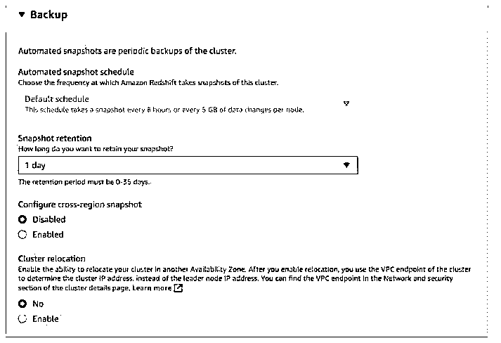

I .创建红移集群

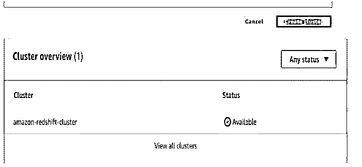

#### 实施例 2

在下面的示例中，我们将名称重新引导为 amazon-redshift-cluster。

**输出:**

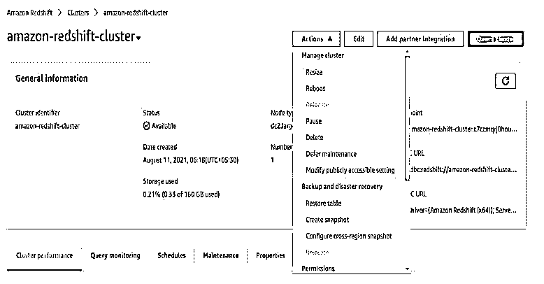

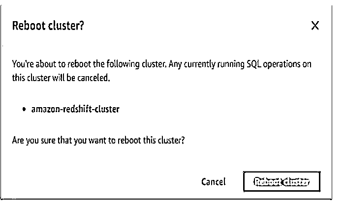

#### 实施例 3

在下面的示例中，我们必须删除名称 amazon-redshift-cluster。

**输出:**

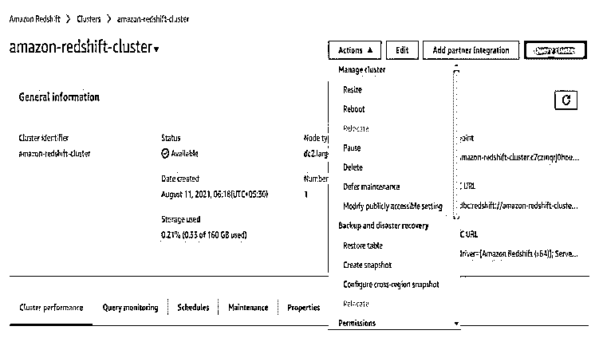

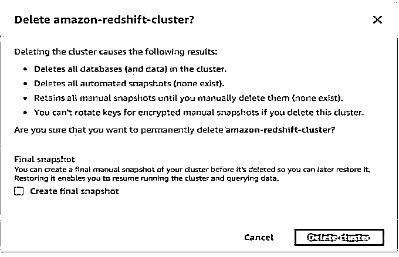

### 结论

更快地执行查询是有用的。引导节点和计算节点是两个可用的组件。创建 amazon 后，我们可以优化、调整、重启和删除集群。我们可以使用 2-128 个节点来创建它。

### 推荐文章

这是一个红移星团的指南。在这里我们讨论一下引论，星系团是如何在红移中工作的？和示例。您也可以看看以下文章，了解更多信息–

1.  [红移物化视图](https://www.educba.com/redshift-materialized-views/)
2.  [红移子串](https://www.educba.com/redshift-substring/)
3.  [红移创建表](https://www.educba.com/redshift-create-table/)
4.  红移日期差值

