# 红移插入到

> 原文：<https://www.educba.com/redshift-insert-into/>

## 红移插入的定义

Redshift insert 用于将行插入到指定的表中，我们可以在一条语句中插入单行以及多行。我们可以在将记录插入指定列时使用列列表，如果我们没有使用任何列列表，数据将按照我们在示例中定义的顺序插入。我们还可以在单个查询中插入大量数据，也可以通过在 select 查询中指定表名来插入另一个表中的数据。Redshift insert into 命令遵循 PostgreSQL 标准查询协议。

**语法:**

<small>Hadoop、数据科学、统计学&其他</small>

下面是 insert into in redshift 的语法如下。

**1)插入单行，不使用列列表—**

`Insert into name_of_table values (column1_value, column2_value, …, columnN_value);`

**2)使用列列表插入单行-**

`Insert into name_of_table (column_name1, column_name2, …., column_nameN)
Values (column1_value, column2_value, …, columnN_value);`

**3)插入多行而不使用列列表—**

`Insert into name_of_table values (column1_value, column2_value, …, columnN_value);
(column1_value, column2_value, …, columnN_value);
………...,
(column1_value, column2_value, …, columnN_value);`

**4)插入多行而不使用列列表—**

`Insert into name_of_table values (column_name1, column_name2, …., column_nameN)
(column1_value, column2_value, …, columnN_value);
(column1_value, column2_value, …, columnN_value);
………...,
(column1_value, column2_value, …, columnN_value);`

**5)插入另一个表格中的行-**

`Insert into name_of_table (select * from name_of_table);`

**6)使用默认值插入单行-**

`Insert into name_of_table values (default, default, …, columnN_value);`

**参数:**

1)Insert into–该命令在 redshift 中用于将行插入特定的表中。通过使用 insert into 命令，我们可以在单个语句中插入单行和多行。

2)表名–在 redshift 中使用 insert into 语句时，该参数非常重要。这被定义为我们在其中插入记录的表的名称。它是一个持久的或临时的表。

3)Values–该关键字与 redshift 中的 insert into 命令一起使用。列的值列表与我们在查询中使用的列列表对齐。在单个查询中插入多个值时，我们需要用“，”符号分隔每个值。

4)列名–这被定义为我们已经插入值的列的名称。

5)Default–使用该关键字，我们可以将默认值插入到列中，我们已经在创建表时定义了默认值。

### insert into 如何在红移中工作？

*   基本上，redshift insert into 命令用于将记录插入表中。我们在单个查询中插入了单个和多个记录。
*   在向表中插入记录时，我们可以列出许多列。如果假设我们没有使用列名，那么它将插入空值。
*   如果假设选择的列不允许空值，它将返回错误，我们不能传递空值。
*   下面的例子表明，我们不能将空值插入到包含 not null 约束的列中。
*   在下面的示例中，我们尝试将记录插入到 redshift_insert 表中，但它将显示错误，即我们无法插入包含 not null 约束的 null 值。
*   我们在第二列中使用了 null 值，但是它不允许插入 null 值，因为我们已经为第二列定义了 not null 约束。

**代码:**

`Insert into redshift_insert values (1, NULL, 'PQR', default, default);`

**图–我们不能在包含非空约束的列中插入空值。**

*   要将记录插入到表中，我们需要向用户插入或拥有表的权限。
*   下面的例子表明，我们需要 insert 或表的所有者特权来在 redshift 中执行 insert into 命令。
*   在下面的示例中，我们使用测试用户将记录插入到 redshift_insert 表中，但是测试用户没有 insert 或 owner 之类的特权，因此它将显示 redshift_insert 关系名的权限被拒绝之类的错误。

**代码:**

`Insert into redshift_insert values (1, NULL, 'PQR', default, default);`

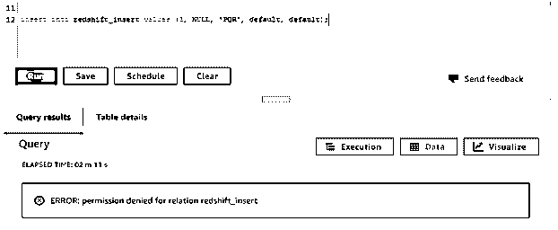

**图–我们需要 insert 或表的所有者权限来执行 insert into 命令。**

*   Redshift insert 命令正在向指定的表中插入新行。如果我们想在表中插入大量数据，我们需要选择复制命令，因为插入比复制命令慢。
*   Insert 最适合在 redshift 中插入少量记录。

### 例子

下面的例子表明 insert into redshift 如下。

#### 1)在不使用列列表的情况下将单个记录插入到表中

以下示例显示了在不使用列列表的情况下向表中插入单个记录。我们必须在 redshift_insert 表中插入一行。

**代码:**

`Insert into redshift_insert values (2, 'ABC', 'PQR', 'Pune', 'India');
Select * from redshift_insert;`

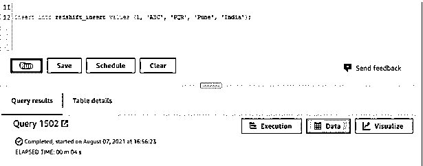

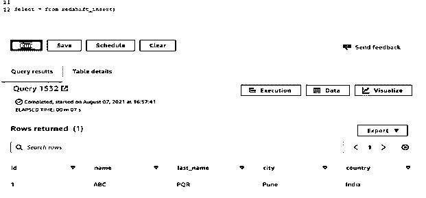

#### 2)使用列列表将单个记录插入到表中

以下示例显示了如何使用列列表将单个记录插入到表中。我们必须在 redshift_insert 表中插入一行。

**代码:**

`Insert into redshift_insert (id, name, last_name, city, country) values (2, 'ABC', 'PQR', 'Pune', 'India');
Select * from redshift_insert;`

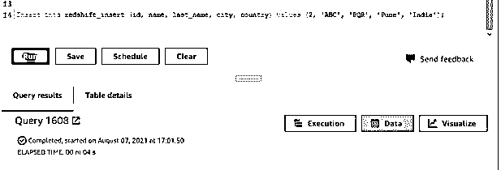

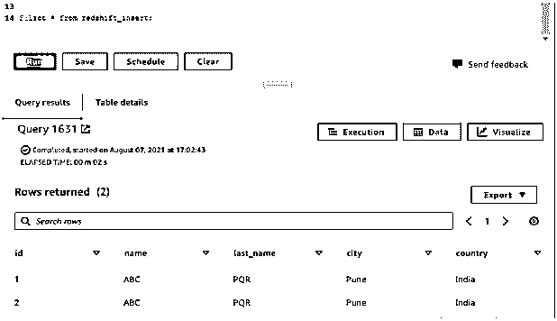

#### 3)在不使用列列表的情况下向表中插入多条记录

以下示例显示了在不使用列列表的情况下将多条记录插入到表中。我们必须用一条语句在 redshift_insert 表中插入两行。

**代码:**

`Insert into redshift_insert values (3, 'ABC', 'PQR', 'Pune', 'India'), (4, 'ABC', 'PQR', 'Pune', 'India');
Select * from redshift_insert where id between 3 and 4;`

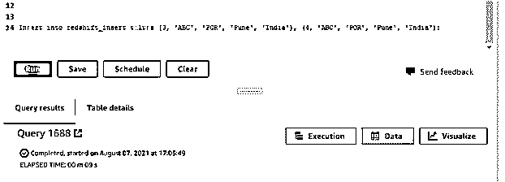

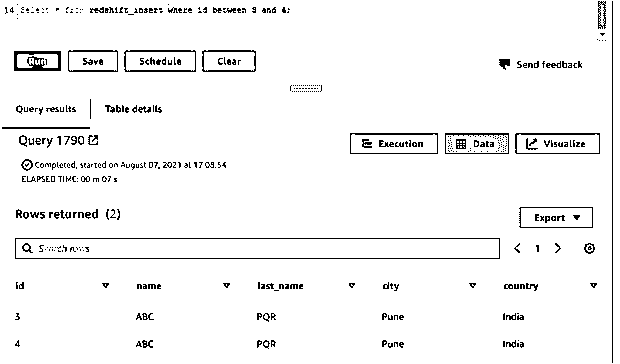

#### 4)从另一个表中插入行

在下面的示例中，我们必须从 redshift_insert 表向 redshift_insert1 表插入记录。

**代码:**

`Insert into redshift_insert1 (select * from redshift_insert);
Select * from redshift_insert1;`

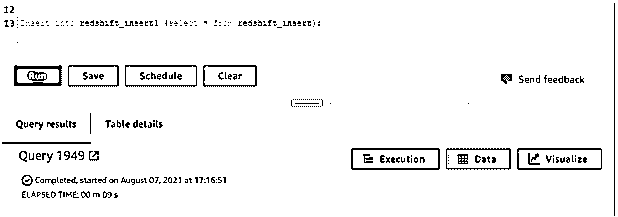

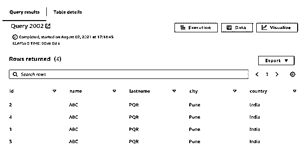

#### 5)使用默认值插入行

在下面的示例中，我们使用默认值向 redshift_insert 表中插入行。

**代码:**

`Insert into redshift_insert values (5, 'ABC', 'PQR', default, default);
Select * from redshift_insert where id = 5;`

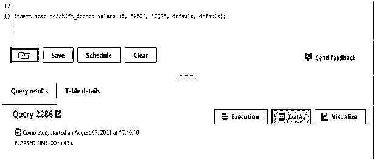

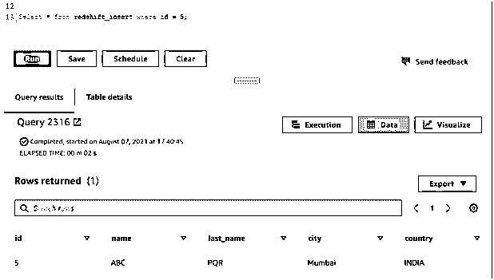

### 结论

Redshift insert into 用于将记录插入表中。使用 insert into，我们可以在单个查询中插入单个或多个记录。要执行 insert 语句，我们需要 table owner 或 insert 特权。在向表中插入记录时，我们也可以使用默认值。

### 推荐文章

这是一个红移插入到指南。这里我们讨论一下定义，insert into 如何在红移中起作用？以及更好理解的例子。您也可以看看以下文章，了解更多信息–

1.  [红移物化视图](https://www.educba.com/redshift-materialized-views/)
2.  [红移子串](https://www.educba.com/redshift-substring/)
3.  [红移创建表](https://www.educba.com/redshift-create-table/)
4.  红移日期差值

