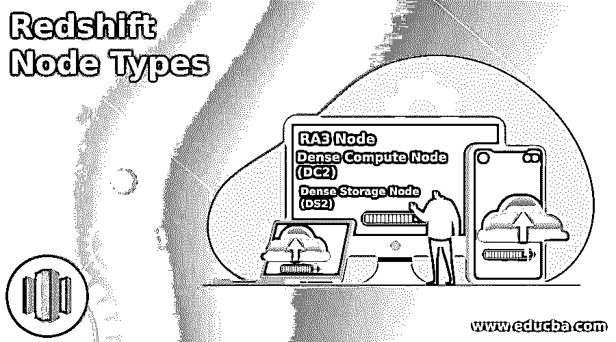
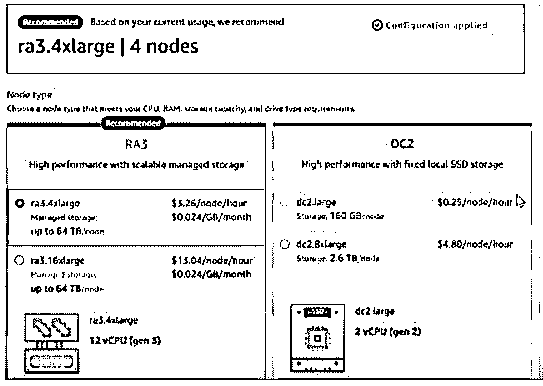

# 红移节点类型

> 原文：<https://www.educba.com/redshift-node-types/>

## 红移节点类型介绍

以下文章概述了红移节点类型。红移向用户提供不同类型的功能；节点是红移提供的功能之一。通常，Redshift 提供不同类型的节点来管理工作负载，这就是我们使用 RA3 或 DC2 节点的原因，但这取决于性能、数据大小和增长。

基本上，我们用来管理存储系统的 RC3 节点意味着，根据需要，我们可以扩展存储大小并独立管理存储系统。通过使用 RC3，我们可以根据性能要求选择节点数量，然后我们可以为使用的节点付费。

<small>Hadoop、数据科学、统计学&其他</small>

### 不同的红移节点类型

下面给出了红移中不同类型的节点:

一个亚马逊红移组由枢纽组成。每个组都有一个先锋中枢和至少一个人物中枢。首先，pioneer hub 从客户应用程序获取查询，解析问题，并创建查询执行计划。接下来，先锋中心安排流程中心平等地执行这些计划，并合计这些中心的过渡结果。然后，在这一点上，最终将结果返回给客户应用程序。

注册中心执行问题执行设计，并在它们之间传递信息以服务于这些查询。在发送回客户应用程序之前，中间结果被运出先锋中心进行聚合。

枢纽的特点是在下面的边界。在选择中心时，您需要仔细分析边界，选择最适合您的先决条件的一个。我们来明确一下这些界限怎么样？

*   **vCPU:** 是每个 hub 的虚拟 CPU 数量。
*   **RAM:** 是每个集线器的内存度量单位，单位为吉比字节(GiB)。
*   **每个节点的切割:**边界表征了当束被制作或调整大小时，集线器被分配到的切割的数量。
*   **容量:**这是每个集线器的容量限制和种类。
*   **节点范围:**是 Amazon Redshift 支持的中心类型和大小的基础和最大数量的中心。

节点的类型如下:

#### 1.RA3 节点

AWS 在 2019 年底推出了 RA3 中心，这是红移家族的第三代出现类型。RA3 包括高速存储、监控存储和高速数据传输组织。在新 RA3 时代出现类型中，红移将永久信息存储到 S3，并利用邻域圆进行保留。来自 S3 的信息可以根据请求恢复，因此，RA3 的例子在计算和容量之间分摊了费用。您需要为每 GB 的容量和处理量付费。

下面给出了不同类型的 RA3 节点:

*   **Ra3.4xlarge:** 这是第一种类型的 Ra3 节点。每个节点需要 12 个虚拟 CPU。该节点使用 96 GB 的内存。因此需要 Ra3.4xlarge，或者我们可以说它管理每个节点的 64 TB 存储，该节点的总容量为 4096 TB。
*   **Ra3.16xlarge:** 这是第二种类型的 Ra3 结。每个节点需要 48 个虚拟 CPU。该节点使用 384 GB 内存。Ra3.16xlarge 是必需的，或者我们可以说它管理每个节点的 64 TB 存储，该节点的总容量为 8192 TB。

**举例:**

现在，让我们看看如何在集群内创建新节点。

首先，我们需要点击快照按钮；在其中，我们需要指定所有节点的详细信息，例如节点的名称、虚拟 CPU、RAM 和存储大小，如下图所示。

选择所需选项后，我们可以创建 RA3.4xlarge 节点，如下图所示。

请看这里，我们创建了具有 4 个节点和 256 TB 存储大小的 RA3，如图所示。

#### 2.密集计算节点(DC2)

DC2 是先进的信息处理系统，是一个注册的集中信息发布中心，利用固态硬盘进行社区存储。它允许您根据您的信息大小和执行先决条件选择一些中心。根据经验，如果您的信息少于 500 GB，选择 DC2 场合类型是明智的，因为它可以提供强大的计算能力和理想的 SSD 存储。此外，DC2 在本地为精英存储信息，如果您需要额外的空间，它允许您添加更多的注册中心。

下面给出了不同类型的 DC2 节点:

*   **dc2.large:** 这是 dc2.large 节点的第一种；它需要 2 个虚拟 CPU。它也需要 15 GB，使用 160GB 存储。其总容量为 5.12 TB。
*   **dc2.8large:** 这是 dc2.8large 节点的第二种类型；它需要 32 个虚拟 CPU。它还需要 244 GB，使用 2.56 TB 存储。其总容量为 326 TB。
*   **dc1.large:** 这是 dc2.large 节点的第三种类型；它需要 2 个虚拟 CPU。它还需要 15 GB，并且使用 160 GB 存储。其总容量为 5.12 TB。

**举例:**

同样，我们可以按照与 RA3 相同的流程，在群集内创建一个包含 2 个节点和 32 TB 存储的新节点 dc2。例如，下面的屏幕截图显示了 DC2 节点，如下所示。

#### 3.密集存储节点(DS2)

DS2 允许你有一个大容量的信息储藏室，里面有 CPU 和 RAM 用于计算。DS2 中心使用 HDD(硬盘驱动器)作为容量，作为一般准则，如果您有超过 500 GB 的信息，则适合使用 DS2 的例子。

下面给出了 DS2 的类型:

它有两种类型:

*   ds2.xlarge
*   ds 2.8 x 大

这两种类型的工作原理和我们前面看到的一样。

### 结论

从上面的文章中，我们看到了红移节点类型的基本概念，也看到了红移节点类型的不同类型。从本文中，我们看到了如何以及何时使用红移节点类型。

### 推荐文章

这是红移节点类型的指南。为了更好地理解，我们在这里讨论介绍和不同的红移节点类型。您也可以看看以下文章，了解更多信息–

1.  [红移物化视图](https://www.educba.com/redshift-materialized-views/)
2.  [红移子串](https://www.educba.com/redshift-substring/)
3.  [红移创建表](https://www.educba.com/redshift-create-table/)
4.  红移日期差值

