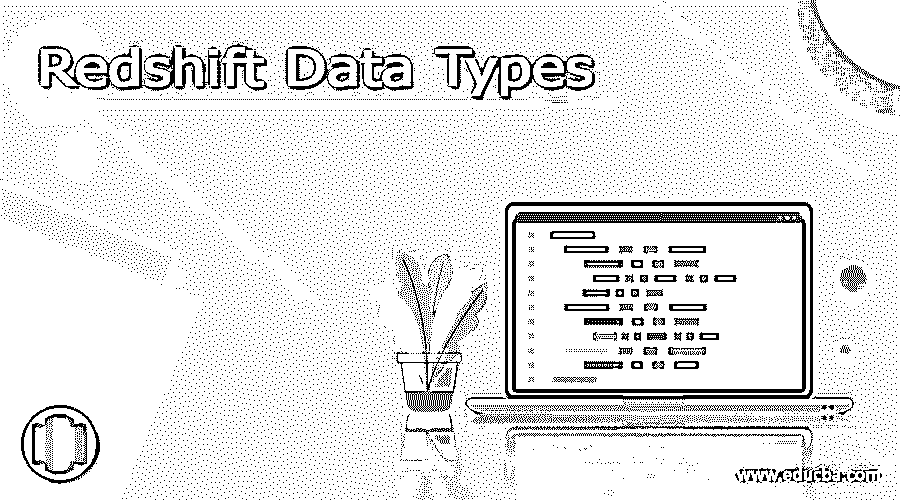

# 红移数据类型

> 原文：<https://www.educba.com/redshift-data-types/>

## 红移数据类型介绍

红移数据类型是您希望存储在数据库特定字段中的值的类型。创建数据库的结构或模式时，正确指定值的类型以及值在特定字段中的存储格式非常重要。这可以通过为该字段指定适当的数据类型来实现。更重要的一点是指定该字段的长度，这将有助于为该字段分配更多的内存，并且不会浪费任何类型的内存资源。长度指定可以与数据类型指定一起完成。

在本文中，我们将研究 Redshift 中可用的数据类型，以及如何使用它们来表示字段中存储的值的格式和类型。我们还将了解数据类型的别名，并对每种数据类型进行详细描述。

<small>Hadoop、数据科学、统计学&其他</small>

### 红移中的数据类型

数据类型是对列和参数应用约束的一种很好的方式，它告诉我们与字段相关的所有属性以及值可以存储的格式。在 Amazon Redshift 中，表列可以有以下提到的数据类型之一

| 红移中的数据类型 | 数据类型的别名 | 细节 |
| 希尔斯凯奇 | 没有人 | 这种数据类型主要用在超级日志的草图中。 |
| 几何学 | 没有人 | 当您必须在空间分布中存储数据时，会使用这种数据类型。 |
| 日期 | 没有人 | 此数据类型表示日历的日期，其中包含日、月和年的值。 |
| timez | 这是时间以及时区的说明 | 这有助于存储特定日期的时间以及使用该时间的时区的详细信息。 |
| 时间 | 这是没有指定时区的时间 | 这有助于存储特定日期的时间，而不需要使用它的时区的详细信息。 |
| 时间戳 | 这是时间戳值的别名，没有指定时区详细信息。 | 我们可以将日期和时间的值存储在同一个字段中，该字段称为时间戳，即时间线中的点。 |
| 时间戳 | 这是时间戳值的别名，指定了时区详细信息。 | 我们可以将日期和时间的值存储在同一个字段中，该字段称为时间戳，即时间线中的点，以及当前记录和使用它的时区的详细信息。 |
| 比吉斯本 | INT8 | 这是存储在内存的八字节空间中的整数值，可以在其中存储有符号的值。 |
| 斯莫列特 | INT2 | 这是存储在内存的两个字节空间中的整数值，可以在其中存储有符号的值。 |
| 整数 | INT，INT4 | 存储数值最常用的数据类型。这是存储在四字节内存空间中的整数值，可以在其中存储有符号的值。 |
| 布尔型 | 布尔 | 这种数据类型用于存储布尔值，这些值实际上是逻辑值，可以是 TRUE 或 FALSE。 |
| 真实的 | 浮动 4 | 此数据类型用于存储单精度浮点数的值。 |
| 小数 | 数字的 | 此数据类型用于存储选定的精度数值，并表示精确的数字。 |
| 双倍精密度 | 浮动，浮动 8 | 这有助于以双精度指定浮点数的数值。 |
| 可变长字符串 | NVARCHAR、字符变化和文本 | 该数据类型用于存储长度可变的字符串值，字符限制由用户定义。 |
| 茶 | NCHAR、CHARACTER 和 BPCHAR | 此数据类型用于指定列将包含由长度固定的字符组成的字符串。 |

### 数据类型的隐式转换

使用 Amazon Redshift 时，可以显式或隐式地将值转换为相应的数据类型。当指定存储在列中的值与列的实际定义数据类型不匹配时，如果两种数据类型本质上兼容，则使用隐式转换在内部将其转换为预期的数据类型。这两种数据类型是要存储的值的数据类型和要存储该值的列的数据类型。

隐式转换可能发生在两种情况下，一种是完成赋值(例如使用 update 和 insert 命令来设置值),另一种是表达式(例如 WHERE 子句中提到的比较语句)。下表说明了发生隐式转换的兼容数据类型列表。

| **源数据类型** | **最终数据类型** |
| 茶 | 可变长字符串 |
| 小数 | 茶 |
| 小数 | 比吉斯本 |
| 小数 | 整数 |
| 小数 | 漂浮物 |
| 小数 | 双倍精密度 |
| 小数 | 斯莫列特 |
| 小数 | 真实的 |
| 小数 | 可变长字符串 |
| TIMESTAMPZ | 日期 |
| 时间戳 | TIMEZ |
| 时间戳 | 茶 |
| 时间戳 | 可变长字符串 |
| 时间戳 | 时间戳 |
| 时间 | timez |
| 时间 | 可变长字符串 |
| timez | 时间 |
| timez | 可变长字符串 |
| 真实的 | 茶 |
| 真实的 | 比吉斯本 |
| 真实的 | 小数 |
| 真实的 | 斯莫列特 |
| 真实的 | 可变长字符串 |
| 真实的 | 整数 |
| 斯莫列特 | 布尔型 |
| 斯莫列特 | 比吉斯本 |
| 斯莫列特 | 小数 |
| 斯莫列特 | 双精度浮点 |
| 斯莫列特 | 真实的 |
| 斯莫列特 | 茶 |
| 斯莫列特 | 可变长字符串 |
| 整数 | 比吉斯本 |
| 整数 | 小数 |
| 整数 | 双精度浮点 |
| 整数 | 真实的 |
| 整数 | 茶 |
| 整数 | 可变长字符串 |

除了上面指定的兼容数据类型之外，还有其他隐式转换的数据类型。但是，在对具有特定数据类型的表的列执行操作并显式转换值时，应该小心谨慎。

### 结论

红移数据类型是在表的列中指定和存储值的类型和格式。本文列出了 redshift 中支持的数据类型，以及 redshift 内部自动完成隐式转换的兼容数据类型。在 redshift 中执行 insert、update 或任何类型的条件指定时都应该小心，因为数据类型对性能有很大的影响。

### 推荐文章

这是红移数据类型指南。这里我们分别讨论引言、红移中的数据类型、数据类型的隐式转换。您也可以看看以下文章，了解更多信息–

1.  [红移 Row_NUMBER()](https://www.educba.com/redshift-row_number/)
2.  [红移子串](https://www.educba.com/redshift-substring/)
3.  [红移创建表](https://www.educba.com/redshift-create-table/)
4.  [红移物化视图](https://www.educba.com/redshift-materialized-views/)

