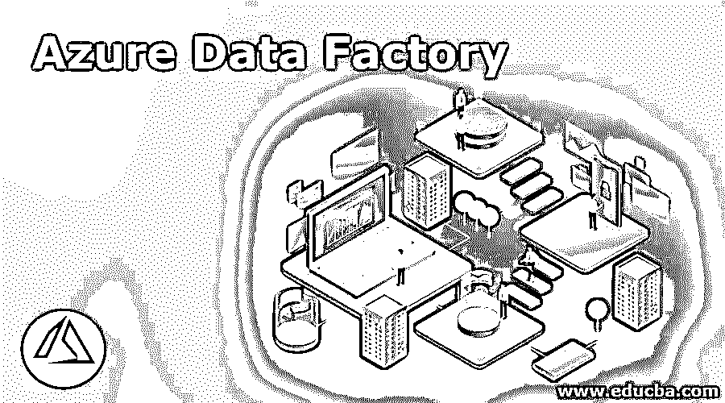
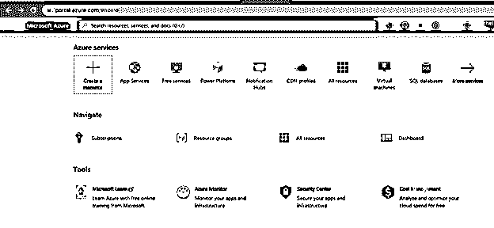
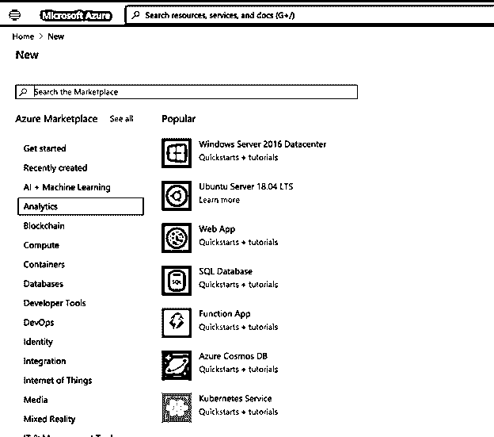
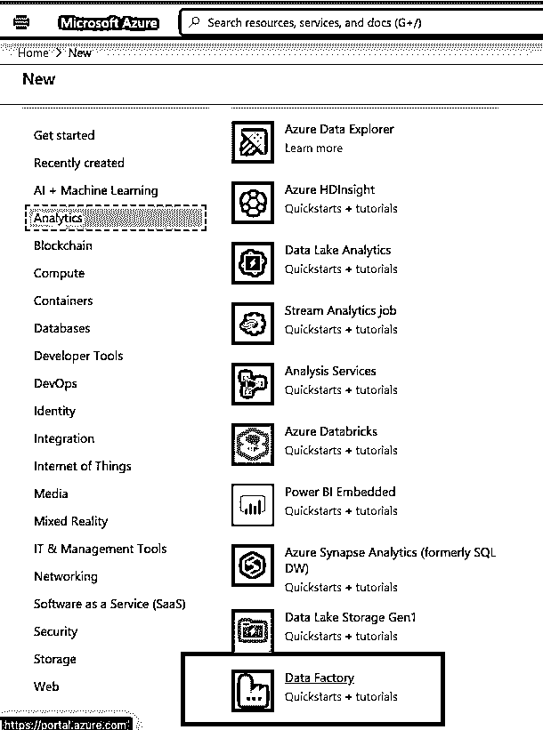
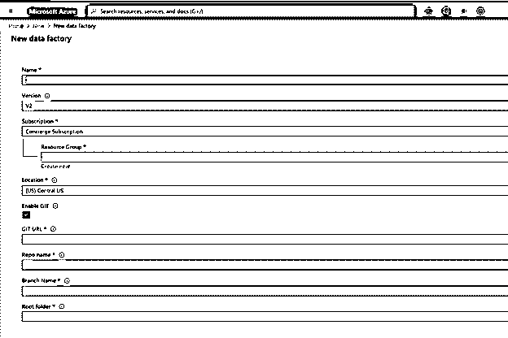
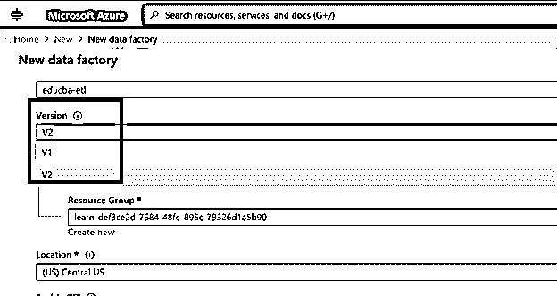
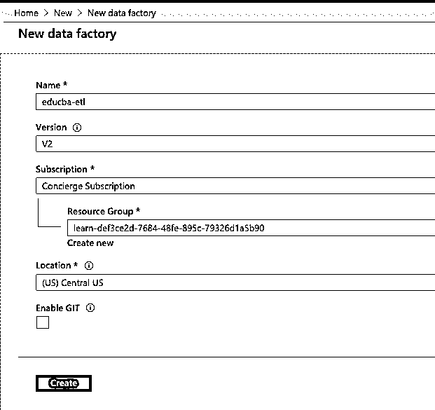
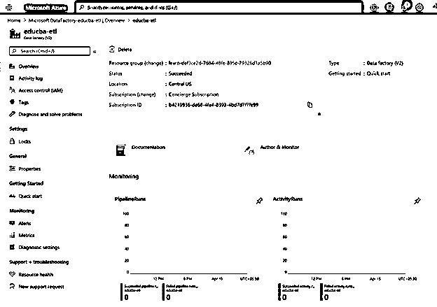

# Azure 数据工厂

> 原文：<https://www.educba.com/azure-data-factory/>

## Azure 数据工厂简介

Azure data factory 是一个平台，用于集成和编排创建 ETL(提取转换加载)管道的复杂过程，并自动化数据移动。它用于在结构化或非结构化原始数据上创建转换流程，以便用户可以分析数据并使用处理后的数据来提供可操作的业务洞察力。数据工厂用于赋予存储系统中存储的大数据以意义。它有助于数据移动，并对大规模数据执行转换。

### Azure 数据工厂的功能

Azure data factory 是一个基于云的 ETL 服务，因此它可以帮助用户创建一个 ETL 管道来加载数据并对其执行转换，还可以使数据移动自动化。因此，使用数据工厂，数据工程师可以根据所需时间安排工作流。在这里，我们将看到 Azure data factory 如何创建这种数据驱动的端到端 ETL 管道，进而帮助数据工程师:

<small>Hadoop、数据科学、统计学&其他</small>

#### 1.连接和收集

Azure 存储系统可能有不同卷和格式的数据，数据可以是有组织的或无组织的，来自不同的来源，如关系数据库、文件共享和 SFTP 服务器等。因此，用户必须做的第一件事是连接所有数据源，然后需要将所有这些数据移动到中央存储库进行处理。Data factory 使用数据管道中的复制活动流程将数据复制和接收到云中或本地的存储位置，以便用户可以对数据执行进一步的分析。

#### 2.改造和丰富

在数据被接收到中央存储库中的机器之后，下一步是进行数据处理和转换。作为数据管道的一部分，azure data factory 使用 ADF 映射数据流来执行数据转换和处理等活动，以便开发人员或数据工程师可以创建和管理在 Spark 作业执行期间创建的有向无环图(DAG)。如果用户正在编写代码来执行转换，ADF 可以使用外部大数据工具，如 Hadoop、Spark、HDInsight 等。azure 中的计算服务。

#### 3.CI/CD 和发布

Data factory 支持 DevOps 和 GitHub，因此开发人员可以对开发的代码运行 CI/CD 流程，并逐步改进 ETL 流程，一旦数据端到端管道准备好所有 ETL 流程，它就会发布最终产品。它有助于将业务就绪数据加载到最终的 SQL 或 NoSql 数据库，以便企业可以创建报告并从数据中获得可操作的洞察力。

#### 4.班长

用户可以在数据工厂中监控构建和部署 ETL 数据管道以及预定的活动，因为它有来自监控的内置支持。Data factory 在 Azure 门户中有 Azure monitor 平台来处理部署的数据管道的日志和健康状况。

### Azure 数据工厂的组件

Azure data factory 主要由四个关键组件组成，它们共同创建一个端到端的工作流:

*   **Pipeline:** 创建 Pipeline 是为了通过在单个工作流中组合任务中的不同活动来执行特定的任务。管道中的活动可以是数据摄取(将数据复制到 Azure) - >数据处理(执行 Hive 查询)。使用 pipeline 作为单个任务，用户可以在单个流程中调度任务和管理所有活动，还可以使用它来并行运行多个操作。
*   **活动:**它是对管道中的数据执行的特定操作，如数据的转换或摄取。每个管道中可以有一个或多个活动。如果使用 Copy Monitor 将数据从一个源拷贝到目标，则这是一种数据移动活动。如果使用 hive 查询或 spark 作业对数据执行数据转换，那么这就是数据转换活动。
*   **数据集:**基本上是收集用户需要的数据，作为 ETL 过程的输入。数据集有不同的格式；它们可以是 JSON、CSV、ORC 或文本格式。
*   **链接服务:**它拥有关于不同数据源的信息，数据工厂使用这些信息来连接数据源。它主要用于定位机器中的数据存储，还表示要执行的活动的计算服务，如在 spark 集群上运行 spark 作业或使用来自云的 hive 服务运行 hive 查询。

### 如何创建 Azure 数据工厂？

**1。**点击以下链接使用有效登录凭证登录 [Azure 门户](https://portal.azure.com/learn.docs.microsoft.com):

[https://portal.azure.com/learn.docs.microsoft.com](https://portal.azure.com/learn.docs.microsoft.com)

**2。**现在从 azure 门户菜单页面选择创建资源选项。

**3。**从“创建资源”页面的左侧窗格中选择“分析”:

**4。**在选择分析时，您会看到左侧窗格中的数据工厂选择数据工厂

**5** 。现在，在新数据工厂页面上，您可以根据应用程序的要求输入详细信息:

**6。**您可以根据需要在版本下拉列表中选择版本，您可以选择 V1 或 V2:

**7。**在订阅中，字段选择您的 Azure 订阅。

**8。**在位置中，下拉选择数据工厂中存储元数据的位置。

**9。**此外，您可以通过启用 Enable Git 选项来提供 GitHub 的位置，这样 CI/CD 进程就可以根据用户的需求运行它，用户也可以禁用它。

10。现在点击页面上的创建按钮。

它将开始部署数据工厂:

**11。**部署完成并成功创建数据工厂后，将填充以下页面:

**12** 。单击“转到资源”进行验证:

### Azure 数据工厂的特性

1.  它具有创建 ETL 管道的内置功能，因此无论数据是在云上还是在本地机器上，数据都可以在文件、关系或非关系数据库之间传输。
2.  它具有使用 azure monitor 调度和监控工作流的功能，并且由于其工作流调度功能，它支持基于事件的流程。
3.  它通过在复制数据或与其他网络共享数据时自动加密数据来提供数据安全性。
4.  它具有处理大数据的可扩展性，因为 Azure data factory 是为了处理大数据技术中使用的数据而开发的。它还具有时间片和并行特性，可以使用批处理来移动大数据。
5.  为了创建和配置数据管道，用户可以使用 Azure 门户，大部分配置都是用 JSON 文件编写的，因此数据工程师或开发人员只需要最少的编码经验。

### 结论

微软 Azure 中的数据工厂有助于管理和创建大数据的 ETL 管道。Azure 数据工厂工具将云与大数据技术相结合，大数据技术是当今时代的两个创新领域，旨在推动任何组织走向未来，并从数据中提取有价值的信息。

### 推荐文章

这是 Azure 数据工厂指南。在这里，我们讨论 Azure Data Factory 及其不同组件、功能和高级特性的介绍。您也可以浏览我们推荐的其他文章，了解更多信息——

1.  [微软 Azure 与亚马逊网络服务的主要区别](https://www.educba.com/microsoft-azure-vs-amazon-web-services/)
2.  [Azure 优势介绍](https://www.educba.com/advantages-of-azure/)
3.  [微软 Azure 十大面试问题](https://www.educba.com/microsoft-azure-interview-questions/)
4.  [Azure 中的表|如何创建和管理？](https://www.educba.com/tables-in-azure/)

