# Azure Blob 存储

> 原文：<https://www.educba.com/azure-blob-storage/>

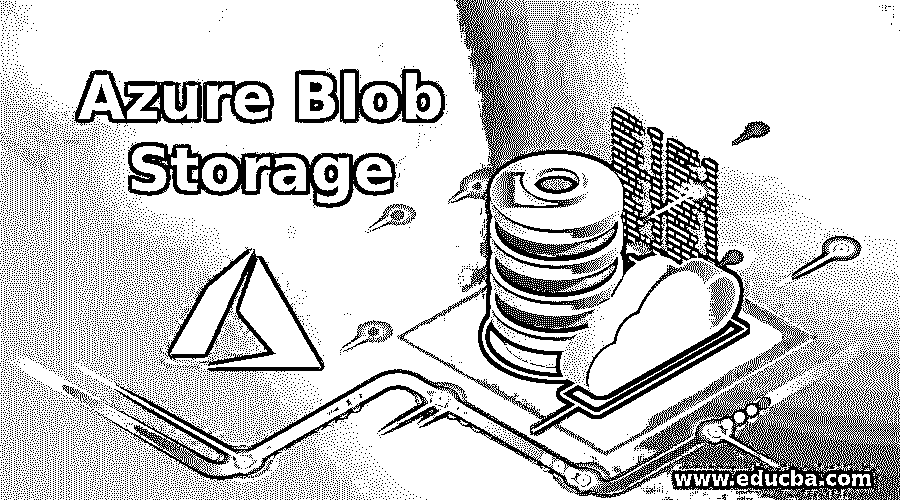

## Azure Blob 存储简介

Azure blob storage 是微软的对象存储系统提供的一项功能，用于在微软的云平台中存储非结构化数据。用户可以使用 blob 存储中的数据来构建和部署应用程序。非结构化数据是没有预定义模型或结构的数据。非结构化数据的形式有视频剪辑、音频剪辑、文本数据或二进制数据等。Blob 基本上是一个二进制大对象，它将数据分组到容器中，这些容器与用户存储帐户相关联，用户存储帐户可以使用[进行修改。网名](https://www.educba.com/what-is-dot-net/)。

### 为什么我们需要 Azure Blob 存储？

Microsoft Azure Blob 存储存储非结构化数据，这意味着它可以存储任何类型的数据，无论是视频、音频还是 PDF 文档。由于这种非结构化数据位于大容量 blob 存储系统中，因此该系统能够处理千兆字节的数据，这有助于用户根据需要扩展存储系统。

<small>Hadoop、数据科学、统计学&其他</small>

以下是我们需要 Azure blob 存储的一些原因:

*   它是必需的，因为用户可以在浏览器上看到所有的图像和文档。
*   它有助于编写日志文件，以便用户可以根据需要访问日志。
*   因为它存储视频和音频形式的非结构化数据。它帮助用户流式传输音频和视频文件。
*   我们需要 azure 存储来备份数据和恢复系统，以便在发生灾难时系统可以轻松恢复。
*   Azure blob 存储不仅存储数据，而且为了使访问更快，它具有分布式访问的能力。

### 使用 Azure Blob 存储

当使用 Azure blob 存储来存储数据时，人们必须知道 Blob 存储如何工作并组织数据，以便构建应用程序，用户可以使用 Blob 提供的所需存储资源。

Azure blob 中有三种类型的可用资源，如下所示:

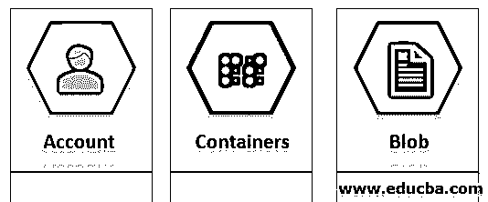

#### 1.存储帐户

要使用 Microsoft Azure 服务，用户需要在 Azure 中为您的数据提供唯一的命名空间。每当用户在 azure 存储上存储一些数据时，这些数据都有一个包含您的唯一帐户名的地址。存储帐户中对象的基址是帐户名和 azure 存储 blob 终结点的组合。要组织 blob 数据，单个存储帐户就足够了。

**举例:**

**假设您的存储帐户名称为:** myeducbastorage

**那么默认情况下，斑点存储是:**http://myeducbastorage.blob.core.windows.net

#### 2.容器

每个 Blob 存储帐户都分配了容器来组织 Blob 组，就像文件系统的目录一样。一个存储帐户可以有无限数量的容器。在创建容器名时，除了长度限制和字符限制之类的一般规则之外，用户还必须遵循一组特定的规则。使用的容器名称应该是有效的 DNS 名称。如果用户进行配置以允许公共访问，则公共可以访问单个容器，但默认情况下，访问容器需要身份验证。

**举例:**

容器的命名约定需要有效的 DNS 名称。容器的 URI 如下:

**存储账户名称:** myeducbastorage

**容器名称:** educbacontainer

**uri:**https://bit . ly/3 btua 9l

#### 3.一滴

Blobs 通常被用作 Azure 中的个人文件系统。每个容器都以 blob 的形式存储数据。默认情况下，public 需要认证才能访问所有 blob，因为 blob 可用于共享个人文档。

有三种类型的 blobs 用于存储数据:

*   **Block blob:**blob 由不同大小的块组成，这是通过将数据上传到 Block 并并行提交给 blob 来创建的。
*   **追加 blob:**这是一个专门的 block blobs，仅用于高效地追加新数据。主要用于写日志或流数据。
*   **页面 blob:**这个 blob 由虚拟机用来存储虚拟硬盘(VHD)文件。这是为了添加随机访问读写功能而创建的。

Blobs 名称也遵循一定的长度和字符限制规则。默认情况下，blob 在命名中没有任何嵌套或层次结构，但用户应该命名看起来像 blob 的路径段，以便用户可以从 blob 列表中过滤出 API 的操作。

**举例:**

**存储账户名称:** myeducbastorage

**容器名称:** myeducbastorage

**Blob 名称:** educbablob

https://bit.ly/2Uf3Cl3 的 URI

### Azure Blob 存储的使用

Azure blob 存储为用户提供了基于应用和架构的不同类型数据的多种用途:

*   Blob 存储可用于为传输大量数据的应用程序共享消息中的 Blob URLs，因为数据以二进制形式存储在 Blob 中，并且可以在小消息中共享。
*   它还可以用作文件存储系统来共享文档和其他数据。
*   图像、视频和音频等非结构化数据也可以存储为 blob，如果需要，可以在 web 服务器上向公众公开。
*   像 azure 云壳和虚拟机这样的微软 Azure 组件使用 azure blob 来存储文件、配置等。与此类似，许多 Azure 服务在后端使用 azure blobs。

### 如何创建 Azure Blob 存储？

在这里，我们将学习在 Azure 门户中创建 Azure blob 存储，然后开始创建 blob 存储。用户需要访问 Azure 门户，并且访问同样的用户需要 Azure 订阅。all-通过存储帐户访问 azure 门户。

**步骤 1:** 使用以下 URL 登录 azure 门户:

https://portal.azure.com/#home

输入有效的电子邮件和密码，下面的主页将被打开

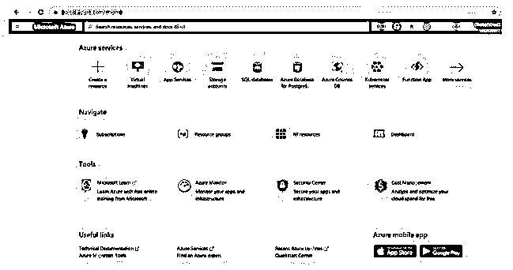

**步骤 2:** 从 Azure 门户菜单的右上角选择所有服务。

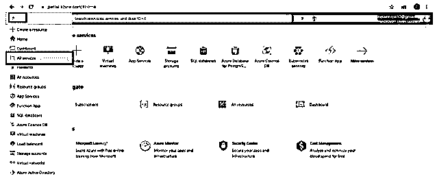

**步骤 3:** 从“所有服务”页面的左侧面板中选择存储帐户。

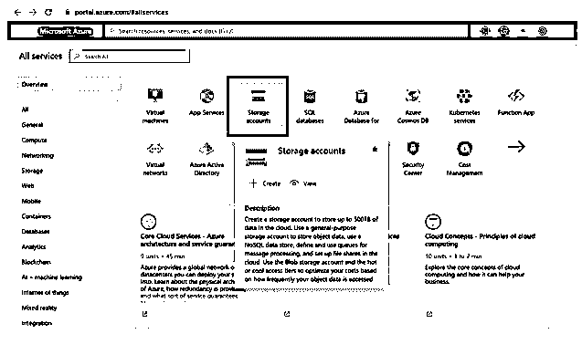

**步骤 4:** 从存储帐户窗口中选择+添加。

**步骤 5:** 创建存储帐户窗口，它将询问您要创建存储帐户的订阅。

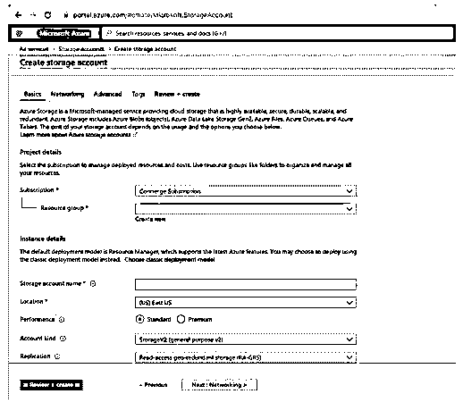

**第 6 步:**现在，单击“Review+Create”按钮，然后单击“Create ”,部署完成后将显示以下消息。

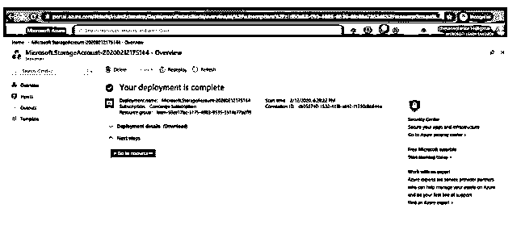

在这里，我创建了一个名为“educba”的存储帐户

**第 7 步:**现在，我们将尝试创建一个容器，转到最近创建的存储帐户并选择存储帐户。

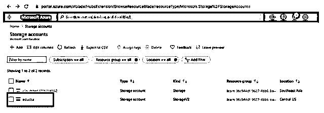

**步骤 8:** 现在从 Blob 服务部分选择容器，可以通过向下滚动来检查。

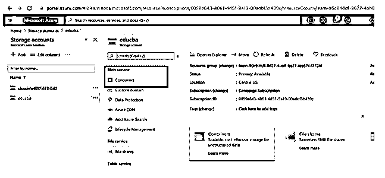

**步骤 9:** 现在从“educba–Containers”中选择“+ Container”按钮

这里 educba 是一个存储帐户名，您可以看到自己的帐户名。

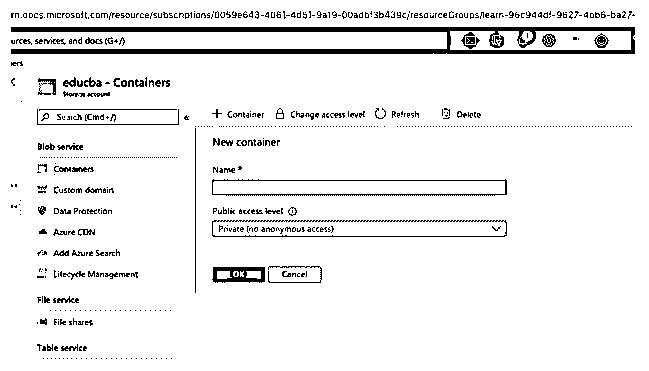

**第 10 步:**输入你的容器名，我将使用容器名作为 educba，默认情况下，这个容器的访问级别将被私有设置为公共访问级别。单击“确定”创建容器。

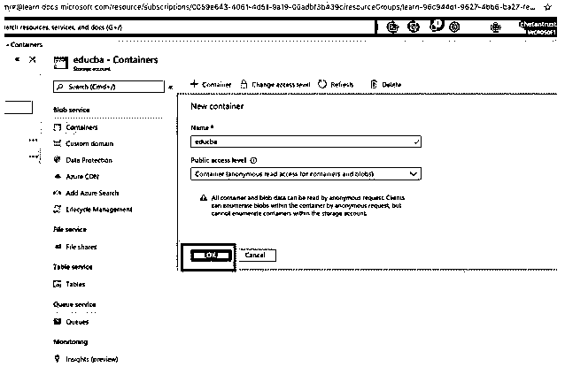

**步骤 11:** 在通知中，用户可以检查容器创建消息是否会显示如下:

**步骤 12:** 现在转到您最近从 Azure portal 创建的容器:

**步骤 13:** 由于容器是新的，它显示没有创建 blob，从容器窗口选择上传按钮。

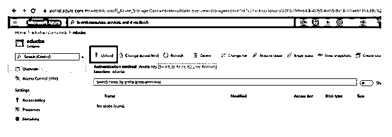

**步骤 14:** 这将提供一个浏览本地文件系统的选项。

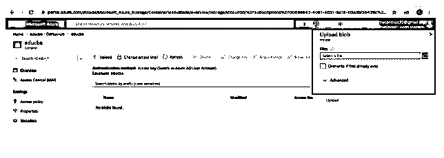

**步骤 15:** 浏览你的文件系统，上传一个 block blob 格式的文件，展开高级部分可以看到。

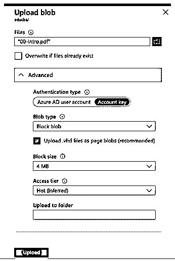

**步骤 16:** 现在选择上传按钮来上传 blob，你可以上传任意多的 blob。

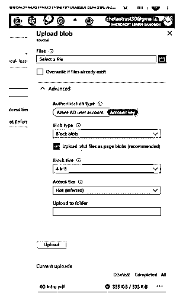

**步骤 17:** 我们可以验证数据是否从下面加载到容器中，也可以下载数据。

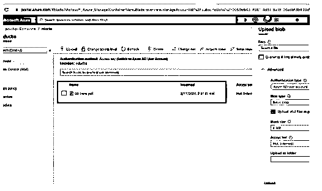

**步骤 18:** 在选择特定文件时，我们还会得到下载选项:

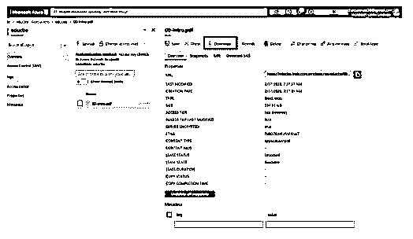

在这里，我们学习如何创建存储、帐户和容器，并上传一些数据作为 blob。

### 结论

总之，我们了解到 Azure blob 存储可用于存储 pdf、音频或视频非结构化数据，我们还看到了一个将 PDF 文件作为 blob 加载到 Azure 存储的示例。

### 推荐文章

这是 Azure Blob 存储的指南。在这里，我们讨论了 azure blob 存储的简介、用途、工作方式以及如何创建 azure blob 存储？您也可以看看以下文章，了解更多信息–

1.  [Azure 组件](https://www.educba.com/azure-components/)
2.  [云计算服务提供商](https://www.educba.com/cloud-computing-service-providers/)
3.  [什么是 Azure？](https://www.educba.com/what-is-azure/)
4.  [大数据架构](https://www.educba.com/big-data-architecture/)

