# Azure 活动中心

> 原文：<https://www.educba.com/azure-event-hub/>

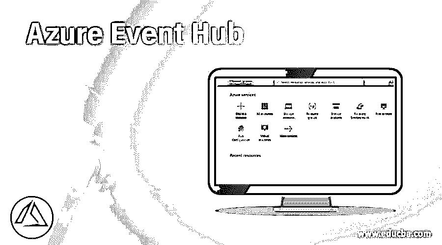

## 什么是 Azure Event Hub？

微软 Azure Event Hub 是一个基于云的服务，通过在几秒钟内处理数百万个事件，被用作大数据平台和事件摄取服务。源系统中生成或存储的数据可以发送到事件中心，用户可以对数据执行必要的转换，最后，可以使用实时摄取技术或通过批处理/存储过程存储数据。azure event hub 用于异常检测、应用程序日志或需要实时数据的应用程序，如实时仪表板等。

### Azure Event Hub 是如何工作的？

Azure event hub 可以轻松地实时处理数据，以便用户能够更深入地了解数据。它使用 Hadoop 中使用的分布式处理平台以低延迟处理数据，并与数据分析服务集成。活动中心就像活动管道的“前门”,充当活动的“入口”。事件破坏者介于事件惩罚者和消费者之间。它是一个统一的流服务，将生产者从事件消费者中分离出来。

<small>Hadoop、数据科学、统计学&其他</small>

对于处理，数据流事件中心使用以下组件:

*   **事件生产者:**它是一个端点，使用 HTTP 或 Apache Kafka 协议将客户与事件中心联系起来。发送到中心的任何类型的数据首先使用事件发布者/生产者发布。
*   **Partitions:** Event hub 流式传输消息，该消息被分区，因此基于分区，消费者只能读取流式传输消息的分区的特定子集。
*   **消费者组:**事件中心遵循发布和订阅机制，这在事件中心使用消费者组来启用。它提供事件中心的状态、位置和偏移视图。基于消费者组的订阅，他们可以在事件中心查看事件流。消费者团体可以根据他们的速度和偏移来阅读或观看该流。
*   **吞吐量单位:**为了控制吞吐量容量，用户可以在 Azure Event Hub 中预先购买容量单位。
*   **事件接收方:**用于从事件中枢读取数据的实体。AMQP 1.0 会话用于连接所有活动中心消费者。此会话用于在活动中心服务可用时立即交付服务。对于实时流和数据摄取，Apache Kafka 使用 Kafka 消费者，这些消费者通过 Kafka 协议 1.0 或更高版本连接。

### 如何在 Azure 中创建和使用 Event Hub？

在学习创建 Azure 事件中心之前，用户必须拥有 Azure 订阅，以便您可以使用有效的凭据登录 Azure 门户。

#### 第一步

使用有效凭据登录 Azure 门户:

https://portal.azure.com/#home

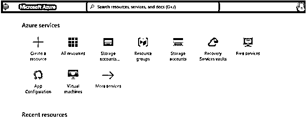

#### 第二步

在 Azure 门户中，在所有服务中搜索创建资源链接，并选择从 Azure 服务创建资源。

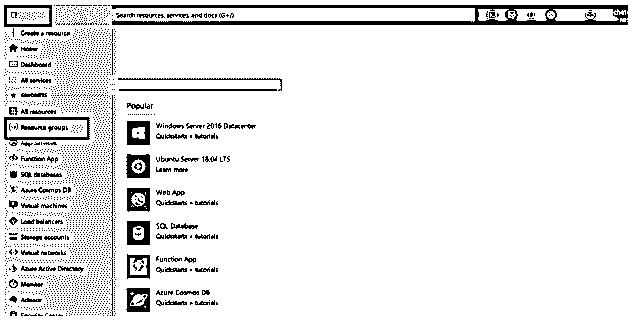

#### 第三步

现在选择+Add 在 Azure 中添加新的资源组:

#### 第四步

根据要求输入资源组详细信息:

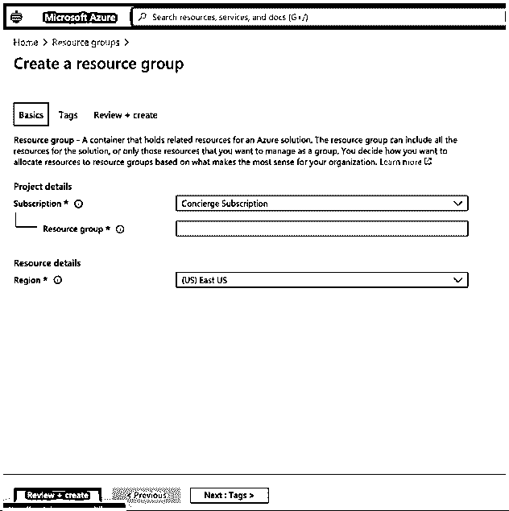

#### 第五步

然后选择“查看+创建”按钮，然后选择“创建”来创建一个新的资源组，将会生成一个新资源，如下所示。

#### 第六步

现在转到 Azure 门户主页，然后转到所有服务

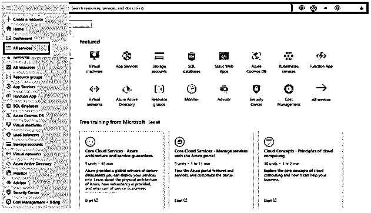

#### 第七步

在 Azure 服务中搜索事件中心:

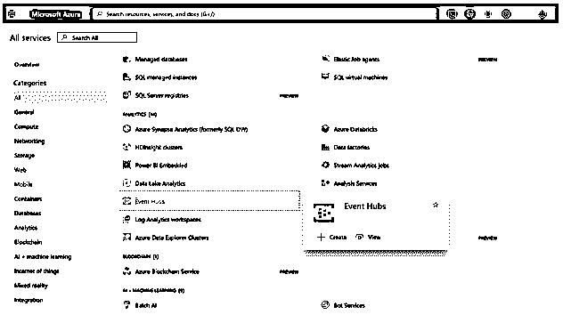

#### 第八步

从页面中选择事件中心，然后单击+添加以创建新的事件中心:

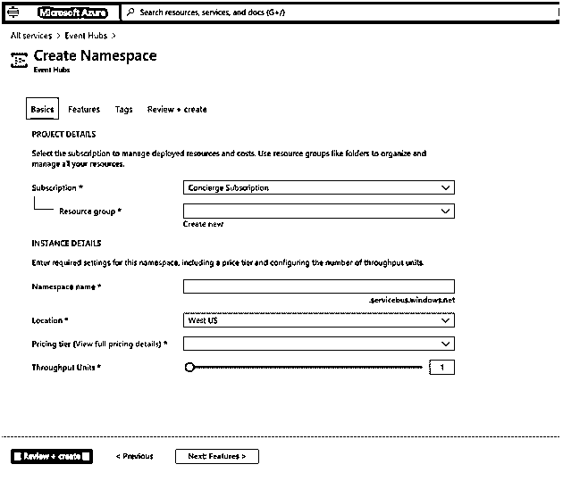

#### 第九步

现在，在“创建命名空间”页面上，选择资源组、订阅、位置，选择定价层(基本或标准)以及吞吐量单位:

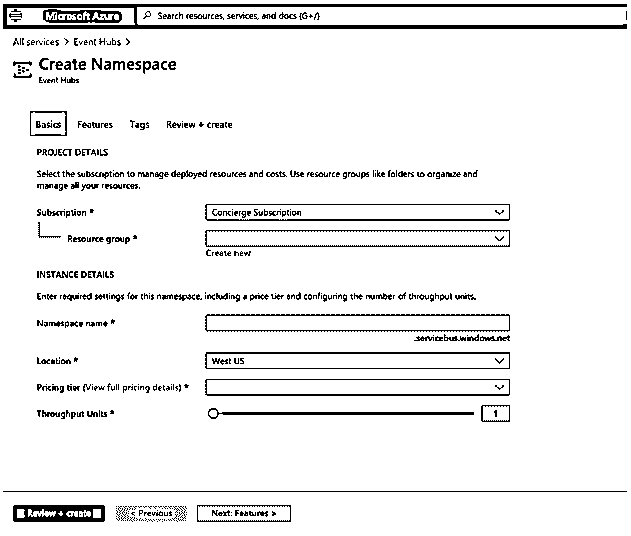

#### 步骤 10

现在选择“查看+创建”,然后选择“创建”,以部署新的活动中心:

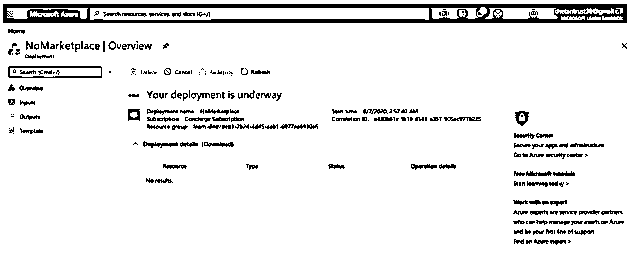

#### 步骤 11

部署成功后，选择转到资源。

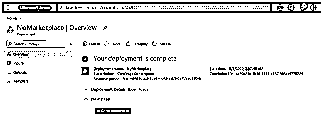

#### 第 12 步

在左侧面板中的实体下选中事件中心，然后选择事件中心:

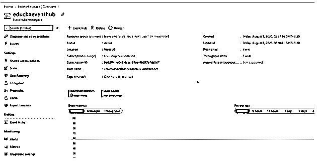

#### 步骤 13

从事件中心页面中选择事件中心，以添加新事件:

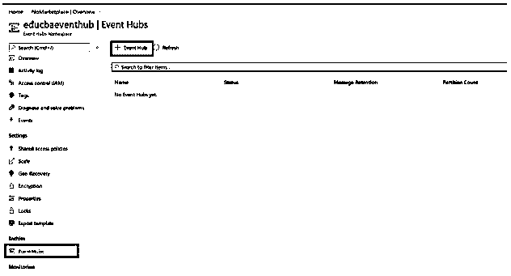

#### 第 14 步

提供新的事件详细信息和分区，然后单击“创建”以添加新事件:

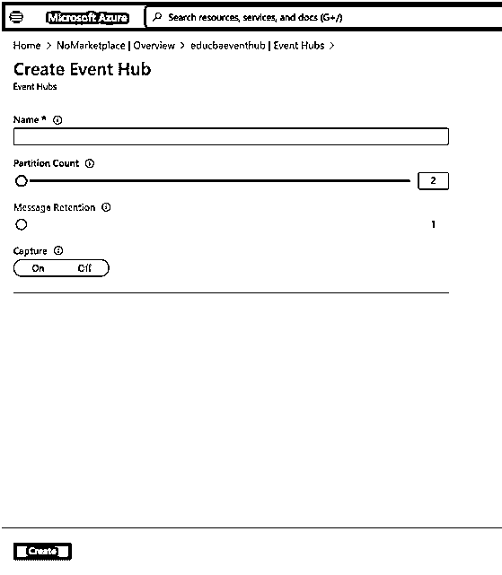

### Azure 事件中心的使用

1.  它支持实时数据处理，因此可用于异常检测、实时仪表板以及作为大数据分析一部分的任何类型的实时分析。
2.  支持数据的实时和批处理。
3.  Azure Event Hub 使用基于云的服务，因此它是可扩展的，用户可以以兆字节为单位开始流，并且它可以增加到 GBs 或 TBs。
4.  这是一项完全托管的基于平台的服务，因此所需的监控和管理开销较少。
5.  它有一个丰富的生态系统，因为它支持 Apache Kafka 生态系统，因此 Kafka 协议用于在生产者和消费者之间传输数据。
6.  Azure Event hub 支持多种语言，如。NET，Python，Java，Scala。

### 结论

Microsoft Azure Event Hub 是 Azure cloud 的一项服务，用于帮助实时或批量摄取数据，以便用户可以从数据中获得更有意义的洞察力，并轻松地在云或任何其他系统上部署应用程序。它支持多种语言和平台，并使用 apache Kafka 生态系统来接收数据。需要在更短的时间内接收大量数据的客户可以更喜欢 Azure Event Hub 服务，因为它易于使用，需要的手动干预更少。

### 推荐文章

这是 Azure 事件中心的指南。在这里，我们讨论如何在 Azure 中创建和使用事件中心，以及工作和使用。您也可以看看以下文章，了解更多信息–

1.  [Azure 备份](https://www.educba.com/azure-backup/)
2.  [Azure 功能](https://www.educba.com/azure-functions/)
3.  [Azure 数据工厂](https://www.educba.com/azure-data-factory/)
4.  [Azure 中的表格](https://www.educba.com/tables-in-azure/)

