# Azure 中的 CDN

> 原文：<https://www.educba.com/cdn-in-azure/>

## Azure 中的 CDN 简介

下面这篇文章提供了一个关于 Azure 中 CDN 的概述。这是一个面向内容交付网络(CDN)的全球解决方案，能够以低延迟交付高带宽内容。Azure CDNs 使用分布式服务器网络来交付高带宽内容，它缓存用户的内容并将内容存储在最接近最终用户的服务器上，这有助于减少延迟。Azure CDN 大多是通过一些动态数据，利用缓存来提升性能。Azure 将无法缓存和存储到端点，因为 CDN 在 POP(服务器存在点)上使用各种网络优化来加速动态内容。

### 如何在 Azure 中创建 CDN？

内容交付网络有助于将视频文件存储在边缘服务器中，以便全球用户可以访问这些文件。

<small>Hadoop、数据科学、统计学&其他</small>

**先决条件:**

需要具有有效电子邮件地址和密码的 azure 帐户，还需要 Azure 订阅才能使用 Microsoft Azure 存储。

**步骤 1:** 使用以下 URL 登录 Microsoft Azure 门户。

[https://portal.azure.com/](https://portal.azure.com/)

下面的 Azure 主页将被打开:

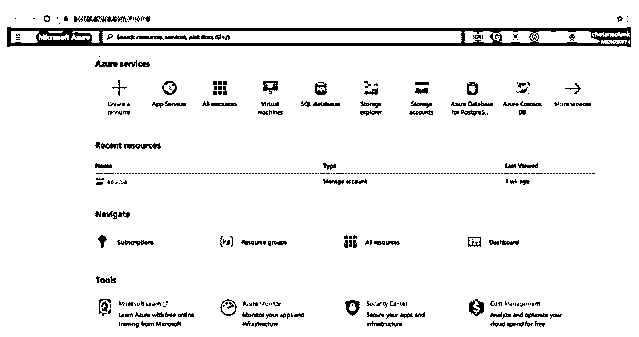

**步骤 2:** 从 Azure 门户主页选择创建资源，它将显示包含所有服务的页面，如下所示:

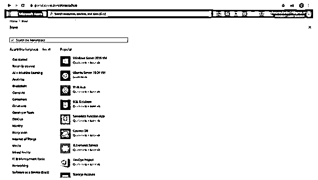

**第三步:**在门户的新页面选择 Web App。

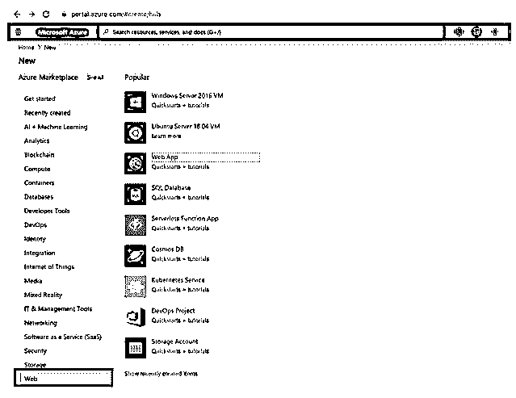

**第四步:**在新填充的特色窗格中选择 CDN，如下图。

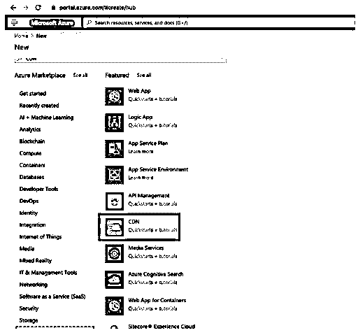

**步骤 5:** 将打开 CDN 配置文件页面，根据需要提供 CDN 名称，并从下拉列表中选择资源组和定价层。

不要选中“立即创建新的 CDN 端点”复选框。

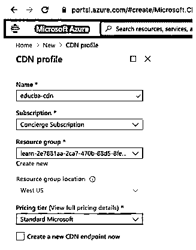

**步骤 6:** 单击“创建”按钮，这需要一些时间来部署，验证将按如下方式开始。

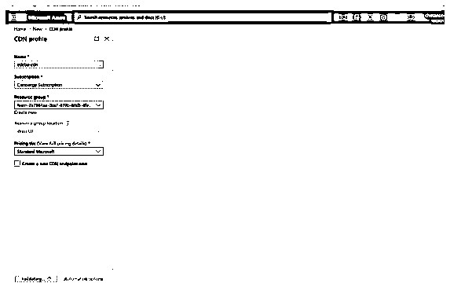

**步骤 7:** 成功创建 CDN 配置文件后，在通知图标消息中显示为“成功创建 CDN 配置文件”。

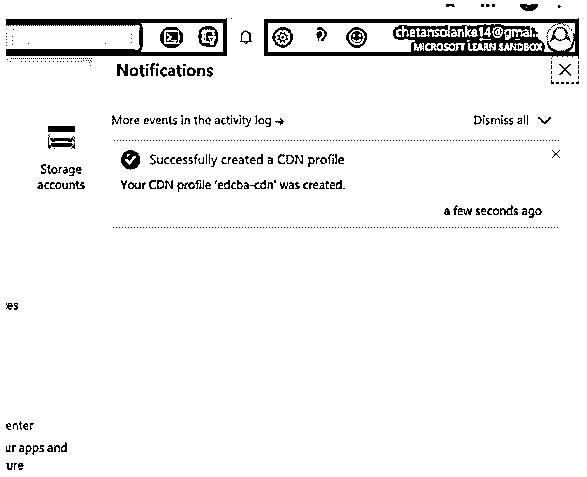

**第 8 步:**单击第 7 步中成功创建的 CDN 配置文件页面，显示您刚刚创建的 CDN 配置文件。

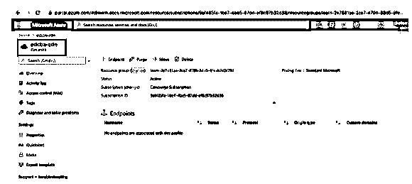

### 如何在 Azure 中创建自定义原点的 CDN？

Microsoft Azure CDN 支持以下四种原始类型:

*   储存；储备
*   云服务
*   Web 应用程序
*   自定义来源

在这里，我们将看到如何为自定义源创建一个 CDN，它只不过是一个公共访问的源 web 浏览器，可以托管在 Azure 或任何地方。

**步骤 1:** 转到“所有服务”,从左侧窗格中选择“Web ”,然后单击“CDN profilers ”,查看最近创建的 CDN 配置文件。

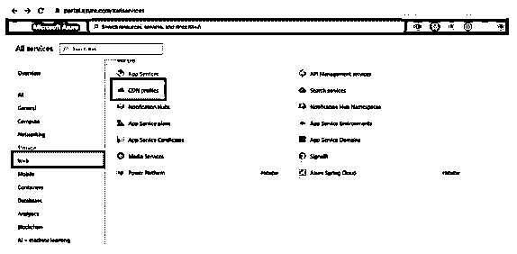

**步骤 2:** CDN profiles 页面显示所有已创建的 CDN 配置文件，选择一个 CDN 配置文件，如下所示。

**步骤 3:** 从 CDN profile 窗格中选择 **+** 端点，如下图。

**步骤 4:** 在 Add an endpoint 中输入您想要的端点名称。

**第五步:**原产地类型是一个下拉列表，显示所有四种原产地类型，这里选择原产地类型作为自定义原产地。

**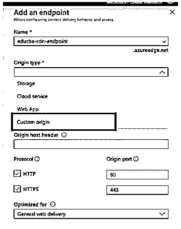

** 

**步骤 6:** 源主机名字段接受自定义链接的 URL 或 IP 地址，它将从源提取内容，不要在主机名的 URL 中使用 https/http 或任何尾随斜杠。

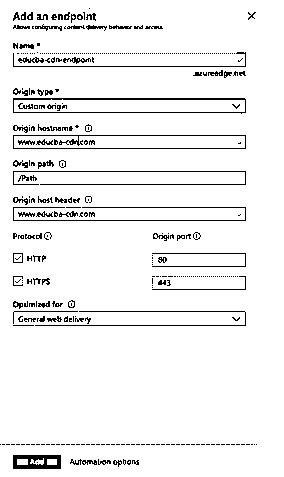

**第 7 步:**单击“添加”为自定义原点创建一个端点大约需要 8-10 分钟，在通知中，图标通知将显示为“已成功创建 CDN 端点”。

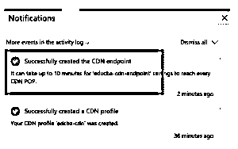

点击成功创建的 CDN 端点以导航到该端点。

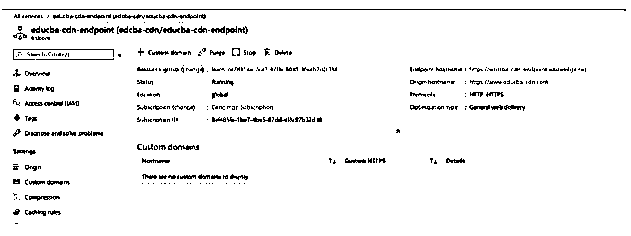

### 如何在 Azure 中管理 CDN？

在这里，我们将看到如何管理 CDN azure 来控制内容的交付。

**步骤 1:** 转到您想要管理的 CDN，从“所有服务”页面中选择 CDN 配置文件。

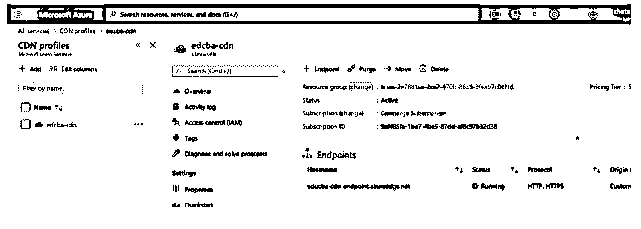

**步骤 2:** 选择您想要管理的 CDN 端点，这将从 CDN 配置文件中打开一个 CDN 端点。

**步骤 3:** 从设置部分选择地理过滤选项，该设置将允许您控制基于位置的过滤。它有两个选项配置为允许或阻止。

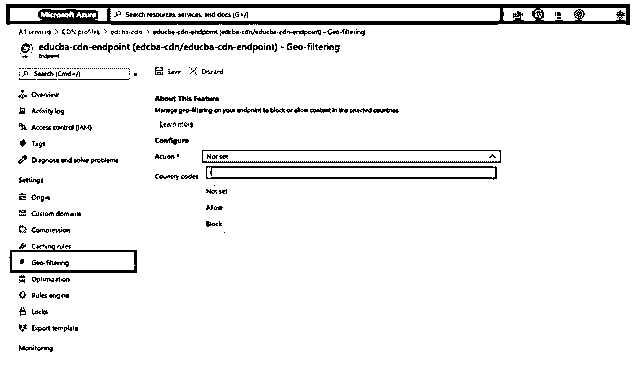

**第四步:**根据国家代码，用户可以管理在哪个国家屏蔽和在哪个国家屏蔽内容。

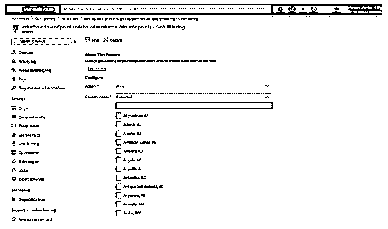

**第五步:**要管理压缩，选择如下设置部分下的压缩。

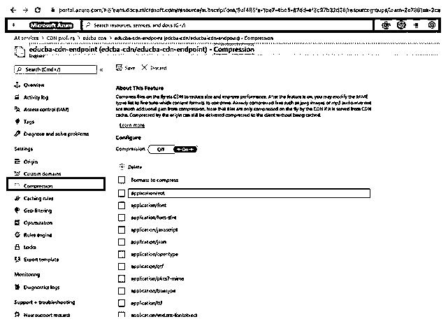

根据需要，用户可以将压缩配置保持为打开或关闭。还有其他几个压缩清单提供给用户。

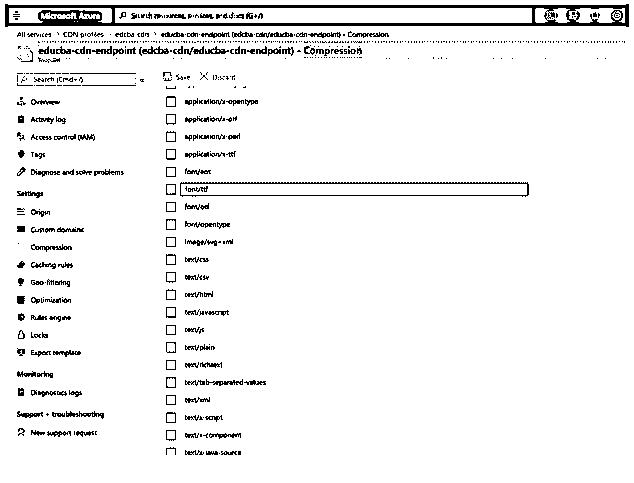

**步骤 6:** 要管理 CDN 中的缓存，请在“设置”部分点击缓存规则，这有助于控制内容。

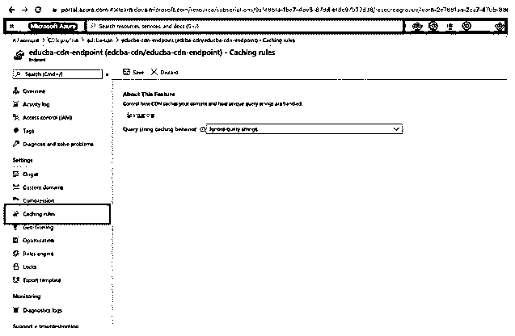

**步骤 7:** 缓存设置提供了三种不同的查询缓存行为，分别为:

*   忽略查询字符串
*   绕过查询字符串的缓存
*   缓存每个唯一的 URL

根据需求，用户可以设置内容缓存行为。

### 优势

Microsoft Azure Content delivery network 为用户在全球范围内交付内容提供了许多优势:

*   它减少了提供高带宽内容的等待时间。
*   Azure CDN 在使用重复加载内容的应用程序时，提供了改进的用户体验和高性能。
*   它具有处理大量数据负载的高可伸缩性。
*   它将内容存储在离用户较近的边缘服务器上，以较少的流量向用户提供内容目录。

### 结论

总之，我们了解了 Microsoft Azure 如何在全球范围内处理内容交付，CDN 如何帮助在全球范围内共享基于网络的内容，使用 CDN 端点用户可以管理可以访问的国家或位置数据，还可以选择在自定义源域上托管数据。

### 推荐文章

这是 Azure 中的 CDN 指南。这里我们讨论一下在 Azure 中创建 CDN 的介绍，以及如何用优势管理 CDN。您也可以看看以下文章，了解更多信息–

1.  [Azure 组件](https://www.educba.com/azure-components/)
2.  [Azure 服务](https://www.educba.com/azure-services/)
3.  [Azure 物联网边缘](https://www.educba.com/azure-iot-edge/)
4.  [什么是 Azure？](https://www.educba.com/what-is-azure/)
5.  [Azure SQL 数据库|如何创建？](https://www.educba.com/azure-sql-database/)

