# 蓝色木板

> 原文：<https://www.educba.com/azure-boards/>

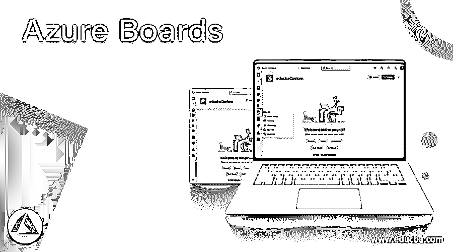

## 什么是微软 Azure Boards？

微软 Azure board 是一款用于管理软件开发工作的工具，该工具主要用于 Azure DevOps，帮助团队规划工作和日常活动。该团队需要完成的所有工作都在 Azure boards 中进行跟踪，Tailspin 团队将使用 Azure Board 来获得关于需要完成的工作的大多数想法，并对工作进行优先排序。Azure board 还扩展了对 Scrum、看板或可定制仪表板的支持，支持集成报告。

当一个由多个开发人员或用户组成的团队在一起协作时，Microsoft Azure board 服务可以帮助用户跟踪软件开发工作或与不同用户相关联的任务。下面是用来开发 azure 板最流行的过程:

<small>Hadoop、数据科学、统计学&其他</small>

**1。基本流程**

Azure board 中的基本流程遵循工作项层次结构和工作流状态。为了跟踪工作问题并创建任务，对于较大的场景，所有任务和工作被分组在一起，并为分组的工作创建 epic。工作状态从未开始进展到完成，状态工作流从**到**、**做**、**做**到**完成**。

通过向工作项添加问题、任务和 epic 来创建工作项。Epic 用于跟踪特性和需求，而 issues 用于跟踪用户故事或 bug。

下图描述了基本的流程积压工作:

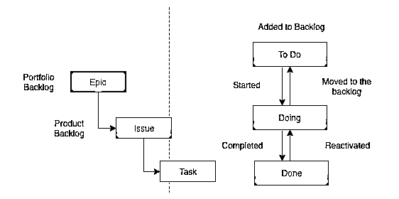

**2。敏捷流程**

在敏捷流程中，用户故事和任务是在工作项中创建的，用于跟踪工作或提出 bug 并跟踪 bug 代码，而史诗和特性则用于收集单个工作任务中的大型场景。随着工作的进展，工作流状态可以从**新建、活动、已解决和关闭**改变。

用户可以添加一个用户故事、bug、任务、epic，并使用这个工作项进行创建。每个团队成员将被分配一个基于团队必须开发的特定工作的用户故事。在每个故事中，创建的任务是一个故事中的少量工作，用于跟踪已完成的工作和工作时间，如以小时或天为单位跟踪时间。

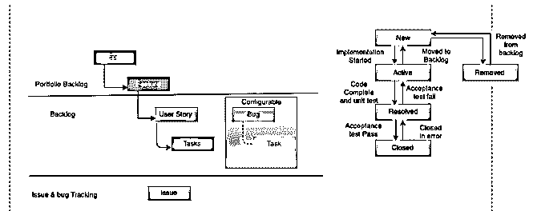

### 如何在 Azure 中创建和使用板子？

**先决条件:**

在学习创建 Azure Boards 之前，用户必须拥有 Azure 订阅，这样他们就可以使用有效的凭证登录 Azure 门户并创建 Azure Boards。

**使用 Azure 门户的步骤:**

*   #### Create a project

**步骤 1:** 使用以下网址登录 dev.azure.com:

[https://dev.azure.com/](https://dev.azure.com/)

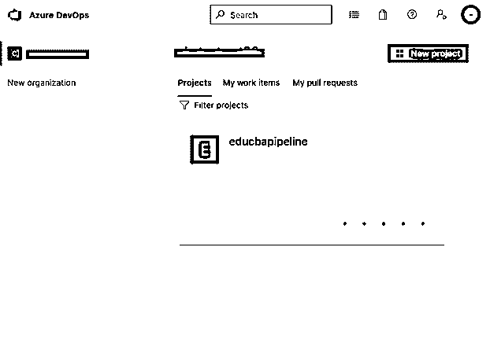

**第二步:**从 Azure DevOps 中选择+ **新项目**:

它将打开一个对话框，显示**创建新项目:**

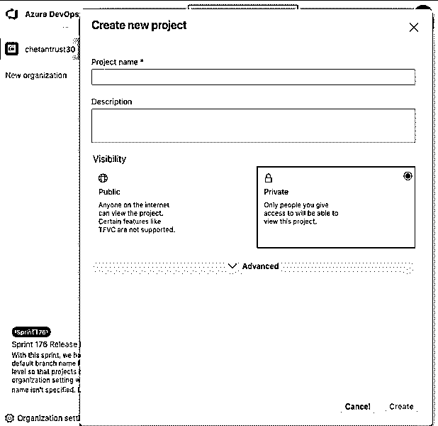

**第三步:**在**新建项目**弹出窗口中输入以下详细信息:

*   **项目名称:**在本栏位输入项目名称。
*   **描述:**在本栏位输入项目的详细信息或描述
*   **可见性:**选择**公共**或**私有**来控制访问权限，并选择将项目设为私有还是公共。

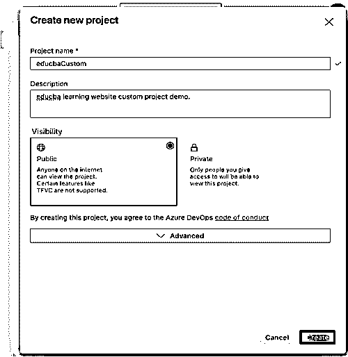

**步骤 4:** 在新建项目中选择**高级**，在高级下拉菜单中选择**版本控制**作为 **Git** ，在**工作项流程**下作为**基本:**

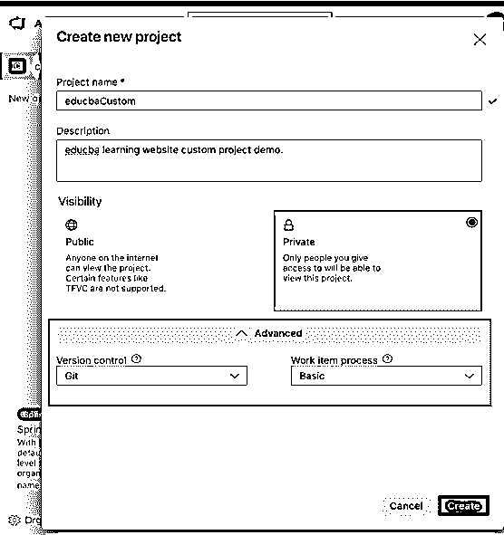

**第五步:**现在选择**创建**创建一个新项目，过一会儿一个新项目就会被添加进来。

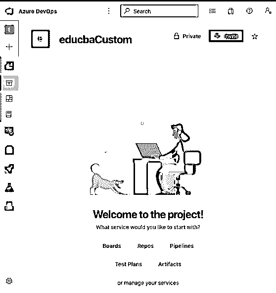

*   #### Create a team and add team members

**步骤 6:** 现在创建一个团队，点击项目右上角的**邀请**:

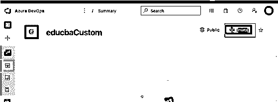

**第七步:** **邀请**会打开一个对话框在团队中添加新的团队成员:

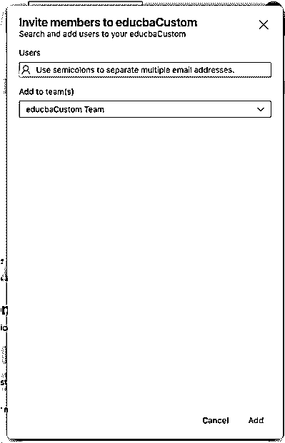

**第 8 步:**在**用户**栏输入用户名，然后选择**添加**添加新用户:

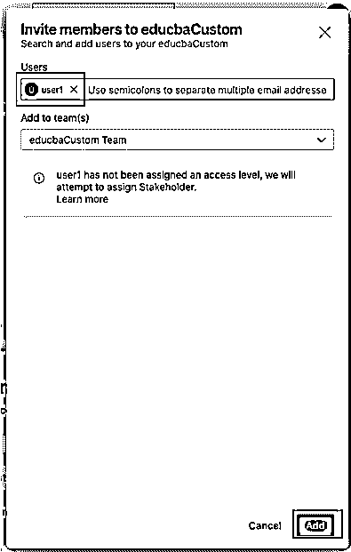

**第 9 步:**同样，用户可以根据需要添加任意数量的用户或团队成员。

*   #### Create bulletin board:

**步骤 10:** 在项目总结页面，从左侧部分选择**板**:

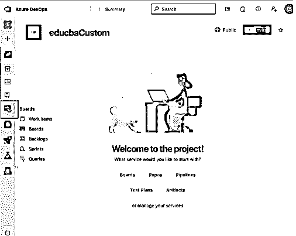

**步骤 11:** 从**板卡**列表中选择**板卡**，这将打开一个空白板卡:

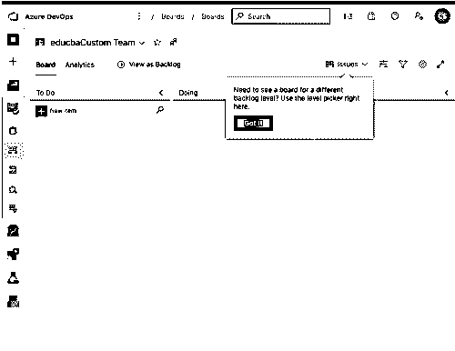

**第 12 步:**由于这是一个基本流程，我们可以看到有三种状态可供选择，即“要做”、“正在做”和“完成”:

**第 13 步:**从**待办事项**栏选择+新事项字段，输入事项明细，点击回车:

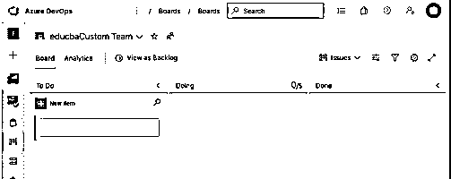

**第 14 步:**进入后，输入新任务，添加任务明细。

**第 15 步:**点击创建的新项目，然后选择省略号(…)，然后选择**打开:**

**T2】**

 ****第十六步:**在描述字段输入任务的描述，点击保存:

**T2】**

 ****步骤 17:** 使用上面的步骤 13 到 16，在列表中添加更多的项目:

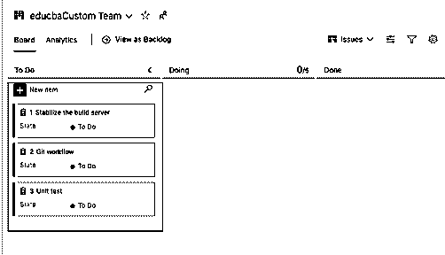

*   #### Define sprint

**步骤 18:** 从面板中选择页面左侧的 Sprint 选项:

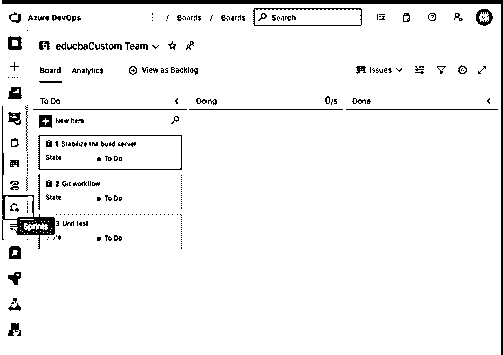

第 19 步:设定冲刺日期:

输入冲刺详情:

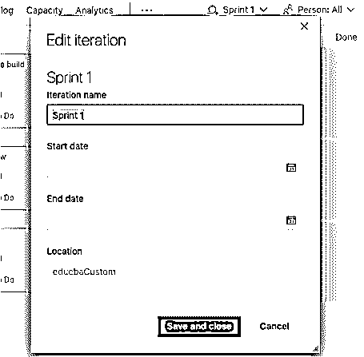

**步骤 20:** 在对话框中输入 sprint 迭代名称和起止日期，点击保存并关闭:

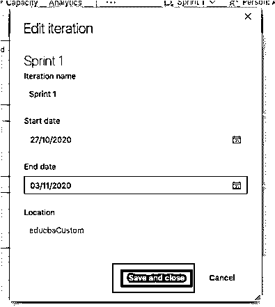

*   #### Assign tasks and set iterations

**步骤 21:** 从项目的面板中选择工作项，在下面的屏幕截图中，我选择了创建的第一个工作项:

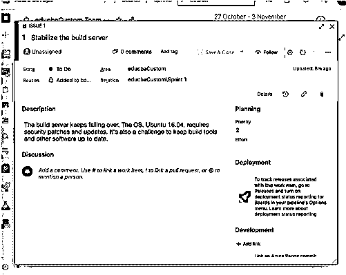

**第 22 步:**现在从迭代下拉列表中选择 Sprint 1:

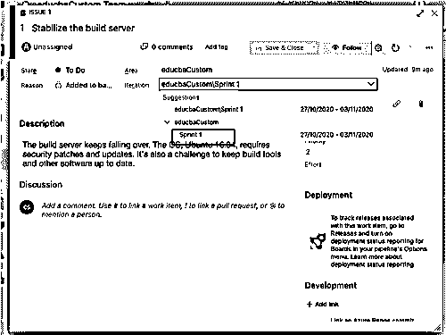

**步骤 23:** 现在从页面中选择**未分配的**并分配任务给现有用户，然后点击**保存&关闭**:

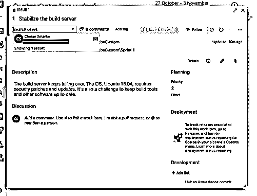

**步骤 24:** 在留言板中，用户可以查看任务是否分配给新用户:

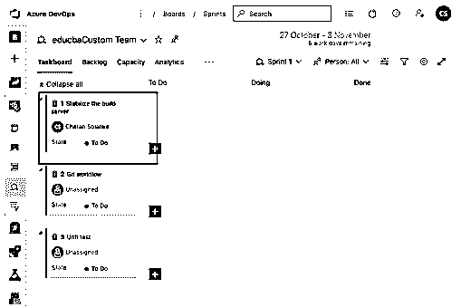

**步骤 25:** 对剩余的工作项目再次重复相同的步骤 20 到 23。

在这里，我们可以看到创建了一个新的 Azure 板，并添加了一个新闻报道。

### Azure 板的用途

*   Azure Boards 允许跨团队和团队在单个开发任务或工作上进行协作和合作。
*   Azure board 支持微软团队、Skype 和 Slack，因此敏捷团队成员可以更有效地协作。
*   Azure Marketplace 与 azure board 集成，azure board 为用户和团队提供了更多的工具，因此该扩展可以支持规划和跟踪。
*   Azure board 连接到 GitHub，因此 Azure board 中的问题和任务都链接到 GitHub commit。
*   工作被组织到 epics 下的分组问题/任务中，用户还可以轻松快速地创建分类问题和任务。

### 结论

总之，Azure Boards 支持基本的敏捷流程。敏捷方法是最常用的软件开发方法。此外，它还支持各种微软 Azure 云服务，帮助团队轻松开发应用程序。

### 推荐文章

这是一个 Azure 板的指南。在这里，我们讨论什么是微软 Azure 板，用途，如何在 Azure 中创建和使用板？.您也可以看看以下文章，了解更多信息–

1.  [Azure 队列存储](https://www.educba.com/azure-queue-storage/)
2.  [Azure 事件网格](https://www.educba.com/azure-event-grid/)
3.  [Azure ExpressRoute](https://www.educba.com/azure-expressroute/)
4.  [Azure 桌面储物](https://www.educba.com/azure-table-storage/)

****