# Azure 网络观察者

> 原文：<https://www.educba.com/azure-network-watcher/>

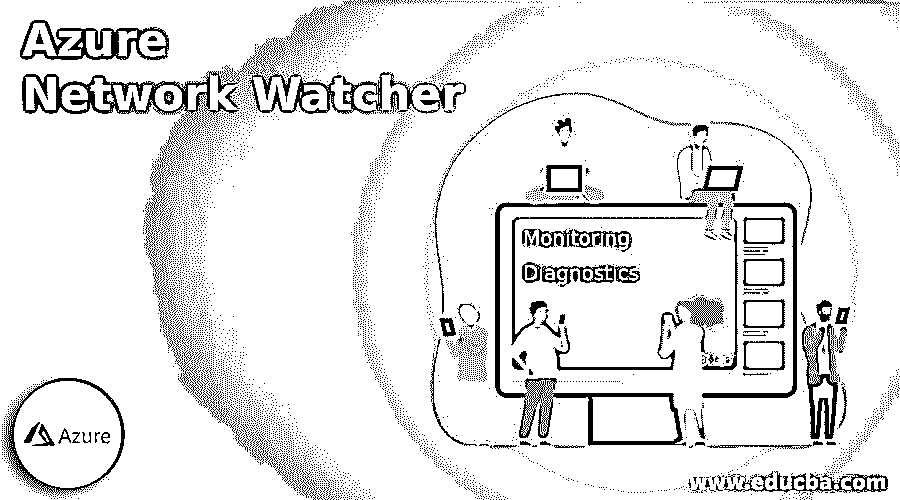

## Azure 网络观察器简介

Azure Network Watcher 是一个 Azure 云服务，它通过将所有工具组合在一个中心工具中来诊断 azure 网络的健康状况。通过监控、诊断、查看指标以及登录的工具，可以启用和禁用 Azure 虚拟网络。Azure network watcher 旨在修复网络健康云基础设施，并监控虚拟机(VM)、虚拟网络、负载平衡器、应用程序网关等。网络观察器不监控和维护 PaaS 监控和网络分析。

### 什么是微软 Azure 网络守望者？

Azure network watcher 的工具分为两类:监控工具和诊断工具。这些工具通过提供一个集中的中心来识别问题，用于监视和诊断网络观察器中的问题。

<small>Hadoop、数据科学、统计学&其他</small>

#### 1.监视

为了执行监控任务，网络监视器使用以下三种工具:

*   **拓扑工具:**它生成 Azure 虚拟网络的图形图像，包括其使用的资源、形成的互连以及关系。因此，拓扑工具可用于可视化和理解基础设施，以便新用户可以轻松排除故障。
*   **连接监控工具:**用于检查两个 azure 资源之间的连接健康状况。如果需要，用户可以检查两个虚拟机是否相互通信。它可以捕获网络配置或 NSG 规则的变化，并查找任何故障或变化。出现任何故障/问题时，它会告知发生的原因以及如何修复。
*   **网络性能监视器:**它监视资源的端到端连接，使您能够跟踪系统延迟或发出警报。它为用户提供了网络的集中视图。

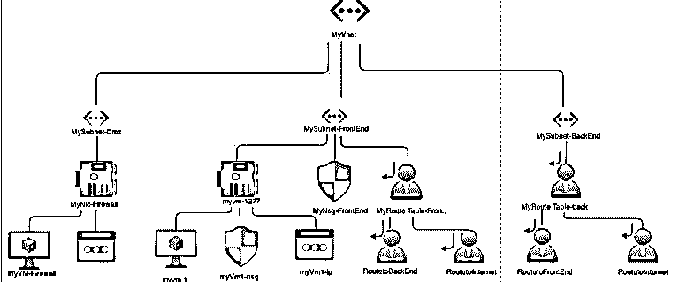

#### 2.诊断学

网络观察器中有以下六种诊断工具:

*   **IP 流验证工具:**它识别特定数据包在虚拟机中是被允许还是被拒绝。如果包装工在 NSG 被拒绝，这些工具会给你这个团体的名字。
*   **下一跳工具:**使用该工具，用户可以确定数据包如何从一个虚拟机到达另一个虚拟机。使用源网络、源 IP 地址和目的地虚拟机 IP 工具确定数据包的目的地，并可用于诊断不正确的路由表。
*   **有效的安全工具:**显示所有要在网络接口上应用的有效的 NSG 规则。NSG 根据来源和目的地过滤 azure 网络。
*   **数据包捕获工具:**用于记录从虚拟机接收和发送的所有数据包，然后您可以查看网络流量或诊断异常。
*   **连接故障排除工具:**用于检查源虚拟机和目标虚拟机之间的 TCP 连接，通过使用 FQDN，URI 或 IP 地址用户可以指定目标虚拟机。
*   **VPN 故障排除工具:**该工具可以通过在虚拟网络上运行诊断来诊断虚拟网络网关连接的问题，并返回健康诊断。

### 如何在 Azure 中使用网络观察器？

在这里，我们将看到如何通过 Azure 门户使用 Azure 中的网络观察器来诊断虚拟机网络:

**先决条件:**

*   用户应该拥有有效的用户名和密码。
*   用户应该拥有 Azure 订阅才能使用网络观察器诊断资源。

### 使用 Azure 门户的步骤

下面给出了使用 Azure Portal 的步骤:

**创建虚拟机:**

**步骤 1:** 使用以下 URL 登录 Azure 门户:

https://portal.azure.com/learn.docs.microsoft.com

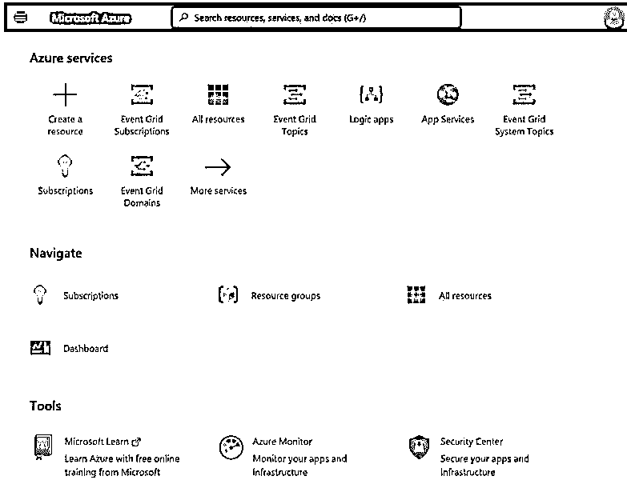

**步骤 2:** 从 Azure 门户主页，选择+创建资源。

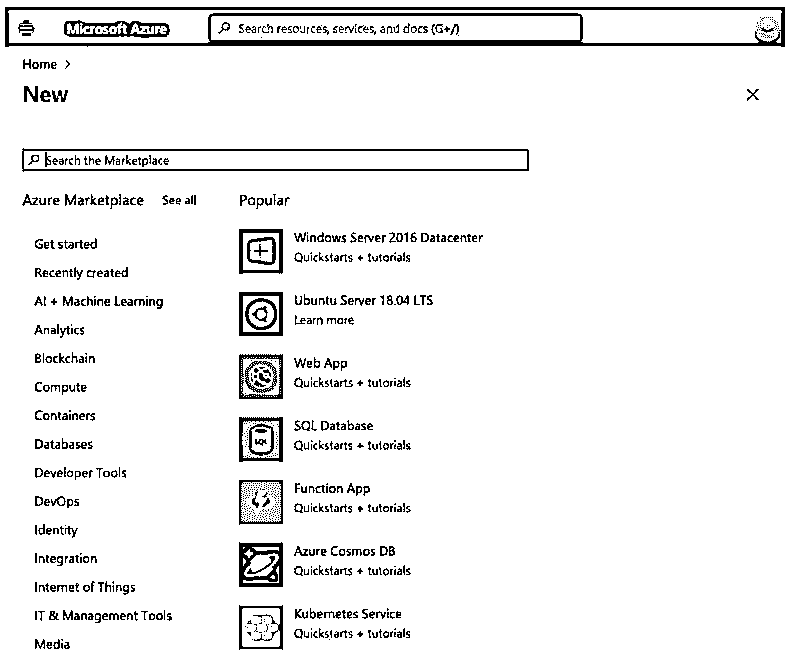

**步骤 3:** 在 Azure Marketplace 中，选择计算，然后点击 Window Server 2016 Datacenter 或 Ubuntu Server。

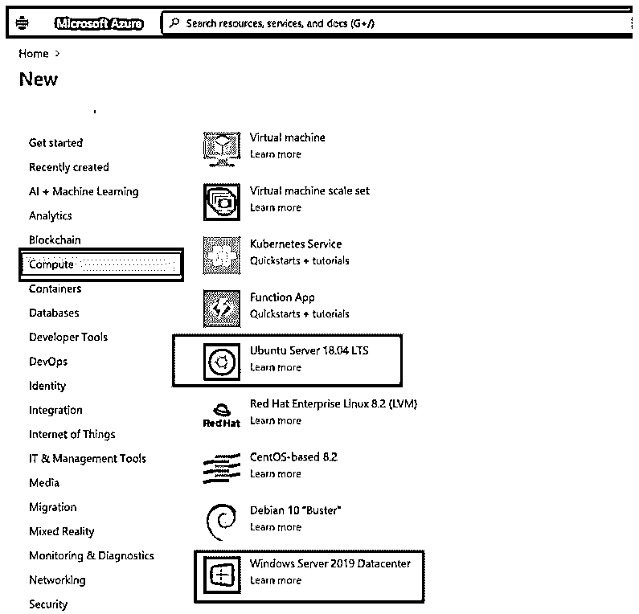

**第四步:**这里，我们选择了 Ubuntu Server 108.04，用户迁移到创建虚拟机页面。

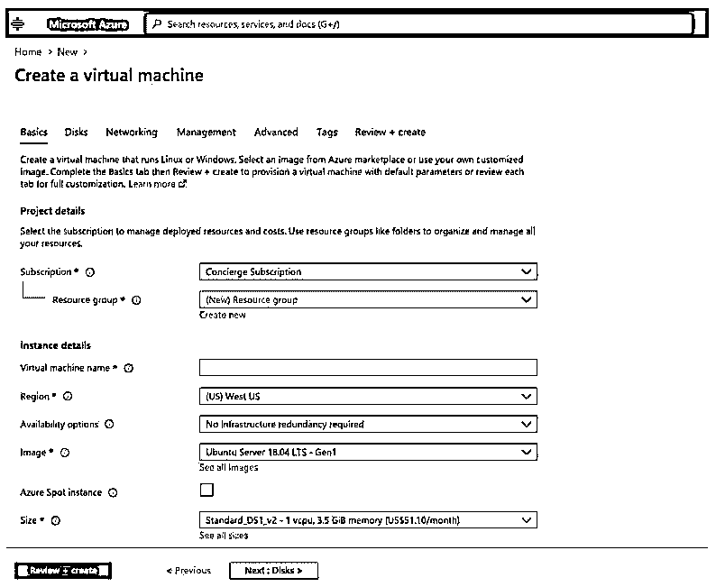

**步骤 5:** 输入虚拟机详细信息，根据您的订阅和要求配置订阅名称、虚拟机名称、大小、区域、可用性选项等基本参数，然后单击“Review+Create”。

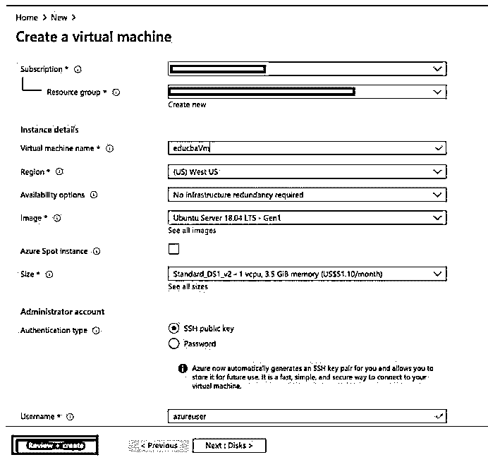

**步骤 6:** 如果输入的详细信息正确，验证将通过，然后选择“create”以创建虚拟机。它将开始部署虚拟机。

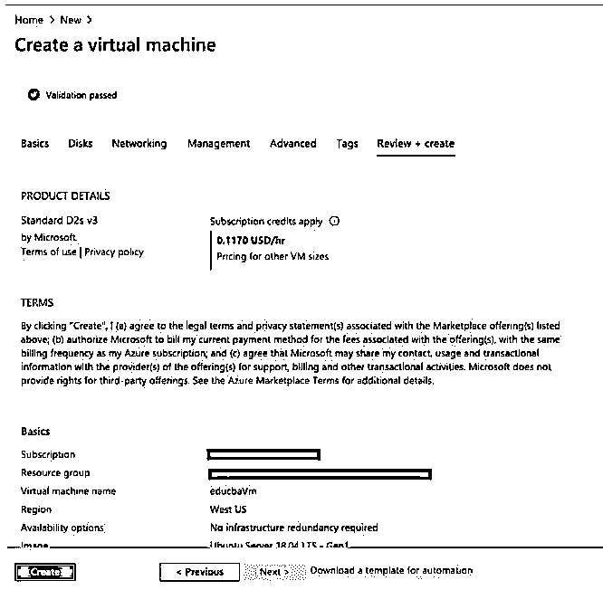

**第 7 步:**这将重定向到虚拟机创建页面，您可以跟踪状态。

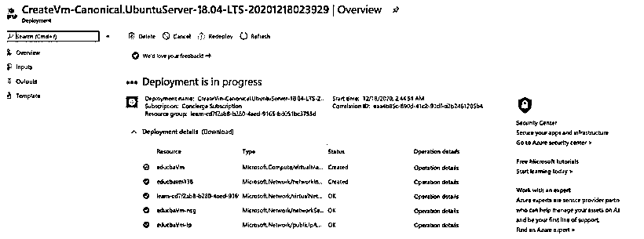

**第 8 步:**部署完成后，单击“转到资源”查看虚拟机。

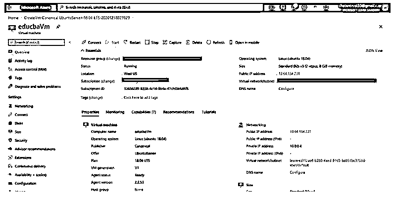

### 测试网络通信

下面给出的是测试网络通信:

**步骤 1:** 在 Azure Portal 搜索框中，输入 Network Watcher，当它出现在结果部分时，选择相同的内容。

**步骤 2:** 在这里，在网络观察器中，单击区域部分的下拉列表，并选择您已创建虚拟机的区域。

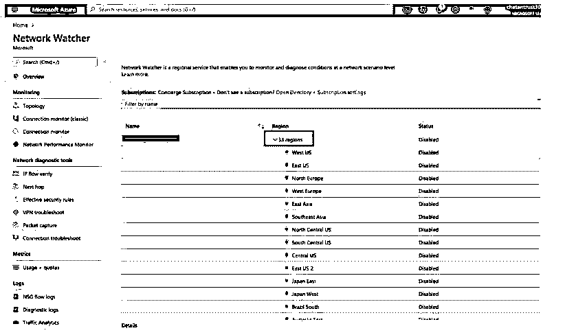

**步骤 3:** 启用特定区域网络观察者。

### 使用 IP 流验证工具

下面给出了 IP 流验证工具的使用方法:

**步骤 1:** 启用网络观察器后，从网络诊断工具部分选择要验证的 IP 流。

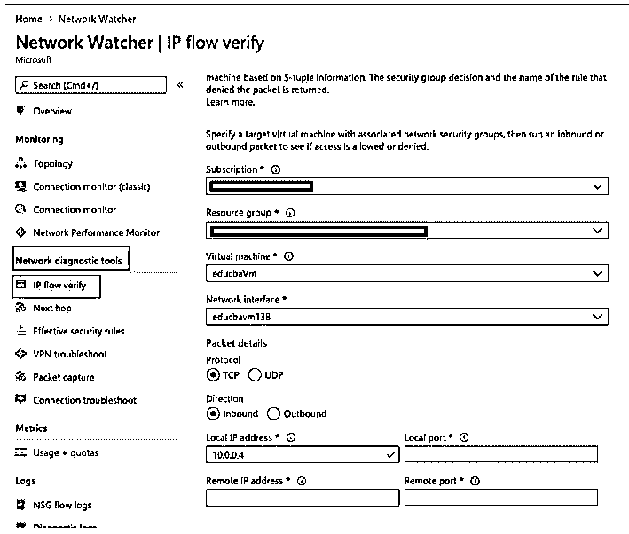

**步骤 2:** 选择订阅、资源组、虚拟机名称、协议，并输入远程 IP 地址以测试与他的 IP 的连接，然后单击检查:

**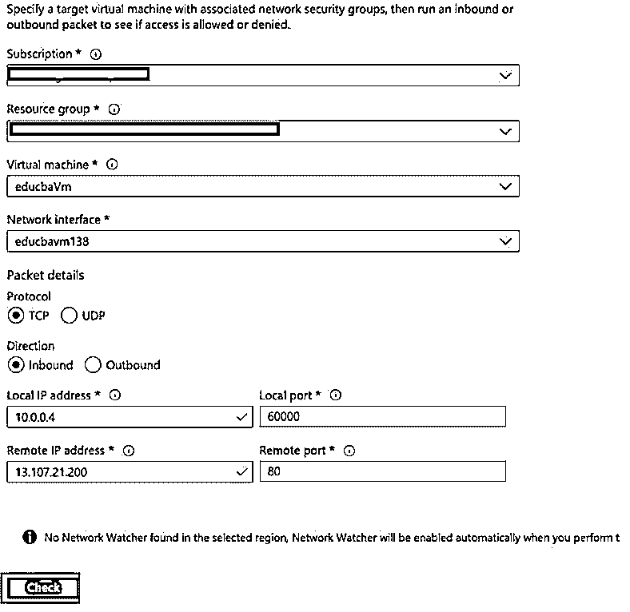

** 

一段时间后，它将返回一个结果，即由于安全规则 AllowedInternetOutbound，访问被允许。

**第三步:**你可以尝试添加一些其他的远程 IP，检查连接；由于安全规则，它将返回 defaultOutboundDenyAll。

**监控工具:**

**步骤 4:** 一旦启用了监视程序，用户就可以从监视工具中进行选择，用户可以使用这些工具进行监视。在“监控”部分，列出了所有工具。

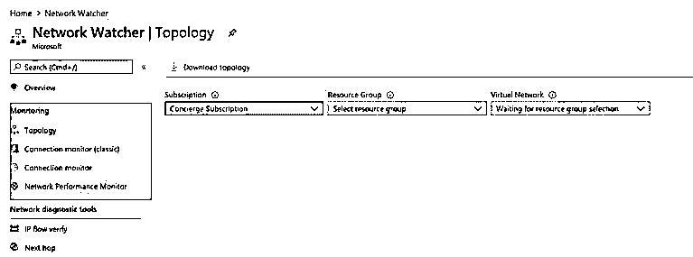

用户还可以使用诊断部分的其他诊断工具来诊断资源。

### Azure 网络观察器的使用

*   要解决单个虚拟机网络中的连接问题，用户可以使用 IP 流验证工具来识别问题，因为用户可以指定远程和本地端口。这个工具也将提供解决方案。
*   网络监视器自动监控网络并捕获数据包。因此，无需登录虚拟机，监控和诊断就会自动进行。
*   使用流量日志，您可以深入了解您的网络流量。
*   VPN 连接问题诊断非常简单，因为网络观察器可以诊断 VPN 网关和连接问题。

### 结论

总之，使用网络监视器完全消除了手动或从特定区域诊断或监控资源的复杂性。由于它已经集成到 Azure 服务中，用户只需为他们使用的东西付费。

### 推荐文章

这是 Azure 网络观察器的指南。在这里我们讨论介绍，步骤，测试网络通信，使用 IP 流验证工具的用途。您也可以看看以下文章，了解更多信息–

1.  [Azure API App](https://www.educba.com/azure-api-app/)
2.  [天蓝色钥匙金库](https://www.educba.com/azure-key-vault/)
3.  [Azure 数据块](https://www.educba.com/azure-databricks/)
4.  [Azure 存储](https://www.educba.com/azure-storage/)

