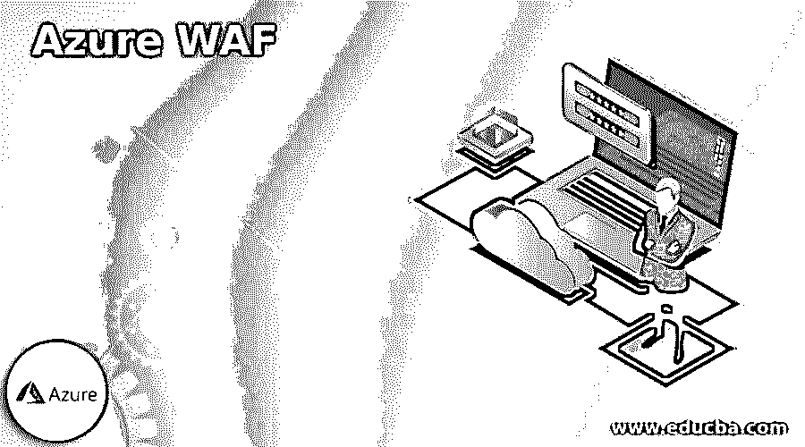

# 天蓝色薄饼

> 原文：<https://www.educba.com/azure-waf/>

## Azure WAF 简介

Azure 应用程序网关上提供的 Azure WAF (Web 应用程序防火墙)提供了 Web 应用程序的集成安全性，防止共享漏洞和易受攻击性。因为 web 应用程序逐渐成为恶意攻击的目标，这些恶意攻击通常利用已知的弱点。其中最常见、最主要的攻击是跨站脚本和 SQL 注入。从 OWASP(开放 Web 应用安全项目)来看，应用网关上的 WAF 一般基于 CRS(核心规则集)3.1、3.0 或 2.2.9。因此，需要一个 WAF 策略来允许应用程序网关上 Web 应用程序防火墙，包括完整的有组织的规则、排除、自定义规则和自定义，如文件上传限制。

### 创建 Azure 晶片

我们可以使用三种不同技术创建 Azure WAF:

<small>Hadoop、数据科学、统计学&其他</small>

*   **Azure 应用网关:**帮助平衡 web 流量的负载，这允许处理 Web 应用的流量。
*   **Azure Front Door:** 集中式安全、全球、可扩展的入口点，实现了微软全球边缘网络，用于设计快速、安全、可广泛扩展的 web 应用程序。
*   **Azure CDN(内容交付网络):**提供全球 CDN 解决方案以提供高带宽内容，并且可以在 Azure 或任何不同的位置托管。

### Azure WAF 的命令示例

要配置 Azure WAF，可以应用以下命令，但只能应用于具有 SKU WAF 类型的应用程序网关:

*   **az 网络应用-网关 waf-配置列表-规则集:**提供关于现有 WAF 规则集、规则 id 和规则组的信息。
*   **az 网络应用-网关 waf-配置集:**用于更新 web 应用的防火墙布置。
*   **az 网络应用-网关 waf-config 显示:**接收一个 web 应用的防火墙的配置。
*   **azure-waf-policies-get:** 帮助恢复资源群集中的保护策略。例如！azure-waf-policies-get limit=1。
*   **azure-waf-policies-list-all-in-subscription:**在提供的订阅中重新获得整个 WAF 策略。命令示例可以是:！azure-waf-policies-list-all-in-subscription 限制=3。
*   **azure-waf-policy-update-or-create:**它创建或更新在资源集群中具有特定规则集名称的特定策略。
*   **Azure-waf-policy-delete:** 删除现有策略。
*   **Azure-waf-auth-start:** 开始授权过程，并遵循命令 outcomes 中的说明。
*   **Azure-waf-auth-complete:** 帮助实现授权过程。
*   **Azure-waf-auth-reset:** 重复授权过程。
*   **Azure-waf-auth-test:** 检查连接性。

### Azure WAF 的优势

以下是 WAF on Application Gateway 提供的基本优势:

#### 1.保护

*   无需更改后端代码，保护 web 应用程序免受 web 攻击。
*   同时保护各种 web 应用程序。应用程序网关的一个示例是能够托管多达 40 个网站，这些网站由 web 应用程序防火墙保护。
*   为匹配 WAF 背后的各个站点设计定制 WAF 策略。
*   保护您的 web 应用程序免受恶意僵尸程序的攻击，包括 IP 信誉规则集。

#### 2.监视

*   通过实时 WAF 日志观察对任何 web 应用程序的攻击。日志包含在 Azure Monitor 中，用于简单地跟踪 WAF 警报和监控趋势。
*   应用程序网关 WAF 与 Azure 安全中心集成在一起，提供了对整个 Azure 资产的安全状态的重要意见。

#### 3.用户化

*   为了适应应用的需要并消除误报，定制 WAF 规则和规则组。
*   将 WAF 政策与 WAF 背后的每个站点相关联，以同意站点特定的安排。
*   设计定制规则以满足应用程序的要求。

### 特征

Azure WAF 的一些特性如下:

*   防止跨站点脚本攻击。
*   防御 SQL 注入。
*   防止违反 HTTP 协议。
*   防御爬虫和扫描器。
*   针对 HTTP 协议差异的保护，如缺少主机用户代理和一致的报头。
*   防范一些相互的 web 攻击，如命令注入、HTTP 响应分割、远程文件包含和 HTTP 请求走私。
*   检测共享应用程序的错误配置，如 IIS 和 Apache。
*   配置请求大小限制，包括下限和上限。
*   设计适合应用程序特定需求的定制规则。
*   排除列表允许您从 WAF 评估中忽略明确的请求元素。相互实例可以是为验证或密码字段实现的活动目录注入令牌。
*   地理过滤流量，允许或阻止特定地区/国家访问应用程序。
*   保护您的应用程序，使其免受僵尸工具攻击。
*   在请求体中插入 XML 和 JSON。

### Azure WAF 规则

要在应用程序网关上启用 WAF，用户应设计一个 WAF 保护策略，该策略包含两种安全规则，如完整的受管规则和自定义规则，以及文件上传等其他自定义内容的排除。这个链接到 web 应用程序 WAF 策略可以在每个 URI 级别、全局级别和每个站点级别。

如果两者都可用，那么在处理托管规则集中的规则之前，将只处理自定义规则。我们可以将规则定义为匹配条件、优先级和操作的组合。支持的操作类型有日志、阻止和允许。这里，优先级是一个独特的整数，它概括了要处理的规则的顺序。较小的整数值表示较高的优先级，这些规则在具有较大整数值的规则之前首先计算。匹配后，执行操作，而优先级较低的规则将不会被进一步管理。

*   **核心规则集:**应用网关提供了三个规则集:CRS 2.2.9、CRS 3.0 和 CRS 3.1。这些规则保护 web 应用程序免受恶意操作。
*   **自定义规则:**应用程序网关甚至支持自定义规则，用户可以使用这些规则开发自己的规则，这些规则是为每个请求计算的，这通过 WAF 来实现。在这里，这些规则比有组织的规则集中的其他规则拥有更高的优先级。如果遇到一组约定的条件，则执行一个动作来允许或阻止。GeoMatch 运算符目前可用于自定义规则。

### Azure 晶片模式

WAF on Application Gateway 可以设置为在以下两种模式下执行:

*   **检测模式:**在诊断部分，操作员继续记录应用网关的诊断。监控并记录所有威胁警报。应确认晶片日志是在开启模式下指定的。在检测模式下执行时，WAF 不会阻止传入的请求。
*   **防御模式:**阻止入侵和规则检测到的攻击。当攻击者得到“403 未授权访问”异常时，连接将被终止。在预防模式下，这种攻击会记录在 WAF 日志中。
*   **注释:**您必须在生产环境中以检测模式短时间执行新安装的 Azure WAF。这提供了获取防火墙日志和修改任何例外或自定义规则的机会，然后过渡到预防模式，这有助于减少意外阻塞流量的发生。

### 结论

Azure WAF 是一种云原生服务，可以保护 web 应用免受 SQL 注入等共享 web 黑客方法和跨站点脚本等安全暴露的影响。你只需在几分钟内安装这个 Azure 服务，就可以接收到整个环境的反射，并在恶意攻击到达我们的服务器之前阻止它。

### 推荐文章

这是一个 Azure WAF 的指南。这里我们讨论简介、创建 azure WAF、示例命令、优点、特性、规则和模式。您也可以看看以下文章，了解更多信息–

1.  [Azure 通知中心](https://www.educba.com/azure-notification-hub/)
2.  [Azure 实例类型](https://www.educba.com/azure-instance-types/)
3.  [天蓝色杂交优势](https://www.educba.com/azure-hybrid-benefit/)
4.  [Azure 活动中心](https://www.educba.com/azure-event-hub/)

