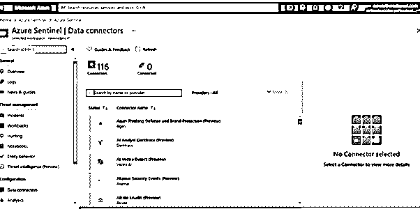
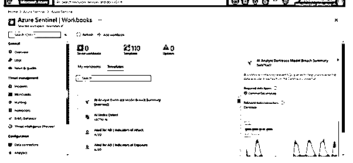

# 蔚蓝哨兵报

> 原文：<https://www.educba.com/azure-sentinel/>

## Azure 哨兵简介

微软公共云设计了事件管理和安全编排，以实现自动响应，这一安全信息系统被称为 Azure Sentinel。它为威胁可见性、警报检测、主动搜索和对威胁的快速响应提供了独特的解决方案。它从各种数据源收集数据，进行数据关联，并将数据处理到单个仪表板中。因此，它对安全事件和威胁做出迅速反应。本文简要讨论了 Azure Sentinel 的工作原理、组件和特性。因此，它向协调的系统提供威胁情报和智能安全分析。

### 什么是 Azure Sentinel？

Azure Sentinel 通常是 SIEM 的一部分，SIEM 是一个安全协调系统，当它检测到安全威胁时，用户会收到即时响应。它整合了 Azure logics 和 logs analytics 上的应用程序来提高性能。它具有先进的内置机器学习能力来检测威胁和恶意攻击，这有助于安全系统分析环境。人们对 Azure sentinel 的工作感到好奇，并对其在不同的基础设施结构中部署的能力给予了极大的重视。

<small>Hadoop、数据科学、统计学&其他</small>

### 如何使用 Azure sentinel？

Azure sentinel 工作在基于角色的控制上，这为管理员提供了基于各种需求部署权限的粒度阶段。使用 Azure sentinel 的三个重要角色是读者、响应者和贡献者。

*   分配到该角色的读者可以查看数据和票证，但无权进行更改。
*   此角色的响应者可以查看票证和数据，并对其进行处理，如分配给其他人，以及根据事件的严重性进行一些更改。
*   参与者可以查看数据和事件，还可以执行一些操作，如创建和删除分析规则。

要使用这个 Azure sentinel，这个人需要是一个贡献者，并且应该订阅它。由于是 RBAC 模式，权限可以分配给不同的团队和组。

### Azure 哨兵数据连接器

在将 Microsoft Sentinel 配置到工作环境中之后，应该将其连接到数据源，首先，在 Microsoft Sentinel 中接收数据。在实时环境的集成中，它配置了不同的连接器。服务到服务的连接器有 Microsoft 365 的 defender 连接器，如 Azure active directory、office 365、identity Microsoft defender for the cloud applications。管理员可以启用现成的连接器，为非微软产品提供更广泛的安全性。系统可以使用通用事件格式、系统日志和 REST API 将数据资源与 Microsoft Sentinel 关联起来。数据连接器可以从 Microsoft Sentinel 仪表板上的导航栏启用，具有各种数据连接器，其状态也可以在工作区中定义。

Microsoft sentinel 菜单中的“打开连接器”页面帮助用户选择连接器及其状态。然后选择防御网络钓鱼和保护，继续使用 API 数据连接器来满足要求。然后在工作簿中，它可以保存多个模板并显示各种工作簿

### Azure sentinel 智能安全分析:

Azure sentinel 的安全分析容易产生大量流量，因为它们会收到来自不同产品的大量警报。因此，它使用标准和可扩展的机器学习算法来关联数百万个最小可靠性异常，以处理最大可靠性异常，从而帮助机器学习分析师保护所摄取的数据，并帮助连接导致异常的点。例如，如果用户在云应用程序中遇到任何勒索软件攻击，他可以使用 Microsoft Sentinel 的智能安全分析来解决，这有助于大幅降低噪音，并将警报疲劳降低 90%以上。机器学习模型由微软安全团队构建，以保护客户端的云资产。他们不需要任何数据科学家来编排任务，并帮助定制和增强缺陷检测，通过机器学习中的服务将其模型带到 Azure Sentinel。

### Azure sentinel Security:

云中的工作负载保护由 Azure Security Center 提供，它专注于服务器工作负载的需求和混合数据架构。Azure Sentinel 处理事件数据，以检测早期攻击和数据泄露。它还可以用来存储、收集、响应和调查安全事件。安全人员使用 Livestream、Jupyter 笔记本和书签搜索工作环境并分析缺陷检测。

使用 Jupyter 笔记本的狩猎过程可以从收集到的数据中进行分析。内置的 kglmagic 库提供了特定的功能来处理 sentinel 查询并直接在笔记本中执行它们。因此，Azure 提供了一个专门针对 Azure 环境的集成 Jupyter，可以保存、执行和共享笔记本。

书签有助于保存 Azure Sentinel 的查询日志和执行结果。它使用户能够添加标签和注释作为参考。因此，通过查看它，用户可以分析日志分析，并使用其他数据源进行过滤，使其成为协作和有吸引力的仪表板。

Livestream for hunting 使管理员能够开发一个交互式会话，使用户能够执行一些任务，例如，在威胁攻击时获得通知，通过运行虚假警报测试新查询，以及以两种方式(如用户或主机)创建资产调查。它可以通过使用 REST API 的日志分析查询来执行。它支持在 Azure sentinel 的 UI 中管理 Livestream 查询。

### 结论

因此，Microsoft Azure Sentinel 在安全分析和防止部署环境中的恶意攻击方面发挥着至关重要的作用。它还用于关联来自 Microsoft 365 安全产品的数据行为和用户活动，还可以与其他产品相关联，以提供对攻击顺序的清晰可见性。

### 推荐文章

这是 Azure Sentinel 的指南。在这里，我们讨论 Azure Sentinel 的工作原理、组件和特性。您也可以看看以下文章，了解更多信息–

1.  [蔚蓝租户](https://www.educba.com/azure-tenant/)
2.  [蔚蓝色的木板](https://www.educba.com/azure-boards/)
3.  [蔚蓝堡垒](https://www.educba.com/azure-bastion/)
4.  [Azure 混合优势](https://www.educba.com/azure-hybrid-benefit/)

