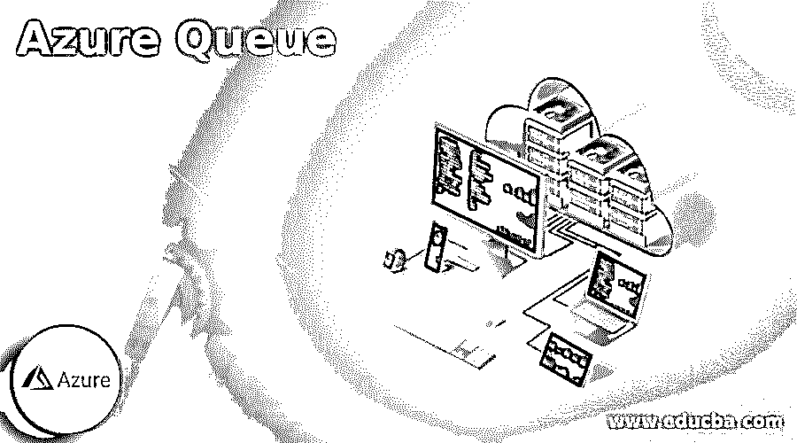
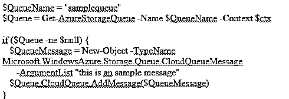

# Azure 队列

> 原文：<https://www.educba.com/azure-queue/>

## Azure 队列简介

简而言之，开发人员使用数据结构中的队列来保存遵循先入先出规则的数据。数据在队列的后面提供，并从前端检索。Azure queue 遵循同样的思想，以队列格式存储数据。发送方传输数据，客户端获取并处理数据。每个传输的数据都是唯一的，并且有几个附加的属性。本文简要介绍了 Azure 队列的功能、属性、使用和创建。

### 什么是 Azure 队列？

azure queue 是微软提供的一项常见服务，它是一个存储大量消息的空间。队列的大小可以是 64KB，包括数百万条消息，直到它达到存储帐户的总容量。这里，队列主要用于异步流程，该流程用于创建任何未完成工作的积压。

<small>Hadoop、数据科学、统计学&其他</small>

Azure 队列的工作很简单，客户端的工作是定期处理和删除消息。Windows Azure 允许客户端保存消息七天，之后会自动删除。可以有单个发送者和客户端，有时可以有多个发送者和客户端。组件解耦是 Azure 中消息队列服务的一个重要功能。它在异步环境中执行，数据可以在应用程序的多个组件之间传输。它为管理任务和工作流提供了有效的解决方案。简单地说，在前端发送一条完成任务的消息，由后端的用户接收，用户完成任务后删除消息。

存储队列中的命名约定允许使用所有类型的字符，如数字、连字符、小写字母、大写字母，长度范围从 3 到 63。azure 总线队列的名称可以包含 260 个字符，可以由句点、下划线、连字符、数字和字母组成。消息的最大大小可以是 64 KB，它采用 base64 编码，最大大小为 48 KB。消息的最大大小可以是 200 GB，它可以被封装为单个数据。标准层订阅的最大邮件大小为 256KB，高级层订阅的最大邮件大小为 1 MB

### 使用 Azure 队列存储

当没有保存大于 80 GB 的消息的选项时，可以使用 Azure 存储队列。这是因为服务总线队列的最大大小限制为 80 GB。因此，一旦达到这一点，队列就开始通过给出异常来丢弃到达的消息。

当任何应用程序在没有轮询队列的情况下接收数据时，都可以隐含服务总线队列。Azure storage queue 提供了存储队列中所有已发生事务的日志，这可能是出于审计或分析的目的。

Azure 队列提供了一个名为重复检测的属性。启用后，副本检测时间范围窗口中出现的所有副本消息都会被忽略。如果队列中已经存在具有类似 message-id 的任何其他消息，则传入的消息将被视为副本。如果应用程序需要处理该会话中的消息，可以启用它们的 azure 队列。

Azure 队列保持先进先出规则，并且在存储队列中不能保证这一点。这是因为存储队列中存在消息的可见性超时服务。它创建了所有过期数据的可见性时间，以便在所有原本应该排队的消息之后查看。

如果应用程序需要负载平衡、增强的可伸缩性、容错，那么 Azure 存储队列可以提供最高的性能。单个队列中的最近事务由 Azure 存储队列完成。

服务总线队列和存储队列提供了一个灵活且相关的区域，在这里控制机制被委托。用户可以提供对存储帐户级别或命名空间或实体级别的访问。

存储队列因其最佳可扩展性而成为首选，其中存储区域可提供高达 200 TB 的信息。在存储帐户中可能会出现无限数量的存储队列。

当用户接收和删除服务总线队列时，可以限制消息传递操作。所以如果队列中的消息是预期接收和删除模式，那么它就从队列中删除。

数据的自动转发由 Azure 队列完成，以使用户能够配置目标队列，在该队列中，所有消息都在源队列中接收，数据应该在源队列中转发。它用于获得最大的安全性。

当队列中提取的消息超过指定的出队计数时，可以将它们转移到组装的死信队列中。

### 创建 Azure 队列

要在 PowerShell 中创建 Azure 队列，请遵循给定的步骤。

*   选择“以管理员身份运行 ISE”
*   执行命令到达帐户。粗体部分是创建的用户帐户的一部分。

*   给出要在其中创建队列的存储帐户的名称。

*   创建队列

检索队列

要删除队列，请执行以下操作:

将消息放入队列

登录 Azure 帐户

提及用户想要使用的存储帐户的名称

恢复队列并编辑消息

如果此处使用条件来检查提到的队列名称是否存在。

队列中的下一条消息应该出队，以处理最新的消息。

### 结论

因此，这些是 Azure 队列中讨论的要点。在 Azure queue 的帮助下，可以执行许多功能，它在应用程序中以一致的方式工作起着重要作用。

### 推荐文章

这是 Azure Queue 的指南。这里我们讨论什么是 Azure 队列，以及队列的功能、属性、使用和创建。您也可以看看以下文章，了解更多信息–

1.  [Azure 登录](https://www.educba.com/azure-login/)
2.  [Azure 架构](https://www.educba.com/azure-architecture/)
3.  [Azure 数据块](https://www.educba.com/azure-databricks/)
4.  [Azure 事件网格](https://www.educba.com/azure-event-grid/)

