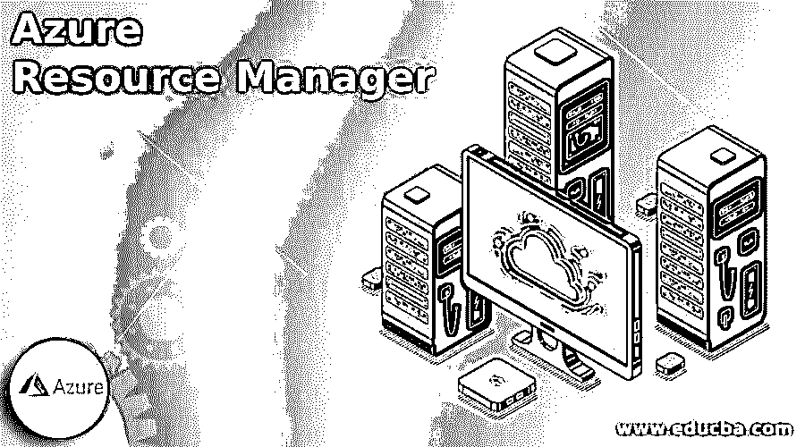

# Azure 资源管理器

> 原文：<https://www.educba.com/azure-resource-manager/>

## Azure 资源管理器简介

Azure 资源管理器充当开发和部署管理器，它负责根据需求创建各种服务，许多层通过使用许多管理功能(如锁、标签、访问控制和许多其他模板)来管理这些 azure 帐户。支持所有这些特性的模板，甚至支持身份验证和各种其他基础设施支持，这些支持增强和改进了许多架构方面。某些 RBAC 属性根据角色支持它，提供与总管理策略和一组资源的本机集成。

### Azure 资源管理器概述

对于 azure 资源管理器，有许多与之相关的概述，例如:

<small>Hadoop、数据科学、统计学&其他</small>

*   Azure resource manager 基本上标记了许多资源，这提供了一种操作的简化方式和关于资源管理的分析愿景。
*   管理和监控资源的部署过程通过单独处理所有资源，确实有助于以多种方式管理组内的所有资源。
*   它定义和操作资源之间的所有依赖关系，这些依赖关系可以在一致的状态下准确地分析资源。
*   在组织内共享资源，然后通过查看费用和共享先前针对创建的标签开发的那些标签来管理整个组织的计费。
*   可以使用声明性模板访问整个基础设施，而不是管理其中的脚本。

### 如何做 azure 资源经理？

azure resource manager 提供了适当的层次和级别，比如资源组、管理组(资源管理器)、订阅和资源组。整个图表和图像显示了所有这些场景及其工作中的特定级别和操作:

*   一旦在范围的所有级别应用了管理设置，那么，在这种情况下，所选择的级别给出了对应用设置的广泛程度的理解。
*   所有较高级别都向其所有较低级别提供设置，这意味着较低级别中的设置继承了较高级别中的所有特征和功能。
*   对于订阅，假设应用了任何策略，那么它将应用于范围或名称空间中存在的所有资源。
*   类似地，当策略应用于任何资源组或资源时，在这种情况下，它也会应用于其所有资源。
*   正常情况下，任何其他资源组或资源都不拥有任何要跨所有组或资源分配的策略。

### Azure 资源管理器架构

这代表了整个资源管理器架构，其中有一个流程:

*   用户从 Azure PowerShell 或 CLI、API 或任何 SDK 发送请求，然后它与 Azure 资源管理器进行交互，在那里它接收请求并进一步通过授权对其进行身份验证。
*   它授权，然后与其他资源一起验证请求，管理和共享所有其他资源与其他需求和流的连接。
*   满足 azure 一致性管理器层和其他 azure cli、REST API 和 SDK 之间没有太大区别。
*   所有功能将在实际发布后的 180 天内随门户和 API 一起提供。azure 资源管理器的使用
*   从创建、开发、管理到部署，azure 资源管理器有许多用途。
*   它基本上涉及许多功能，是借助资源、组或带有资源组的资源来部署、管理和监控所有资源的一部分。
*   它确实通过 Azure 基于角色的访问控制为所有服务提供了身份验证和角色授权，从而管理平台和所有其他资源。
*   标签的管理和各种新标签的创建在有效和高效的管理中提供了大量的资源管理，提供了适当的视图。
*   它提供了一个简化且清晰的视图，并对所有具有大量订阅和管理的资源进行了适当的组织成本核算。
*   整个开发生命周期中的重新部署和管理，在状态上有很大的信心和一致性。
*   不允许重复的标签和锁，这意味着认证和授权的级别提高了很多。

### Azure 弹性资源管理器

*   整个资源管理器服务基本上是为连续可用性而设计的，不会妨碍流程，并且具有操作弹性。
*   整个控制平面有责任提供弹性，这意味着需要执行与该平面相关的某些操作。
*   在 REST API 的帮助下，请求被发送到 management.azure.com，所有服务分布在整个地区，一些服务和地区相应地管理它。
*   它不依赖于本质上符合逻辑的单个数据。
*   Azure 资源管理器不会因为任何维护活动而被带走或关闭。
*   整个资源管理器分别分布有可用性区域及其操作。
*   弹性主要通过资源管理器和管理与所有接收和请求密钥库的服务进行交互。

### 范围和益处

*   从管理组、订阅、资源和资源组开始，整个范围及其四个管理级别无缝交互，这包含了 Azure Active Directory 中的所有信息和相关性。
*   然后，Azure Active Directory 管理、识别和访问大量模板、租户、范围和许多其他资源组订阅。
*   使用资源管理器的全部好处以及它提供的一个基本好处是 Azure RBAC，它与管理平台的集成进行了本机交互。
*   资源共享相同的生命周期，因此通过提供许多特权来管理和优化资源，例如一起添加、部署、更新和删除资源。
*   如果一个资源需要存在，它将需要分阶段部署，可以针对许多事情以各种方式定位和管理。

### 结论

在利用公共基础设施进行资源管理和共享方面，Azure Resource Manager 有很多优势和好处。此外，所有的资源组和资源管理器都是同一个开发到部署生命周期的一部分，这对于设计可靠的 Azure 应用程序有很多额外的优势。

### 推荐文章

这是 Azure 资源管理器的指南。在这里，我们讨论如何作为 azure 资源管理器工作，以及概述和好处。您也可以看看以下文章，了解更多信息–

1.  [Azure 登录](https://www.educba.com/azure-login/)
2.  [Azure 实例类型](https://www.educba.com/azure-instance-types/)
3.  [Azure API App](https://www.educba.com/azure-api-app/)
4.  [Azure 事件网格](https://www.educba.com/azure-event-grid/)

