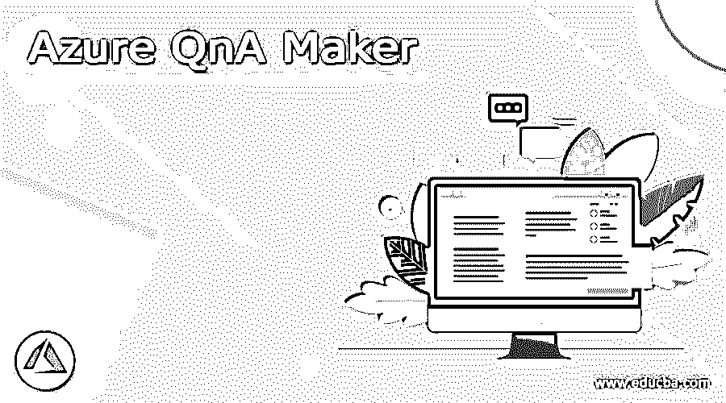

# Azure QnA Maker

> 原文：<https://www.educba.com/azure-qna-maker/>

## 什么是 Azure QnA Maker？

*   Azure QnA Maker 是 Azure Cognitive Service 的一部分，作为基于云的 NLP(自然语言处理)服务推出，允许用户设计和训练一个简单的问答机器人，以响应数据之上的自然对话层。QnA Maker 吸收结构化文档、FAQ URLs 和产品手册，从内容中提取完整的可能问题和答案对。
*   最佳信息 Bot 结果的共同挑战是将内容管理从 Bot 设计和开发中分离出来，因为内容所有者通常是领域专家，可能没有技术经验。
*   QnA Maker 允许我们编辑、删除或添加具有易用界面的 QnA Maker 对，然后通过 bot 服务的 API 端点发布知识库。
*   它有助于构建包含社交媒体、支持语音的桌面和聊天机器人的亲密客户应用程序。

### 如何使用 Azure QnA Maker？

当我们发现以下提到的条件时，我们可以使用 Azure QnA Maker:

*   **当存在任何静态事实或数据时:**当客户在回答的知识库中拥有静态数据时，使用 QnA Maker，该知识库是根据客户需求定制的，已经组装了具有类似 URL 和 pdf 的文档。
*   **当有必要对一个问题、请求或命令给出相似的答案时:**当不同的客户提交相同的问题并必须返回相同的答案时，应用 QnA Maker。
*   **当需要过滤以元信息为中心的静态事实时，QnA** Maker 会帮助添加元数据标签，以提供与客户端应用程序的客户端和事实相关的额外过滤选项。例如，共享元数据事实包含聊天、内容目的、内容新鲜度以及内容类型或格式。
*   当我们需要规范包含静态事实的机器人对话时，QnA Maker 服务帮助知识库获取客户的对话脚本或命令，然后回答它。在这里，如果答案是一个注定的对话流的一部分，在你的知识库中以多回合视角表示，那么机器人可以简单地传递这个流。

**注意:**QnA 制定者不保存客户信息。完整的客户数据(如聊天记录和问题答案)存储在客户部署所需服务的区域。QnA Maker 处理并返回提交的问题和响应对的最佳解决方案，并返回一个 JSON 格式的响应。

<small>Hadoop、数据科学、统计学&其他</small>

### 正在创建 Azure QnA Maker

为了创建 Azure QnA Maker，让我们创建以下必需的服务:

#### Azure Bot 服务

1.  登录 Azure 门户后，进入创建资源，选择“AI +机器学习”选项。
2.  然后选择 Web App Bot 服务，提供所需的详细信息。
3.  选择可用作问题和答案的 Bot 模板。
4.  接下来，要么构建新的 Azure 存储，要么选择应用服务计划。
5.  再次选择自动创建应用程序 ID 加密码。
6.  最后，单击 Create 选项完成部署过程。

#### Azure QnA Maker 知识库

1.  使用 Azure 门户的凭证，你需要以 [QnA Maker.ai](https://www.qnamaker.ai/) 的身份登录链接。
2.  之后，去创建一个知识库，在微软账号里建一个 QnA 服务。
3.  这将登陆或转发到 Azure 帐户。
4.  现在，输入服务所需的所有详细信息，如名称、订阅、位置、层、应用程序名称、资源组、网站位置等。
5.  最后，单击“创建”按钮完成该过程。
6.  再次访问 QnA Maker 门户，完成下一步。
7.  将创建的 QnA 服务连接到 KB，从而选择 Azure 帐户目录、Azure QnA 服务名称和帐户订阅名称。
8.  然后，如果您愿意，您可以命名服务。
9.  也可以在页面上生成一个 Excel 或 doc 的问答对，然后在这个阶段添加文件或提供 URL。
10.  最后，只需选择 Create your KB 选项来构建您的知识库。
11.  添加 QnA 对，定义要添加的问题及其有效答案。
12.  在顶部，选择“保存并训练”选项，转到“发布”选项卡选项，单击“发布”按钮，然后发布它。
13.  现在，您将收到一个针对 bot 的 HTTP 请求，因此再次访问 bot 服务并单击选项卡 Application Settings 以获取 QnAKnowledgebaseID、QnAAuthKey 和 QnAEndpointHostName。
14.  从 QnA Maker 发布 HTTP 请求数据中填充这些值；之后，保存它。
15.  要测试 Web 应用程序机器人，请访问机器人管理部分，并在 Web 聊天选项卡中选择测试选项，通过提供一对问题和答案来检查机器人，以返回一个合适的答案。

### 设置 QnA 制造商服务

在创建任何 Azure QnA Maker 知识库之前，用户需要在 Azure 中设置 QnA Maker 服务。任何有权创建订阅中的新资源的人都能够建立 QnA Maker 服务。但是如果有人想尝试自定义问答属性，那么您必须创建文本分析资源，然后添加自定义问答属性。考虑以下步骤来设置服务:

4.  首先，通过登录 Azure 门户创建 QnA Maker 资源。
5.  查看条款和条件后，选择创建。
6.  在此 QnA Maker 中，选择合适的层级和区域:
    *   然后，在字段中键入唯一的名称以识别 QnA Maker 服务。
    *   接下来，选择下面的订阅，我们将部署 QnA Maker 资源。
    *   最后，选择为 QnA Maker 门户和相关管理 API 定义的定价层。
    *   建议创建一个新的资源组，或者实施一个现有的资源组来安装 QnA Maker 资源。
    *   选择资源组位置。
    *   选择 Azure 认知搜索服务的搜索定价层选项。遗憾的是，它不可用于免费订阅服务设置。
    *   选择相关的搜索位置。
    *   在应用程序名称中填写应用程序服务实例名称
    *   应用服务默认设置为标准 S1 层。
    *   选择安装应用服务的网站位置。
    *   选择是否激活应用洞察。
    *   选择相关的应用洞察位置。
7.  如果所有字段都已确认，则单击创建
8.  完成部署过程后，您可以查看在 Azure 订阅门户中创建的 QnA Maker 资源。

### Azure QnA Maker 连接器

Azure QnA Maker 连接器可在以下提及的产品和领域中获得:

| **服务** | **类** | **地区/区域** |
| 逻辑应用 | 标准 | 除了:Azure 中国地区，所有其他逻辑应用地区都可以在这里找到。 |
| 电力自动化 | 标准 | 除了世纪互联运营的中国云，其他电力自动化领域都可以在这里找到。 |
| 高级应用程序 | 标准 | 除了世纪互联的中国云之外，所有其他电力应用区域都可以在这里找到。 |

联系信息是:

名称:微软

网址:[微软 LogicApps 支持](https://azure.microsoft.com/support/options/)，[微软 Power Automate 支持](http://flow.microsoft.com/support/)，[微软 Power Apps 支持](https://powerapps.microsoft.com/support/)。

**建立联系。**

QnA Maker 连接器提供以下认证类型:

*   **API Key:** Apikey 是一个可共享的连接，适用于整个地区，auth id 为 KeyBasedAuth。
*   **默认(已弃用):**此选项仅用于没有任何身份验证形式的旧连接，也仅用于后端兼容性。这不是一个可共享的连接，但适用于所有地区。

节流限制由每个连接的 API 调用定义，调用限制为 1200 次，更新周期为 60 秒。

### 结论

*   Azure QnA Maker 是 Azure 的语言功能工具，用于将信息和事实提取到对话中，并提供易于导航的答案。
*   QnA Maker 有助于使用知识库在数据记录之上快速创建对话层，自动从内容中提取问答，甚至可以在不需要代码经验的地方开发和发布机器人。

### 推荐文章

这是 Azure QnA Maker 的指南。在这里，我们讨论了创建和设置 Azure QnA Maker 的定义、用途和步骤。您也可以阅读以下文章来了解更多信息—

1.  [Azure 登录](https://www.educba.com/azure-login/)
2.  [Azure 架构](https://www.educba.com/azure-architecture/)
3.  [Azure 数据块](https://www.educba.com/azure-databricks/)
4.  [Azure 事件网格](https://www.educba.com/azure-event-grid/)

