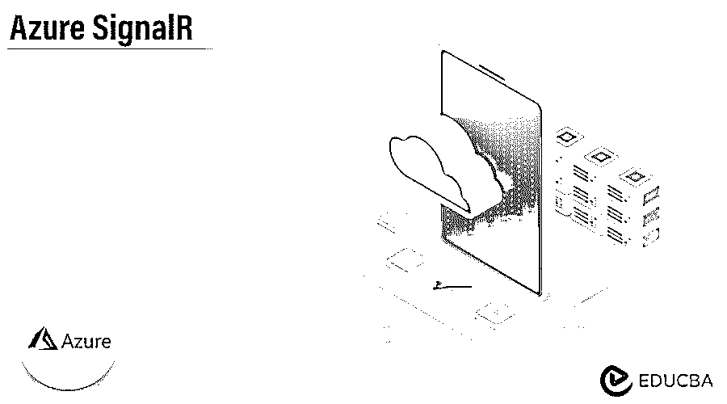
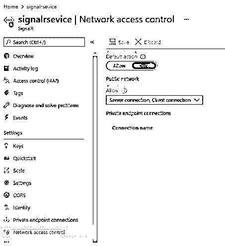
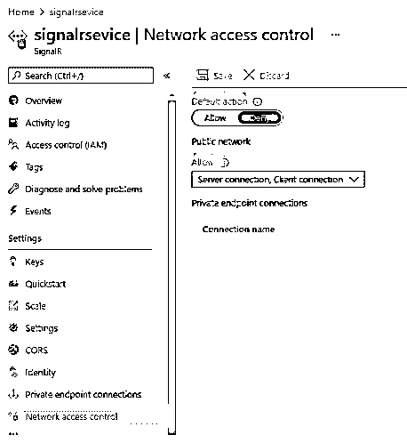
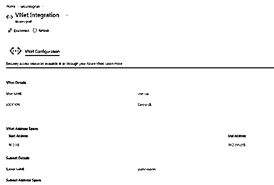
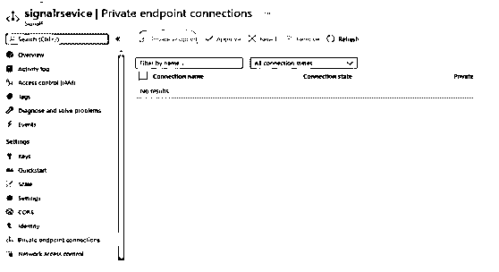
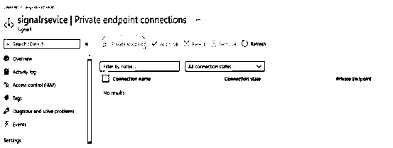
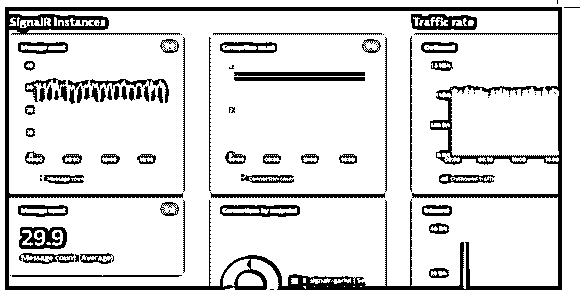

# 蓝色信号

> 原文：<https://www.educba.com/azure-signalr/>

## Azure SignalR 简介

我们知道 azure 为用户提供了不同类型的功能；SignalR 是 azure 提供的功能之一。基本上，SignalR 提供了一个简单的服务，帮助我们通过 HTTP 将实时 web 功能添加到软件中。实时功能意味着它允许我们进行一些更改，如推送数据，以及通过单个 web 应用程序和移动应用程序更新内容。

### 关键要点

*   基本上，它提供了构建实时的基于 web 的应用程序的抽象技术。
*   它支持 ASP.NET，还允许我们将新应用程序迁移到旧应用程序。
*   它拥有广泛的客户支持。
*   在 Azure SignalR 的帮助下，我们可以轻松处理大规模的客户端连接。

### 什么是 Azure SignalR？

Azure SignalR 管理是一个完全受监督的管理，它允许设计人员专注于构建连续的 web 体验，而无需强调限制供应、可靠关联、缩放、加密或验证。通过与不同类型的。NET SignalR 库和 Visual Studio 集群，帮助更简单地传达谈话、即时广播和物联网仪表板等内容。

<small>Hadoop、数据科学、统计学&其他</small>

### 蓝色信号服务

现在让我们看看 azure 提供的 SignalR 服务是什么:

通常我们知道我们需要从服务器上收集所需的信息，这也可以在 azure SignalR 服务中完成。Azure SignalR 服务广泛应用于各行各业的各种实时应用程序，用于更新内容。

下面列出了一些:

*   **数据更新:**如果我们想在游戏或投票等高频率上更新数据，我们可以使用 azure SignalR 服务。
*   **仪表板监控:**它允许我们监控任何公司的仪表板、财务数据和销售数据，还允许监控物联网。
*   **聊天:**聊天是 Azure 的重要和受欢迎的服务之一，它允许我们提供实时聊天室、客户支持、购物帮助和 messenger 以及许多其他与在线支持相关的服务。
*   **实时位置映射:**借助它，我们能够跟踪物流配送；我们可以更新交付状态，以及许多其他服务。
*   **协作应用:**协作应用最好的例子就是我们一起使用的团队会议应用。
*   **推送通知:**显示社交媒体通知、电子邮件通知以及游戏和旅行提醒。
*   广播:提供视频直播、音频广播、语言翻译以及新闻转播。
*   **自动化:**为任何类型的事件或操作提供实时通知。

### Azure SignalR 服务保护

根据实际计划，Azure SignalR administration 有一个通过 web 开放的公共端点，它现在不支持直接发送到虚拟组织并允许 IP 地址。因此，您不能对贡献的资产使用某些系统管理突出显示。比如网络安全聚会，课表，或者其他组织下属机器像天蓝色防火墙。在任何情况下，它都允许您创建私有端点来获取虚拟组织中的资产和 Azure SignalR 管理之间的流量。

同样，您可以利用管理标签和设计网络安全捆绑规则，将入站/出站流量限制在紫色 Azure SignalR 管理范围内。如果我们使用默认的网络访问控制，那么我们可以看到下面的屏幕。

在上面的截图中，我们打开服务器和客户端连接来打开互联网，其他连接被默认设置拒绝，如 REST API 和 Trace API。现在让我们看看如何保护 azure SignalR 和基于 web 的应用程序之间的连接，如下所示。

首先，我们需要将我们的应用程序连接到 azure 应用程序，因此我们需要配置 NAC，因为我们使用互联网。第二步，我们需要为客户端连接配置公共网络，如下图所示。

对于服务器连接，我们需要私有地配置服务器连接。之后，我们需要配置 VNet，这是一个用于访问应用程序位置的虚拟网络。

完成 VNet 配置后，我们需要将 azure 应用服务与 VNet–cus 以及公共子网集成，如下图所示。

现在在 Azure 上配置私有端点，如下图所示。

如果我们没有端点，那么我们需要创建一个新的端点，如下图所示。

创建端点后，我们可以建立连接。

### Azure 信号函数

azure 函数用于绑定允许通过网络连接客户端的 SignalR 服务，我们也可以发布消息。在函数的帮助下，客户端能够在 SignalR 客户端 SDK 的帮助下连接服务，并绑定两种不同类型的服务，如输入和输出。

### Azure SignalR 服务管理 SDK

关联讨论过程给我们的代码增加了额外的(然而是基本的)管道。幸运的是，微软已经开发了 Azure SignalR。开发板 SDK 使其易于实现。我们不会在这里详尽地讨论这些方法，因为 SDK 测试是一个非凡的资产。我们将暂时讨论 SDK 提供的强大 API。

### Azure SignalR 到监控

监控是 Azure 提供的最重要的服务之一，但在此之前，我们必须确保监控的先决条件如下:

1.  首先，我们需要实现监控。
2.  在第二步中，我们需要添加一个用于监控的服务。
3.  第三，我们需要监控资源。
4.  根据我们的要求，我们需要配置指标并查看指标控制面板的指标，如下图所示。

### 常见问题解答

下面是提到的常见问题:

#### Q1。我们能测量信号吗？

**答:**是的，我们可以根据我们的要求缩放 SignalR 基本上，规模是基于发送的消息数量。在这个过程中，azure 服务处理连接的数量。

#### Q2。什么是 Azure SignalR 单位？

**答:**通常，单元是指流程的子实例，它有助于我们提高性能和连接数量。

#### Q3。我们为什么使用 SignalR？

**答:**它为需要构建基于 web 的应用程序的不同服务提供高级 API 构建，或者我们可以说它在客户端和服务器之间建立了安全连接。

### 结论

在这篇文章中，我们已经看到了 Azure SignalR 是什么，我们也看到了一些关于它的配置的基本关键思想。我们还看到了 Azure SignalR 的用途和功能，以及如何使用它们。

### 推荐文章

这是一个 Azure SignalR 的指南。在这里，我们讨论介绍，azure SignalR 服务，功能和管理 SDK。您也可以看看以下文章，了解更多信息–

1.  [蓝色 Cache Redis](https://www.educba.com/azure-cache-redis/)
2.  [Azure 文件](https://www.educba.com/azure-files/)
3.  蔚蓝色的 SSIS
4.  [Azure 基础知识](https://www.educba.com/azure-fundamentals/)

