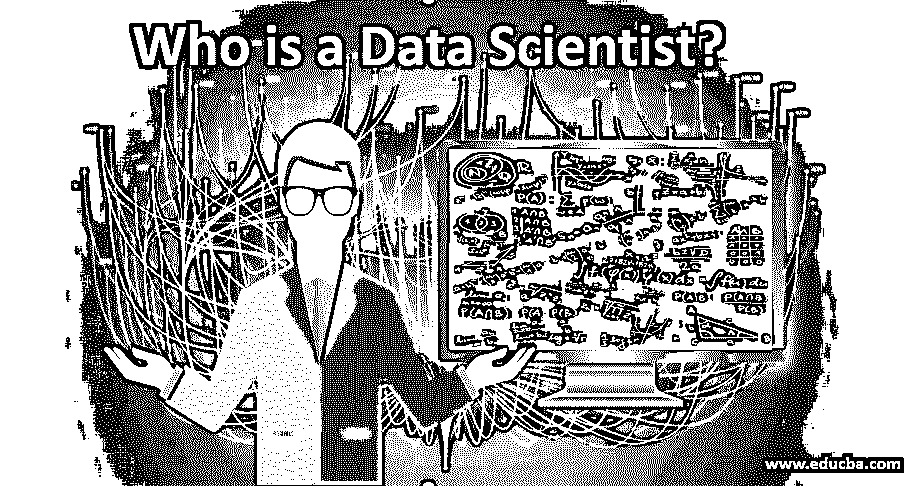
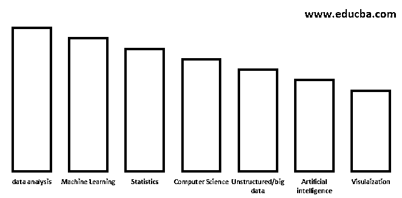

# 谁是数据科学家？

> 原文：<https://www.educba.com/who-is-a-data-scientist/>

## 数据科学家简介

数据科学家被定义为使用技术和社会科学技能来找出模式和管理数据的分析专家。这些人擅长收集、查询和分析数据，以理解来自社交媒体、电子邮件、智能设备等各种来源的非结构化、杂乱的数据。除此之外，他们还应该善于使用数据库，与其他部门合作收集数据，了解与数据库相关的最新趋势等。

### 谁是数据科学家？

*   数据科学家是使用科学方法、流程、算法和不同系统处理结构化和非结构化数据以提取知识和见解的人。他们是分析数据专家，具有解决复杂业务问题的良好技能，以及探索下一步要解决的问题的分析思维。
*   你可以称他们为数学家、统计学家和计算机科学专家的组合。它们之所以流行，是因为大数据在商业中的普及。业务正在以非结构化数据的形式产生大量信息，这需要不同的关注！这个领域是信息的金矿，相信我；数据科学家坐在这座金矿上，提取无人问津的有用信息。
*   大多数数据科学家从统计学家或数据分析师开始他们的职业生涯。但是今天，由于大数据和 Hadoop 处理的增强，需要更多。他们不仅负责类似的工作。有一天他们可能会处理文本挖掘项目；第二天，它可能是一个预测模型。因此，数据科学家需要精通各种技术。

### 数据科学家的责任

作为一名数据科学家，您需要对许多事情中的几件负责:

<small>Hadoop、数据科学、统计学&其他</small>

*   从不同的来源收集原始数据，并将其转换成可用的格式。
*   用数据驱动的方法发现业务问题并解决它们。
*   精通分析编程语言，如 R，Python，SAS。
*   扎实的统计学知识，如分布、假设等。，进行描述性分析。
*   了解机器学习、深度学习和文本挖掘等分析技术。
*   能够与技术专业人员和最终用户沟通，以确定和翻译业务需求。
*   模式和趋势检测有助于业务未来发展。

### 一个数据科学家应该知道什么？

*   数据科学家应该知道如何从头到尾处理一个数据科学项目，以及实现这个项目背后的技术。对于从各种来源收集数据，数据科学家应该了解 SQL / Python / R 等基本编程语言或 Talend / Pentaho / Spectrum 等分析工具。因为现在数据不仅来自表格数据库，因此大数据知识是非常必要的。
*   为了从 NoSQL 数据库或通过网络提取数据，正在使用 Apache Kafka 或 Flume 或其他分析工具。数据准备是数据科学家的另一项巨大责任；因此，他们需要知道数据争论、数据咀嚼和数据挖掘。
*   数据科学家应该非常了解统计数据，以便执行数据分析，从而了解数据产生的模式和趋势。他们应该具备分析思维，以理解问题陈述并最终确定解决方案。他们应该拥有机器学习/深度学习知识，以便将算法应用于数据。最后，他们应该能够以数据可视化的形式表示结果。为此，他们需要了解至少一种 BI 工具，如 Power Bi、Tableau、Qlikview 等。

我让你困惑了吗？或者你只是因为这些高条款而害怕？放心吧！我们将首先尝试纠正我们的基础。因此，让我们继续讨论它必须具备的技能。

### 数据科学家技能

成为一名数据科学家不是在公园散步。你被期望成为这个领域的活百科全书，几乎知道属于机器学习、计算机科学、统计学、数学、人工智能、深度学习、可视化、数据分析等等的一切！所需的技能是相当小众的，很少有人有幸拥有正当的知识。那么，让我们试着了解成为数据科学家最需要的技能是什么。

研究人员发现了最受欢迎的技能，如统计学、数据分析等。，来自 LinkedIn、Indeed 或者 Glassdoor 这样的面试平台。

趋势表明，数据科学家应该非常精通数据分析，从数据中收集见解，并应该能够对原始数据应用机器学习和统计。数据科学家应该了解这两种编程语言，不管是 R 还是 Python。对于数据科学，首选 R，但是 python 比较好学。高级机器学习、深度学习和大数据框架被默认认为是数据科学家的唯一选择。最后是可视化，因为没有讲故事，你不会被认为是数据科学家角色的合适人选。我们可以将这些技能大致分为三个领域:

*   统计/数学
*   商务沟通/领导力
*   计算机科学/编程

#### 1.统计数字

统计学是一个专注于使用统计方法和公式从收集的数据中提取有用信息的领域。因此，所有数据科学家都需要深入了解统计数据。对于任何需要概率、分布、异常值等基本概念的数据科学项目，您至少需要执行一次描述性分析。，你会在统计学里学到。你需要了解统计学的核心概念，如描述性统计、分布、假设和回归。此外，你应该知道贝叶斯概率理论，包括条件概率、先验概率、后验概率和最大似然估计。

#### 2.商业头脑

数据科学家应该了解他们所在行业的业务问题。他们应该知道哪些问题对业务很重要，如何利用现有数据处理这些问题，以及这些决策将如何影响业务。现在，商业意识对于探索新的商业机会至关重要。

#### 3.编程语言(R/Python/SQL)

虽然市场上有很多统计工具，如 SAS、Knime、RapidMiner 等。但是至少知道一种分析编程语言会让你在数学运算中固执己见。您可以根据自己的需求操作数据。Python 和 R 是数据科学家最常用的语言，因为有各种各样的包可用于统计计算。SQL 一直是人们的最爱，无论你去哪家公司，他们都会测试你的数据科学核心 SQL 知识。在开始使用之前，非常需要从数据库中获取数据；因此，SQL 也是成为数据科学家的主要要求之一。

### 数据科学家在企业中的优势

以下五点解释了数据科学家在商业中的优势:

*   借助数据驱动的选择，让管理层和企业能够做出更好的决策。
*   分析组织数据的趋势，并根据过去的趋势预测未来。
*   从一堆对业务至关重要的问题中选择关键问题。
*   通过挖掘组织当前的分析系统来发现新的机会。
*   关注合适的目标受众，最大化组织增长和收入。

### 结论

是的，成为数据科学家绝非易事。但同时，也不是不可能！你只需要有正确的学习精神，不断更新。这是市场上最受欢迎的职位，未来 10 年将会非常火爆！所以准备好你的马，开始用这些惊人的技能填充你的工具箱，让这个头衔成为你的！

### 推荐文章

这是关于谁是数据科学家的指南？.在这里，我们讨论责任、技能、好处、数据科学家应该知道的内容，以及对数据科学家的简要说明。您也可以浏览我们的其他相关文章，了解更多信息——

1.  [数据模型的类型](https://www.educba.com/types-of-data-model/)
2.  [数据科学技术](https://www.educba.com/data-science-techniques/)
3.  [数据科学机器学习](https://www.educba.com/data-science-machine-learning/)
4.  [机器学习中的数据预处理](https://www.educba.com/data-preprocessing-in-machine-learning/)

