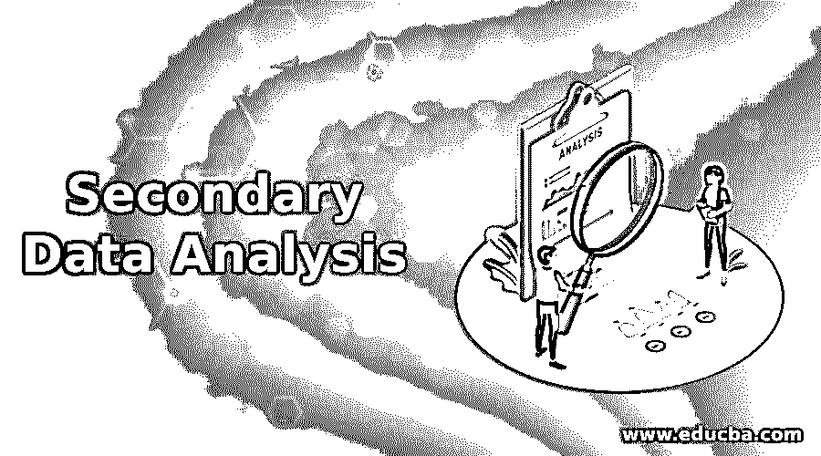

# 二手数据分析

> 原文：<https://www.educba.com/secondary-data-analysis/>

## 次级数据分析简介

全球的学生、研究人员和专业人士正在生成和收集大量的数据。因此，有效利用当前数据非常重要。二次数据分析就是这样一种技术，它参照当前数据对收集的数据进行经验数据分析，以达到其他目的。这有助于研究人员在时间和资源有限的情况下快速分析数据。这项技术被研究界广泛使用。它也被伟大的社会学家如马克斯·韦伯、卡尔·马克斯等使用。在过去十年里。

### 什么是二次数据分析？

根据 Nachmias 的说法，二级数据分析被定义为研究人员为一些不同的用例收集数据。Punch 称这是对之前收集的已经分析过的数据的重新分析。补充上述定义的另一个定义是，通过研究构思的新思想依赖于其他研究人员先前收集的数据。简单来说，可以表述为二手分析技术。它可以用作所有用例的市场研究工具。

<small>Hadoop、数据科学、统计学&其他</small>

然而，有一些批评者认为，这可能会导致数据准确性的损失，因为研究人员将无法控制数据收集过程。另一个论点是，用于执行次级数据分析的数据源可能不相关。

### 二手数据分析方法

次要数据分析取决于数据来源。数据源取决于研究领域。例如，为了了解一个国家的社会经济和宏观经济政策，统计数据提供了最可行的选择。如果国家正在进行一项调查，比如说即将到来的选举的投票率。那么普查数据有助于研究人员理解相同的数据，并对其进行二次分析。

研究人员使用以下步骤进行二次数据分析。

*   研究目的:研究人员必须知道他们为什么要对收集的数据进行研究。
*   **数据跟踪:**研究人员可以使用互联网来获得用于不同目的的最先进的数据收集和收集技术。
*   **数据的重要性:**研究人员必须了解数据收集过程中使用的基本流程，如填充子采样策略、数据收集的时间和方式等。
*   **数据的完整性:**必须对出于其他目的收集数据的研究人员的证书进行验证。此外，像数据一致性这样的问题以及与之相关的问题也必须得到解决。
*   **数据分析:**可以使用各种统计过程得到推论和相应的底层模式。

#### 二次数据分析涉及的步骤

*   **文档数据:**研究人员使用它来执行使用原始数据收集技术的项目。它使用以下类型的文件，即下文所述的书面和非书面文件:
*   **书面文件:**包括会议记录、股东报告、发言记录、信函、通知等。
*   **非书面文件:**使用数字编码格式，如视频和磁带记录、电视和电影节目、CD/DVD 等。

### 基于调查的二手数据

它通常涉及通过问卷收集的数据，这些数据已经针对一些不同的用例进行了分析。它使用以下类型的调查:

*   人口普查:它被政府用作人口调查或选民投票，但参与是可选的。它提供了用于研究目的的比较数据和背景数据。
*   **连续定期调查:**排除上述方法，在一段时间内重复进行。它包括全年收集数据的调查，以及定期重复进行的调查。它为研究目的提供了比较数据和背景数据。
*   **特别调查:**它不会定期发生，更像是一次性的。它在特定的研究领域更加具体。这些数据来自组织和政府进行的调查以及独立研究人员进行的调查。在这一类别中找到可行和相关的调查被认为是困难的。
*   **多源二次数据:**或者是文献数据，或者是调查数据，或者是两者的结合。这里的主要思想是在使用当前数据之前，将不同来源的数据组合成另一个数据源。

### 使用二手数据分析的好处

以下是使用二次数据分析的好处:

*   成本效益:由于数据由其他研究人员事先收集，因此所需的资金、时间或精力投入更少。此外，收集的数据被清理并以某种类型的电子格式存储。因此，研究人员不必在数据预处理上花费时间，而是可以专注于如何执行数据分析。
*   **减少数据量:**二次数据分析允许研究人员收集特定的数据子集，而不是收集大量数据。因此，由于政府和组织已经收集和分析了大量数据，因此可以在地理上对数据进行缩放。
*   **专业水平:**保持一定水平的专业知识和专业水平，这可能不是进行独立研究的个人的情况。由于它涉及具有某种技能和专业知识水平的人，因此可以更好地收集二手数据。
*   不引人注目:它不会阻碍和妨碍研究人员正在进行的研究。
*   **数据类型:**为研究者提供上下文相关和比较数据。
*   **科学突破:**它可以带来意想不到的发现和科学突破，因为以前用于其他目的的分析数据正被用作基准。
*   **数据持久性**:为某些研究目的提供分析数据的持久性。

### 结论

二手资料分析虽然有一些缺点和批评，但对使用它的研究人员有益。然而，使用这种技术的研究人员必须了解这种技术的缺点，如数据准确性、数据充分性和数据重要性的损失，以便有效地使用这种技术并最大限度地减少它带来的威胁。

### 推荐文章

这是二手资料分析指南。在这里，我们讨论了二手数据分析的介绍以及方法，步骤和好处。您也可以浏览我们的其他相关文章，了解更多信息——

1.  [Tableau 中的数据混合](https://www.educba.com/data-blending-in-tableau/)
2.  [数据 vs 信息](https://www.educba.com/data-vs-information/)
3.  [TeraData vs 甲骨文](https://www.educba.com/teradata-vs-oracle/)
4.  [大数据是数据库吗？](https://www.educba.com/is-big-data-a-database/)

