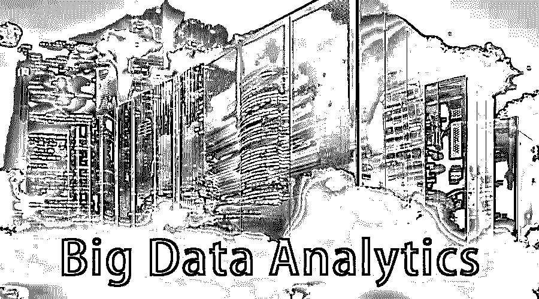

# 大数据分析

> 原文：<https://www.educba.com/big-data-analytics/>

## 大数据分析简介

大数据是一个术语，指的是从万亿字节到千兆字节甚至更多的海量数据。通常在专业技术和工具的支持下，分析数据集所包含的信息以得出推论的过程称为大数据分析。它广泛用于商业行业和其他组织，以做出更好的商业结论。

### 什么是大数据分析？

这里最重要的事情是组织如何处理可用的数据。随着技术的快速发展，从日常产生的数据中获取有意义的见解对公司来说是一场噩梦。随着这一概念的引入，组织从各种外部来源收集数据，如移动设备、社交媒体源、测量仪器、预测报告、物联网设备、关系数据库服务器和其他几个来源。

<small>Hadoop、数据科学、统计学&其他</small>

可以以更好的方式对这些数据进行格式化、操作和分析，从而为业务问题提供解决方案，获得有关客户趋势的知识，对人员进行情感分析，增加收入并提高运营绩效。

### 了解大数据的 V

让我们来看看大数据的流行趋势:

#### 1.卷

处理大量数据是一个常见的问题。大数据利用 Hadoop、Apache Spark 和 HDFS 等其他技术轻松执行任务。

#### 2.速度

组织高速收集数据以处理即时结果。大数据可以应对这种情况，提供无缝处理和结果。股票交易和天气预报就是一些实时的例子。

#### 3.多样化

*   **结构化数据:**从关系数据库中导出的具有预设格式的数据集。例如，带有预定义事物模式的雇员的工资表。
*   **非结构化数据:**这些是没有适当格式或排列的随机数据。它们需要更多的处理时间。例子包括谷歌搜索、社交媒体调查和视频流。
*   **半结构化数据:**它是结构化和非结构化数据的结合。他们有一个适当的结构，但缺乏所需的定义。

### 工作是如何变得更容易的？

在大数据分析出现之前，对可用数据进行线性和逐行分析。后来随着计算机的引入，Excel 电子表格使生活变得简单了。用户需要将不同的记录制成表格，并进行必要的研究，以得出有意义的报告。

这在许多不同的方面改变了游戏规则。可以处理和分析高达万亿字节的大量数据集。应用了复杂的查询和算法。生成的报告具有更好的结果，几乎没有失败。所有这些都需要几分钟到几小时的时间，这取决于输入的数据量。

### 使用大数据分析的顶级公司

它广泛应用于制造业、医疗保健、能源、保险、体育等领域。

下面列出了一些顶级公司:

*   国际商用机器公司
*   微软公司(全球知名的 PC 软件主要厂商)
*   亚马孙
*   惠普企业
*   Teradata

### 成分

有各种第三方工具，如下所列，可用于对来自数据源的数据进行分析。它们既可以独立运行，也可以与其他组件协作运行。

*   Hadoop
*   HDFS
*   SQOOP
*   mapreduce
*   阿帕奇火花/风暴
*   谷歌大查询
*   亚马逊 Kinesis

### 大数据分析的使用案例

*   管理层可以做出更好的决策。
*   认识客户需求的趋势并保持相关性。
*   低风险结果。
*   决策验证。
*   目标受众已经确定。

### 使用大数据分析

在 Hadoop 和 Spark 等第三方工具的帮助下，我们可以将大型数据集加载到外部存储上。基于人工编写的查询来处理数据。[商业智能团队](https://www.educba.com/what-is-business-intelligence/)利用这些报告来理解预测模式并纠正以前的错误。此外，可以将数据可视化，以做出有用的决策。

### 优势

下面是提到的优点:

*   可以完全理解业务目标。
*   学习数字背后的意义。
*   分析以前失败的根本原因。
*   使用易于理解的语言洞察未来结果。
*   有助于做出完美的决定。

### 先决条件

没有先决条件。诸如 Java 或 Python 等编程语言的基础知识会有所帮助。理解数据库如何工作和原始查询就足够了。还有其他一些高级语言，比如 Spark 和 Pig，也很容易学习和使用。用户应该在使用这些来获得期望的输出的方式上是技术上合理的。

### 为什么用？

它用于改进应用程序和服务，以提供更好的结果。可以得到各种有成本效益的解决方案。随着环境的快速变化，了解客户需求至关重要。

### 范围

数据分析永远不会过时，而且随着尖端技术的发展，它正在呈指数级增长。大数据分析领域对专业人士的需求巨大。它的发展潜力巨大。数据分析师通过正确使用大数据技术成为公司的决策者。

### 需要大数据分析

如今，数据以不同的形式出现。由于实施成本和缺乏专业人员，许多分析解决方案在过去是不可能实现的。

这些能够在一个时间间隔内对机器数据执行复杂的算法。这些有许多实时用例，如欺诈检测、在全球平台上锁定受众、网络广告等。

### 大数据分析的目标受众

利用该工具及其组件的组织可以实现以下目标:

*   预测客户的未来趋势和行为模式。
*   以有用的方式分析、理解和展示数据。
*   跟上竞争对手并在市场中保持相关性。
*   做出强有力的决定。

### 结论

随着需求的增长和竞争的加剧，对于专业人员来说，保持更新是至关重要的。通过有效地利用个人和组织，可以在几个方面获益。分析师对行业有了更好的了解，并将这种了解传达给员工。可以根据报告做出决定，而不是依靠猜测和直觉。

### 推荐文章

这是大数据分析的指南。在这里，我们讨论大数据分析、组件和使用大数据分析的顶级公司的介绍。您也可以阅读以下文章，了解更多信息——

1.  [大数据分析薪资](https://www.educba.com/big-data-analytics-salary/)
2.  [什么是大数据技术？](https://www.educba.com/what-is-big-data-technology/)
3.  [大数据分析示例](https://www.educba.com/big-data-analytics-examples/)
4.  [什么是大数据和 Hadoop](https://www.educba.com/what-is-big-data-and-hadoop/)

