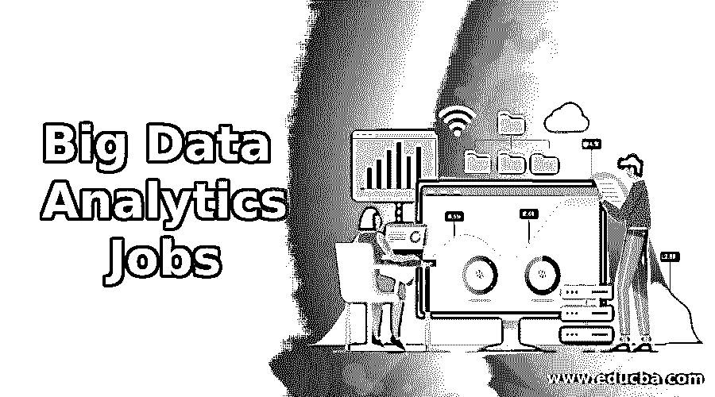

# 大数据分析工作

> 原文：<https://www.educba.com/big-data-analytics-jobs/>

## 什么是大数据分析工作？

大数据是一组庞大而复杂的数据，普通的数据处理系统无法控制它们。现在，这种分析主要处理大量的数据检查，分析相同的获取和理解关键模式和其他方面。根据目前的技术，通过持续和正在进行的分析，我们可以启动和分析这些大数据交易过程的不同见解。

**最重要的三种分析方法是:**

<small>Hadoop、数据科学、统计学&其他</small>

*   数据处理和决策的分析和优化方法
*   基于当前的流程，在处理这些大型数据集时，经济高效的方法扮演着重要的角色
*   新产品和服务可以按照当前的市场标准生产。

### 大数据分析的优势

1.  它处理大量的数据；因此，分析导致不同的创新方法和解决方案。因此，分析从业务角度提供了许多优化的解决方案。
2.  它为医疗保健和核心医疗领域提供广泛的分析支持。当前的数据科学和研究进展视角也发挥着非常重要的作用。
3.  根据当前的行业标准，这些分析也有助于金融方法、交易市场和安全补丁。

### 大数据分析工作类别

根据当前的市场标准，找出以下几个重要的工作类别:

1.  **数据科学分析师:**数据科学分析师、数据科学家是基于大数据分析方法和研究的重要工作类别。他们曾经是数据科学团队的一部分，负责大量的数据分析和获取重要信息。所以他们要精通编程语言 R，Hive 等。
2.  **大数据-Hadoop 开发人员:**这是另一个基于分析领域的重要工作类别。开发人员使用 Hadoop 平台开发应用程序，客户可以使用。
3.  **Hadoop 测试人员:**是从测试和质量保证的角度，测试人员要有 Hadoop 平台和大数据工件的知识。
4.  **Hadoop 架构师:**更像是 Hadoop 开发者的高级角色。他们处理基于 Hadoop 平台的应用的复杂数据分析和核心架构。
5.  **解决方案架构师:**大数据解决方案架构师也是数据分析行业的重要工作角色之一。他们处理现实世界的问题，根据分析，他们创建一个优化的解决方案来解决问题。这些都是基于大数据框架的。根据场景，他们决定不同的解决方案工件，比如需要实现哪种编程语言以及其他与框架相关的参数。因此，他们应该精通编程语言、相应的数据库、框架和其他分析记录和处理优化解决方案所需的工具。

### 大数据分析工作所需的技能。

根据目前的市场情况，在分析工作方面有巨大的空缺。但是要成为被选中的人，这份工作需要适当的技能和学习。

在下面找到一些扮演不同工作角色所需的重要技能:

#### 1.Hadoop 开发人员/分析师

要成为 Hadoop 开发人员或分析师，需要具备以下几项重要技能:

*   正确理解 Hadoop 日志文件及其相应的工件
*   日志文件管理和审查理解也是必需的
*   管理工作流程时的正确理解和决策能力
*   与 Hadoop 作业调度功能完全相反
*   集群协调和工作流管理知识
*   正确理解 Hadoop 集群框架及其相关工件
*   具备 Python、HiveQL、R 语言的正确理解和写作知识
*   对工作流程和进度管理有正确的理解和经验
*   了解并运用数据加载和数据分析工具

#### 2.Hadoop 架构师

它更像是 Hadoop 开发者的高级角色。要成为 Hadoop 架构师，需要具备以下几项重要技能:

*   正确理解 Hadoop 框架架构和应用定制
*   正确分析和理解所需文件
*   了解集群编程知识
*   对 Hadoop 架构的深入了解
*   具备 Python、HiveQL、R 语言的正确理解和写作知识
*   对工作流程和进度管理有正确的理解和经验
*   了解并运用数据加载和数据分析工具
*   对 Hive，Pig，Java MapReduce，HBase 的理解和工作知识

#### 3.Hadoop 测试器

这个角色更多的是从测试的角度出发。要成为一名 Hadoop 测试人员，需要具备以下几项重要技能:

*   正确理解 Hadoop 工件的测试策略和文档
*   用 Java 语言来执行 MapReduce 可测试工件
*   对 Hadoop 框架的基本理解以排除其中的错误。
*   具备 Python、HiveQL、R 语言的正确理解和写作知识
*   蜂箱、猪的测试和实践知识
*   解决方案驱动的方法和在 MRUnit、JUnit 框架中的工作经验

### 大数据分析工作的薪酬

根据当前的市场情况，大数据分析工作存在巨大的空缺。以下是从不同调查中获得的平均(大概)工资。下图显示了印度分析专业人员的大致工资。

| **公司** | **工资范围(印度卢比)** |
| 认知技术解决方案 | 378 千–870 千 |
| 分形分析 | 60 万–100 万 |
| 塔塔咨询服务公司 | 476 千–750 千 |
| Wipro | 634 千–1548 千 |
| 德勤 | 763 千–1259 千 |
| 公共网关接口 | 571 千–620 千 |
| Amdocs | 715k–856k |

### 结论

根据当前的市场标准和上述分析，很明显对大数据分析专业人员有巨大的需求。但是需要对大数据和 Hadoop 工件的理解和知识。因此，可以得出结论，分析工作是软件业蓬勃发展的职业之一。

### 推荐文章

这是大数据分析工作的指南；在这里，我们讨论了大数据分析责任、分析工作所需的技能、薪酬模式等。您也可以阅读以下文章，了解更多信息——

1.  [大数据职业](https://www.educba.com/careers-in-big-data/)
2.  [数据分析面试问题](https://www.educba.com/data-analytics-interview-questions/)
3.  [挑战&大数据分析解决方案](https://www.educba.com/challenges-of-big-data-analytics/)

