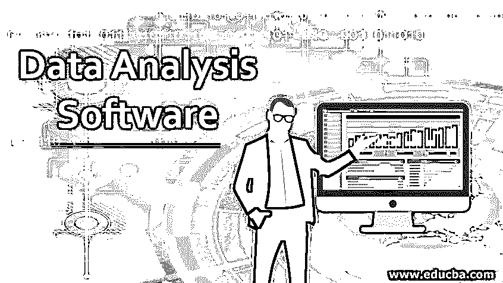

# 数据分析软件

> 原文：<https://www.educba.com/data-analysis-software/>

## 数据分析软件介绍

数据分析软件被定义为一种工具，用于处理和操纵信息，通过提供质量分析(如转录分析、话语分析、扎根理论方法和内容分析)以及使用统计和分析能力的决策方法来分析数据集之间的关系和相关性，基于这些能力，数据分析软件被分类为探索性数据分析和验证性数据分析。

### 什么是数据分析？

数据分析有助于澄清、理解或解释个人和事物，在定性和定量信息的有意义和象征性内容中提供帮助。定性和定量是分析中汇总和解释数据的两种基本方法。这些策略可以独立使用，也可以同时使用，因为它们都有相同的目标。

<small>Hadoop、数据科学、统计学&其他</small>

定量分析通常与数值分析有关，在数值分析中，数据被收集、分类，然后使用一套统计方法计算出明确的发现。而定性分析则是对无法量化的信息进行分析，与对对象的理解和洞察有关。

定量和定性研究数据分析策略提供了有助于转录分析、加密和文本解释、算法抽象、内容分析和话语分析的工具，帮助用户避免浪费时间和管理大量信息，增加灵活性，并提高信息分析的有效性和适用性。

### 数据分析软件工具

[数据分析软件工具](https://www.educba.com/free-data-analysis-tools/)帮助用户更轻松地处理和操作信息，分析数据集之间的关系和相关性:

*   数据分析软件提供工具来辅助定性分析，如转录分析、内容分析、话语分析和扎根理论方法。
*   数据分析软件具有决策方法的统计和分析能力。
*   数据分析软件过程可以分为描述性统计、[探索性数据分析](https://www.educba.com/exploratory-data-analysis/) (EDA)和验证性数据分析(CDA)。

### 数据分析软件的类型

基于业务和技术，存在几种类型的数据分析软件。主要的数据分析软件有:

#### 1.NVivo

NVivo 用于数据分析。这是一个支持定性和混合策略分析的程序。它还帮助用户整理、分析和发现定性数据中的见解，如采访、开放式调查反馈、文章、社交媒体和网站。

*   分析和组织非结构化的文本、音频、视频或图像信息。
*   轻松管理您的信息并增强您的内部工作流程和覆盖过程。
*   交付由清晰的发现和分析方法支持的高质量输出。
*   提高生产率并缩减项目时间。
*   使用 NVivo，您可以从参考管理代码导入文章并制作副本。

#### 2.Transana

Transana 是一款[开源软件](https://www.educba.com/open-source-software/)，专为每一种——传输信息的转录和分析而设计。有了 Transana，静态图片、音频和视频区域单元的定性数据分析的多种方法成为可能。

*   Transana 的图形和基于文本的报告非常通用和可定制。
*   它允许用户探索数据中的分析关系，并以一种不同的方式保存他们的洞察力。
*   Transana 多用户版本允许多个研究人员同时同步访问恒定数据，即使是从完全不同的位置。
*   通过文本/图形报告浏览编码信息。
*   使用 transana，您可以使用加密形状对静态图像进行编码，包括视频信息的屏幕截图。

#### 3.MAXQDA

MAXQDA 是一个熟练的软件，用于数据分析过程的[定性、定量和混合策略。它为研究人员提供了一个强大的，创新的和简单易用的分析工具，有助于使一个研究项目取得成功。](https://www.educba.com/data-analysis-process/)

*   MAQDA 可以帮助您系统地分析和解释您的数据。
*   专业人士用它来分析采访、报告、表格、在线调查、焦点小组、视频、音频文件、文献、图片等等。
*   MAXQDA 提供三种产品选项:MAXQDA Standard、MAXQDA Plus 和 MAXQDA Analytics Pro。
*   MAXQDA Standard 是一个定性和混合方法的数据分析策略，MAXQDA Plus 是一个定量的文本分析，而 MAXQDA Analytics Pro 是一个用于统计分析的[模块。](https://www.educba.com/statistical-analysis-types/)
*   使用 MAXQDA，您可以轻松地确认焦点小组中的不同发言人，比较他们的贡献，分析每个发言人，并以各种方式可视化他们。

#### 4.恰卡

Qiqqa 是一个创新的数据分析解决方案，被学术界、研究人员和企业所采用。这是一个重要的免费研究和参考管理器，可用于搜索、阅读和注释 pdf。

*   Qiqqa 保护用户所有 pdf 文件的安全，使用户可以通过所有设备即时访问和搜索这些文件。
*   当用户在 Qiqqa 中扫描 pdf 文件时，它可以帮助他们捕捉所有的标签、评论、亮点和注释。
*   用户可以立即回顾他们的工作，撰写文章，并制作参考书目。
*   Qiqqa 让消费者通过引用、作者和关键词找到下一步要扫描的内容。

#### 5.ATLAS.ti

ATLAS.ti 是一款领先的定性数据分析软件，适用于希望看到大图并欣赏细节的人。它揭示了允许用户将他们的发现建立在信息中的意义和关系。

*   ti 允许用户通过最直观和最强大的 QDA 代码获得丰富的洞察力。
*   ti 被研究人员和从业者用于各种领域，包括社会科学、艺术、设计、交流、科学学科、经济学、心理学和社会学。
*   它提供了分析和可视化工具，旨在打开织物的新的指导性视图。
*   Eight Windows 已准备好为计算机辅助定性信息分析制定新的标准。

### 结论

展望和清理大量信息的能力在 21 世纪非常重要，因此需要适当的数据分析工具来与对手竞争，并为您的业务增添优势。市场上还有许多其他数据分析软件工具，如 Dedoose、web QA、Annotations 等等。您可以根据自己的需求、发展、收入和组织成本来决定合适的数据分析工具。

### 推荐文章

这是一个数据分析软件指南。在这里，我们将讨论什么是数据分析、数据工具以及最常见的 5 种数据工具。您也可以浏览我们的其他相关文章，了解更多信息——

1.  [什么是大数据分析？](https://www.educba.com/what-is-big-data-analytics/)
2.  [数据分析技术的类型](https://www.educba.com/types-of-data-analysis-techniques/)
3.  [大数据分析示例](https://www.educba.com/big-data-analytics-examples/)
4.  [数据分析工具研究](https://www.educba.com/data-analysis-tools-for-research/)

