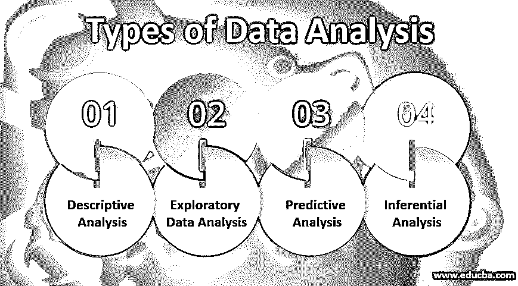

# 数据分析的类型

> 原文：<https://www.educba.com/types-of-data-analysis/>

## 数据分析的定义

[数据分析](https://www.educba.com/what-is-data-analysis/)是通过对数据集的检查、清洗、转换、建模，捕捉有用信息的过程；这样做所涉及的方法可以分为描述性分析(它从数字上获得数据的洞察力)、探索性分析(它从视觉上获得信息的智慧)、预测性分析(它使用历史事件传达数据的意义)和推断性分析(这涉及到通过从样本中获得信息来了解人口)。

### 数据分析的类型

根据使用的方法，数据分析可分为以下四个部分:

<small>Hadoop、数据科学、统计学&其他</small>

*   描述性分析
*   [探索性数据分析](https://www.educba.com/exploratory-data-analysis/)
*   预测分析
*   推理分析

#### 1.描述性分析

描述性分析是深入了解数据的数字方法。在描述性分析中，我们得到数值变量的汇总值。假设您正在分析一家汽车制造商的销售数据。在描述性分析的文献中，你会寻找这样的问题，比如一种车型的销售价格的均值和模式是什么，销售一种特定类型的汽车所产生的收入是多少，等等。使用这种类型的分析，我们可以得到数据的数值变量的集中趋势和分散程度。在大多数实际的数据科学用例中，描述性分析将帮助您获得数据的高级信息，并习惯数据集。描述性分析的重要术语有:

*   平均值(数字列表中所有数字的平均值)
*   模式(数字列表中最常见的数字)
*   中位数(一系列数字的中间值)
*   标准偏差(一组值相对于平均值的变化量)
*   方差(标准偏差的平方)
*   四分位数范围(一系列数字的 25%和 75%之间的值)

在 python 中，panda 的库提供了一个名为“describe”的方法，其中包括关于数据框的描述性信息。我们也可以使用其他库，比如统计模型，或者根据用例开发我们的代码。

#### 2.探索性数据分析

与描述性数据分析相反，探索性数据分析是一种可视化的数据分析方法。一旦我们通过描述性分析对手头的数据有了基本的了解，我们将转向探索性的数据分析。我们还可以将探索性数据分析分为两个部分:

*   单变量分析(探索单个变量的特征)
*   多变量分析(多变量的比较分析，如果我们比较两个变量的相关性，就叫双变量分析)

在数据分析的可视化方式中，我们使用各种曲线图和图表来分析数据。为了探索单个变量(单变量分析)，我们可以使用条形图、直方图、带须的箱线图、小提琴图等。对于多元分析，我们使用散点图、等高线图、多维图等。

**但是我们为什么需要探索性的数据分析呢？**

*   探索性数据分析给出了描述数据的可视化方式，有助于更清晰地识别数据的特征。
*   这有助于我们确定哪些功能更重要。这在我们处理高维数据的时候特别有用。(例如，像 PCA 和 t-SNE 这样的方法有助于降维)。
*   这是向管理人员和非技术堆栈持有者解释产生的结果的有效方法。

在 python 中，有许多库可以执行探索性的数据分析。Matplotlib，Seaborn，Plotly，Bokeh 等。，是最受欢迎的。

#### 3.预测分析

如果提前知道未来会犯的错误会怎么样？我们会努力避免这些吗？预测分析是通过分析历史事件来预测未来结果的最科学的方法。数据科学的核心是基于预测分析。预测分析有助于我们回答以下问题:“我们能否预测某个买家是否会购买某个特定产品？”或者“我们能估算出保险公司为索赔支付的总成本吗？”或者‘我们能估计即将到来的季风的降雨量吗？’

预测分析帮助我们给出导致大规模商业和社会经济变化的关键问题的近似或最可能的结果。机器学习模型是基于历史数据开发的，用于预测类似的未知未来事件的结果。

#### 4.推理分析

推理分析是数据科学文献，而我们预测多个部门的参考结果。例如，我们推导出消费者价格指数或人均收入。逐一接触到每个消费者并计算是不可行的。而是科学地从人群中抽取样本，在统计分析的帮助下，得出指数。

### 结论

在本文中，我们讨论了各种数据分析方法。我们需要使用所有这些方法吗，或者我们可以使用其中任何一种方法吗？现在，它是基于应用程序的用例和领域的。但在大多数情况下，我们将从描述性和探索性的数据分析开始，并开发预测模型来预测未来的结果。

### 推荐文章

这是一个数据分析类型的指南。在这里，我们基于应用程序的用例及领域，讨论数据分析和各种方法的简要概述。您也可以浏览我们推荐的文章，了解更多信息——

1.  [免费数据分析工具](https://www.educba.com/free-data-analysis-tools/)
2.  [数据分析过程](https://www.educba.com/data-analysis-process/)
3.  [数据分析软件](https://www.educba.com/data-analysis-software/)
4.  [数据分析技术的类型](https://www.educba.com/types-of-data-analysis-techniques/)

