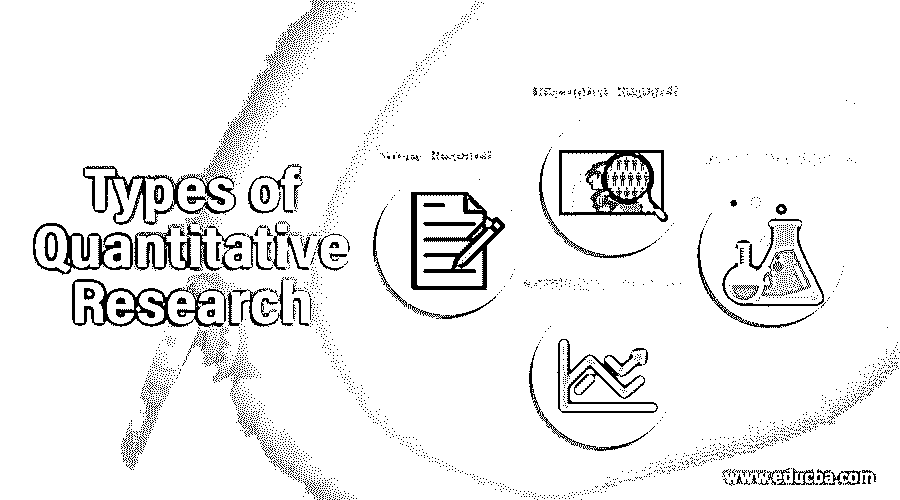

# 定量研究的类型

> 原文：<https://www.educba.com/types-of-quantitative-research/>

## 定量研究导论

定量研究是通过收集定量信息和活动应用数学或程序技术对现象进行的科学调查。定量分析中的数据收集是它区别于其他不同类型的原因。定量分析专门针对数字数据，它结合使用数学分析来研究什么是确定的，收集的信息应该是数字。定量研究的一般结构是根据科学方法预测的。它使用汇总的策略和方法，并在事件受害期间不时使用该信息来共享分析和结论。

### 不同类型的定量研究

定量风格的基本程序是:

<small>Hadoop、数据科学、统计学&其他</small>

*   对未知的、无法解释的或全新的事物建立自己的观察。调查围绕你的缺点或问题的当前情景和理论。
*   假设你在第一步中观察到的证据和解释。
*   建立一个结果预测来支持你的假设。制定一个详细的步骤，并计划测试你从第二步的预测。
*   收集和处理你的信息。如果你的预测是正确的，再次访问第 5 步。如果不是，这个假设就被证明是错误的。回到第 2 步，配对一个全新的假设来支持你收集的新数据和知识。
*   验证你的新发现，并从中得出你的结论。用一种恰当的、听众可以接受的形式描述你的发现。

下面是对不同类型的定量研究类型的描述。

#### 1.调查研究

调查研究是各种定量研究技术中最基本的工具。这项研究最重要的目的是广泛地解释一个特定群体或一群人口的特征。这种分析最典型地被小型和大型组织所采用，用于正确地理解他们的客户以及理解商品和产品的观点。

*   客户可以提出多个问题，并对这些问题进行分析。
*   横向调查和纵向调查是可以用来进行调查定量研究分析的两种主要调查。
*   横断面调查是在特定的时间目标人群中进行的。这些类型的调查主要用于零售商店、卫生保健行业等进行研究。
*   在纵向调查中，研究在不同的时间段进行。这些被用于医学和应用科学。

#### 2.描述性研究

描述性研究试图解释一个确定变量的当前状态。描述性研究的目的是解释和诠释人、环境、条件或事件的现状。

*   在描述性研究中，研究者通常不会从假设开始，但是，在收集信息后，可能会发展出一个假设。
*   数据的系统分类需要仔细选择单位和测量每个变量。
*   描述小学教师使用数学工具的程度，描述全球变暖与科学家的关系，描述学校中不同种类的体育活动，等等。都是描述性研究的例子。

#### 3.实验研究

实验研究，顾名思义，通常基于一个或多个理论。它基于一种或多种理论。它被称为真正的实验，使用科学的方法在一组构成研究的变量之间建立因果关系。多种理论可以用来进行这项研究。实验研究设计的组成部分规定如下。

*   被随机选择并分配到实验组和对照组的参与者的比较组。
*   自变量，可指可应用于实验组的实验变量。
*   因变量，可被称为效应变量或后验变量，可以用相同的方式对所有组进行测量。

#### 4.相关研究

相关性研究用于建立两个密切实体之间的关系，并确定一个实体如何影响另一个实体。为此，一名研究人员至少需要两个独立的小组。这种类型的研究将识别数据中的趋势和模式，但它不会在其分析中观察不同的模式。

*   相关性研究有时被认为是一种描述性研究，因为研究中没有操纵任何变量。
*   因果关系不是这种观察研究的基础。
*   相关研究的例子包括数学课堂活动类型与学生成绩之间的关系，饮食与焦虑之间的关系。

#### 5.偶然比较研究

因果比较研究用于得出两个或多个变量之间的因果关系方程，其中一个变量依赖于相反的实验变量。实验者不操纵自变量，而是测量自变量对因变量的影响。

*   这种分析不限于两个变量的应用数学，而是扩展到分析不同的变量和组。
*   因果比较研究是一种研究比较过程的方法。
*   一旦做出分析和结论，就应该一丝不苟地决定原因，因为其他不同的变量，每个著名的和未知的，可能仍然对结果有影响。
*   这类研究的例子包括学前教育对一年级末社会成熟度的影响，毒品对青少年的影响。

定量研究分析模板是客观的，精心制作的，并结合调查。如果你考虑研究人员在调查过程中如何设计和管理变量，就更容易知道各种类型的定量研究设计。定量设计的基本程序是为那些观察假设一个证据。

### 推荐文章

这是一个定量研究类型的指南。这里我们还讨论了引言和不同类型的定量研究，包括调查、描述性研究、实验性研究等。您也可以看看以下文章，了解更多信息–

1.  [数据库测试工具](https://www.educba.com/database-testing-tools/)
2.  [统计中的数据类型](https://www.educba.com/types-of-data-in-statistics/)
3.  [统计中变量的类型](https://www.educba.com/types-of-variables-in-statistics/)
4.  [数据分析软件](https://www.educba.com/data-analysis-software/)

