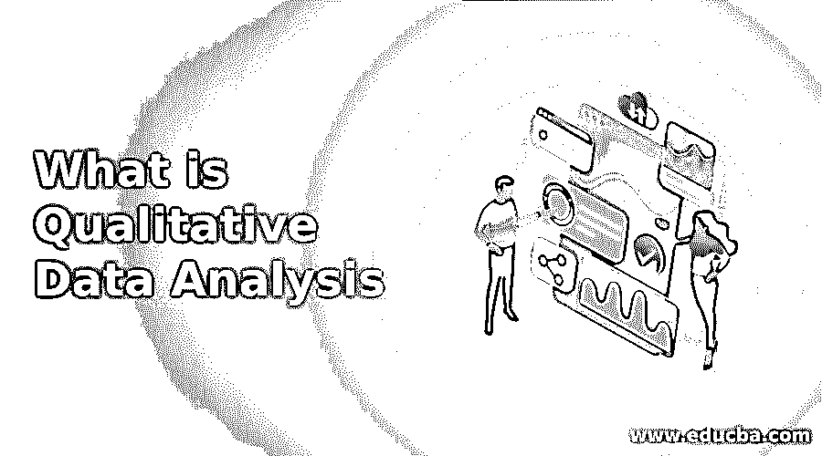

# 什么是定性数据分析

> 原文：<https://www.educba.com/what-is-qualitative-data-analysis/>

## 定性数据分析介绍

定性数据是与社会环境中个人的想法、观点、价值观和行为相关联的信息。它是指非数字数据，如采访笔录、笔记、视频和音频记录、图片和文本文档。什么是定性数据分析通常是主观的，丰富的，并由深入的信息组成，通常与排序的话。分析定性数据需要阅读大量的文本，寻找相似或不同之处，然后找到主题和发展类别。定性数据管理的使用减少了技术复杂性，使过程更容易。

### 什么是定性数据分析？

**分析定性数据的过程主要包括对信息进行书写或分类。首先，它涉及通过减少原始信息量来理解大量数据，然后是独特的重要模式，最终提取有意义的知识，然后构建逻辑模式。**

<small>Hadoop、数据科学、统计学&其他</small>

### 定性数据分析的例子

*   定性数据也称为分类数据，因为这种数据可以根据类别进行分类。
*   例如，想象一个学生在整个课堂上朗读一本书的一段。正在听阅读材料的讲师会对孩子如何阅读该段落提供反馈。如果老师提供了支持流畅性、语调、发音清晰度的反馈，但没有给孩子评分，这被认为是定性知识的一个例子。
*   蛋糕的颜色是橙色、蓝色和黑色(定性)。
*   女性有棕色、黑色、金色和红色的头发(定性)。

### 定性分析的类型

这可以分为以下五个类别/类型:

#### 1.内容分析

*   这是指对口头或活动数据进行分类的方法，以对信息进行分类、总结和列表。
*   可以在两个层面上分析内容:

1.  描述性–数据是什么？
2.  解释性–数据的含义是什么？

*   使用内容分析，研究人员将量化和分析这些词、主题或想法的存在、意义和关系。
*   内容分析用于发现个人、群体或机构的意图、焦点或交流趋势。
*   内容分析被用来解释对交流的态度和行为反应。
*   它被用来揭示交流内容的模式。

#### 2.叙事分析

*   叙事是转录的经验。
*   叙事分析指的是一组分析方法，用于解读具有传奇色彩的文本或视觉资料。
*   叙事分析涉及到考虑到每个案例的背景和每个回答者完全不同的经历，对回答者提供的故事进行重新表述。或者，叙事分析是科学人对原始定性知识的修正。
*   不同的叙事分析方法根据它们是否以叙事内容或结构为目标进行分类，主位版本询问一个故事是关于什么的，而结构版本询问一个故事是如何组成以达到特定的交际目的。
*   叙事分析的核心活动是解释个人在各种背景下讲述的故事，并支持他们不同的经历。

#### 3.话语分析

*   话语分析通常是对话语进行分析的几种传统的总称。
*   话语分析可能是一种分析自然发生的互动(口语)和所有类型的书面文本的技术。
*   它可能是分析书面、口头或语言使用或任何重要哲学理论事件的各种方法的总称。
*   话语分析涉及非发明的真实文本、创造的文本和人造文本。
*   话语分析不仅出现在所说内容的基本层面，而且考虑到周围的社会和历史背景。
*   它可能是一个很好的工具，用来找出书面和口头文本中的政治含义。
*   话语分析在讨论开始时被用来突出讨论的主题，并确定它对说话者的重要性。

#### 4.框架分析

*   该框架是一种定性数据分析的关联方法，为研究人员提供了一种管理、分析和确定主题的科学结构，对于大量文本尤其有用。
*   这种分析有不同的阶段，这些阶段相互联系，形成一个有组织的严格框架。这些阶段改变了研究人员对数据的认识和解释，从描述性的叙述转向对信息的抽象澄清。
*   框架分析的五个不同阶段是:

1.  **熟悉:**抄录和阅读信息。
2.  **确定主题框架:**从每个问题发展而来的初始编码框架——先验的和新出现的。
3.  **编码:**用数字或文字编码的方式，将完全不同主题对应的特定数据点出来。
4.  **制图:**使用主题框架中的标题创建的图表(可以是主题的，也可以是案例的)。
5.  **映射与解释:**在知识内部寻找模式、联想、思路和解释。

#### 5.扎根理论

*   扎根理论涉及数据的收集和分析。这个想法是“基于”实际数据的，这意味着理论的分析和发展发生在你收集信息的时候。
*   扎根理论是一种相关的归纳、比较方法，为收集、综合、分析和概念化定性数据提供系统的指导方针，以达到数据收集和建模的目的。
*   在努力识别经验社会现象，并构建受这些现象制约的理论时，多数选择和 GT 理论采用了 3 大类数据编码、备忘录和理论抽样。
*   在成组技术中，数据收集和数据分析是相互作用的。从数据分类开始的时候起，基础理论家就在数据分析中进行互动，最终导致额外的数据收集、后续的数据分析等等。

### 结论

在过去的二十年中，定性数据分析越来越受欢迎，并在广泛的医疗和卫生学科中被广泛接受，包括卫生服务研究、卫生技术评估、护理和相关卫生。定性方法探索经验的角度和意义，寻求洞察力，并确定解释人们行为意义的社会结构或过程。

### 推荐文章

这是一个什么是定性数据分析的指南。在这里，我们讨论定性数据分析的介绍，它是什么样的例子和类型。您也可以浏览我们的其他相关文章，了解更多信息——

1.  [数据分析软件](https://www.educba.com/data-analysis-software/)
2.  [数据分析技术](https://www.educba.com/data-analysis-techniques/)
3.  [数据分析 vs 数据分析](https://www.educba.com/data-analytics-vs-data-analysis/)
4.  [数据 vs 信息](https://www.educba.com/data-vs-information/)

