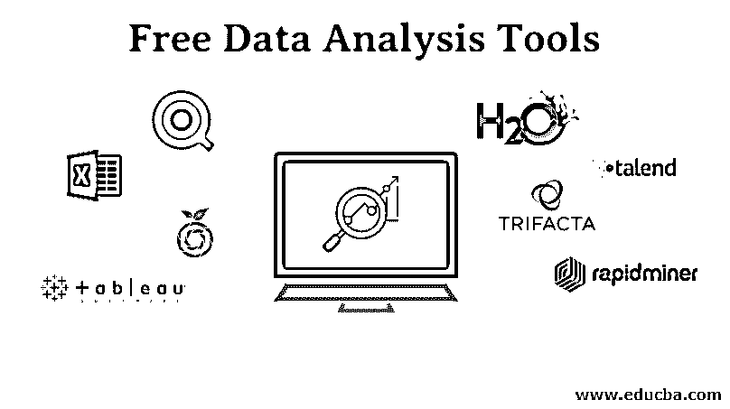
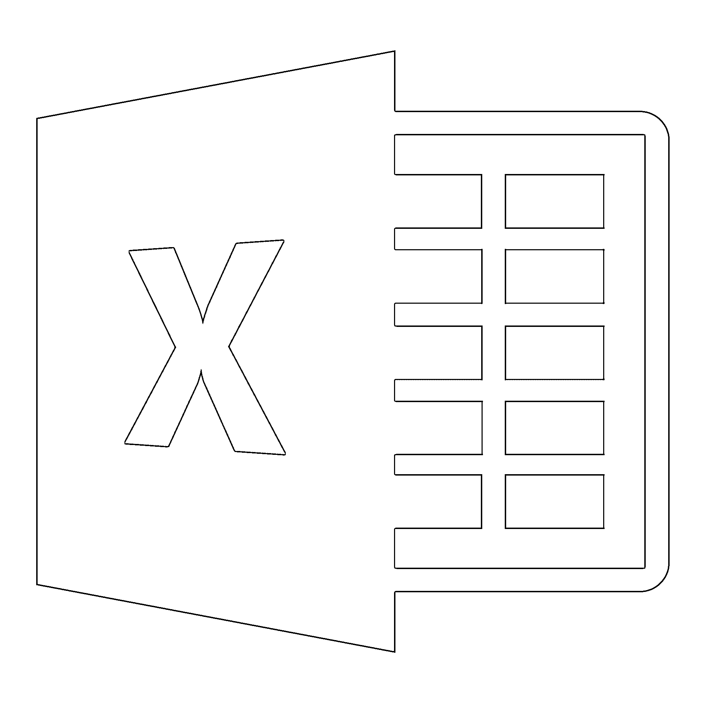
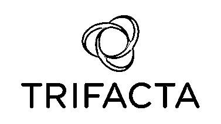
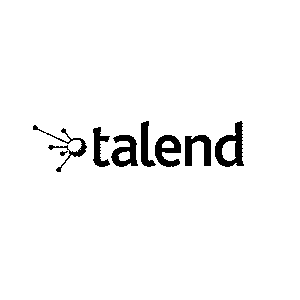
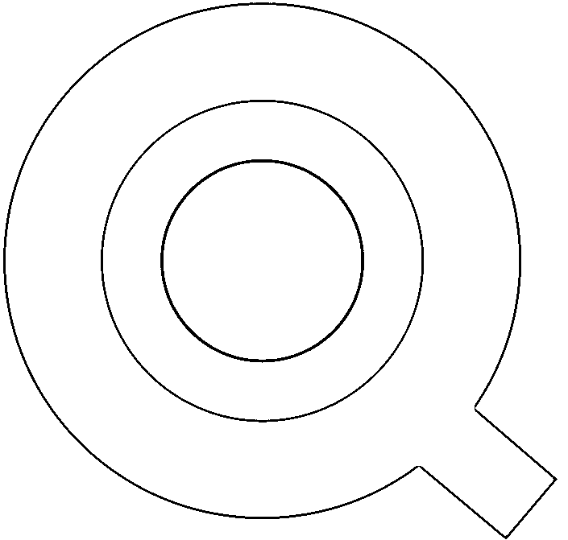
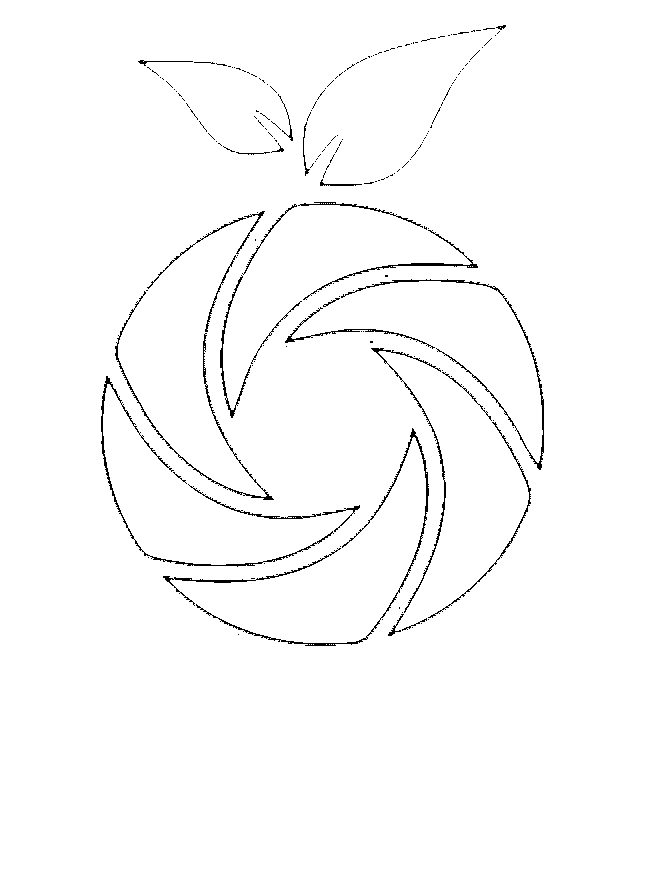
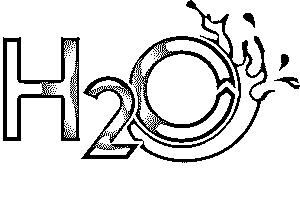

# 免费数据分析工具

> 原文：<https://www.educba.com/free-data-analysis-tools/>

## 免费数据分析工具简介

免费的数据分析工具用于分析数据，并从数据集中创造有意义的见解。这些是帮助企业创建数据驱动的决策过程的一套工具。一些业界知名的工具是非常受欢迎的工具，如 Microsoft excel、tableau public、KNIME、Rattle GUI for R、Talend、H2O、Trifacta、Orange、RapidMiner、Qlikview。这些工具有几个现成的功能支持，有助于数据分析过程。与用于数据分析的标准编程相比，这些数据分析工具易于学习并且可以非常快速地开发分析解决方案。

### 数据分析工具

以下是不同的数据分析工具。

<small>Hadoop、数据科学、统计学&其他</small>

#### 1.擅长

Excel 仍然吸引着人们去做数据分析，是的，它仍然是不可或缺的分析工具。有许多免费的在线教程可以教你 excel 和 VBA，通过它们你可以掌握 Excel。通过各种图形工具浏览数据、汇总数据和可视化数据等所有功能都在 excel 中完成。

学习和掌握 excel 是非常容易的。Excel 仍然是数据科学和分析的基本工具。excel 知识将对你的[数据科学职业生涯](https://www.educba.com/data-science-career/)有所帮助。尽管 Microsoft Excel 不是免费的，但市场上有类似的工具，如电子表格、open offices 和许多其他工具，它们提供了与 Excel 相同的功能。excel 的一个小缺点是它不能用于非常大的数据集。

#### 2.活人画

*   Tableau 是一个从简单数据到复杂数据的免费数据可视化工具。这是一种互动，我们可以建议标签，工具，列的大小，以及几乎任何我们可以定制的东西。拖放界面在这个软件中非常有用，计算也可以在 Tableau 中完成。任何对分析没有任何概念的人都可以从 Tableau 平台上看到并理解数据。
*   仪表板和工作表是在 Tableau 中创建的，用于数据分析和可视化。Tableau 有助于通过其仪表板从不同的角度查看数据。人们可以通过 Tableau 轻松进入数据科学的世界。还有，Tableau 集成了 Python 和 [R 编程语言](https://www.educba.com/what-is-r-programming-language/)。

#### 3.Trifacta

Trifacta 是一个用于数据争论的开源工具，它使得数据分析的数据准备变得容易。Trifacta 有助于将数据从原始数据格式转换、探索和分析为整洁有序的格式。它使用[机器学习技术](https://www.educba.com/machine-learning-techniques/)帮助用户进行数据分析和探索。Trifacta 的另一个名字是 Data Wrangler，这表明它在数据清理方面最有用。

它是由乔·赫勒斯坦、杰弗里·赫尔和肖恩·坎德尔在 2012 年开发的。Trifacta 与云一起工作，并与 AWS 合作。它获得了 AWS 颁发的机器学习部署奖。与 Excel 不同，Trifacta 可以帮助您处理大型数据集。还有，文本编辑建议在 Trifacta 中也是不可思议的。

#### 4.快速采矿机

RapidMiner 是数据准备、机器学习、深度学习和其他[数据分析技术](https://www.educba.com/data-analysis-techniques/)的集成工具。工作流被称为过程，一个过程的输出成为其他过程的输入。这可以通过编程语言或者他们自己的插件来扩展。RapidMiner 的某些版本是免费的。

RapidMiner 的产品包括 RapidMiner Studio、RapidMiner Auto Model、RapidMiner Turbo Prep、RapidMiner Server 和 RapidMiner Radoop。我们可以通过将数据加载到 RapidMiner 中来检查数据，并在工具中进行计算或分类。RapidMiner 主要是为非程序员设计的。RapidMiner 还帮助清理数据和准备图表。

#### 5.说得好

Talend 是一个借助云进行数据集成的开源工具。Talend 帮助导入数据，并尽快将其移动到数据仓库。Talend 有统一的平台。还有，Talend 的社区强大到你永远不会知道另一边的人来自哪个背景。

Talend Platforms、Talend enterprise 和 Talend Open Studio 在几乎所有与数据相关的方面都有帮助，一旦您开始使用 Talend，您可能就不会再寻找其他工具了。三者中使用最多的是 [Talend Open Studio](https://www.educba.com/talend-open-studio/) 。Talend 的协作和管理值得称赞，就像他们的数据集成一样。

#### 6\. Qlikview

Qlikview 被推荐为数据可视化的最佳工具。它更快、更容易，而且在本质上是独一无二的。QlikView 中有一个社区，其中有论坛、博客和图书馆。社区可以帮助解决你的大部分问题。它用不同的颜色显示数据之间的关系。Qlikview 帮助用户从不同的数据可视化方法中做出正确的决策。

如果您对布局设计感兴趣，Qlikview 是您的最佳选择。掌握数据建模和 SQL 基础知识对精通 Qlikview 很有好处。

#### 7.柑橘

orange toolkit 可以用作复杂机器学习算法的简单数据可视化，前提是它是开源的。它也可以与 Python 库一起使用。它就像一块画布，用户在上面放置小部件并创建工作流。所有的数据功能都在 widgets canvas 中完成。用户可以探索该工具中可用的各种可视化技术。

Orange 工具有许多插件，因为它也用于机器学习算法中。数据挖掘也可以在这个工具中完成。

#### 8.H2O

H2O 帮助寻找数据的模式。它的应用主要是在机器学习和人工智能方面，但它提供了关于数据的非常好的见解。H2O 有一个内置函数来猜测传入数据集的结构。

还有其他工具，如用于排序和过滤数据的 OpenRefine，用于图表和可视化的 Fusion Tables，用于数据可视化和数据争论的 Microsoft power BI，用于创建报告的 Google Dashboards，用于统计分析的 Plotly，用于统计可视化的 Gephi，以及许多工具。

### 结论

只要稍加练习，数据分析就可以很容易地完成。所有的工具都不会有同等的帮助。选择一个工具并成为这个工具的主人是很好的。理解数据对于了解我们在数据分析方面的实际情况至关重要。编程在可视化和分析数据方面并不重要。但是有些工具让你更接近编程。

### 推荐文章

这是一个免费数据分析工具的指南。这里我们详细讨论基本含义和不同的数据分析工具。您也可以浏览我们推荐的其他文章，了解更多信息——

1.  [数据科学工具](https://www.educba.com/data-science-tools/)
2.  [数据分析过程](https://www.educba.com/data-analysis-process/)
3.  [数据仓库工具](https://www.educba.com/data-warehouse-tools/)
4.  [数据分析的类型](https://www.educba.com/types-of-data-analysis/)

