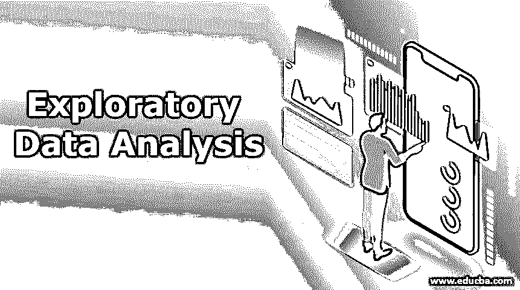
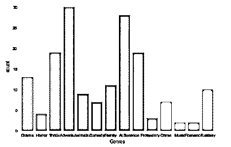
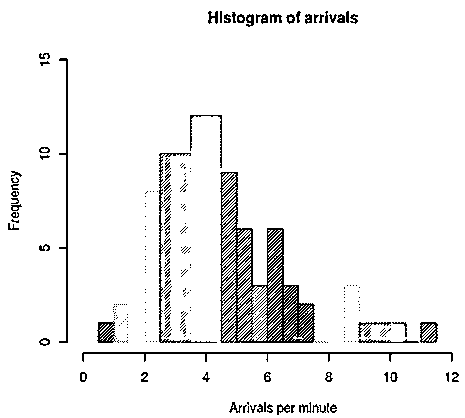
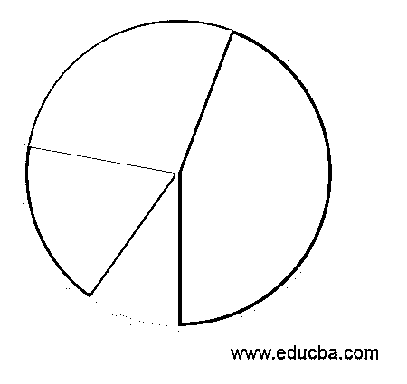
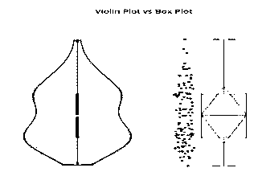
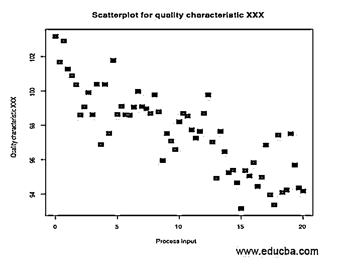

# 探索性数据分析

> 原文：<https://www.educba.com/exploratory-data-analysis/>

## 什么是探索性数据分析？

探索性数据分析是一种基本的数据分析技术，在分析行业中与 EDA 同名。EDA 与在分析项目的初始阶段应用的一些概念和最佳实践相关联。EDA 与图形可视化技术相关联，以识别数据模式和比较数据分析。EDA 是数据科学项目的功能工程和功能选择过程的首选技术。一些广泛使用的 EDA 技术有单变量分析、双变量分析、多变量分析、条形图、箱线图、饼图、折线图、频率表、直方图和散点图。EDA 对于数据准备阶段非常有用，这将补充机器学习模型。

### 探索性数据分析是如何进行的？

让我们看看探索性数据分析是如何执行的:

<small>Hadoop、数据科学、统计学&其他</small>

#### 1.单变量分析

Uni 的意思是一个。顾名思义，单变量分析就是只涉及单个变量的数据分析。变量可以是“分类”变量，也可以是“数字”变量。让我们讨论一下最常用的用于单变量分析的探索性数据分析的图解法。

#### 2.频率表和计数图

频率表或计数图用于确定某个值出现的频率或次数。例如，我们正在投掷一枚无偏的硬币 5 次(H，T，H，H，T)。这里头的频率或计数是 3。让我们从一个电影评论数据集来看看计数图是什么样子的。由于矩形条，计数图也称为条形图。我们使用 Seaborn 库在 python 中生成条形图。

电影评论数据集的计数图

**来源链接**:[https://stack overflow . com/questions/48043365/how-to-improve-this-seaborn-count plot](https://stackoverflow.com/questions/48043365/how-to-improve-this-seaborn-countplot)

#### 3.直方图

直方图是核密度估计的平滑版本。直方图有助于我们了解数据的基本分布。例如，正态(钟形曲线)分布的预处理方法将明显不同于其他倾斜分布，如 Pareto 分布。让我们看看到达航班的分布是如何以柱状图的形式显示的。

**来源:** [维基百科](https://en.wikipedia.org/wiki/File:Histogram_of_arrivals_per_minute.svg)

#### 4.圆形分格统计图表

饼图是一个圆，它根据样本或总体的相对计数或频率被分成多个部分。假设我们想要比较多个产品的相对业绩或销售额，饼图是一种非常有用的可视化图形方式。

#### 5.带胡须和小提琴图的方框图

带触须的箱线图用于以图形方式显示变量的 25-50-75 百分位值。箱形图让我们清楚地看到数据中 50%、25%或 95%的值。Violin 图是 boxplot 的增强图，它包括变量的更多信息(变量的分布)。让我们看看盒子图和小提琴图是什么样子的。

来源:维基百科

#### 6.多变量分析

多元分析是对多个变量进行比较分析的方法。如果我们比较这两个变量，这就是所谓的双变量分析。散点图、等高线图、多元概率密度图是分析多维数据最常用的图形方法。让我们展示一下散点图是什么样子的。

### 探索性数据分析的优势和劣势

下面给出了探索性数据分析的优点和缺点:

#### EDA 的优势

*   它让我们对数据有了有价值的了解。
*   它帮助我们进行特征选择(即使用主成分分析)
*   可视化是检测异常值的有效方法。

#### EDA 的缺点

*   如果执行不当，EDA 可能会误导问题。
*   当我们处理高维数据时，EDA 并不有效。

### 探索性数据分析的应用

让我们用单变量分析的用例来分析探索性数据分析的应用，其中我们将寻求数据集中趋势的度量:

*   集中趋势的测量给我们一个单变量变量的概述。集中趋势是平均值、中间值和众数的度量。Mean 是简单的平均值，其中中值是 50%的百分位数，Mode 是最常出现的值。假设我们想知道一个数据科学家的工资。此外，假设我们已经仔细收集了具有相似专业知识和经验范围的数据科学家的数据。
*   现在，如果我们想得到平均值，只需将样本中所有数据科学家的总工资除以样本或总体中数据科学家的数量。但如果你仔细想想，平均工资并不是一个恰当的术语，因为在一些极端值的存在下，结果会有偏差。假设大多数情况下工资在 8-10 LPA 之间，一两个情况下是 32 LPA。现在把所有这些加起来，平均值会有偏差。中位数更适合这种情况，它对异常值更稳健。

### 结论

在本文中，我们讨论了探索性数据分析中涉及的各种方法、应用、优点和缺点。我们还浏览了使用 seaborn 和 Matplotlib 库在 python 中生成绘图的示例代码。EDA 是数据科学文献的艺术部分，有助于获得有价值的见解和可视化数据。

### 推荐文章

这是探索性数据分析指南。这里我们讨论 EDA 的介绍，探索性数据分析是如何执行的？以及 EDA 的应用和优缺点。您还可以浏览我们推荐的其他文章——

1.  [什么是](https://www.educba.com/what-is-data-analysis/) [数据](https://www.educba.com/what-is-data-analysis/) [分析？](https://www.educba.com/what-is-data-analysis/)
2.  [数据分析技术](https://www.educba.com/data-analysis-techniques/)
3.  [数据分析工具](https://www.educba.com/data-analysis-tools/)
4.  [NoSQL 数据模型](https://www.educba.com/nosql-data-models/)

