# 统计分析回归

> 原文：<https://www.educba.com/statistical-analysis-regression/>

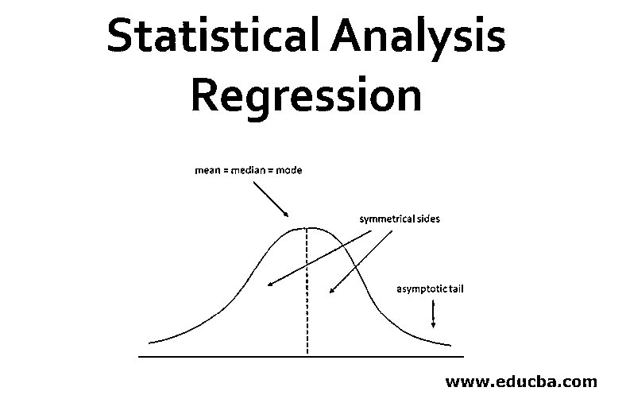

## 统计分析回归导论

统计分析回归使用均值、中值、正态分布等统计方法来计算因变量和自变量之间的关系，以获取变量之间的关系强度，并为变量之间的新关系建模，因为它涉及各种变量，如简单线性、多线性和非线性，其中非线性回归主要用于自变量和因变量显示非线性关系的复杂数据集。

**均值:**均值或统计均值是将所有的数相加，然后除以有多少个数得出的。

<small>Hadoop、数据科学、统计学&其他</small>

**标准差:**标准差是一种用来量化一组数据中变化量的度量。

标准偏差=方差的平方根，即 S

方差=标准差的平方，即 S 2

**正态分布:**对于回归分析，我们遵循正态分布。这是一个概率分布。在正态分布中，平均值等于中位数，中位数等于众数(平均值=中位数=众数)。它也被称为钟形曲线分布。

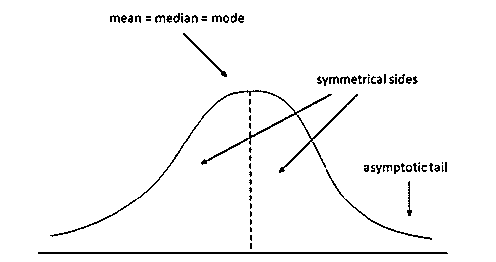

统计学中的回归是一个变量(即产量)的平均值与其他变量(即时间和成本)的相关值之间的关系。

回归分析将有助于为图表提供一个方程，以便可以对数据进行预测。

**例子:**

*   我们可以在营销中使用回归分析来确定营销活动中应该瞄准的最佳群体。
*   回归分析最简单的例子是——当你吃的多少和你的体重有联系时；回归分析可以帮你同样量化。

因此，从上面的例子中，我们了解到统计学中的回归分析是一组用于估计因变量和一个或多个自变量之间关系的统计过程。

简而言之，回归是使用一组数据进行预测的最佳猜测。

### 需要统计分析回归

我们知道，相关系数也是两个变量之间的统计关系，它只给我们关系或关联的程度。它不能帮助我们预测或估计给定自变量的响应变量。这里，响应变量也称为因变量。

我们需要统计分析回归，原因如下:-

*   解释因变量因使用多个自变量而产生的变化。

**举例:**当我们考察一家公司中影响利润额的因素时。这里利润量被认为是一个因变量，因为它可能会受到其他变量的影响。

*   通过统计等式以精确的方式描述关系的本质。
*   利用预测和预报问题。
*   帮助消除不必要的因素。
*   用于识别业务变量之间的潜在关系，并处理它们之间任何可能的结果或解决方案。

公司的决策者可以使用回归分析结果来制定重要的决策，从而为公司的发展增加重要的商业价值。

### 如何进行统计分析回归？

回归分析用于通过分析现在和过去的数据来预测未来的结果。

**案例分析:**

下面的例子向我们展示了如何进行回归分析的基本理解

让我们对一家洋娃娃制造公司的销售量进行回归分析。

考虑以下内容

制造公司的销售量(目标)= Y

这里的预测因素有:

*   价格= X1
*   娃娃模特= X2
*   年份= X3
*   其他方面= X4

考虑每个预测值或变量的影响级别等于 b。X1 的影响级别为 b1，X2 的影响级别为 b2，依此类推。现在我们有了系数-B1，b2，b3..十亿

这里 Y 的值会受到所有独立变量的一个或多个组合的影响。

我们可以用简单的线性回归公式来计算销售量:

Y = b1X1 + b2X2 + b3X3 + …..+ bnXn

由此，我们可以理解，回归分析使用观察数据来估计 b1、b2、b3、..，bn。贴上这个，我们可以用下面的公式预测销售量。这里的销售量是估算出来的，所以我们称之为*ŷ*。

请注意，y≠as*ŷ*和*ŷ*只是一个估计值。

因此，为了修正 Y 的值，我们执行以下操作

y =错误

换句话说，y 等于 y 有正负误差。

如果我们理解在我们的回归模型中 X1、X2、X3 和 X4 对*ŷ*没有影响，会怎么样

换句话说，b1、b2、b3 和 b4 的值等于零，则销售量等于 0

下面是公式:

因此，销售量=零，这是不正确的。销量不能为 0。

在这种情况下，我们通过添加其他系数 b0 来固定它。这里 b0 称为截距或常数。

那么下面将是公式

这被称为多元线性回归。

这里:

*   叫做截距或常数
*   *b1，b2，b3，b4* 称为系数

#### Excel 中的回归散点图

让我们学习如何用下面的问题陈述在 excel 中绘制图形。

问题陈述:

| **X(售出产品数量)** | **Y(已收金额)** |
| **2** | **3000** |
| **2** | **2500** |
| **3** | **4000** |
| **4** | **3500** |
| **6** | **5000** |
| **7** | **5500** |
| **7** | **6000** |
| **9** | **6000** |
| **11** | **7000** |
| **12** | **6500** |

上表中有两列 X 和 y。

x 是卖出的产品数量，Y 是卖出产品后收到的金额。

所以在这个问题中，第一行的州销售的产品数量是 2，销售产品后收到的金额是₹3000.

第二行说明售出的产品数量为 2，售出产品后收到的金额为₹2500，依此类推。

我们现在可以对这些数据进行简单的描述性统计。

我们需要确保在 excel 中有可用的数据分析。

如果你没有，你只需要:

*   转到文件，然后点击 excel 选项。

*   选择加载项，然后按确定。

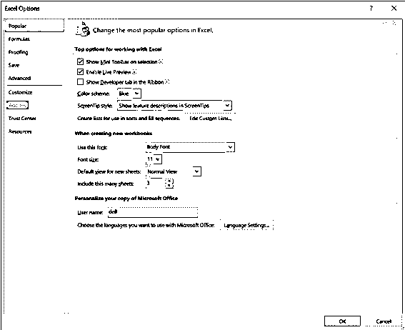

*   然后单击管理下的加载项选择 Excel 加载项，并单击转到。

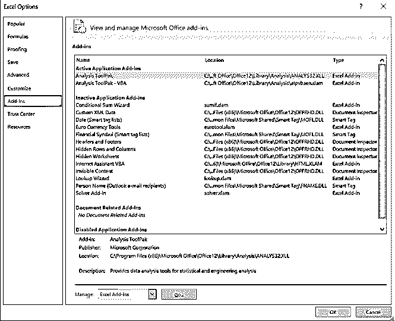

*   然后点击 go，确保你选择了分析工具库。

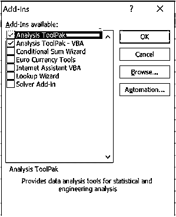

*   然后，您将在工具栏中获得数据分析选项。

现在我们在 excel 中有了数据分析选项，让我们运行描述性统计。

*   单击数据分析选项，选择描述性统计，然后选择确定。

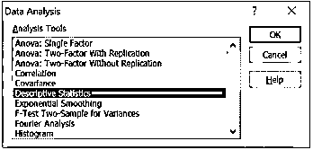

*   选择完整的输入范围 X，即从 C3 到 C12 销售的产品数量。选择汇总统计数据。如果您愿意，您可以在此表单中选择输出范围(这是可选的)，然后单击确定。

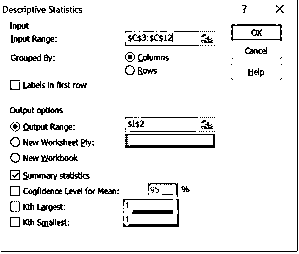

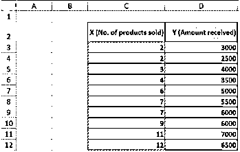

*   我们将在第 1 列中得到结果，在那里我们得到所有的中心趋势和其他细节。

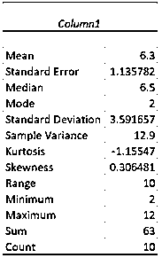

#### 在 Excel 中绘制回归分析

*   选择 X & Y 的完整 excel。转到插入

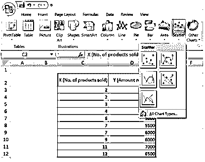

*   下图弹出窗口。

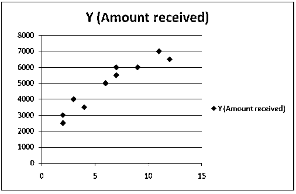

*   点击图表

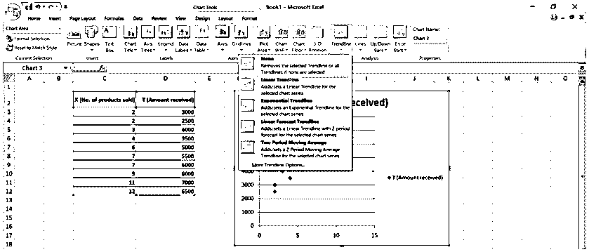

*   我们现在可以找到下面的趋势线。

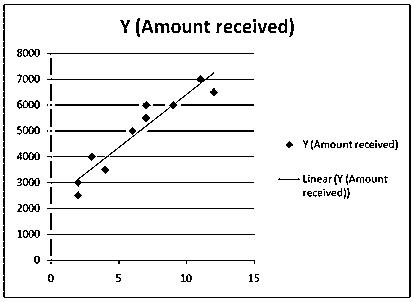

### 统计分析回归的优势

现在我们知道了统计分析回归是如何执行的，我们需要理解执行回归分析后的优势。

下面是统计分析回归的一些优点:

*   预测分析:回归分析结果可以定义业务产出。它有助于预测近期和长期的销售。
*   企业运营效率:对于一个小企业来说，决定了哪个因素最重要，哪个因素可以忽略。它可以用来了解库存水平，供应和需求水平。

### 结论

我们现在可以理解，回归分析是一系列统计工具，可以帮助业务分析师建立模型来预测趋势，做出权衡决策，并为决策支持建立真实世界的模型。回归分析有助于为当前和未来的业务做出更好的决策。回归预测用于确定变量之间的关系。数据提供了对业务的全新见解，有助于发现不同变量之间的关系，从而揭示模式。

### 推荐文章

这是一个统计分析回归指南。这里我们讨论统计分析回归的需求、优势以及如何执行。您也可以浏览我们推荐的其他文章，了解更多信息——

1.  [统计分析方法](https://www.educba.com/statistical-analysis-methods/)
2.  [统计分析类型](https://www.educba.com/statistical-analysis-types/)
3.  [学习 17 种不同的统计分析工具](https://www.educba.com/statistical-analysis-tools/)
4.  [R 中的统计分析指南](https://www.educba.com/statistical-analysis-in-r/)

