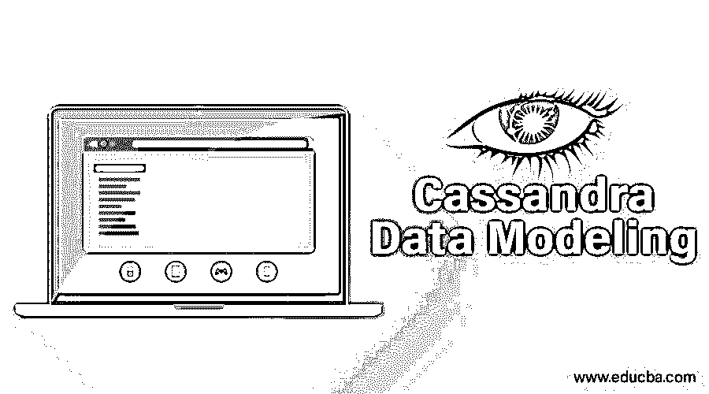

# Cassandra 数据建模

> 原文：<https://www.educba.com/cassandra-data-modeling/>

## Cassandra 数据建模简介

为了应对海量信息，新的数据管理技术应运而生。这些技术不同于传统的关系数据库方法。他们统称为 NoSQL。Cassandra 是广为人知的 NoSQL 数据库之一。其他流行的 NoSQL 数据库产品包括 MongoDB、Riak、Redis、Neo4j 等。在本主题中，我们将[学习 Cassandra](https://www.educba.com/what-is-cassandra/) 数据建模。

这些 NoSQL 数据库通过包含大量有组织的、半组织的和无组织的信息，克服了关系数据库的缺点。web 应用程序的可伸缩性和性能、较低的成本以及对敏捷软件开发的支持是它的一些优势。Cassandra 是 Apache Software Foundation 中的一个功能性开源平台，因此也被称为 Apache Cassandra。Cassandra 可以在跨多个中心的大型分布式集群中监督大量有组织、半有组织和无组织的数据。它提供高可扩展性、高性能并支持灵活的模型。

<small>Hadoop、数据科学、统计学&其他</small>

数据建模是对开发软件所需的流程和结构的理解。它标识主要对象、它们的特征以及它们与其他对象的关系。这通常是创建任何软件的第一步，也是最重要的一步。就像蓝图设计对于建筑师一样，数据模型对于软件开发人员来说也是如此。这有助于分析结构，并允许您预测以后可能发生的任何功能或技术困难。

传统的数据建模流程从概念数据建模开始。这个[概念数据模型](https://www.educba.com/conceptual-data-model/)然后被映射到关系数据模型，最终产生关系数据库模式。在这个过程中，首要的事情是数据排序，这是通过理解和查询相关性来完成的。

Cassandra 中的数据建模不同于关系数据库中的数据建模。关系数据建模仅基于概念数据模型，它使用 SQL 来检索和执行操作。Cassandra 使用 CQL ( [Cassandra 查询语言](https://www.educba.com/cassandra-query-language/))，具有类似 SQL 的语法。Cassandra 中的数据建模从组织数据和理解数据与其对象的关系开始。这里，键空间类似于包含不同记录和表的数据库。一个集群可以有多个键空间。不同的节点连接起来创建一个集群。在键空间级别，我们可以定义像复制因子这样的属性。

### 台式

Cassandra 对表格的理解与现有的概念完全不同。CQL 表可以被视为一组称为列族的分区，其中包含具有相同结构的行。每个分区都有一个唯一的分区键，每一行都包含一个可选的单个集群键。分区和簇键的组合称为主键，用于标识表中的一行。具有聚集键的表将有多行分区，而没有聚集键的表将只有单行分区。

### 查询模型

Casandra flow 从一个概念数据模型以及应用程序工作流开始，作为输入获得逻辑数据模型，并最终获得物理数据模型。

用户查询在应用程序工作流中定义。概念数据建模用于捕捉不同实体及其属性之间的关系。因此得名 E-R 模型。

### 逻辑数据建模

Cassandra 数据建模方法的核心是逻辑数据建模。基于应用程序工作流中定义的查询，将概念数据模型映射到逻辑数据模型。这种查询驱动的概念到逻辑的映射是由数据建模原则、映射规则和映射模式定义的。

### 数据建模原则

以下四个原则为概念数据模型到逻辑数据模型的映射提供了基础。

*   **了解您的数据:**为了正确地组织数据，必须熟知实体、属性及其关系，以开发概念数据模型。
*   **了解您的查询:**为了高效地组织数据，使用了查询。要执行的最佳选项是每个查询分区。
*   **数据嵌套:**为了按照已知的标准将多个相同类型的实体组织在一起，使用了数据嵌套。它用于从单个分区中检索多个实体。
*   **数据复制:**在 Cassandra 中通过连接进行数据复制总是更好，因为它有助于有效地支持对相同数据的不同查询。

基于数据建模原则，定义了映射规则来实现从概念数据模型到逻辑数据模型的转换。

#### 映射规则

*   **实体和关系:**实体和关系类型映射到表格，实体和关系映射到表格行。
*   **相等搜索属性:**相等搜索属性用于包含参与相等搜索的主键的列。
*   **不等搜索属性:**不等搜索属性也用于包含主键的列中，以产生不同的搜索结果。
*   **排序属性:**排序属性用于按照特定的顺序对数据进行分组。
*   **关键属性:**该特征有助于识别唯一的行。

基于上述映射规则，我们设计了映射模式，作为自动化数据库设计的基础。通过给定的查询和概念数据模型，每个模式定义了最终的模式设计大纲。

### 物理模型

一旦逻辑模型就位，开发物理模型就相对容易了。物理数据模型代表数据库中的数据。分配数据类型后，将估计分区大小，并执行测试来分析模型以获得更好的优化。

总之，我们可以说，当有大量各种各样的数据需要分析和处理时。有必要选择一种能够有效提取待分析数据的方法。凭借其高可伸缩性和存储海量数据的能力，Cassandra 提供了快速的信息检索，以设计复杂结构的数据模型。

Cassandra 数据建模及其所有功能可以包含在以下方式中。在这里，我们创建了一个查询驱动的概念数据设计，并在概述的映射规则和映射模式的帮助下，实现了从概念模型到逻辑模型的转换。然后，我们描述一个物理模型，以获得设计的完全独特的心理图像。

### 推荐文章

这是 Cassandra 数据建模指南。这里我们讨论表模型、查询模型、逻辑数据建模和数据建模原则。您也可以看看以下文章，了解更多信息–

1.  [数据库管理系统中的数据模型](https://www.educba.com/data-models-in-dbms/)
2.  [什么是数据建模？](https://www.educba.com/what-is-data-modeling/)
3.  [数据仓库建模](https://www.educba.com/data-warehouse-modeling/)
4.  [数据分析面试问题](https://www.educba.com/data-analytics-interview-questions/)

