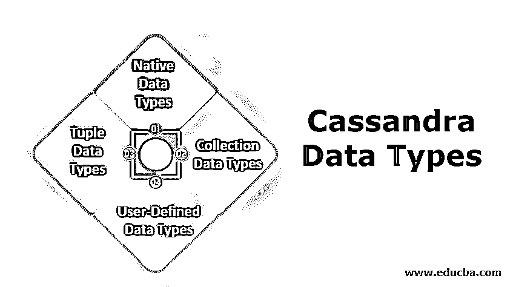

# Cassandra 数据类型

> 原文：<https://www.educba.com/cassandra-data-types/>

## Cassandra 数据类型简介

Cassandra 数据类型包含一组丰富的数据类型，包括本机类型、集合类型、用户定义类型、元组类型和自定义类型。这些数据类型很重要，用于根据数据的输入类型保留存储数据的内存。这有助于在编译器和程序员级别防止错误并增强输入数据的可读性。在数据库的情况下，如果为表中的列指定了数据类型，那么只能存储该组数据和值。

### Cassandra 数据类型

以下是一些主要的数据类型:

<small>Hadoop、数据科学、统计学&其他</small>

#### 1.Cassandra 本地数据类型的类型

[Cassandra 查询语言](https://www.educba.com/cassandra-query-language/)包含不同类型的数据类型:

该表包含几行和以下三列:CQL 类型、常数和说明。

*   **ascii** **:** 第一种 CQL 是 ascii。它对应的常量是字符串，它的描述是 US-ASCII 字符串。
*   **bigint** :第二种 CQL 类型是 bigint。它对应的常数是整数，它的描述是 64 位有符号长。
*   **斑点**:第三种 CQL 类型是斑点。它对应的常量是 blobs，它的描述是它包含任意字节(无验证)，用十六进制表示。
*   **布尔**:第四种 CQL 类型是布尔。它对应的常数是布尔型的，它的描述是要么为真，要么为假。
*   **计数器**:第五种 CQL 是计数器。它对应的常数是整数，它的描述是它是一个分布式计数器值(64 位长)。
*   **十进制**:第六种 CQL 类型为十进制。它对应的常数是整数和浮点数，它的描述是它是一个可变精度的小数。
*   **double** :第七种 CQL 式是 double。它对应的常数是整数，它的描述是 64 位 IEEE-754 浮点。
*   第八艘 CQL 号正在漂浮。它对应的常数是整数和浮点数，它的描述是它是一个 32 位 IEEE-754 浮点。
*   **inet** :第九种 CQL 类型是 inet。它对应的常量是字符串，它的描述是 IPv4 或 IPv6 格式的 IP 地址字符串*。
*   **int** :第十种 CQL 类型是 int。它对应的常数是整数，它的描述是 32 位有符号整数。
*   **列表**:第十一种 CQL 类型为列表。它对应的常数是 n/a，它的描述是它是一个或多个有序元素的集合。
*   **地图**:第十二种 CQL 就是地图。它对应的常量是 n/a，它的描述是它是一个 JSON 风格的文字数组:{ literal: literal，literal: literal… }。
*   **设定**:设定第十三种 CQL。它是相应的常数 n/a，它的描述是，它作为一个或多个元素的集合。
*   **文本**:第十四种 CQL 类型为文本。它对应的常量是字符串，它的描述是它是一个 UTY-8 编码的字符串。
*   **时间戳**:第十五个 CQL 类型是时间戳。它对应的常数是整数和字符串，它的描述是它包括一个日期加上时间，并被编码为自纪元以来的 8 个字节。
*   **uuid** :第十六个 CQL 类型是 uuid。它对应的常量是 UUID，它的描述是它是标准 UUID 格式的 UUID。
*   **timeuuid** :第十七个 CQL 类型是 timeuuid。它对应的常量是 UUID，并且它的描述是它只是一个类型 1 UUID(CQL 3)。
*   **varchar** :第十八个 CQL 类型是 varchar。它对应的常量是字符串，它的描述是它是一个 UTG-8 编码的字符串。
*   **varint** :十九 CQL 型是变种。它对应的常数是整数，它的描述是它是一个任意精度的整数。

#### 2.集合数据类型的类型

CQL 支持 3 种类型的收藏:地图、集合和列表。

*   **Map** : Map 是一组排序的键-值对，其中键是惟一的，并且 Map 按其键排序。
*   **集合**:集合是唯一值的有序集合。
*   **列表**:列表是一个非唯一值的有序集合，其中元素按列表中的位置排序。

#### 3.用户定义的数据类型

CQL 支持用户定义类型的定义(简称 UDT)。可以使用 create_type_statement、alter_type_statement 和 drop_type_statement 来创建、修改和删除这种类型

#### 4.元组数据类型

Cassandra 查询语言也支持元组数据类型。这些元组数据时间由可以包含不同数据类型的元素或参数组成。元组可以是自定义数据类型，也可以是匿名用户定义的数据类型。元组总是处于冻结状态，因此不可能在不实际更新整个元组的情况下部分地或单独地修改元组的元素。

### 结论

CQL 中这些不同的数据类型集用于读取输入数据，分配为处理数据保留的内存，然后编译数据以根据用户要求使用数据。因此，这些数据类型旨在通知编译器关于数据将如何被使用。它还定义了可以使用数据完成的操作。

### 推荐文章

这是 Cassandra 数据类型指南。这里讨论了 Cassandra 数据类型的介绍以及前 4 种数据类型。您也可以看看以下文章，了解更多信息–

1.  [Cassandra 中的数据模型](https://www.educba.com/data-model-in-cassandra/)
2.  [NumPy 数据类型](https://www.educba.com/numpy-data-types/)
3.  [卡珊德拉建筑](https://www.educba.com/cassandra-architecture/)
4.  卡桑德拉是 NoSQL 吗？
5.  [SQL Server 数据类型示例](https://www.educba.com/sql-server-data-types/)

