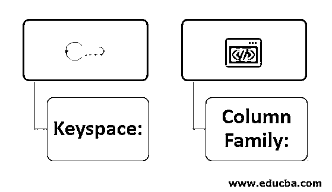
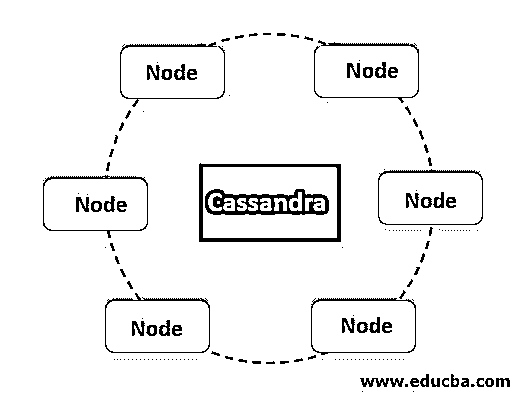

# CQL

> 原文：<https://www.educba.com/cql/>

## 什么是 CQL？

CQL 被称为卡珊德拉查询语言，是阿帕奇卡珊德拉 NoSQL 数据库的交互语言。对于关系数据库，CQL 的工作方式非常类似于结构化查询语言(SQL)。Cassandra 数据库为 CQL 提供了 Cqlsh 命令行界面。有两种与 Cassandra 相关的数据模型，如 keyspace 和 column family。CQL 对于查询处理是有效且一致的。CQL 的一些主要功能是键空间创建、更改表、截断表、删除表、数据插入和数据删除操作。此外，CQL 支持各种运营商和安全条款的实施。

进入 CQ 的一般方式如下:

<small>Hadoop、数据科学、统计学&其他</small>

*   这是 CQL 的命令行界面
*   任何应用程序开发编程语言都可以与其驱动程序一起使用。

Cassandra 的数据模型操作两个主要项目，即，

#### 1.Keyspace(键空间)

键空间类似于 RDBMS 中的数据库。一个键空间将包含多个表或列族。列族是在 Cassandra 中组合在一起的一组列名；可以随时用新的柱值更新柱族。更重要的是，Cassandra 并不期望一行包含列族中的所有列。所以一行可以单独容纳必要的列。

#### 2.柱族

列族与 RDBMS 中的表非常相似。组合在一起形成柱族的一组柱。有两种类型的柱族，静态柱族和动态柱族。在静态类型中，列名和列类型保持不变。对于动态列，列名将在执行的运行时生成。柱族中的每根柱都有三个属性。列名、列值和列时间戳。超级列是将相似的列组合成一个列族的过程。

### 我们为什么需要 CQL？

CQL 的一些主要必需品如下:

*   允许轻松处理非 SQL 数据
*   CQL 容易学得多。CQL 从根本上来说是一个充满了更高级特性的 SQL。虽然这是排序的低端，但这也是一个巨大的优势，因为该工具使用较少的命令和函数就可以非常好地执行。
*   使用 Cassandra 可以完成复杂的任务，收集指标，记录事件，设计高性能的查询，这些都可以有效地使用 Cassandra 来完成。
*   CQL 的管理成本非常低。低管理成本构建了难以置信的建设性 Cassandra，因为开发人员能够进一步思考核心任务，如产品的功能，因此这减少了他们对面向管理的问题的参与。
*   Cassandra 的数据模型非常强大，是一个面向列的数据库。通常的数据库在列名中保存元数据，但是从 Cassandra 的角度来看，它保存的是实时数据。因此，这为 Cassandra 提供了一个机会，可以为存储的每个数据存储大量的列。因此，卡桑德拉天生就有一个丰富的数据模型。
*   它能够为自己应用可调的一致性。这让它超级有能力。基本上，一致性有两种不同的类型，最终一致性和强烈一致性。最终的一致性可确保客户端在群集识别到写入后尽快获得许可。在强一致性中，系统上的每个节点都会广播更新。当延迟是关键因素时，我们可以选择最终一致性，而在延迟非常低的其他情况下，则选择强一致性。
*   事实上，Cassandra 是一种无模式或无模式的数据结构。这是因为对于特定的行，可以创建任意数量的列。这就是 Cassandra 被称为模式可选数据模型的原因。在 Cassandra to hand 中，不需要在外部演示对应用程序至关重要的每一列，因为集合中的每一行几乎都不会有相同数量或集合的列。
*   Cassandra 这种数据库的主要优点是从硬件的角度来看它是可伸缩的。因此，这意味着可以随时向集群添加所需数量的节点。此外，Cassandra 不希望在改变缩放比例的过程中出现任何值得注意的管理任务，如整个数据库重启或任何其他任务。这使得 Cassandra 在数据库中拥有最大的吞吐量和最多的集群节点。

### CQL 是如何运作的？

在 Cassandra 中，存储系统是集群的。这意味着分布式格式的多个节点被集成到一个集群中。节点是数据在其中得到解决的终端系统。多个节点的集合形成了一个数据中心。除此之外，提交日志用于记录集群中的所有活动。这有助于在服务器崩溃时进行恢复。甚至 Cassandra 系统上的每一个写操作都在这些提交日志中被捕获。

### CQL 的特色

卡珊德拉或 CQL 的一些主要特征如下:

*   它非常一致
*   Cassandra 是一个面向列的数据库
*   一些大公司像脸书，推特，网飞。
*   巨大的可伸缩性取决于 Cassandra 数据库硬件所能处理的数据量。
*   数据存储更加灵活
*   Cassandra 支持一致性、持久性、隔离性和原子性(酸性)等属性。

### 示例中的关键操作

以下给出了以下关键操作:

#### 1.CQL 钥匙空间创作

Cassandra 中的数据复制是通过键空间实现的。Cassandra 中的每个节点都与一个密钥空间相关联。键空间为存储在 Cassandra 数据库中的所有数据设置复制因子。

**语法:**

`CREATE KEYSPACE <identifier> WITH <properties>`

**复制策略**

| **键区属性** |
| **策略名称** | **描述** |
| **简单策略** | 复制的简单因素正在设置 |
| **网络拓扑策略** | 每个数据中心的复制是独立设置的 |
| **旧网络拓扑策略** | 这是一种传统的复制策略。 |

**示例查询:**

`CREATE KEYSPACE Details
WITH replication = {'class':'NetworkTopologyStrategy',
'replication_factor' : 5};`

#### 2.CQL 表创建

create table 命令用于在 Cassandra 中创建表格。创建的表可以设置主键。主键充当表的唯一键。

**语法:**

`CREATE ( TABLE | COLUMN FAMILY )
< table_name >
( '<column-1 >' , '<column-n>' )`**T2】**

**示例查询:**

`CREATE TABLE Details (
id int PRIMARY KEY,
name text,
city text,
sal int,
phone int
);
(or)
CREATE COLUMN FAMILY Details (id int,
name text,
city text,
sal int,
phone int,
PRIMARY KEY(id)
);`

#### 3.CQL 祭坛表

可以使用 alter table 命令修改现有的表。更改表的过程包括添加新列、删除现有列甚至更改表的主键等操作。在向现有的表中添加新列时，我们需要确保新添加的列不是重复的。

**语法:**

`ALTER (TABLE | COLUMN FAMILY)
<table_name> <order>`
**示例查询:**

`ALTER TABLE Details DROP phone;
Note: The above query deletes the column phone from the table details.`

#### 4.CQL 表截断

从表中删除所有行的过程称为截断。这种删除是一个永久的过程。

**语法:**

`TRUNCATE <table_name>`

**示例查询:**

`TRUNCATE Details;`

#### 5.CQL 下降表

要删除现有的表，可以使用 drop table 命令。删除表会将其从现有数据库中完全删除。因此，这将从数据库中删除所有元数据和相关信息。

**语法:**

`DROP TABLE <table_name>`

**示例查询:**

`DROP TABLE Details;`

#### 6.CQL 数据插入

使用 insert 命令向表中插入一条新记录。CQL 的插入过程非常类似于普通的 RDBMS 插入。

**语法:**

`DROP TABLE <table_name>`

**示例查询:**

`INSERT INTO Details (id, name, city,
phone, sal) VALUES(10,'Sanjay', 'chennai', 985567338, 40000);
INSERT INTO Details (id, name, city,
phone, sal) VALUES(11,'ram', 'mumbai', 8056119217, 60000);
INSERT INTO Details (id, name, city,
phone, sal) VALUES(12,'vinoth', 'hyderabad', 98577338, 90000);
INSERT INTO Details (id, name, city,
phone, sal) VALUES(13,'marian', 'delhi', 985556338, 30000);
INSERT INTO Details (id, name, city,
phone, sal) VALUES(15,'snehan', 'mumbai', 98588766, 60000);
INSERT INTO Details (id, name, city,
phone, sal) VALUES(16,'manju', 'hyderabad', 98537338, 50000);`

#### 7.CQL 数据删除

delete 命令用于从表或列族中删除记录。这与 drop table 非常不同，这里只从表中删除指定的行。

**语法:**

`DELETE FROM TABLE_NAME WHERE
<clause>;`

**示例查询:**

`DELETE sal FROM Details WHERE id=13;DELETE * FROM Details WHERE name='snehan';DELETE city FROM Details WHERE phone='98537338';`

#### 8.CQL 数据读取

像所有查询语言一样，Cassandra 也使用 select 语句来读取数据。

**示例查询:**

`select * from Details;`

### 结论

随着数据需求的增长，当前市场期望强大的无后续数据库。卡珊德拉在解决市场上无续集必需品的问题上绝对处于一个非常强大的位置。

### 推荐文章

这是 CQL 旅游指南。这里我们讨论一下引言，我们为什么需要 CQL？和 8 个关键操作以及相应的查询示例。您也可以浏览我们推荐的其他文章，了解更多信息——

1.  [加入 MySQL](https://www.educba.com/joins-in-mysql/)
2.  [PHP 过滤器](https://www.educba.com/php-filters/)
3.  [Cassandra 数据建模](https://www.educba.com/cassandra-data-modeling/)
4.  [卡珊德拉建筑](https://www.educba.com/cassandra-architecture/)

