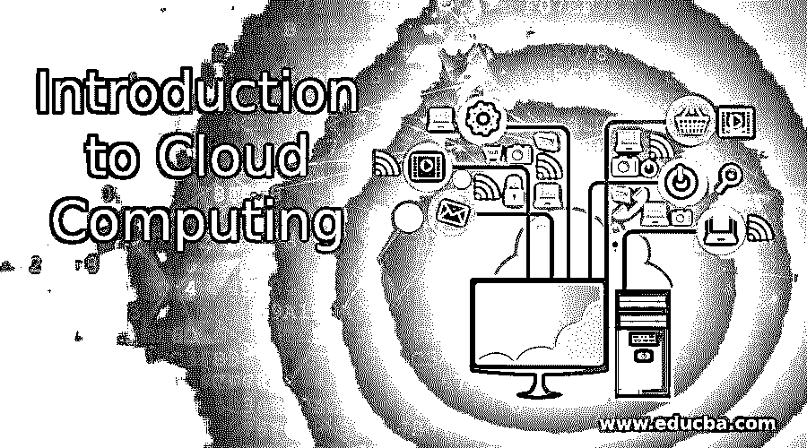
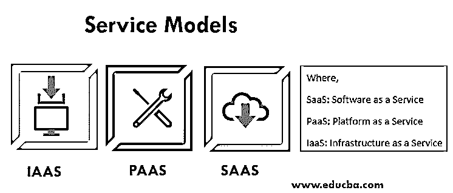
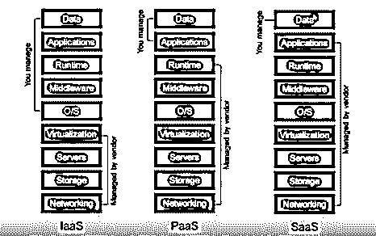
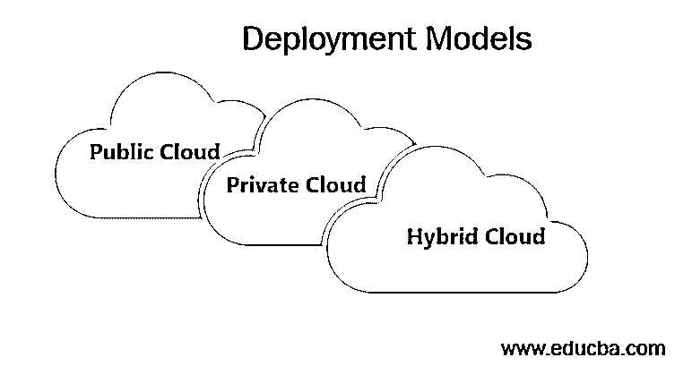
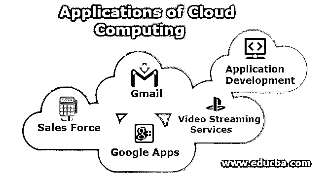
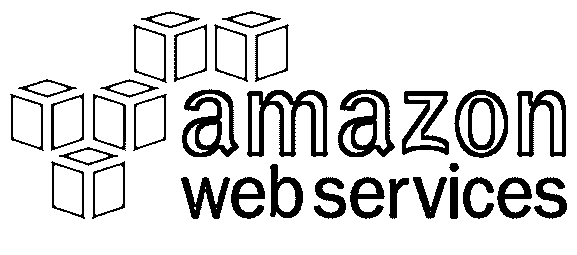
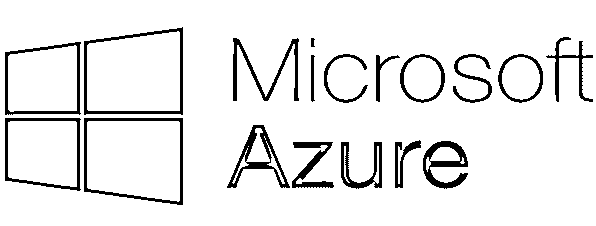
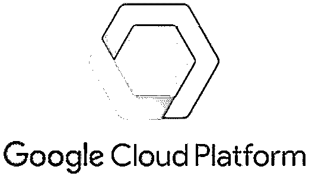

# 云计算简介

> 原文：<https://www.educba.com/introduction-to-cloud-computing/>

## 云计算概述

下面的文章提供了云计算简介的大纲。[云计算](https://www.educba.com/what-is-cloud-computing/)是一种访问计算和存储系统的方式，无需实际拥有和主动管理资源。在当今世界，添加和存储需求是非常动态的；购买、维护和升级系统需要投入大量的时间和金钱。像 AWS(亚马逊网络服务)、微软 Azure 和[谷歌云平台(GCP)这样的公司按需提供](https://www.educba.com/what-is-google-cloud-platform/)计算和存储服务器，并对你使用的内容收费。这些云服务可用于托管静态网站、电子商务商店、公司内部数据等。事实证明，这对于计算资源主要随时间变化的初创公司非常有用。

云计算可以按照以下模型进行分类:

<small>Hadoop、数据科学、统计学&其他</small>

*   服务模式
*   部署模型

### 服务模式

[服务模型](https://www.educba.com/cloud-service-models/)根据提供给最终用户的抽象进行分类。

#### 1.SaaS(软件即服务)

在基于 SaaS 的模式中，云服务提供商，即用户，只需要上传和下载数据。维护、停机、升级和安全性都由服务提供商负责。

#### 2.平台即服务

在 PaaS 中，用户管理应用程序和数据。用户通常希望通过云来启动和维护他们的应用程序，这时 PaaS 就出现了。服务提供商满足所有硬件、网络和操作系统需求。用户可以使用任何选择的编程语言。PaaS 服务比 SaaS 便宜。

#### 3.IaaS(基础设施即服务)

在基于 IaaS 的服务硬件中，供应商提供虚拟化和网络服务，而用户负责操作系统、应用程序和数据。

为了在不同的服务模型之间给出一个简单的类比，我们可以举一个比萨饼订单的例子。SaaS 类似于在家订披萨；在 PaaS，你去餐馆吃饭，而在 IaaS，你用面包和酱料自己做披萨。

### 部署模型

下面是三种部署模式:公共云、私有云、混合云。

#### 1.公共云

*   服务提供商通过互联网向公众提供计算、存储和应用程序等资源。
*   任何用户都可以登录并使用这些服务。
*   你为你使用的资源数量付费。
*   用户对其数据的控制力较弱。

#### 2.私有云

*   该供应商通过防火墙安全为更少的用户提供托管服务。
*   私有云最大限度地减少了安全问题。
*   它提供了对数据更好的控制。
*   组织通常使用它们来关注数据安全。

#### 3.混合云

*   [混合云计算](https://www.educba.com/what-is-hybrid-cloud/)顾名思义，使用私有和公有云服务的组合。某些服务由私有云托管，而其他服务则由公共云托管。
*   借助混合云服务，企业可以将关键数据保存在私有空间，将其他数据保存在公共空间，从而充分利用这两个领域的优势。

### 云计算的应用

以下是云计算的应用:

*   **SalesForce:** 销售人员在云基础设施上提供 CRM ( [)服务和 EPR(企业资源规划)](https://www.educba.com/customer-relationship-management-tools/)[，并按使用量收费。该软件由 Salesforce 开发和维护，并为高级用户提供附加服务。](https://www.educba.com/cloud-infrastructure/)
*   Gmail: 我们知道 Gmail 用于个人邮件。但 Gmail 也为企业提供其基础设施，包括带有附加功能的商务电子邮件 id。
*   Google Apps: 像 Google Sheets 和 Google Drive 这样的应用程序允许普通大众使用云存储和计算。
*   **视频流媒体服务:**一些流媒体服务，如网飞、亚马逊 Prime 和 Hotstar，依靠云计算存储将个性化数据同时传输给数十亿用户。
*   随着越来越多的公司通过移动应用程序提供服务，像 Zoho Apps 这样的公司允许用户在云上创建应用程序并进行修改。Wix 和 WordPress 为网站创建和[托管](https://www.educba.com/what-is-hosting/)提供相同的服务。

### 云计算的优势和劣势

下面给出了云计算的优点和缺点:

#### 优势:

*   无需购买大量服务器，从而避免高额资本支出。
*   易于扩展:随着需求的变化，服务器的数量可以很容易地改变。
*   随着生成的数据越来越多，可以进行资源调配来刷新旧数据或动态添加额外空间。
*   服务器的监控和维护由供应商负责。
*   由于资源在不同用户之间共享，环境受益。

#### 缺点:

*   对于少数大型企业来说，云计算可能成本高昂，因为每小时都会产生大量数据；拥有和维护计算和存储资源是有意义的。
*   对于某些应用程序，互联网带宽可能是一个瓶颈，用户的请求和传输可能需要很长时间才能在线。
*   应用程序的定制是有限的；基于云的应用程序可能无法完全满足您的需求。
*   如果供应商停止服务，一些用户会受到影响，不得不寻找替代方案。

### 云服务提供商

以下是主要的云服务提供商亚马逊网络服务(AWS)、微软 Azure、谷歌云平台(GCP)、IBM Cloud、数字海洋

#### 1.亚马逊网络服务(AWS)

在云提供商中，AWS 以最大的计算能力引领市场。它允许用户试用云服务的基本版本一年。用户可以安装 Windows 或 Linux 操作系统。AWS 服务用于各种任务，从网站托管、电子商务商店到机器学习模型。像网飞、Quora 等大公司。，依赖 AWS 提供服务。AWS 按小时收费。

#### 2.微软 Azure

Azure 是用于设计和管理云服务的 AWS 的竞争对手。它允许使用各种编程语言、操作系统、数据库等。，并向新用户提供 30 天免费试用。

#### 

3。谷歌云平台(GCP)

GCP 使用谷歌数据中心提供服务，如虚拟机，存储和众多的应用程序。它还可以与实时数据集成，提供仪表板功能。新用户使用 GCP 服务可以获得一定数量的信用额度。与 AWS 不同，它是按秒计费的。因此，如果你使用这项服务 5 分钟，你不需要支付整个小时的费用。

### 推荐文章

这是云计算入门指南。在这里，我们讨论了云计算的服务和部署模型、应用程序和各种其他服务提供商，以及优缺点。您也可以阅读以下文章，了解更多信息——

1.  [云服务](https://www.educba.com/cloud-services/)
2.  [云计算和 Hadoop](https://www.educba.com/cloud-computing-vs-hadoop/)
3.  [什么是云计算中的虚拟化](https://www.educba.com/what-is-virtualization-in-cloud-computing/)
4.  [免费云计算](https://www.educba.com/free-cloud-computing/)

