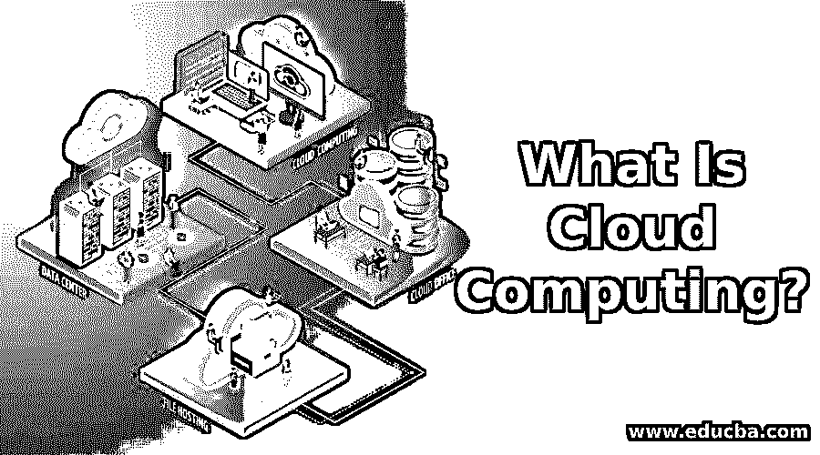

# 什么是云计算？

> 原文：<https://www.educba.com/what-is-cloud-computing/>

## 云计算简介

现在大家好像都在讨论“什么是云计算。”如今，我们越来越多地看到技术向云转移。在过去的 10 年里，人们已经逐渐从传统的存储软件转向互联网。但这是什么呢？云计算提供不同的设施和便利，如数据库、服务器、存储、应用程序等。，通过互联网。例如，云计算不是将数据存储在本地硬盘上，而是帮助我们在远程数据库上存储和保存数据。假设我们使用的设备可以访问互联网，它也可以访问数据。

基本上，云计算在某种程度上是外包计算机程序。这些计算机程序由外部方托管，位于云中。正因为如此，用户不必担心存储和电源，也可以放心地处理数据。如今，许多人出于各种原因选择云计算，包括提高生产率、更好的货币价值、时间和速度效率、安全性和性能。

<small>Hadoop、数据科学、统计学&其他</small>

### 了解云计算

传统的应用程序总是复杂而昂贵，因为运行这些应用程序所需的硬件和软件数量令人望而生畏。我们需要安装和配置、运行和测试、保护和维护这些庞大的应用程序。云计算减少了管理软件和硬件的麻烦，有助于消除存储个人数据带来的问题。我们可以向供应商支付远程存储数据的费用，供应商将只根据需要向我们收费，这使得向上或向下扩展变得容易。

云计算之所以如此命名，是因为我们试图访问的信息和数据是在云中远程发现的，而云只不过是虚拟空间。云用户可以在远程服务器上存储文件、数据和应用程序，并借助互联网访问这些数据。这有助于用户不必在一个精确的位置获取对数据的访问，并且可以从任何地方检索数据。云计算减少了大量数据的处理，让计算机来完成所有的工作。

在云计算领域，我们有公共和私有服务。公共云服务是通过互联网收费提供的，而私有云服务只提供给特定的人群。我们还有第三个选项，称为混合选项，它结合了两种服务的元素。

借助云计算服务，我们可以实现各种功能，例如:

*   电子邮件
*   存储、备份和数据恢复
*   审查数据
*   构建和测试应用程序
*   按需提供软件
*   音频和视频流
*   云计算的运作

云计算使得在互联网上使用服务器、数据库、存储和各种应用程序变得很容易。云平台拥有并维护连接到这些服务所必需的网络的硬件，而我们在 web 应用程序的[帮助下使用任何我们需要的东西。这个应用程序通常是一个用户友好的仪表板，帮助用户管理他们的帐户。](https://www.educba.com/what-is-web-application/)

### 云计算部署

单一类型的云计算可能不适合所有类型的业务。这就是为什么有许多不同的云，每一种都提供不同类型的部署和服务，以帮助为我们提供满足我们需求的精确解决方案。

有三种云部署或[云计算架构](https://www.educba.com/cloud-computing-architecture/)可供选择来实施我们的云服务。我们可以在公共、私有或混合云上部署这些服务。

#### 1.公共云

公共云由第三方云服务提供商拥有和维护，他们通过互联网提供服务器、数据库和存储等资源。微软 Azure 和 Salesforce 就是公共云的例子。通过公共云，所有基础架构都由第三方云提供商管理。我们只是使用这些服务，并通过他们提供的网络浏览器控制我们的账户。

#### 2.私有云

私有云意味着云计算资源完全由一个实体使用，无论是企业还是组织。物理上，私有云通常位于公司站点。或者，一些公司让第三方服务提供商托管他们的私有云。私有云使用的网络是负责其服务和基础设施的私有网络。

#### 3.混合云

混合云使用来自公共云和私有云的元素，并将它们结合在一起，通过技术将它们绑定在一起，从而允许共享它们的数据和应用程序。通过同意数据和应用程序在公共云和私有云之间传输，混合云提供了更大的灵活性，从而有助于优化现有的基础架构。

### 云计算服务

现在我们已经看到了云计算可以提供的部署类型，让我们看看我们可以拥有的云服务类型。云计算服务主要有基础设施即服务(IaaS)、平台即服务(PaaS)、软件即服务(SaaS)和无服务器。云服务有时也被称为云计算堆栈，因为它们形成于彼此之上。如果我们知道这些服务的含义以及它们之间的区别，那么我们就能更容易地完成我们的使命。

#### 1.基础设施即服务(IaaS)

基础设施即服务(IaaS)属于最简单的一种云计算服务。在 IaaS 中，我们租用我们需要的 IT 基础架构，如服务器、数据库、存储等。，来自云提供商。我们以现收现付的方式提供这项服务。它提供按需服务，并包含一种通过基于 IP 的连接将一切从操作系统交付到服务器的方法。用户不需要购买任何基础设施，而是按需获取这些资源。IaaS 的几个例子包括微软 Azure 和 IBM Cloud。

#### 2.平台即服务(PaaS)

平台即服务(PaaS)是一种云计算服务，它按需提供平台或环境来开发、测试和管理软件应用程序。它旨在使开发人员更容易、更快速地创建应用程序，而不必担心处理开发所需的数据库、服务器和存储的基础结构。这是最复杂的云服务之一。PaaS 的几个例子是 Heroku 和 Force.com。

PaaS 与 SaaS 有一些相似之处，主要区别在于它不是在线交付软件，而是一个创建通过互联网交付软件的平台。

#### 3.软件即服务(SaaS)

软件即服务(SaaS)是一种云计算服务，我们在订阅和需求的基础上通过互联网向用户提供软件应用程序。在这项服务中，第三方[云提供商拥有](https://www.educba.com/top-cloud-providers/)并维护软件应用程序和所需的任何基础设施。他们还处理安全补丁和软件更新等问题。在网络浏览器的帮助下，用户可以很容易地通过互联网连接到应用程序。

#### 4.无服务器计算

无服务器计算专注于构建应用程序的功能，而不会浪费时间持续管理基础架构和服务器。基础设施的硬件和设置由云提供商管理。这种体系结构是高度可伸缩的，仅在精确的功能发生时才使用资源。

### 云计算的使用

我们在日常生活中使用云计算，却没有意识到这一点。通过在线服务提供商发送电子邮件，听音乐，玩游戏，甚至只是在我们的手机上存储图片和文件所有这些都可能使用云计算。

让我们看看使用云计算可以做些什么。

*   **创建新应用:**云计算帮助我们在任何平台上快速构建和部署 web 和移动应用。[云计算服务帮助](https://www.educba.com/cloud-computing-service-providers/)我们获取满足应用需求所需的资源。
*   **存储、备份或检索数据:**云计算通过互联网将数据高效地移动到远程云存储系统，从而帮助保护我们的数据。这可以在大范围内实现，并且可以从任何地方和任何设备访问这些数据。
*   **分析数据:**通过使用[机器学习和人工智能](https://www.educba.com/machine-learning-vs-artificial-intelligence/)帮助我们发现愿景和见解，它有助于在团队和地点之间统一我们的数据。这有助于我们做出明智的决定。
*   **流媒体:**它帮助我们使用任何具有音频和视频分发功能的设备，随时随地与人联系。
*   **嵌入智能:**它通过使用智能模型帮助我们吸引客户。这有助于我们从获取的数据中获得有价值的信息。
*   **按需交付软件:**这有助于您掌握最新的技术和更新，而无需购买。

### 云计算的优势

*   对于几乎任何类型的应用程序功能，用户都可以很容易地按需获得资源；因此，IT 管理员不需要提供资源。
*   组织可以随着需求的增加而扩大规模，随着需求的减少而缩小规模。这降低了基础设施的投资成本。
*   它允许用户只为他们正在使用的资源和基础设施付费。
*   在云计算的帮助下，组织可以根据自己的预算，在需要时轻松地将应用程序的某些领域从云来回转移到另一个平台，或者用最新的技术更新自己。
*   它使得开发适应性强、易于定制的应用程序变得更加容易，同时允许用户完全控制代码。
*   云服务提供了一次向众多客户使用修改后的应用程序的机会。
*   由于是由第三方托管，企业更有可靠性。如果出现任何问题，他们可以很容易地联系客户支持。
*   这有助于我们节省大量基础设施投资。
*   在云计算的帮助下，我们只需点击几下鼠标，就可以轻松地在全球范围内部署我们的应用程序。

### 技能

随着越来越多的企业接受和实践云计算，对云技能的需求也在逐步增加。

有了下面的技能，我们可以期待在云计算中高飞。

#### 1.机器学习和人工智能

所有主要的云计算供应商都在提供越来越多的服务，允许组织在他们的应用程序中使用机器学习和人工智能。这些工具配置起来很简单，网上也有很多教程可供学习。然而，要真正理解这些技术，我们需要具备[强大的数据科学技能](https://www.educba.com/data-science-skills/)。

#### 2.云安全

安全性对每个企业都至关重要。对于打算主修[云安全技能](https://www.educba.com/cloud-security-tools/)的专业人士来说，有各种标准资格可供选择，其中 CCSP(认证云安全专家)是最受欢迎的资格。CCSP 建立在[对 CISSP 认证](https://www.educba.com/cissp-study-guide/)的理解之上。

#### 3.自动化

Jenkins、Chef 和 Terraform 都是流行的工具，有助于在各种平台中实现自动化。个人应该把这些技能放进自己的口袋里。

#### 4.无服务器架构

专业人士可以开始在线学习无服务器应用程序开发，但是要这样做，首先需要选择一个平台。例如，如果我们选择 AWS，那么我们可以从 Lambda 教程和网络研讨会开始。开始云计算职业生涯的关键是获得跨平台技能。除了其他认证之外，我们应该专注于拓宽我们的技能组合，以包含来自 [Google Cloud 和 AWS](https://www.educba.com/google-cloud-vs-aws/) 的认证。

### 范围和职业发展

*   它正在成为当今 It 世界的一个重要元素。大型企业和小型组织都在其能力范围内部署了云。如果 IT 专业人员知道如何使用“云”，他们就会被聘用。
*   有志投身云计算的人可以选择多种职业道路，例如云工程师、架构师、开发人员和安全专家。与其他 IT 工作相比，云计算领域的工作薪水相当高。即使是入门级的工作也有相当不错的薪水，这使得该部门非常有生产力。
*   它变得越来越流行，许多公司正在将他们的系统转移到云计算。它只有大约十年的历史，由于它在开发应用程序方面的各种好处和便利性，已经有很多组织，从小型创业公司到全球巨头，都在采用它。

### 推荐文章

这是什么是云计算的指南？在这里，我们分别讨论了部署、好处、服务和技能。您也可以浏览我们推荐的其他文章，了解更多信息——

1.  [云计算职业](https://www.educba.com/career-in-cloud-computing/)
2.  [云计算是虚拟化吗？](https://www.educba.com/cloud-computing-virtualization/)
3.  [什么是 ETL 测试？](https://www.educba.com/what-is-etl-testing/)
4.  [什么是敏捷编程？](https://www.educba.com/what-is-agile-programming/)

