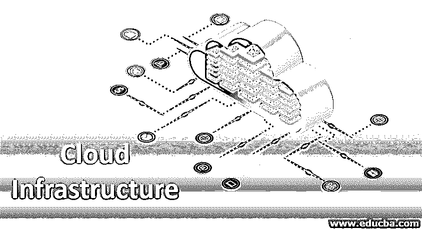
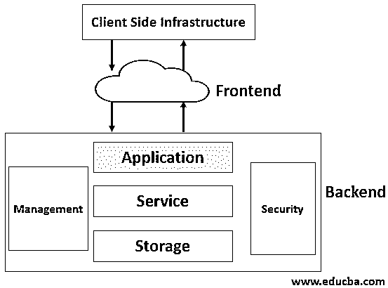

# 云基础设施

> 原文：<https://www.educba.com/cloud-infrastructure/>

## 云基础架构简介

术语“基础设施”是指平台所在的物理结构，以及可用的设施。因此，术语云基础设施指的是物理架构，即在云服务器上执行和显示活动的计算系统。它是各种硬件和软件组件的集合，这些组件根据云计算模型的要求执行特定的操作。基础设施还包括一个层和通过各种网络远程连接的各种网络应用程序，由于资源的巨大集合，这些应用程序由大型数据库维护。

### 云基础架构图

这是有助于理解流经云的基本组件的基本图表:

<small>Hadoop、数据科学、统计学&其他</small>

以下几点有助于详细理解整体架构:

云基础架构主要由两部分组成:

*   **前端侧:**即客户端，也是服务器所在的位置。
*   **后端端:**这包括所有的应用程序和存储管理。

以下是关于云基础架构图表的几点:

*   基础设施的前端，也称为客户端，主要由服务器和所有网络连接组成。这种连接是通过中间件平台和虚拟连接实现的，它们将必要的信息传递给服务器。
*   后端平台主要由主要硬件组件和应用程序堆栈组成，如交换机和路由器、存储设备、通过互联网平台直接连接的电子设备，连接通过安全介质进行，以实现[有效通信](https://www.educba.com/effective-communication/)。
*   中间件平台在从后端应用程序收集数据方面扮演着特殊的角色，并通过相同的通道提供有效的响应，以将其传递给云服务器，从而保持数据的安全性和完整性，并防止数据丢失。
*   基础设施主要由分布式文件系统形式的磁盘存储组成，有助于处理大量数据。

### 云基础架构的 9 大优势

云基础架构提供了各种优势，使我们的事情变得简单，因为它只包含一个强大的云服务器，由所有数据存储组成，而无需在不同的服务器和文件系统中存储数据。

#### 1.性价比高

首先是应用服务和硬件平台的成本，与订阅计划中运行的其他计算服务相比，其成本非常低。云计算系统的支付服务基于按使用付费，用户可以使用他们选择的服务并根据这些服务进行支付。

#### 2.增强的性能和质量

云服务器的服务可靠地以最小的工作量产生最大的输出，保持 99%的效率和改进的质量。该应用程序还为用户提供了从任何地方访问的好处。

#### 3.存储容量及其灵活性

云基础设施的增加的存储服务器为存储大块数据提供了巨大的容量，并通过根据用户需求快速响应增加的数据存储来提供存储容量的灵活性，并在完成后减小大小，从而保持成本优化。

#### 4.改进的软件更新

在云中，服务器程序保持同步，并提供最新的操作。安全更新速度更快，因为更新是自动进行的，并且定期刷新，不需要手动操作。在这样的情况下，节省了大量的手工劳动时间，节约了成本。

#### 5.高数据安全性

由于大量数据定期通过一台服务器进行同步，因此存在安全性问题。然而，云计算使事情变得更加简单和安全，因为它提供了非常先进的安全功能来维护数据保护和应用程序的安全。它提供系统的身份验证和加密数据，确保网络上的安全通信和改进的数据，消除数据泄露的头痛。

#### 6.顺畅和更好的协作

云计算帮助全球各地的用户通过安全的共享系统共享信息和想法。它有助于平滑客户服务和与不同组织的员工合作。

#### 7.改进的数据控制

有许多灾难发生在正确的数据没有被传送给正确的人的地方。现在，[云计算为](https://www.educba.com/cloud-computing-providers/)提供了一个大大增强的控制系统，帮助用户选择一个人，并为最终用户访问数据。这有助于提高对每个数据的控制级别，以便它到达需要访问该数据的正确的终端介质。

#### 8.维护和管理

云计算提供了更加高效和先进的管理服务，并提供了增强的维护，这有助于用户在不安装资源的情况下享受修改后的用户界面。

#### 9.正常运作及其可持续性

云计算只需要互联网连接，就可以通过任何网络在全球范围内连接到任何应用程序。因此，通过云进行沟通使其更加可持续和环保，因为它消除了物理产品的需求。

### 云基础设施的运行

云计算的工作原理是通过服务器进行有效的数据管理和通信。当今世界，一切都通过网络连接在一起，这使得最终用户能够通过共享服务器轻松交流和使用数据。云服务器主要工作于三种模式。

它们是:

*   **[“软件即服务”(SaaS)](https://www.educba.com/what-is-software-as-a-service-saas/) :** 客户获得平台的软件服务，并可根据使用情况灵活付费。
*   **平台即服务(PaaS):** 该模式提供了测试、维护软件并最终交付给最终用户的基本环境。
*   **基础设施即服务(IaaS):** 这种模式产生了一个完整的基础设施，其中的资源、网络和机制在构建一个庞大的组织时保持相互连接。

### 结论

云基础设施提供了更具建设性和更高级的资源利用，有助于企业在改善生产、协作和安全性、利用共享资源和保持有效通信方式方面实现长期发展。

### 推荐文章

这是云基础设施指南。在这里，我们讨论云基础架构的介绍及其优势。您也可以浏览我们推荐的其他文章，了解更多信息——

1.  [云计算架构](https://www.educba.com/cloud-computing-architecture/)
2.  [云计算 vs 网格计算](https://www.educba.com/cloud-computing-vs-grid-computing/)
3.  [云计算技术](https://www.educba.com/cloud-computing-technologies/)
4.  [数据存储设备](https://www.educba.com/data-storage-devices/)

