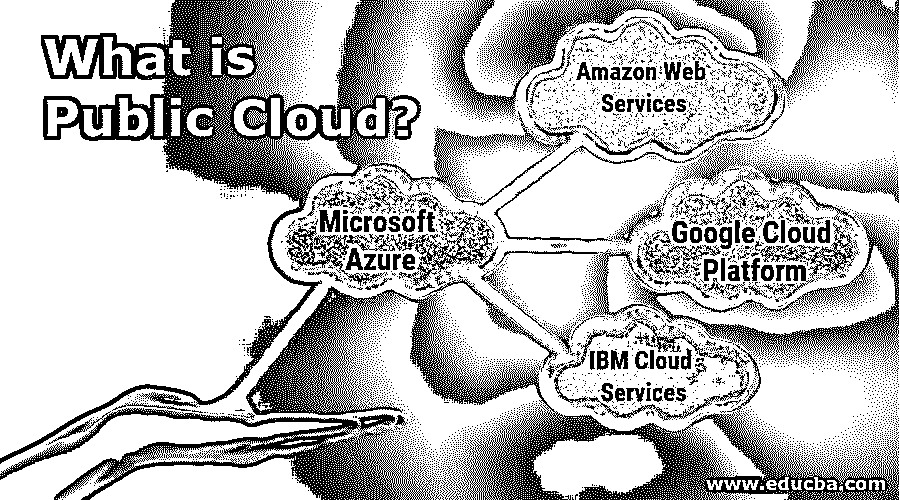
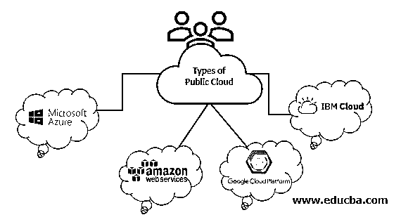

# 什么是公共云？

> 原文：<https://www.educba.com/what-is-public-cloud/>

## 公共云简介

云服务通过公共互联网提供，由第三方提供商提供，称为公共云。任何人都可以通过互联网获得它。然而，由于安全问题，公司不会通过公共云共享敏感信息。云服务总是免费提供，或者以按使用付费的方式提供给客户。公共云有许多虚拟资源，由不同的客户端自动管理。如果有需求波动，通过这些资源很容易管理。它可以用于单一应用程序开发

### 不同类型的公共云

公共云有一个独特的功能，即广泛的网络访问，在这种情况下，可以通过移动电话、个人笔记本电脑和计算机轻松访问存储和虚拟机等广泛的资源。因此，它可以在任何时候访问。资源池允许多个用户共享一个公共池，如数据库、应用程序和网页，并为客户端使用的资源或最近分配给客户端的资源提供快速的灵活性。随时都有可能扩大或缩小资源规模。

<small>Hadoop、数据科学、统计学&其他</small>

#### 1.微软 Azure

它是微软最顶级的云平台和产品之一，旨在提供可扩展的服务、应用服务、消息传递设施、数据存储服务和高效的数据库。Azure cloud 的目标是通过高效的数据存储来提供持久的服务，并帮助公司提供即时、准确的解决方案，这些解决方案包含行业每个组成部分的数据库中的可用数据。安全是最重要的事情，应该给每个客户。

不像只有大规模行业才需要保护数据。数据和服务也应该受到保护，为小规模的行业，甚至为我们的手机。安全性被同等地提供给从企业到客户和企业到企业的所有用户。借助单点登录功能，所有用户都可以轻松访问它。

它跟踪用户的数据及其访问状态，并与包含所有用户、管理员、员工和客户详细信息的数据库进行交叉检查。因此，如果有一个漏洞，任何黑客都可以进入，它会生成警报并发送警报，以防止数据快照或数据丢失。它更具有位置特异性，并可控制其所有集成设备。

#### 2.亚马逊网络服务

它使用户能够在网络空间中托管和管理服务。一些受尊敬的组织使用 AWS 来构建、托管、管理和组织公司的基础设施。在这里，云平台为用户提供了许多好处:基于云的数据存储、应用程序传输和管理存储。

#### 3.谷歌云平台

它是一个流行的云平台，提供文档辅助数据库、云计算和弹性数据库。它是支持机器智能、[谷歌分析](https://www.educba.com/what-is-google-analytics/)等的第三大云平台。该软件有助于训练系统的用户。这些元素包括 Google 云平台控制台、云和 REST API。谷歌云帮助分析、训练和修改用户的系统。

开发和设计的系统部署在用户基础设施中。用户将收到预测，对预测的监控将能够管理用户设计及其相关版本。Google Cloud ML 有三个组件，包括 Google Cloud 平台控制台、Gcloud 和 Rest API，用于设计、分析和部署用户界面。它提供稳定和坚实的支持。

#### 4.IBM 云服务

它就像一个 Q 和一个会话，在 Apache Hadoop 的框架下为 SUSE Linux 服务器提供服务。如果用户用 Watson 设计他的系统，就有可能从那个设备获得高度的理解和高效的输出。它从细小的信息中收集知识，对于应用程序开发，它使用 API。这是一个强大的系统，使更聪明的业务。

### 公共云的结构

基本结构如下所示:

#### 1.基础设施即服务(IaaS)

云计算提供商虚拟和物理计算机。虚拟机由虚拟机管理程序访问，这些虚拟机管理程序被分组到池中，并由运营支持网络控制。云计算介绍了虚拟机和应用程序设计上的工作框架图。IaaS 提供 IP 地址、防火墙、监控服务、存储、带宽、虚拟机等资源；所有这些都向客户开放，按时间收费。

**例子:** Windows Azure，谷歌计算引擎，亚马逊 EC2，Rackspace

#### 2.平台即服务(PaaS)

它是向开发人员交付应用程序开发和部署平台即服务的一部分，开发人员可以利用该平台有效地构建、部署和管理 SaaS 应用程序。PaaS 的主要元素是指向和点击设备，使程序员能够制作基于 web 的应用程序。

**例子:**Force.com，谷歌，Apache StratosApp，Engine，Windows Azure，AWS Elastic Beanstalk。

#### 3.软件即服务(SaaS)

它是通过浏览器在网络上将应用程序传输给最终用户。云客户端安装它，他们可以让它们在云基础设施上运行。但是对于这个过程来说，这不是强制性的，因为减少了对软件维护和支持的需求。相反，他们可以使用便携的 SaaS 应用程序。比如一个办公套件。SaaS 为我们提供了应用编程接口(API ),允许开发者构建定制的应用。

**举例:**谷歌应用程序，微软 Office 365

### 云的示例

相关的例子解释如下:

*   广泛使用的公共云的几个例子是云存储服务、在线软件应用、基于云的开发和部署环境、web 托管和云托管。需要最低水平的基础架构和安全性的用户更喜欢公共云。业务人员有效地使用云进行他们的操作，例如非机密数据和在线文档的协作。
*   这是许多组织对其快速和安全的传送、快速处理、无任何损失的可靠数据传输、便于携带的设置的需求。偏好公共云的受益公司包括 web 服务提供商、电子商务、云服务提供商、网络运营商、云服务提供商。它允许用户根据基于云的服务的需求来开发他们的网络。
*   一个可靠的云网络可以为分布在全球的服务器提供高端监控，控制互连服务器之间的流量，通过高级网络安全保护系统，并通过集中化管理为用户提供可见性。

### 推荐文章

这是一本关于什么是公共云的指南？在这里，我们将讨论不同类型的公共云，以及云的结构和几个示例。你也可以浏览我们推荐的其他文章来了解更多信息-

1.  [什么是云托管？](https://www.educba.com/what-is-cloud-hosting/)
2.  [云联网](https://www.educba.com/cloud-networking/)
3.  [什么是私有云？](https://www.educba.com/what-is-private-cloud/)
4.  [什么是春云？](https://www.educba.com/what-is-spring-cloud/)

