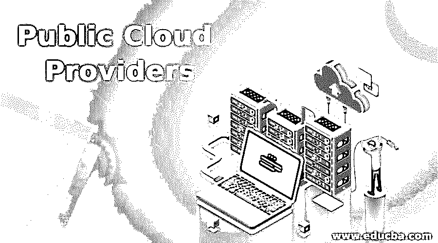
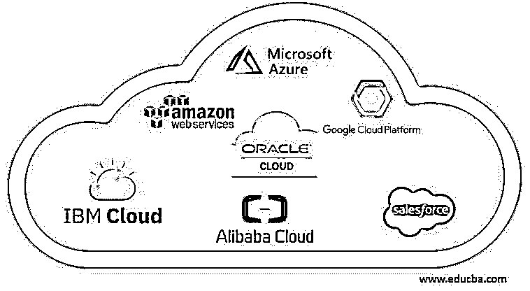

# 公共云提供商

> 原文：<https://www.educba.com/public-cloud-providers/>

## 公共云提供商简介

服务提供商，云服务通过互联网公开，以便用户可以使用提供商的存储或应用程序或各种能力来扩展资源，并在同一组织的对等方之间共享。为了降低服务器的能力，开发云中可用的数据，称为公共云提供商。

### 七大公共云提供商

下面介绍了一些公共云提供商:

<small>Hadoop、数据科学、统计学&其他</small>

#### 1.亚马逊网络服务

亚马逊网络服务(Amazon Web Services)是亚马逊在现收现付服务的基础上为企业和个人提供的云服务。它将基础设施、平台和软件作为服务提供给用户。AWS 已经成为公共云提供商的代名词，因为该平台在全球范围内提供各种服务。AWS 提供 EC2、冰川、S3 等三款主要产品。EC2 向用户提供虚拟机服务，而 Glacier 是低成本的云存储服务。S3 用于亚马逊存储系统。数据库存储和计算能力及其快速交付使 AWS 在公共云用户中很受欢迎。任何企业都可以很容易地适应 AWS，这是一个优势以及它的可扩展性。

#### 2.微软 Azure

Azure 是 AWS 的最佳竞争对手，它有各种各样的服务和不同的实现方式。数据中心由微软管理，它帮助部署、管理、构建和测试有利于用户的应用程序。它还拥有类似于 AWS 的基础架构、平台和软件即服务，并提供分析、虚拟计算、网络和存储方面的服务。除了运行应用程序之外，它还有助于升级应用程序并将应用程序改进到最大能力。服务可以根据需要扩大或缩小，产生的费用也取决于您使用的服务。它是唯一一个不需要编程语言知识就可以学习的云计算平台。

#### 3.谷歌云平台

科技巨头之间提供云平台的竞争对用户来说是一种好处，因为用户可以了解各种云服务平台，并可以使用更适合需求的平台。GCP 使用与谷歌相同的基础设施，可以接触到全球用户。借助安装在服务中的数据中心和分析工具，可以在 GCP 构建和运行该应用程序。在平台中管理成本，并且可以有效地管理数据存储。除了云管理，网络、人工智能和安全是 GCP 提供的其他服务。任何数据集，无论是结构化的还是非结构化的，都可以在这个平台上进行管理。它使用基础设施即服务，并与 Linux 操作系统集成，以整合脚本和管理云操作服务，并将其提供给用户。如果用户在服务中有任何基于 SQL 或基于 Microsoft 的单元，这些单元不能在 GCP 使用。这仍然是该平台无法超越其他云服务的一个劣势。

其他公共云提供商在用户中并不突出，但仍有一小部分人在使用。下面将对它们进行讨论。

#### 4.甲骨文云

oracle 公司提供云服务来构建、测试和部署应用程序，以便全球的 Oracle 用户可以使用服务器和应用程序，这种云服务称为 Oracle 云。虽然不是用户喜欢的常见云服务，但它的基础设施和平台服务通过其网络和存储服务取悦了用户。高容量应用程序可以很容易地在云服务中使用，并且可以很容易地定制，以便其他应用程序可以很好地与 Oracle 应用程序一起使用。Oracle 提供的数据库是 SQL，它有大量的用户。将数据从 SQL 转移到 oracle cloud 并不是一个很大的挑战。此外，甲骨文还免费向用户提供从云中转移数据的服务。它只向客户收取对象存储服务的费用。云 ERP 不同于其他云服务，改进云 ERP 可以将 Oracle 云带到云提供商的前沿。

#### 5.IBM 云

IBM 公司提供的云服务称为 IBM cloud，向用户提供平台即服务和基础设施即服务。用户可以部署和使用虚拟资源，这使得存储和网络易于访问。即使对于更高的工作负载，云服务也是可靠的，这使得 IBM cloud 成为众多云服务中的佼佼者。IBM 使用敏捷方法，这样数据从一个平台到另一个平台的传输会更快。IBM cloud 中使用了一些开源技术来实现 DevOps 操作。

#### 6.阿里云

由阿里巴巴提供的阿里云是一个可靠的服务提供商，将不同的服务与安全技术集成在一起。数据存储、大数据处理和关系数据库是这项云服务提供的主要服务。SQL 是阿里巴巴使用的数据库。可扩展性、可用性和效率是阿里云的主要优势。借助阿里云服务，以低廉的价格轻松完成数字化转型。数据管理和云计算是以低成本来吸引用户的。

#### 7.Salesforce 云

一个支持客户关系管理以便更专注于销售和营销的云平台被称为 salesforce cloud。这个云平台支持企业对企业和企业对客户的环境。所有基于销售的应用都在这个云平台上提供。额外的功能需要额外付费，这有助于云服务在销售市场上发展壮大。

### 结论

使用云服务时，成本是主要关注点，便利性紧随成本之后。在这种情况下，所有的云提供商都是按照市场价值和他们为用户提供的便利的顺序来讨论的。一些云服务在用户的控制之下，而另一些则不是。很容易从列出的不同供应商中选择所需的产品。

### 推荐文章

这是公共云提供商指南。在这里，我们还将讨论简介和前 7 大公共云提供商及其解释。您也可以看看以下文章，了解更多信息–

1.  [巨型云存储](https://www.educba.com/mega-cloud-storage/)
2.  [云 vs 数据中心](https://www.educba.com/cloud-vs-data-center/)
3.  [虚拟私有云](https://www.educba.com/virtual-private-cloud/)
4.  [谷歌云服务](https://www.educba.com/google-cloud-services/)

