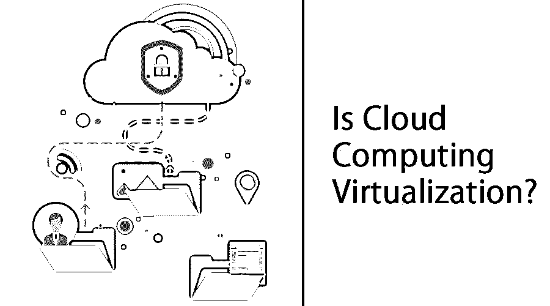

# 云计算是虚拟化吗？

> 原文：<https://www.educba.com/cloud-computing-virtualization/>

## 云计算是虚拟化吗？

云计算是通过互联网使用共享计算资源、数据或软件的服务交付模式。云计算技术基于三个因素——网格计算、实用计算和自动计算。云计算是用来提供软件的托管和交付方法。虚拟化是创建某个事物的虚拟(而非实际)版本，如服务器、台式机、存储设备、操作系统或网络资源。它是创建类似计算机硬件的虚拟版本的过程。虚拟机提供了一个与底层硬件逻辑分离的环境。云计算和虚拟化是两个经常看起来兼容的术语。虽然这两种技术看似相似，但它们不是一回事。他们的差异会极大地影响你的商业决策。

### 云计算

另一方面，云计算是一种特殊的 IT 设置，涉及多台计算机或硬件通过无线或 IP 连接的网络发送数据。在大多数情况下，云计算环境包括通过一种有点抽象的网络轨迹(称为“云”)将输入的数据发送到远程位置。所有的数据都存储在服务器上，在世界任何地方都可以通过互联网进行简单的认证。苹果、亚马逊、谷歌、微软等。是最大的云服务提供商提供非常大的存储给它的用户，使工作更容易。

<small>Hadoop、数据科学、统计学&其他</small>

### 虚拟化

虚拟化是一种将功能与硬件分离的技术，而云依赖于这种分离。虚拟化是云计算的平台[或者说虚拟化](https://www.educba.com/what-is-virtualization-in-cloud-computing/)是云计算的基础。虚拟化是面向云计算的基础技术。

虚拟化将计算框架与物理环境分开。虚拟化帮助您在同一系统上运行不同的操作系统和应用程序。虚拟化是一种允许您从单个物理硬件系统创建多个模拟环境或专用资源的技术。通过虚拟化，我们计划进行服务器整合，通过这种方式维护多台具有不同功能的服务器。[服务器虚拟化允许](https://www.educba.com/server-virtualization/)您拆分资源，以平衡单个服务器的负载，实现多种用途。虚拟化软件允许您分配单台物理服务器的资源，以创建多个独立的虚拟环境。

### 云计算能取代虚拟化吗？

它在云计算技术中起着非常重要的作用。虚拟化改变了硬件和软件的关系。虚拟化是云计算的基本要素之一。云计算和虚拟化共同提供不同的产品。虚拟化帮助云计算技术利用云计算的全部功能。云提供虚拟化产品作为其服务的一部分。不同之处在于，真正的云提供自助服务功能、弹性、自动化管理、可扩展性和随用随付服务，这些都不是该技术所固有的。虚拟化是云的产物。不，云计算不会取代虚拟化。

### 云计算和虚拟化的区别

1.  软件需要多个虚拟机的专用硬件，而云计算指的是由这种操作产生的服务。
2.  虚拟化是云计算的主要元素，它有助于实现[云计算](https://www.educba.com/free-cloud-computing/)的价值。
3.  它限制了虚拟机配置的可扩展性，而云计算可以根据您的意愿进行扩展。
4.  虚拟化是软件即服务，而云计算是基础设施即服务。
5.  它让你在一台服务器或一台计算机上安装多个操作系统，而云计算让大量用户通过同一条链路访问网络。
6.  它不依赖于云计算，而我们需要云计算的虚拟化。
7.  它是基于图像的，而云计算是基于模板的。

### 虚拟化的类型

下面提到了不同类型的虚拟化。

**1。硬件虚拟化:**硬件虚拟化是虚拟机软件直接安装在硬件上的状态。它用于服务器平台控制虚拟机。您可以在硬件虚拟化的基础上使用不同的操作系统和应用程序。

**2。服务器虚拟化:**服务器虚拟化是虚拟机软件直接安装在服务器上的状态。它用于服务器平衡，以平衡负载。

**3。操作系统虚拟化:**操作系统虚拟化是在主机操作系统上安装操作系统的状态。它用于测试不同操作系统平台上的应用程序。

**4。存储虚拟化:** [存储虚拟化](https://www.educba.com/storage-virtualization/)是对多个网络存储设备进行物理存储的分组，以维护单个存储设备的状态。它主要用于备份和恢复目的。

### 云的类型

以下是不同类型的云部署模式:

**1。私有云:**私有云是指[仅由一个客户或组织使用云基础设施](https://www.educba.com/cloud-infrastructure/)。使用私有云时，安全级别最高。这个版本的云只由某些人控制。

**2。公有云:**公有云意味着只在云计算的前提下使用云基础设施。客户对基础架构没有物理控制权。使用公共云时，安全级别存在风险。

**3。混合云:**混合云意味着您可以根据目的使用私有和公共服务。您可以在公共云中使用客户登录，在私有云中保护重要数据。

**4。社区云:**社区云是指组织之间共享基础设施，以共享数据和数据管理问题。

### 结论

虚拟化让您可以轻松外包硬件，并消除与其运营相关的任何能源成本。请记住，虚拟化是一种技术，而云计算是一种服务，

云可以作为服务提供商用于公共领域，而虚拟化可以由 IT 公司用于经济高效的数据中心设置。如果您在 Mac 上完成大部分工作，但使用 PC 专用的应用程序，您可以在虚拟机上运行 Windows 来访问这些应用程序，而无需切换电脑。您可以根据自己的目的在虚拟化和云计算之间进行选择。

### 推荐文章

这是云计算虚拟化的指南？.这里，我们讨论了云和虚拟化类型的基本概念。您也可以看看以下文章——

1.  [SQL 是微软吗？](https://www.educba.com/is-sql-microsoft/)
2.  卡桑德拉是 NoSQL 吗？
3.  [大数据是数据库吗？](https://www.educba.com/is-big-data-a-database/)

