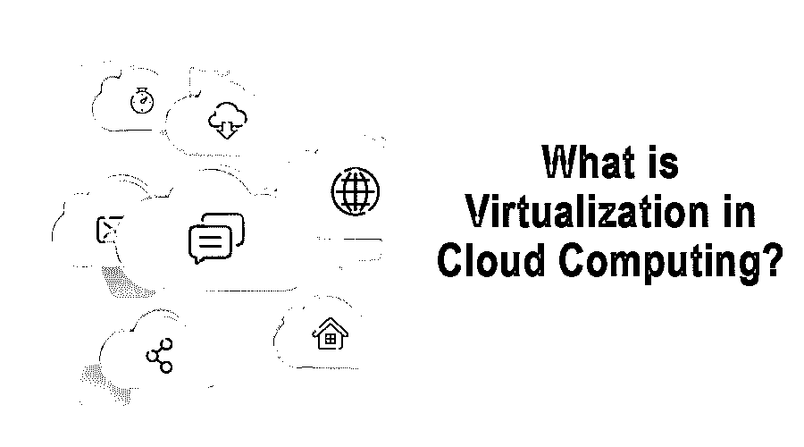
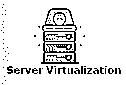
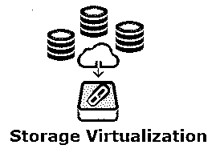
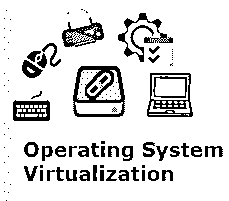
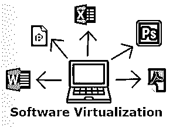

# 什么是云计算中的虚拟化？

> 原文：<https://www.educba.com/what-is-virtualization-in-cloud-computing/>

## 云计算中的虚拟化概述

我们来解读一下什么是云计算中的虚拟化？

在计算或云计算领域，虚拟化指的是从单个同类资源中创建虚拟资源(如虚拟服务器、虚拟存储设备、虚拟网络交换机甚至虚拟操作系统)，这些资源表现为几个单独的孤立资源或环境，用户可以将它们作为单独的物理资源使用。

<small>Hadoop、数据科学、统计学&其他</small>

不同的虚拟机可以运行不同的操作系统和多个应用程序，这些应用程序共享它们下面的单个物理计算机。由于虚拟化隔离了所有其他虚拟机，因此如果一台虚拟机崩溃，其他虚拟机不会受到影响。

用于虚拟化的软件[被称为管理程序](https://www.educba.com/what-is-hypervisor/)。它只负责将硬件从操作系统中分离出来，并分配必要的资源，如处理器、内存、存储等。，针对每个启动的虚拟资源。有两种类型的虚拟机管理程序，即第 1 类虚拟机管理程序和第 2 类虚拟机管理程序。前者安装在裸机上或直接安装在机器顶部，而后者本身作为操作系统的[，而后者安装在主机上的操作系统之上。](https://www.educba.com/features-of-operating-system/)

### 什么是云计算中的虚拟化？

*   我们都知道这种云计算模式是如何工作的。云供应商将拥有在其环境中运行的所有物理资源，如服务器、存储设备、网络设备和应用程序/软件。这些物理资源以按使用付费的商业模式出租给客户。
*   如果云供应商开始向每个客户出租新的单独物理资源，这将是一项开销。因为在理想情况下，物理资源永远不会被完全消耗。这就是为什么虚拟化是高效利用筒仓的一种很酷的方法(筒仓是用于批量组件的存储系统)。例如，云供应商可以虚拟化其单个大型服务器，以便为多个客户提供较小规格的服务器。

### 虚拟化在云计算中的作用

*   如果你看看云计算的[优势，比如易于扩展、安全性、流动或灵活的资源等。，这些都是通过虚拟化实现的。如果需要另一台服务器，虚拟服务器将被快速创建，并且我们将准备一台新的服务器。当我们需要额外的内存时，我们扩展已经在使用的虚拟服务器配置，现在我们有了所需的额外内存。](https://www.educba.com/advantages-of-cloud-computing/)
*   因此，虚拟化形成了云计算商业模式的核心技术。

### 云计算中的虚拟化类型

几乎每种物理资源都可以进行虚拟化，这就是以下几种可用虚拟化的原因。

1.  [服务器虚拟化](https://www.educba.com/server-virtualization/)
2.  存储虚拟化
3.  操作系统虚拟化
4.  [软件虚拟化](https://www.educba.com/virtualization-softwares/)

#### 1.服务器虚拟化

服务器虚拟化是将物理服务器划分为多个虚拟服务器，以有效利用服务器资源。服务器的虚拟化隐藏或屏蔽了处理器、操作系统、内存等服务器资源，并将用户呈现为私有虚拟服务器。这种虚拟化技术用于

*   网络服务器主要是为了降低[网络托管服务](https://www.educba.com/what-is-web-hosting/)的成本。
*   在开发和测试环境中。
*   私有云的模拟。
*   在托管具有集群架构的应用程序时。

**示例**–VMware 的 VMware vSphere suite、微软的 Hyper-V 是一些用于服务器虚拟化的虚拟机管理程序。

#### 2.存储虚拟化

*   存储[虚拟化](https://www.educba.com/storage-virtualization/)将所有存储设备汇集成一个存储设备，并将其呈现给主机。因此，通过这种方式，存储管理员将能够以更好的方式创建或设计逻辑存储单元，以便通过屏蔽 SAN ( [存储区域网络](https://www.educba.com/what-is-storage-area-network/))的复杂性来实现备份、恢复、归档和应用数据类型的存储。

**存储虚拟化的优势是—**

*   人们可以很容易地创建共享存储。
*   易于集中存储资源来屏蔽 SAN。
*   使用虚拟存储，主机故障不一定会危及数据。
*   通过存储虚拟化，可以轻松保护分区和使用存储。
*   存储虚拟化可以实现复制、重复复制、复制和灾难恢复。

**示例—**VMware 的 VMware vSAN 被广泛用作存储设备虚拟化的软件。

#### 3.操作系统虚拟化

*   操作系统虚拟化是操作系统发生分裂的类型。这是操作系统的核心，它被称为共享的内核资源，允许独立的名称空间实例与专用资源一起存在，以运行不同的应用程序。这些实例称为容器。
*   共享主机内核资源的不同风格的操作系统可以在主机上运行，应用程序作为容器在其中运行，这称为操作系统虚拟化。

**操作系统虚拟化的优势是—**

1.  这些比服务器虚拟化更快。
2.  这些是自治平台，因为它们共享主机操作系统的存储资金，并且在其中具有它们的软件和依赖库。
3.  这个容器的迁移非常容易。

**举例**–[Docker](https://www.educba.com/install-docker/)是应用最广泛的集装箱引擎。

#### 4.软件虚拟化

*   [云提供了一个服务模型](https://www.educba.com/cloud-service-models/)作为[软件即服务](https://www.educba.com/what-is-software-as-a-service-saas/) (SaaS)，其中几个客户可能希望为他们安装并运行相同软件的几个实例。软件虚拟化基本上模拟了一个完整的计算机系统，并允许另一个操作系统在其上运行。
*   比如在你本地的 windows 机器上安装一个 android studio，在里面运行 Android Oreo 版本的 OS。再举一个例子，在你的 Windows 本地机器上安装 VMware 或者 VirtualBox，在里面运行 Linux 操作系统。

**软件虚拟化的优势是—**

1.  随着虚拟化的采用，拥有的服务器和其他物理资源的数量减少了。从而降低总拥有成本(TCO)。
2.  虚拟化有助于实现云计算商业模式的承诺。
3.  借助虚拟化概念，可以更轻松地处理业务连续性和灾难管理，并且可以通过一些简单的步骤完成备份和恢复。
4.  虚拟化提高了资源消耗的效率。
5.  虚拟化还为环境提供了更好的安全性。

### 结论

从供应商和用户的角度来看，虚拟化有助于高效地使用和管理您的物理资源，并帮助无缝地运行云计算的业务模型并从中获利。

### 推荐文章

这是关于什么是云计算中的虚拟化的指南？.这里我们讨论了虚拟化的基本概念、作用、各种类型和优势。您也可以浏览我们推荐的其他文章，了解更多信息——

1.  [单片内核](https://www.educba.com/monolithic-kernel/)
2.  [云计算职业](https://www.educba.com/career-in-cloud-computing/)
3.  [云计算面试问题](https://www.educba.com/cloud-computing-interview-questions/)
4.  [什么是集群计算？](https://www.educba.com/what-is-cluster-computing/)
5.  [如何做好云计算安全工作？](https://www.educba.com/cloud-computing-security/)
6.  [虚拟化优势指南](https://www.educba.com/advantages-of-virtualization/)
7.  [关于虚拟化类型的教程](https://www.educba.com/types-of-virtualization/)

