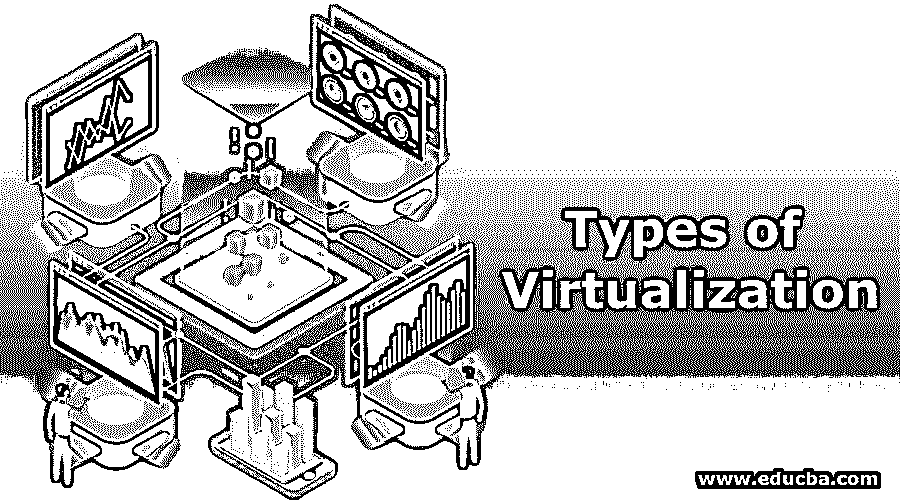
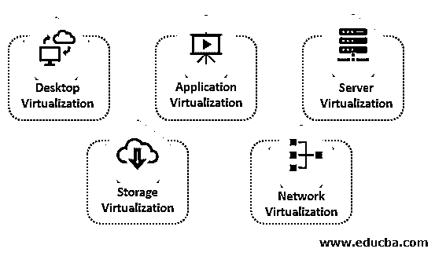

# 虚拟化的类型

> 原文：<https://www.educba.com/types-of-virtualization/>

## 虚拟化类型介绍

这种技术基本上是在软件的帮助下为用户创建一个虚拟平台，其中该平台可以被视为主系统(RAM、CPU、ROM、存储等)和辅助/虚拟系统之间的一个层，它还帮助我们访问这些主系统。正是由于这种虚拟化技术，它必须将我们引向云技术，正如我们今天所知的[云计算](https://www.educba.com/what-is-cloud-computing/)，而且虚拟化已经成为我们日常生活中不可或缺的一部分，因为我们将大部分文件存储在云中，所以我们很少使用桌面存储，它还避免了对文件被病毒破坏或系统格式化的担忧。

### 虚拟化的功能

现在，让我们以服务器虚拟化为例，看看虚拟化是如何工作的。在这种虚拟化中，我们使用一个名为虚拟机管理程序的软件层[，然后将其与我们的基础(即硬件)集成，因此对于任何来宾用户来说，看起来就像该用户正在使用实际的硬件，但反过来，他将在虚拟机管理程序上工作。这个管理程序还帮助我们在单个硬件上创建不同的系统，它们都可以在各种操作系统中并行工作。](https://www.educba.com/what-is-hypervisor/)

<small>Hadoop、数据科学、统计学&其他</small>

### 虚拟化的类型

现在，我们已经了解了什么是虚拟化及其在我们日常活动中的重要作用，让我们更深入地了解一下，看看我们可以采用哪些不同的方式/类型来实现虚拟化

#### 1.桌面虚拟化

这种类型的虚拟化也称为 VDI(虚拟桌面基础架构),在我们的操作系统中将像虚拟机一样在服务器上与其他 VD(虚拟桌面)一起运行。对于这些虚拟数据的处理，我们将在物理服务器的帮助下在数据中心进行。最终用户使用的多个应用程序和操作系统将缓存在服务器的内存中。到目前为止，几个主要的虚拟化供应商是 Citrix 和 VMware Horizon，这些供应商在虚拟机上提供非常流畅的性能，最终用户不会意识到他正在其中工作，并且它们是当前行业中广泛使用的应用程序。

#### 2.应用虚拟化

在这种类型的虚拟化中，我们使用软件将我们的应用程序制作成可以在任何地方运行的单个可执行文件，该软件将与我们的操作系统分离，我们将在沙箱中运行它。应用程序虚拟化可以进一步分为两类，它们是:

*   **远程:**在这种类型的应用程序虚拟化中，客户端将使用远程显示协议与客户端机器进行通信。这种类型的虚拟化的优势之一是，因为它被广泛使用，所以很容易为各种应用程序设置显示器。
*   **流:**这种应用程序虚拟化的美妙之处在于，我们将能够在我们的服务器上拥有应用程序的副本，并且我们可以让它们在客户端的本地系统中并行运行，因此由于这种升级，应用程序变得更加容易，因为客户端将始终指向最新版本。

Xenapp、VM Thinapp 和 Zenworks 等都是应用虚拟化的例子。

#### 3.服务器虚拟化

在这种类型的虚拟化中，我们的目标是虚拟化我们使用的服务器，也就是说，我们将在一台物理服务器上运行多个 VM(虚拟机)。这里，来自该物理服务器的资源将在所有正在使用的虚拟服务器之间共享。共享的一些资源主要是 CPU、存储、ROM 和 RAM 等，我们将在虚拟机管理程序(基础硬件和虚拟机之间的一层软件)上共享它们。这些虚拟机是相互隔离和独立的，它们完全能够在不同的机器上运行不同的操作系统。市场上一些从事服务器虚拟化的竞争供应商包括 vsphere (VMware)、Xenserver (Citrix)和 Hyper-V (Microsoft)等。

#### 4.存储虚拟化

存储虚拟化基本上是将各种设备中可用的存储组合/池化，并将其作为单个存储。通过利用软件并聚合它们以在虚拟系统/环境中使用，可以识别可用存储。实际上，该软件会持续监控来自任何虚拟/物理系统的各种 I/O 请求，并拦截这些请求，然后将其发送到适当的位置，在虚拟环境中维护组合存储。这种存储虚拟化技术实际上有助于管理员以有效和高效的方式进行任何数据恢复、备份或归档，所用时间比平时相对较少。这种虚拟化的一些优势包括:

*   即使主机出现故障，我们的数据也不容易被破坏，因为我们将数据存储在一个不同的、方便的地方。
*   当我们在存储中实现某种程度的抽象时，保护、提供和使用我们的数据是很容易的
*   附加功能，如恢复、复制、复制等。可以轻松完成

#### 5.网络虚拟化

在这里，我们将使用软件将虚拟网络与基线分离，它将执行网络的功能。在我们开始使用这种网络虚拟化之后，我们将使用物理网络来转发数据包，并且我们将使用软件来完成管理工作。我们基本上收集整个网络，在路由表的帮助下，我们将实时管理它，它们也是相互独立的。网络虚拟化的一个例子是 VPN，即虚拟专用网络，在它的帮助下，任何人都可以在互联网上虚拟地创建一个网络。如果我们为一个系统提供网络虚拟化(NV ),我们称之为内部虚拟化；如果我们将它们组合在一个虚拟网络中，我们称之为外部虚拟化。

### 结论

在本文中，我们对什么是虚拟化、它的功能和类型进行了有趣的探讨。理解我们当前的市场行业和我们的日常生活完全运行在虚拟世界中也是很重要的。所以我们有必要对它有一个好的了解。

### 推荐文章

这是虚拟化类型的指南。在这里，我们详细讨论虚拟化的介绍、功能和不同类型。您也可以阅读以下文章，了解更多信息——

1.  [云计算中的虚拟化工作](https://www.educba.com/virtualization-in-cloud-computing/)
2.  [虚拟化在云计算中的作用](https://www.educba.com/what-is-virtualization-in-cloud-computing/)
3.  [云计算是虚拟化吗？](https://www.educba.com/cloud-computing-virtualization/)
4.  什么是虚拟化？
5.  [了解虚拟化的优势](https://www.educba.com/virtualization-benefits/)
6.  [虚拟化平台|前五名](https://www.educba.com/virtualization-platforms/)

