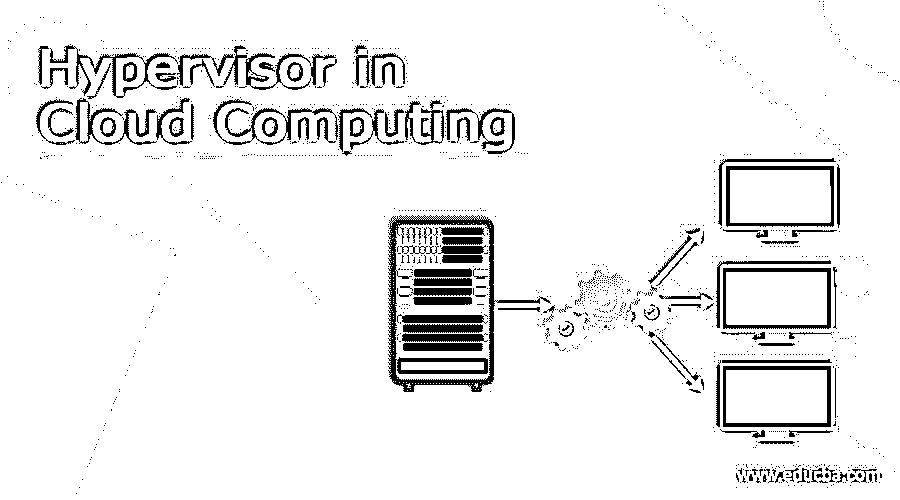

# 云计算中的虚拟机管理程序

> 原文：<https://www.educba.com/hypervisor-in-cloud-computing/>

## 云计算中虚拟机管理程序的介绍

帮助创建虚拟机的软件称为管理程序，也称为虚拟机监视器或仿真器或虚拟化器，其中虚拟平台被提供给操作系统来管理和执行虚拟机。虚拟机管理程序术语描述了它如何管理和监督所有操作系统，因此我们可以将虚拟机管理程序称为监督者的监督者，因为操作系统管理在同一操作系统上运行的每个应用程序的工作。一个系统可以控制各种虚拟机，这有助于通过虚拟机管理程序管理虚拟机的工作。

### 虚拟机管理程序在云计算中的工作

管理程序的工作方式如下:

<small>Hadoop、数据科学、统计学&其他</small>

*   我们有一台主机，其中创建了一个或多个虚拟机。这些虚拟机是在虚拟机管理程序之上创建的。虚拟机管理程序的工作是管理在主机上创建的虚拟机。虚拟机与主机没有任何连接，所有工作都是在虚拟机管理程序的帮助下自行完成的。
*   虚拟机管理程序可以是软件或硬件类型。当虚拟机管理程序管理虚拟机时，我们将虚拟机管理程序称为并行桌面，它充当主机和虚拟机之间的中介。VMware Player 也是一种软件管理程序。现在，硬件虚拟机管理程序没有任何操作系统，直接与主机系统一起工作。微软虚拟机管理程序和 Citrix XenServer 就是硬件虚拟机管理程序的例子。
*   虚拟机管理程序负责控制流入虚拟机的数据流。进入虚拟机的数据流和网络在数据中心被查看和存储。此外，虚拟机管理程序充当虚拟存储数据的存储中心。因此，虚拟机不需要物理存储。创建了一个存储池，我们可以在其中存储来自虚拟机的任意数量的数据。
*   当我们在主机系统中使用多个虚拟机时，并不需要所有虚拟机的操作系统都相同。它可以是 Windows、Linux、CentOS 或 Mac。这增加了主机系统的负担，在这种情况下，虚拟机管理程序在使虚拟机独立方面起着重要作用。不使用主机的服务器或任何硬件，并且机器不依赖于任何系统，而是虚拟机管理程序本身。这使得主机系统运行多个虚拟机，在同一个系统中运行海量数据。
*   所有的虚拟机都是相互分离的，没有一个知道其他的虚拟机。但是，如果发生任何病毒或恶意软件攻击，并且任何一个虚拟机出现故障，另一个虚拟机会正常工作，并执行分配给系统的任务。虚拟机管理程序保护虚拟机免受任何类型的攻击，无论是外部攻击还是内部攻击。
*   虚拟机管理程序可以自动进行资源分配，我们可以将我们需要的任何资源分配给操作系统。我们可以根据用户对应用程序的优先级来分配资源。资源分配可以是自动的，也可以是手动的。如果需要，用户可以定制应用程序。如果我们使用硬件类型的虚拟机管理程序，它将有助于释放服务器，从而节省成本。这也有助于释放服务器的空间。需要一名管理员来管理物理服务器并始终维护服务器。如果服务器不工作，它将影响在同一虚拟机管理程序上工作的整个系统。
*   类型 2 的管理程序被称为托管管理程序，它作为应用程序在主机系统内运行。这不能直接访问主机硬件，但是可以在不受限制的主机系统内运行任意数量的操作系统。如果需要，该系统利用主机系统来使用 CPU 和存储。如果有多个操作系统，这将使系统变慢。管理员是不需要的，如果我们有一个操作系统，我们可以安装和使用管理程序。
*   另一种类型的管理程序是基于内核的虚拟机，它具有物理和软件类型硬件的功能。操作系统是 Linux，该虚拟机管理程序的所有功能都可以通过 Linux 系统添加或管理。KVM 的存储和内存管理非常出色，与其他虚拟机管理程序相比，这一点并不慢。虚拟机是隔离的，这有助于保护虚拟机，防止任何网络攻击(如果发生的话)。

### 优点和缺点

虚拟机管理程序在云计算中的优势和劣势如下:

1.  虚拟机管理程序使得在单个主机系统中管理多个操作系统变得容易。如果没有 hypervisor，它会在操作系统的硬件上产生冲突，系统可能会停止工作。因此，管理系统是虚拟机管理程序的一个优势。
2.  虚拟机管理程序使不同操作系统的独立和共存成为可能。所有的操作系统都是独立工作的，因为不同的系统有不同种类的工作。如果工作需要协作，hypervisor 会完成并将其发送给主机系统。
3.  虚拟机管理程序为系统提供的安全性应该受到重视，因为 VMM 可以避免外部和内部病毒攻击。这使得虚拟机管理程序成为底层系统的保护者。
4.  市场上有免费的虚拟机管理程序，但大多数情况下，这些虚拟机管理程序无法很好地满足企业需求。在寻找虚拟机管理程序时，很难在预算范围内找到可靠的虚拟机管理程序。这是管理程序的一个缺点。此外，对于中央服务器和主要组件，管理程序总是容易受到网络攻击，因此有必要保护管理程序和操作系统免受这些攻击。家用计算机不支持虚拟机管理程序，对于它们来说，没有虚拟机管理程序的虚拟化是可用的选项。

使用 hypervisor 有助于管理系统中的虚拟化，并轻松管理不同操作系统中的工作。所有的管理和支持都依赖于虚拟机管理程序，选择虚拟机管理程序很重要。虽然初始设置成本很高，但从长远来看是有利可图的。

### 推荐文章

这是云计算中虚拟机管理程序的指南。在这里，我们还将讨论虚拟机管理程序在云计算中的引入和工作方式以及优缺点。您也可以看看以下文章，了解更多信息–

1.  [云计算的历史](https://www.educba.com/history-of-cloud-computing/)
2.  [移动云计算](https://www.educba.com/mobile-cloud-computing/)
3.  [云计算安全挑战](https://www.educba.com/cloud-computing-security-challenges/)
4.  [云计算安全](https://www.educba.com/cloud-computing-security/)

