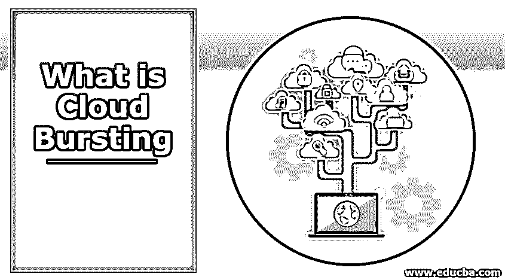

# 什么是云爆

> 原文：<https://www.educba.com/what-is-cloud-bursting/>

## **云爆**简介

云爆发是指在公共云和私有云之间设置的一种配置，用于处理 IT 需求的峰值，具有经济节约的优势(即，用户需要为资源付费，前提是且仅当有对这些资源的需求时)，如果任何使用私有云的组织消耗了 100%的可用资源，则溢出流量将被定向到公共云，以避免任何服务中断。

### 什么是云爆？

企业通常在内部计算环境(私有云)中托管其应用程序，以利用沉没投资，遵守安全标准并保持性能水平。但是，现有的硬件环境并不总是能够满足突然增加的工作负载，负载激增可能是由于

<small>Hadoop、数据科学、统计学&其他</small>

1.  季节性需求
2.  组织的非有机增长
3.  商业环境的变化

工作量突然增加的各种情况

1.  电子商务公司在节日期间和优惠期间的用户数量激增
2.  财务应用程序中的月末负载
3.  销售活动
4.  教育门户网站结果公布日的负载增加
5.  由于合并和收购功能，增强了数据流量水平

### 特征

云爆发提供了一种解决方案来管理这种情况，它以无缝的方式将额外的工作负载转移到公共云，其特性包括

1.  持续监控应用程序的当前负载。
2.  当通过触发器达到限制时，将额外的工作负载移动到[公共云](https://www.educba.com/what-is-public-cloud/)。
3.  维护[私有云和公共云](https://www.educba.com/private-cloud-vs-public-cloud/)之间的数据和应用一致性。
4.  一旦负载达到正常水平，关闭云爆发。
5.  根据使用情况向公共云服务提供商支付计算和存储费用。

监控应用程序工作负载并将它们来回移动到公共云的过程可以通过[私有云防火墙内的自动化系统来完成。](https://www.educba.com/what-is-private-cloud/)

### 挑战

1.  由于业务信息的敏感性，并非所有应用程序都可以迁移到公共云。
2.  将数据存储在公共云中的法规遵从性和安全性问题。
3.  带宽问题限制了数据/应用程序的移动，并延迟了启动。
4.  无法解决某些应用程序的延迟问题。
5.  某些情况下的性能问题。

将数据存储在公共云中也带来了挑战，随着技术的发展，这些挑战正在得到解决。

### 使用

通常，云爆发解决方案在[混合云环境中运行，而](https://www.educba.com/what-is-hybrid-cloud/)如今这种云选项已被广泛接受。80%的企业在其应用程序部署中使用混合云环境。70%的企业正在使用多个公共云环境(> 3)

这些解决方案部署在

1.  处理五字节数据的特定科学应用。
2.  允许出现延迟问题的高性能计算领域。
3.  银行和其他行业持有不太敏感的申请。
4.  不断变化的企业。

企业对探索这一解决方案并获得私有云和公共云的好处表现出浓厚的兴趣。

#### 服务提供商

虽然市场上有许多提供公共云服务的公司，但只有少数公司(如 Cisco、Azure、VMware 和 Equinix)提供端到端的云爆发解决方案。Equinix 通过 VPN 隧道提供解决方案来解决安全问题。

### 云爆发解决方案是如何部署的？

私有云和公共云中的数据和应用程序同步

如果必须将应用程序的额外工作负载转移到公共云，则必须首先将数据库和应用程序配置转移到公共云，并与私有云同步。对高速网络的依赖对于在公共云中开始运营至关重要，在运营开始之前需要一段时间。

为了避免云爆发开始期间的时间延迟，可以在开始之前进行以下活动。

1.  在公共云中拥有数据库和应用程序配置的副本。与计算资源的成本相比，公共云中的存储成本不会很高。
2.  定期(比如每月)用增量更新来更新数据库和应用程序。
3.  在开始爆发的当天，使用上次更新后的更改同步数据库和应用程序，然后在公共云中无缝启动应用程序。
4.  从那时起，确保公共云和私有云数据/应用程序同步，以实现平稳运行。

#### IP 和 MAC 地址映射

在云突发切换期间，公共云中所有服务器和其他网络组件的 IP 地址和 MAC 地址应与私有云的 IP 地址和 MAC 地址相匹配，以便从公共云中工作的用户能够顺利操作。应创建一份详尽的文件，记录所有地址的详细信息，并准备在登陆日进行合并。应该进行试运行以避免错误和意外。

### 云爆发的优势

1.  灵活且经济高效的解决方案，无缝管理突然激增的负载。
2.  管理公共云中计算资源的扩展和缩减以管理负载激增非常简单。
3.  提高业务的灵活性，以利用出现的新机会并提高顶线和底线。
4.  硬件采购方面的业务成本节约，因为额外的负载在公共云中按照每次使用成本模型进行管理。
5.  释放内部计算资源，以便更好地用于其他领域。
6.  由于对应用程序的无中断访问，改善了客户体验和客户保持水平。
7.  有了这个选项，IT 可以将他们的运营作为“IT 即服务”提供给客户。

### 结论

如今，云爆发平台主要在不太敏感且对安全性/延迟方面关注较少的应用中采用。随着用户对混合云适应性的提高以及公共云环境中安全性/延迟问题的解决，云爆发平台的使用在未来必将在所有应用中得到改善。

### 推荐文章

这是一个什么是云爆发的指南。在这里，我们将讨论如何部署云爆发解决方案以及云爆发的优势。您也可以看看以下文章，了解更多信息–

1.  [云计算架构](https://www.educba.com/cloud-computing-architecture/)
2.  [什么是 Adobe Creative Cloud？](https://www.educba.com/what-is-adobe-creative-cloud/)
3.  [云计算中的虚拟化](https://www.educba.com/virtualization-in-cloud-computing/)
4.  [云计算提供商](https://www.educba.com/cloud-computing-providers/)

