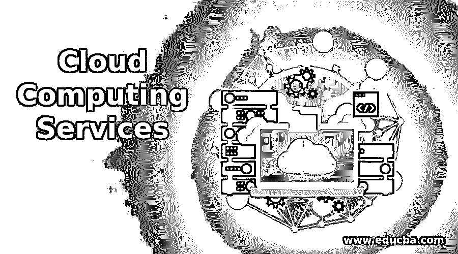
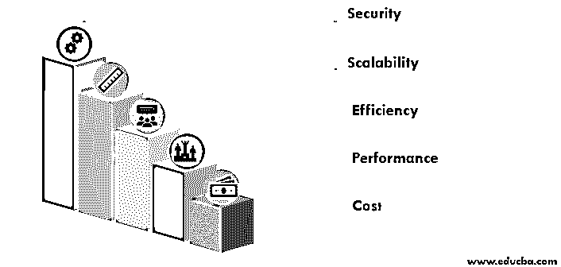
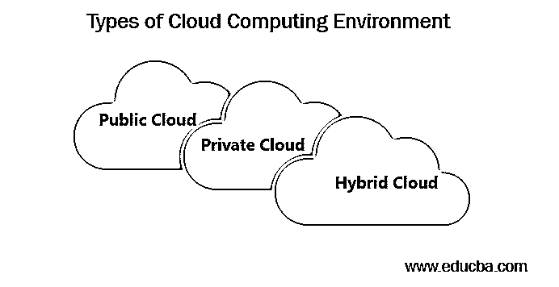
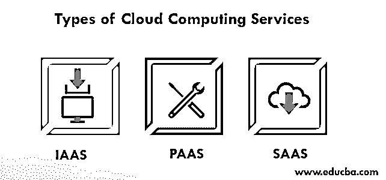

# 云计算服务

> 原文：<https://www.educba.com/cloud-computing-services/>

## 云计算服务简介

下面的文章提供了云计算服务的概要。在当今世界，随着技术的进步，每个人都在发展自己的业务，一切都可以在全球范围内获得。在全球化的影响下，应用程序必须以完美的速度和效率每秒钟启动并运行。此外，它应该能够处理不同类型的负载。除了所有这些挑战，应用程序存储的数据也很重要。它应该随时可用，并且形式正确。为了管理所有这些问题，我们需要成百上千的服务器和存储服务。此外，维护和管理基础设施的专业团队。为了将我们从这些开销中解救出来，云计算应运而生。

什么是云计算？顾名思义，云计算可以让你存储数据、处理数据、托管应用程序，但不会占用系统空间，你也不必担心服务的管理和维护。通过选择云服务，所有的服务器和存储服务都由第三方提供。云计算服务是主要由大公司巨头提供的服务，让您托管您的应用程序并执行大型计算任务，而无需管理底层基础架构的开销。微软提供微软 Azure 亚马逊提供 AWS 谷歌有[谷歌云平台](https://www.educba.com/what-is-google-cloud-platform/)。除了这些公司，企业或组织也可以拥有私有云。

<small>Hadoop、数据科学、统计学&其他</small>

### 优势

以下是列出的优点:

#### 1.费用

云计算具有成本效益，因为人们不需要将所有的硬件和软件导入他们的系统。它提供所有的硬件和软件。此外，由于不需要仅仅为了系统的维护而雇佣专门的团队，所以节省了维护成本；一切都由云提供商负责。

#### 2.表演

由于云提供商确保服务器始终可用于服务，因此性能得到了极大的提高。数据保存在云中，并不时进行复制，以防意外丢失。从而使性能更好。此外，用户可以选择支持其服务的服务器类型。所有的更新和安装都由服务提供商负责。

#### 3.效率

有了现成的系统和复杂的算法来在这些系统上分发数据，云计算处理数据的效率非常高。它确保根据需求将负载分配到不同的系统。从而使处理快速有效。

#### 4.可量测性

云计算的一个主要优势是它可以根据需求进行伸缩。因此用户只需为所使用的服务付费。如果在任何时候需要更多的处理器，可以很容易地启动处理器进行处理，一旦工作完成，处理器就可以关闭。你只需支付你用过的东西。

#### 5.安全性

随着网络犯罪的增加，安全是一个重要的方面。人们普遍认为，如果某样东西在网上可以买到，它就不安全。在云计算中，服务提供商让您管理访问和安全相关的策略。服务用户将有权决定他/她希望向谁提供访问以及访问的程度。此外，云环境中所有系统的安全性由服务提供商负责。所有的系统都被反病毒软件保护起来，并经常升级以确保其中的数据是安全的。

### 云计算环境的类型

根据业务需求，有[种不同类型的云计算环境](https://www.educba.com/types-of-cloud-computing/)。有些人需要内部的云系统，而有些人希望所有的开销都由云提供商自己处理。

云计算环境主要有三种类型:

#### 1.公共云

在[公有云](https://www.educba.com/what-is-public-cloud/)中，所有的服务都由第三方提供。所有的软件和硬件都由云服务提供商提供和管理。用户只需要管理对这些资源的访问。例如:微软 Azure、亚马逊 Web 服务等。

#### 2.私有云

有些人更喜欢由单个企业或组织独家拥有和运营云资源。这些类型的企业或组织自行维护和管理所有资源。所有资源都托管在他们的专用网络上。

#### 3.混合云

一些企业希望自行管理关键服务，并在第三方提供的云上托管不太关键的服务。这些[类型的云服务](https://www.educba.com/types-of-cloud-services/)称为混合云。这些类型的关键应用程序的云安全由企业自己管理。数据可以在私有云和公有云之间流动**。**

### 云计算服务的类型

大多数云计算服务分为三类:基础设施即服务(IAAS)、平台即服务(PAAS)和软件即服务(SAAS)。

这些是云服务提供的不同层次的抽象。

#### 1.基础设施即服务(IAAS)

这是最低层次的抽象。在这些类型的服务中，用户可以选择底层基础设施，如操作系统的类型、ram 和内存的类型、内存量、防病毒软件的类型等。这使用户可以在按需付费的基础上配置他们想要使用的虚拟机。这意味着用户将只为他/她使用的资源数量付费。

例如，亚马逊网络服务、微软 Azure、谷歌计算引擎。

#### 2.平台即服务(PAAS)

平台即服务是指云服务，用户无需担心底层基础设施，但可以拥有云支持的不同 web 应用和移动应用。它就像一个框架，可以在其上构建应用程序。它使应用程序的开发、测试和部署变得快速而简单。

例如，Apprenda、Apache Stratos 等。

#### 3.软件即服务(SAAS)

[软件即服务](https://www.educba.com/what-is-software-as-a-service-saas/)是云服务提供商处理一切的服务。用户只需通过互联网访问该软件。该应用程序的数据中心位于云提供商处，用户订阅了该数据中心。用户无需担心任何更新和与硬件的兼容性。他/她只需要一个互联网连接来使用它。

示例–Google Apps、WebEx、Salesforce

因此，云计算服务是一种新时代的技术，使用户专注于业务的增长，而将技术问题放在一边。

### 推荐文章

这是云计算服务的指南。这里我们已经详细讨论了云计算服务的基本概念、各种类型以及优势。你也可以看看下面的文章:

1.  [云计算职业](https://www.educba.com/career-in-cloud-computing/)
2.  [云计算问题](https://www.educba.com/cloud-computing-issues-challenges/)
3.  [云计算 vs Hadoop](https://www.educba.com/cloud-computing-vs-hadoop/)
4.  [云计算 vs 网格计算](https://www.educba.com/cloud-computing-vs-grid-computing/)

