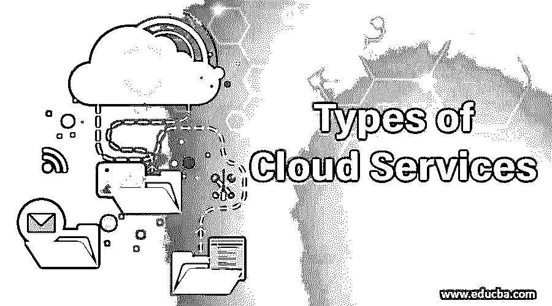
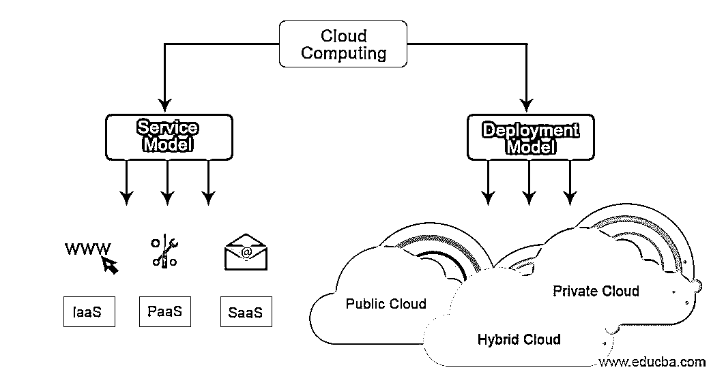

# 云服务的类型

> 原文：<https://www.educba.com/types-of-cloud-services/>

## 云服务类型介绍

云计算服务分为四种。它们是基础设施即服务(IaaS)、平台即服务(PaaS)、软件即服务(SaaS)、网络即服务(NaaS)和功能即服务(FaaS)。这四种类型被称为云计算堆栈，因为其中一种构建在另一种服务之上。此外，根据组织的能力，云部署分为三种类型，如公共云、私有云、混合云和社区云。云提供了应用程序的管理和灵活性。使用云时，我们可以控制自己的信息。

### 什么是云服务？

通过互联网按需向用户提供的服务，而不是由公司自己的服务器提供的服务，被称为云服务。这些数据储存在池中或数字服务器中，任何时候都可以通过互联网获得。云服务是指任何应用程序、服务或资源。该服务由云服务提供商管理。提供商提供应用程序所需的所有资源，因此公司不需要担心资源分配。云服务可以根据用户需求动态扩展。我们可以说，云是服务器、存储和在线备份的交付。服务提供商向公司收取云使用费。

<small>Hadoop、数据科学、统计学&其他</small>

数据可以在线存储和备份，文档可以轻松协作，数据库处理可以完成，技术支持服务可以管理。此外，可以使用云服务创建和管理新的应用程序、恢复数据、流式音频和视频、数据分析和预测。使用云可以很容易地跟踪用户的活动，因此是安全的。

云的概念始于 20 世纪 50 年代。到 20 世纪 90 年代初，由于 IT 革命，云服务被每个人使用。云服务的提供从 2000 年才开始。云中的进步与日俱增。所有组织，无论规模大小，都使用云服务。由于客户关系管理、数据管理、交付应用程序、企业资源管理等新功能，各行各业都在使用云服务。

现在，应用程序无需下载到系统中即可使用。云基础架构有助于组织按照自己的节奏使用应用程序，并且没有许可证问题。因此节省了下载的存储和时间。此外，在云中使用应用程序时，应用程序比本地网络运行得更快。云服务的优势在于可扩展性、可访问性、速度、低成本、自动更新、补丁更新、数据恢复、安全性、低功耗、组织中没有物理服务器以及与不同企业的存储协作。

### 云服务的类型

云服务可以根据其计算服务和部署方法进行分类。

#### 基于计算服务

基于计算服务的不同云服务解释如下:

##### 1.基础设施即服务(IaaS)

为了支持企业内部的运营，将基础设施交付给外包的模型称为 IaaS。本服务提供硬件、软件、存储、数据中心、服务器和网络空间。IaaS 被恰当地称为硬件即服务(HaaS)。平台虚拟化在 IaaS 中完成。

##### 2.平台即服务(PaaS)

为用户提供[硬件和软件工具](https://www.educba.com/hardware-vs-software/)进行应用开发的服务称为 PaaS。使用该服务，各种组件与组织的底层基础设施相结合。此外，它还提供数据库管理系统和编程语言库。编辑、编译、测试和版本管理都可以在这项服务中完成。Web 服务集成是 PaaS 的一个优势。这项服务简单易用。

##### 3.软件即服务(SaaS)

在这项服务中，分发的软件集中托管和许可。 [SaaS 类似于](https://www.educba.com/what-is-software-as-a-service-saas/)应用服务提供商(ASP)。应用程序的单个副本由提供者创建，并提供给所有用户。用户可以根据与提供商的协议，根据他们的使用向软件添加新的特性或功能。API 可以与公司自己的工具集成。

##### 4.功能即服务(FaaS)

用户可以使用 FaaS 构建、运行和保护应用程序及其所有功能和服务。服务是事件驱动的，用户根据他们的使用付费。用户不必担心服务器及其工作。在这项服务中，可以安排任务，并且可以轻松使用更高存储容量的应用程序。

##### 5.网络即服务(NaaS)

不想使用自己网络的用户需要服务提供商的帮助来托管网络基础设施。连接和带宽由服务提供商在合同期内提供。它基本上将网络表示为传输连接。网络虚拟化在此服务中完成。

#### 基于云部署

基于云部署的不同云服务解释如下:

##### 1.公共云

互联网用户使用云服务，云服务的基础设施基于云计算公司。然而，公共云并不安全，拥有敏感信息的组织不应该使用这种云。使用云的每个人都可以获得这些信息。

##### 2.私有云

云基础架构位于组织内部，未经组织许可不得与任何人共享，称为私有云。我们可以说私有云是所有云部署中最安全的。私有云中的定制、扩展和灵活性控制更高。硬件和软件都是只为主人打造的。

##### 3.混合云

私有云和公共云部署的组合称为[混合云](https://www.educba.com/what-is-hybrid-cloud/)。组织在处理繁重的工作负载时拥有公共云的优势，并且信息是安全的，因为私有云融入其中。

##### 4.社区云

这种为有限数量的个人和组织提供的部署模式被称为社区云，只有他们自己才能享受服务。这可以在内部或外部提供，并根据需要进行托管。

不同类型的云服务以各种方式帮助用户充分使用服务。服务提供商充分利用他们的潜力为客户服务。客户应该提高警惕，通过提供完全安全的服务提供商来保护他们的数据。

### 推荐文章

这是云服务类型的指南。这里我们讨论一下什么是云服务？以及基于计算服务和云部署的不同类型。你也可以看看下面的文章来了解更多-

1.  [云计算平台](https://www.educba.com/cloud-computing-platforms/)
2.  [什么是 Azure？](https://www.educba.com/what-is-azure/)
3.  [什么是云托管？](https://www.educba.com/what-is-cloud-hosting/)
4.  [春云组件 i](https://www.educba.com/spring-cloud-components/)

