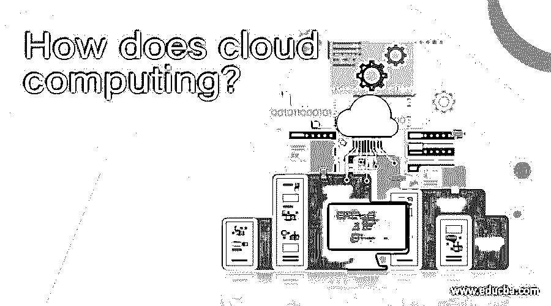

# 云计算是如何做到的？

> 原文：<https://www.educba.com/how-does-cloud-computing-works/>

## 什么是云计算？

云网络被分类为驻留在云计算类型架构中的计算机网络类型。云网络提供不同云系统和服务之间的网络连接功能。云网络类似于计算机网络，但它有助于将远程用户连接到可以从任何远程位置使用系统的系统，并可以起诉云应用程序，如 SaaS 和云基础架构 IaaS。当用户使用 web 系统时，查询通过云基础设施交付，并由应用程序的后端系统提供服务。云网络还提供了通信两个虚拟机并在它们之间建立通信的功能。

### 云计算是如何工作的？

在云计算网络中，服务由用于向客户提供云服务的不同组件组成。这些组件分布在不同的平台上，因此，如果任何一个组件出现故障，服务仍然可以运行并为用户提供服务。云计算为用户在云上存储数据提供了一个虚拟环境，用户可以从任何位置远程访问这些数据。在硬件故障或任何其他服务器问题的情况下，服务是可操作的。例如，有一座很大的建筑，里面有很大的面积。许多小公司不会拿走整栋大楼，他们总是会拿走其中的一小部分来进行安装。云计算网络可以以同样的方式被形象化，用户并没有获得完整的服务，他们总是根据自己的需求获得网络的一小部分。云计算为其用户提供服务，这些服务始终可用，用户可以从任何远程位置访问这些服务。

<small>Hadoop、数据科学、统计学&其他</small>

### 云计算的特点

随着 IT 技术的不断发展，直接增加了使用云计算网络的需求。下面提到了云网络的一些特征:

#### 1.资源池

云提供公司使用计算资源，然后向不同的客户提供云服务。资源可以分为虚拟资源和物理资源，这些资源可以使用，并可以根据用户的需求分配给用户。

#### 2.维护很容易

云服务器易于设置和安装，并且服务器的维护也易于完成。这些服务器通常停机时间很短，并为客户提供连续服务。服务器的性能比提供适当的云服务更好更快。

#### 3.访问大型网络

向用户提供了访问大型云网络的功能，并且用户可以使用系统提供的资源和服务。用户可以使用云网络访问数据，从任何远程位置上传数据，并可以使用任何设备的服务。它所需要的只是用于连接云网络的互联网连接。

#### 4.有效性

云服务总是提供给用户。向用户提供 24 X &的服务。用户可以使用云网络作为存储平台，也可以根据需要购买更多空间。用户可以随时从网络上获取数据。

#### 5.经济的

如果组织采用云服务，那么云服务是经济的。大型组织可以采用云服务，并将一小部分云提供给其他小型组织。通过这种方式，服务的可负担性将会提高，每个人都将有机会使用云服务。

#### 6.自动装置

云服务能够分析用户需求并据此提供服务。用户可以监控服务，控制使用。网络向用户提供访问整个网络的功能。

#### 7.按使用付费

云网络的这一特性使得它对客户的使用更加重要。云网络提供了用户只需为他们使用的服务付费的功能。没有额外的钱，他们必须支付或没有隐藏的费用，这使得这项服务更适合使用。

### 云计算的实施和理解

因为云计算有其自身的优势，对组织有益。唯一的要求是正确理解服务，然后在他们的系统中使用服务。在云系统中，数据存储在可以从任何远程位置访问的虚拟服务器中。通过这种方式，提高了数据安全性，并改善了风险管理。要实现云服务，需要有正确的理解。一些措施描述如下:

**1。应用程序是否与云平台兼容**

在实施云服务之前，首先需要使系统与云平台兼容。应用程序可扩展到云平台。实施云服务后，好处会不会有。在转向云服务之前，所有这些理解都是必需的。

**2。获得数据所有权**

由于用户使用云平台来存储他们的重要数据和信息，因此数据在云平台上保持安全非常重要。此外，数据应该随时呈现在云上，以便可以从任何远程位置轻松访问。

**3。服务使用的波动**

当用户开始使用云服务并在应用中实现时，用户为应用购买存储空间。云服务提供了用户可以根据需求扩展存储空间的功能。用户只需为他们使用的服务付费。

### 结论

云计算网络被各种类型的组织广泛使用，因为该平台提供了存储大量数据的功能，并且可以从任何位置和任何设备访问这些数据。该平台提供的服务价格低廉，用户可以非常方便地使用。

### 推荐文章

这是关于云计算如何工作的指南。这里我们讨论云计算的介绍、特点、实现和理解工作。您也可以看看以下文章，了解更多信息–

1.  [私有云提供商](https://www.educba.com/private-cloud-providers/)
2.  [社区云](https://www.educba.com/community-cloud/)
3.  [公共云提供商](https://www.educba.com/public-cloud-providers/)
4.  [谷歌云存储](https://www.educba.com/google-cloud-storage/)

