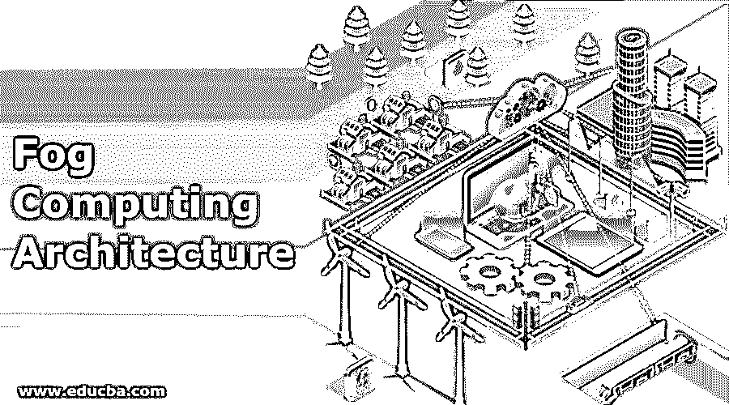
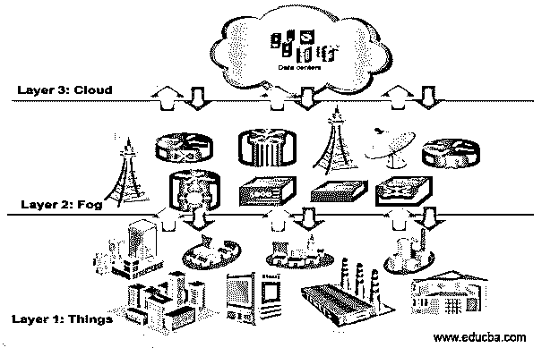
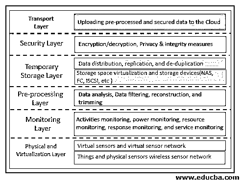

# 雾计算体系结构

> 原文：<https://www.educba.com/fog-computing-architecture/>

## 雾计算架构介绍

Fog 架构涉及使用终端设备(交换机、路由器、多路复用器等)的服务进行计算、存储和处理。雾计算架构由网络、软件和硬件的物理和逻辑元素组成，以形成大量互连设备的完整网络。雾节点分布(物理的和地理的，以及所使用的拓扑和协议)形成了雾架构的关键架构特征。Fog 体系结构涉及不同层的功能分布、所用协议的类型和数量，以及各层的约束条件。

### 分层雾计算体系结构

分层雾架构包括以下三层:

<small>Hadoop、数据科学、统计学&其他</small>

#### 1.终端层

*   终端层是 fog 架构中的基础层，这一层包括手机、传感器、智能车辆、读卡器、智能卡等设备。
*   能够感知和捕获数据的设备位于这一层。设备分布在彼此相距很远的多个位置。
*   该层主要处理数据感测和捕获。不同平台、不同架构的设备主要在这一层。
*   这些设备具有在异构环境中工作的特性，其他设备采用不同的技术和不同的通信模式。

#### 2.雾层

*   雾层包括路由器、网关、接入点、基站、特定雾服务器等设备。，称为雾节点。
*   雾节点位于网络的边缘。边缘可以是距离终端设备的一跳距离。雾节点位于终端设备和云数据中心之间。
*   雾节点可以是静态的，例如位于公共汽车终点站或咖啡店中，或者它们可以是移动的，例如安装在移动的车辆内部。
*   雾节点确保对终端设备的服务。雾节点可以计算、传输和临时存储数据。
*   雾节点和云数据中心连接通过 IP 核心网络实现，提供与云的交互和合作，以增强处理和存储能力。

#### 3.云层

*   这一层由能够提供大容量存储的设备和高性能的机器(服务器)组成。
*   这一层执行计算分析并永久存储数据，以供用户备份和永久访问。
*   这一层有很高的存储和强大的计算能力。
*   巨大的具有高计算能力的数据中心形成了一个云层。数据中心向用户提供[云计算的所有基本特征](https://www.educba.com/what-is-cloud-computing/)。数据中心既可扩展，又可按需提供计算资源。
*   云层位于整个雾架构的最末端。它充当备份，并为雾架构中的数据提供永久存储。通常，用户附近不需要的数据存储在一个云图层中。

### 分层雾计算体系结构

分层雾架构由六层组成:

#### 1.物理和虚拟化层

*   这一层由节点(物理节点和虚拟节点)组成。这些节点执行捕获数据的主要任务，并且位于不同的位置。节点通常涉及传感技术来捕捉它们的周围环境。
*   该节点使用的传感器从周围环境中收集数据，然后通过网关将数据发送到上层进行进一步处理。
*   节点可以是独立的设备，如移动电话，也可以是大型设备的一部分，如安装在车辆内的温度传感器。

#### 2.监控层

*   在这一层，我们执行与各种任务相关的节点监控。
*   可以监控节点的工作时间、温度和其他物理属性、设备的最大电池寿命等。
*   应用程序的性能及其当前状态也会受到监控。
*   对雾节点的能量消耗进行检查，即它们在执行任务时消耗的电池电量。

#### 3.预处理层

*   该层执行主要与分析相关的各种数据操作。
*   清理数据并检查是否存在任何不需要的数据。数据杂质被去除，只收集有用的数据。
*   这一层的数据分析可能涉及从终端设备收集的大量数据中挖掘有意义的相关信息。
*   [数据分析是在将数据用于特定目的之前应该考虑的基本特征之一](https://www.educba.com/what-is-data-analysis/)。

#### 4.中间存储器

*   这一层与数据的非永久性分布和复制相关联。
*   像 VSAN 这样的存储虚拟化用于这一层。
*   一旦数据从临时层移动到云中，该层中的数据就会被删除。

#### 5.安全层

*   这一层涉及数据的私密性、数据的完整性、[数据的加密和解密](https://www.educba.com/encryption-vs-decryption/)。
*   在雾计算数据的情况下，隐私可以包括基于使用的隐私、基于数据的隐私和基于位置的隐私。
*   安全层确保外包给 fog 节点的数据的安全和隐私保护。

#### 6.传输层

*   这一层的主要功能是将部分处理过的细粒度安全数据上传到云端进行永久存储。为了提高效率，收集并上传部分数据。
*   数据在上传到云端之前会通过智能网关。由于雾计算的有限[资源，所使用的通信协议被选择为轻量级和高效的。](https://www.educba.com/fog-computing/)

### 结论

雾架构是一个由许多不同层组成的模型。该模型是构建光纤陀螺网络的理想模型。该体系结构提供了由各个层执行的不同功能的概述。在不同层使用的协议、在不同层使用的特定设备及其功能、规范通过浏览 fog 架构来识别。

### 推荐文章

这是雾计算架构的指南。这里我们讨论一下雾计算体系结构的介绍、分级和分层。您也可以看看以下文章，了解更多信息–

1.  [物联网生态系统](https://www.educba.com/iot-ecosystem/)
2.  [什么是 JVM？](https://www.educba.com/what-is-jvm/)
3.  [AWS 替代品](https://www.educba.com/aws-alternatives/)
4.  [卡夫卡消费群体](https://www.educba.com/kafka-consumer-group/)

