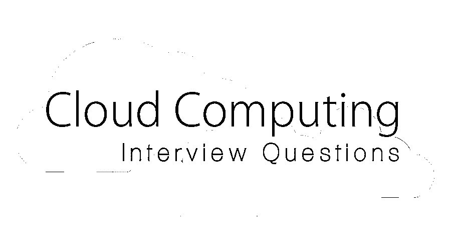

# 云计算面试问题

> 原文：<https://www.educba.com/cloud-computing-interview-questions/>

## 云计算简介面试问答

云计算是通过互联网经由云服务平台按需交付计算服务，如服务器、存储、软件等，即云以及提供这种服务的组织被称为云提供商，例如 Microsoft Azure、Amazon- AWS 等。以下是一些常见的云计算面试问题，对技术面试有所帮助。

So you have finally found your dream job in Cloud Computing but are wondering how to crack the 2022 Cloud Computing Interview and what could be the probable Cloud Computing Interview Questions. Every interview is different and the scope of a job is different too. Keeping this in mind we have designed the most common Cloud Computing Interview Questions and answers to help you get success in your interview.

以下是面试中最常被问到的云计算面试问题列表

<small>Hadoop、数据科学、统计学&其他</small>

#### 1.什么是云和云计算？

**回答:**
**云**:云是一个由硬件、存储、服务和接口组成的术语，有助于从远程位置提供计算即服务。它有三种用户:
最终用户
云服务提供商
[业务管理](https://www.educba.com/business-management/)用户

**云计算:**云计算被定义为通过互联网经由云服务平台按需交付计算能力、数据库存储、应用和其他 IT 资源，以便云在全球范围内交付服务。
用户可以远程操纵、配置和访问云计算中的硬件和软件资源。

#### 2.云计算有哪些不同的服务模式？

**答:**
有不同的[种云服务模式](https://www.educba.com/cloud-service-models/)下面是三种主要模式，不同的企业根据需要使用其中的部分或全部模式:

**1。软件即服务(Saas)** : [SaaS 模式](https://www.educba.com/what-is-software-as-a-service-saas/)向最终用户提供软件应用和程序服务，所有应用和程序都基于云进行管理。

**2。平台即服务(PaaS):** PaaS 模式通过互联网向开发者提供一个环境、平台和操作系统层，以便他们开发应用和服务。

**3。基础设施即服务(IaaS):** [IaaS 是](https://www.educba.com/what-is-iaas/)云计算的基础服务，它提供基础设施来访问互联网上虚拟化环境中的计算资源。

#### 3.有哪些不同的部署模式？

**答案:**
云计算支持几种部署模式，每一种都有自己的服务和对云环境的操作。大型组织使用私有云，而小型企业使用公共云，下面是一些部署模型:

**1。私有云:**为拥有多个业务单元的单个组织提供。私有云由组织拥有、管理和运营。它可能位于内部或外部。组织选择私有云来存储敏感和关键信息，因为它提供安全性、可靠性和服务，并且具有扩展能力。

**2。社区云:**提供给一个组织的一个小组访问，因为它在属于一个特定社区的几个组织之间共享基础设施，即银行和贸易公司。它可以由公司、第三方或二者的组合来管理和运营。它可以驻留在内部或远程数据中心，也可以托管在内部或外部。

**3。公有云:**公有云基础设施对公众开放使用。它比通过互联网获取信息更安全。它由政府组织或企业管理和运营，并且存在于云提供商上。
公共云提供协作、CRM、存储和社交网络等功能。

**4。混合云:**它是两个或更多不同的云部署模型的组合，这些模型保持唯一的实体，并且它们被绑定到ѕtаndаrdizеd 或专有的еnаblеѕ数据和应用程序(用于云之间的负载平衡)。

#### 4.云提供了哪些安全措施？

**回答** :
云中的安全性是组织最关心的问题，因为数据应该以加密的形式存储。云环境中有许多安全级别，例如:

**1。身份管理:**身份管理控制访问信息、计算资源、应用和服务，仅由授权用户使用。

**2。访问控制:**由于数据可以在云中的任何地方访问，需要向用户提供权限来控制其他用户进入云的访问。

**3。授权和认证:**由于数据存储在云中，所以只允许某些个人(授权用户)更改应用程序和数据。

#### 5.公司如何从云计算中获益？

**回答** :
对于任何组织来说，云计算都有许多优势，下面是云计算的一些[优势](https://www.educba.com/benefits-of-cloud-computing/)

降低用户的 IT 基础设施和计算机成本
更安全的数据备份
数据存储(关系型、非 SQL、数据块存储)
提高工作效率
沙盒和虚拟化功能
提高工作效率
成本效益
更有利于增长和可扩展性
无需硬件投资即可利用强大的服务器功能。
“软件即服务”。(SaaS)

#### 6.列举用于大规模云计算的平台？

**回答** :
云为云计算提供了许多平台，但随着大数据云的出现，需要大规模的分布式计算平台如下:

**1。Apache Hadoop:** Apache Hadoop 是一种开源技术，它使用 Hadoop 分布式文件系统(HDFS)对超大型数据集进行存储和分布式处理，多节点计算机集群使用商用硬件构建，具有高可扩展性。Hadoop 提供数据存储、数据处理、数据访问、数据治理、安全和运营等服务。

**2。MapReduce:** MapReduce 是一个用于处理结构化、非结构化或半结构化格式生成的大规模数据的框架。MapReduce 使用云资源和商用硬件来处理数据，通过将相同的数据复制三次(默认复制因子= 3 ),它在软件级别提供了容错和可扩展性。

#### 7.为什么在云服务中使用 API？

**答:**
API 是应用编程接口的缩写，在云中用于:
用户不需要编写完整的程序，因为它提供了内置的编程接口。
将弹出建议和说明，以便在一个或多个应用程序之间建立连接。
通过访问其他系统云服务的链接，可以轻松编程和开发应用程序。

#### 8.列举一些云计算平台数据库？

**回答:**
MongoDB
couch db
lucid db
dynamo db-Amazon

#### 9.说出云计算的一些基本特征？

**回答:**
以下是云计算的一些基本特征:
·按需自助服务，提供存储、计算等功能。
可在瘦客户端平台或胖客户端平台中使用宽带网络接入
支持快速弹性，因此可以根据需求进行扩展和收缩
采用按需付费定价模式的测量服务。

#### 10.说出云计算中的数据中心？

**答案:**
1。集装箱化数据中心
2。低密度数据中心

### 推荐文章

这是一个云计算面试问题和答案列表的指南。在这里，我们已经涵盖了一些常见的面试问题及其详细的答案，使候选人可以轻松地破解面试。您也可以阅读以下文章，了解更多信息——

1.  [节点 JS 与 Java 比较](https://www.educba.com/java-vs-node-js/)
2.  [数据工程师面试问答](https://www.educba.com/data-engineer-interview-questions/)
3.  [有经验者面试问题](https://www.educba.com/angularjs-interview-questions-for-experienced/)
4.  [Java 开发者面试问题](https://www.educba.com/java-developer-interview-questions/)

