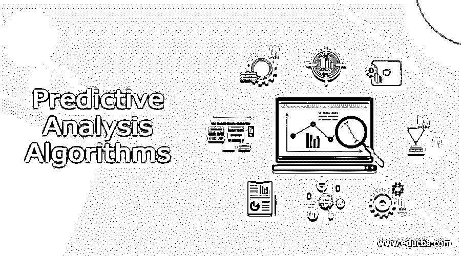

# 预测分析算法

> 原文：<https://www.educba.com/predictive-analysis-algorithms/>

## 预测分析的定义

预测分析是使用机器学习、统计算法和其他数据分析技术来分析数据，以预测未来事件。通过将过去的数据或原始数据作为输入，然后应用几种预测分析算法来提供干净的数据，以便我们可以通过分析获得的干净数据来预测相同数据的未来结果。

通过使用历史和交易数据中获得的结果，我们可以预测未来的利润和损失。在深入预测分析算法之前。让我们看看预测分析的结构，以及如何建立一个高效的预测模型。

<small>Hadoop、数据科学、统计学&其他</small>

### 预测分析结构

预测分析结构如下所示:

*   **定义项目:**确定给定的数据集和我们需要对其执行的算法，并定义其目标。
*   **数据收集:**如果数据是与问题陈述一起给出的，那么你不需要浏览数据集，但是如果你没有得到任何与陈述一起的数据集，你需要通过互联网查找与你的问题陈述相匹配的所需数据。从各种来源收集数据的过程称为数据挖掘。
*   **分析数据:**现在，您拥有的数据是原始数据或非结构化数据，需要清理并转换为结构化数据，以便进行分析，发现有用的信息并得出结论。
*   **统计分析:**这种分析需要对我们的数据进行假设、假设和测试，我们将使用统计模型处理异常值。
*   **异常值处理:**异常值是与数据集中的其他观察值一起存在的观察值，它显示了与数据集中其他值的异常距离。与其他观测结果相比，这是一个显示出更多偏差的对象。

例如，让我们取一个由 10 个数字组成的小样本数据集

*   0, 14, 17, 3, 27, 30, 15, 29, 8, 19, 10000

在这种情况下，异常值为 10000，它远离其他值。在为该数据集绘制图表时，10000 显示出比其他观察值更多的偏差。

*   **预测建模:**预测建模有助于我们为未来分析创建准确的预测模型。
*   **部署模型:**在构建我们的模型之后，我们需要为结果和输出部署它，以自动对我们的预测模型做出决策。
*   **管理模型:**在部署我们的模型之后，我们需要管理和监控它，以检查模型的性能，并确保它给出预期的结果。

### 预测分析中的算法

预测分析中广泛使用的算法有:

*   线性回归
*   逻辑回归
*   神经网络
*   决策树
*   朴素贝叶斯

#### 1.线性回归

线性回归属于监督学习的范畴，在监督学习中，需要预测的变量称为因变量，而我们用来预测因变量的变量称为自变量。

我们通过数据挖掘过程收集的数据将包含在 CSV 文件中，然后上传到 Jupyter 笔记本中，我们将在其中执行预测分析，然后通过使用 ML 算法对我们的数据执行操作。第一步包括读取数据和执行一些基本的探索性数据分析，然后我们将为未来的预测训练数据集。

#### 2.逻辑回归

逻辑回归用于通过分析一个或多个现有自变量之间的关系来预测因变量。该模型可以考虑许多输入标准。基于因变量的早期结果，我们将通过使用落入特定结果类别的概率来预测自变量的未来结果。逻辑回归和线性回归的主要区别在于，当响应变量是分类变量(如是/否、真/假)时，使用逻辑回归；而当响应变量是连续变量(如小时数、身高和体重)时，使用线性回归。

#### 3.神经网络

神经网络算法是通过考虑人脑来开发的，人脑将一组单元作为输入，并将结果传递到预定义的输出。它试图以人脑的方式预测因变量。用于预测的神经网络由输入节点、输出节点和位于两个节点之间的隐藏节点组成。两个节点之间的隐藏层使得这种预测技术比其他预测工具独特且高效。每次数据通过网络时，该算法通过给隐藏层中的节点赋予权重来合并通过它的数据。

#### 4.决策树

决策树是预测建模技术中的一种重要算法，在这种技术中，我们可以直观地表示决策。基于某些条件，我们将使用分支方法得出所有可能的结果。

决策树分为两种类型

*   分类树
*   回归树

当我们期望响应变量本质上是分类的时，分类树用于将数据集分成不同的类。

当响应变量是数字或连续变量时，使用回归树。决策算法构建决策树，用于表示分类规则。决策树中的树叶是预测的决策。

#### 5.朴素贝叶斯

该算法基于贝耶概率定理，或者也称为贝耶法则或贝耶定律。这是一种简单的算法，以其快速构建预测模型并使用这些模型和算法进行预测的有效性而闻名。

### 预测分析的应用

预测分析用于各种领域，以预测特定条件下的未来结果。一些应用包括:

1.  欺诈检测
2.  卫生保健
3.  客户定位
4.  销售预测
5.  评估风险

### 结论

*   预测分析是使用机器学习、统计算法和其他数据分析技术来分析数据，以预测未来事件
*   预测分析结构包括定义项目、收集数据、分析数据、统计分析、预测建模、部署模型和管理模型。
*   广泛使用的预测建模算法有线性回归、逻辑回归、神经网络、决策树和朴素贝叶斯模型。
*   建模的一些应用包括欺诈检测、医疗保健、客户定位、销售预测和风险评估

### 推荐文章

这是预测分析算法指南。在这里，我们还讨论了定义和预测分析结构以及算法。您也可以看看以下文章，了解更多信息–

1.  [预测分析技术](https://www.educba.com/predictive-analytics-techniques/)
2.  [分类算法](https://www.educba.com/classification-algorithms/)
3.  [预测分析与统计](https://www.educba.com/predictive-analytics-vs-statistics/)
4.  [预测分析与数据挖掘](https://www.educba.com/predictive-analytics-vs-data-mining/)

