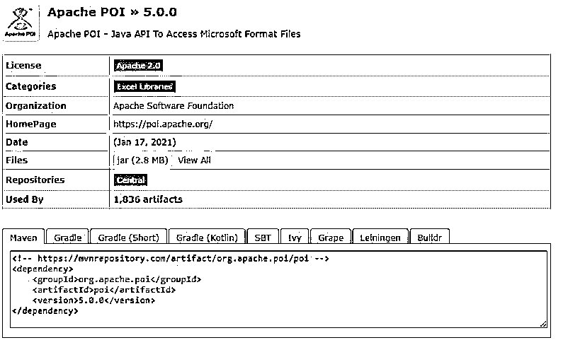
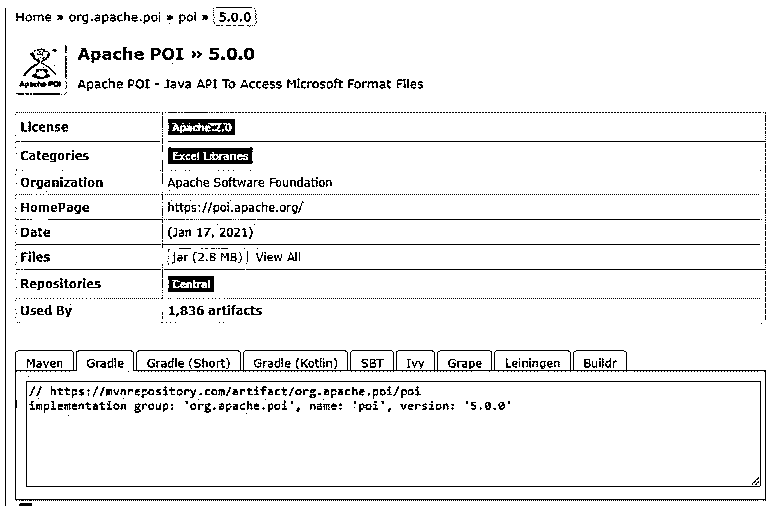
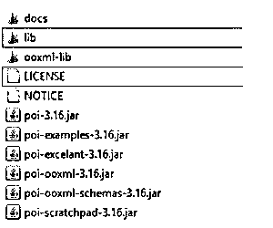

# Apache 然后

> 原文：<https://www.educba.com/apache-poi/>

## Apache POI 简介

在开发任何应用程序时，我们可能会遇到来自客户端的各种需求，这些需求也可能包括处理 Excel 文件或以文件形式向用户显示数据，因此 apache poi 是一个 API，它可以解决我们的问题并管理这种工作。有了这个的帮助，我们通过编写 java 代码，就可以很容易地在我们的应用程序中处理和管理 MS office 文件；为了使用它，我们必须做一些配置。这个 API 使我们的任务变得简单、快速，并且没有错误；我们遇到了一个要求，我们必须以文件的形式上传用户的数据，所以在这种情况下，我们也可能需要一个程序来处理这一点，所以在这个地方，我们可以利用 apache POI。

### 什么是阿帕奇 POI？

*   首先，这个 API 是由 Apache Software Foundation 提供的，这是一个开源库，它帮助我们使用 java 程序就地修改或设计我们的 MS 文件。因此，简而言之，它允许开发人员或使我们能够使用 Java 程序设计、修改、创建和显示 MS office 文件。
*   这是一个 API，包含相应的类和方法，帮助我们从文件中读取用户数据，或者根据用户数据编写或创建任何新文件。

### 用于读取 Apache POI 的组件

下面给出了我们在阅读 Apache POI 时将要使用的主要组件。这个 API 包含许多方法和类，帮助我们通过 java 程序工作和处理所有的 MS office 文件。

<small>网页开发、编程语言、软件测试&其他</small>

*   **HPBF:** 这是 apache poi 的主要组件之一，代表恐怖的 Publisher 格式；该组件用于读写文件，特别是 MS-Publisher 文件。
*   HSSF: 这是另一个代表糟糕的电子表格格式的组件，这种类型的组件特别用于读写我们拥有的 MS Excel 文件的 xls 格式。
*   **HPSF:** 这是又一个代表恐怖属性集格式的组件；这个组件主要用于提取 MS Office 文件的属性，它主要包括属性集。
*   **HSLF:** 这是另一个代表恐怖幻灯片布局格式的组件；这基本上用于 PowerPoint 演示，支持编辑、创建和读取等操作。
*   **HDGF:** 这是另一个代表恐怖图格式的组件；这基本上包含并处理二进制文件；它内部包含处理与 MS Visio 相关的二进制文件的方法和类。
*   这是 apache poi 的又一个 com，代表糟糕的混淆实现文件系统；这被认为是我们使用的所有 poi 元素的基本组成部分或基本因素。如果我们想要读取不同的文件类型，我们可以通过显式编写代码来使用它。
*   HWPF: 这是 apache poi 的另一个组件，代表恐怖的文字处理器格式；该组件基本上支持扩展名为 doc 的 MS word 文件。
*   XSSF: 这是 apache poi 的另一个组件，代表 XML 电子表格格式；这个组件基本上是用来读取 MS Excel 的 xlsx 扩展文件的。
*   **XWPF:** 这是另一个代表 XML 文字处理器格式的组件；该组件主要用于读写扩展名为 docx 的 MS Word 文件。

### 依赖项和 Apache POI 安装

下面展示了我们如何在 java 项目中使用 Apache POI 来高效地处理文件。

**胃:T1**

1.转到下面提到的 URL 并按回车键:

网址:https://mvnrepository.com/artifact/org.apache.poi/poi

2.选择正确的版本，并将依赖项复制到 pom.xml 中。

**代码:**

`<!-- https://mvnrepository.com/artifact/org.apache.poi/poi -->
<dependency>
<groupId>org.apache.poi</groupId>
<artifactId>poi</artifactId>
<version>5.0.0</version>
</dependency>`

**输出:**

【T0 度】

1.如果你用的是 gradle，去同一个 URL，选择正确的版本，点击 gradle 到 gradle 标准依赖。

**举例:**

//https://mvnrepository.com/artifact/org.apache.poi/poi

**实现组:** 'org.apache.poi '，名称:' poi '，版本:' 5.0.0 '

2.添加到应用程序中的 build.gradle 文件。

普通 Java 项目:

要将 apache poi 添加到普通 java 项目中，请遵循以下说明:

形容词（adjective 的缩写）通过下面的 URL 将依赖项下载到您的系统中。

**网址:**

https://www.apache.org/dyn/closer.lua/poi/release/bin/poi-bin-3.16-20170419.zip

b.提取文件夹并将其放入您想要的目录中。

碳（carbon 的缩写）在 eclipse 中，右键单击您的项目并转到 Build Path > Libraries > Add external JARs。

d.选择里面的所有文件(lib、ooxml-lib 和 poi 的根文件夹)

e.按应用和确定。

**类:**

*   **HSSFWorkbook:** 这个类用来创建 HSSFWorkbook 的对象。
*   **XSSFWorkbook:** 这个类用来创建 XSSFWorkbook 的对象。
*   这个类用来创建 HSSFSheet 的对象。
*   XSSFSheet: 这个类用来创建 XSSFSheet 的对象。
*   **XSS row:**这用于实现行。
*   **XSSFCell:** 用于创建单元接口。
*   XSSFCellStyle: 这个类用于设置单元格的样式。

### 重要特征

*   它提供基于流的处理。
*   它可以处理 XLS 和 XLSX。
*   它为额外的 excel 功能提供了很好的支持。
*   它还需要更少的内存。

### 结论

它一步一步地展示了使用 Apache POI 通过 java 程序用已声明的类和方法读写 MS office 文件的好处和功能，使开发人员可以快速轻松地处理它。

### 推荐文章

这是一个阿帕奇 POI 指南。在这里，我们讨论简介、用于读取 apache POI 的组件、依赖项和安装、功能。您也可以看看以下文章，了解更多信息–

1.  [什么是阿帕奇雄猫？](https://www.educba.com/what-is-apache-tomcat/)
2.  [阿帕奇水槽](https://www.educba.com/apache-flume/)
3.  [阿帕奇蚂蚁](https://www.educba.com/apache-ant/)
4.  [阿帕奇 Solr](https://www.educba.com/apache-solr/)

