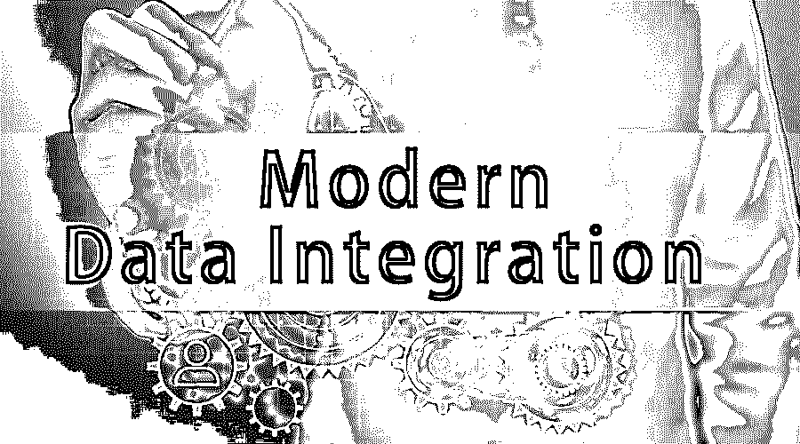
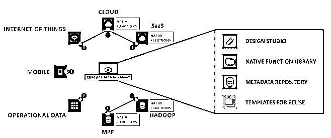
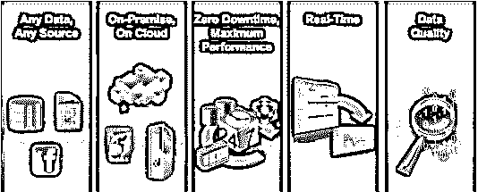

# 现代数据集成

> 原文：<https://www.educba.com/modern-data-integration/>

## 现代数据集成导论

下面的文章提供了现代数据集成的概要。由于技术的进步，企业现在面临着巨大的竞争。组织应该能够利用信息和创造新的知识来领导他们的业务。技术创新和事物的互联性每天都在产生大量的数据。数据集成有助于将数据从源移动到目标。

许多组织正在使用数据集成人才来为他们的业务创造价值。当两家公司合并或在一家公司内整合应用程序以提供公司数据资产的视图时，数据集成变得更加重要。数据集成应用程序并不简单。他们需要代码来完成这个过程。将会出现许多与它的维护、文档和转移相关的问题。

<small>Hadoop、数据科学、统计学&其他</small>

### 数据集成领域

这个术语涵盖了许多不同的领域，例如:

*   数据库
*   数据迁移
*   企业应用
*   主[数据管理](https://www.educba.com/database-management-system/)

### 数据集成过程

数据集成有三个阶段:

#### 1.设计

这个过程应该包括公司的所有部门。在这个过程中，你要问自己几个问题。

*   数据集成的目标是什么？
*   数据的来源是什么？
*   可用数据是否足以满足要求？
*   数据集成符合业务规则吗？
*   支持模式是什么？
*   SLA 要求是什么？
*   从数据源中提取数据的方法有哪些？
*   数据质量如何？
*   是否需要其他非功能性需求，如数据处理需求、安全策略、备份策略等？
*   谁将是系统的所有者，费用总额是多少？

所有上述问题的答案都应记录在案，并由参与数据集成项目的所有成员签名。

#### 2.履行

基于对需求和 SRS 文档的分析，进行了详细的研究，以选择合适的工具来[实施数据集成](https://www.educba.com/what-is-data-integration/)系统。市场上有很多可用的工具，选择最适合您业务的工具是最大的挑战。刚接触数据集成的公司需要实现一种新的工具，已经使用或正在使用这种项目的公司可以扩展他们现有的系统。选择最适合您业务需求的工具将更加有效，并有助于业务的未来增长和扩展。

#### 3.测试

测试是数据的一个重要阶段。需要进行适当的测试，以确保统一数据的完整性和正确性。IT 部门和整个企业都需要参与测试过程。可以使用的不同测试方法有性能压力测试(PST)、技术验收测试(TAT)和用户验收测试(UAT)、PST、TAT(技术验收测试)、UAT(用户验收测试)。

### 技术

公司有几种数据集成技术:

*   **手动集成或公共用户界面**-它为用户提供对所有源系统或网页界面的访问。
*   **基于应用的集成**–仅在应用数量有限的情况下使用。
*   **中间件数据集成**–帮助将逻辑从一个应用程序转移到一个新的中间件层。
*   **统一数据访问或虚拟集成**–定义一组视图，为用户提供对数据统一视图的访问。
*   **通用数据存储或物理数据集成**–拥有来自数据源的数据副本，并在原始系统中独立存储和管理。

### 数据集成产品

数据集成主要有三种产品:

*   **提取、转换和加载(ETL)**–这些产品有助于移动大量数据，这也实现了健壮的转换。
*   **企业应用集成产品(EAI 或 EII)**–这些产品有助于以不同的频率模式移动少量数据。
*   **企业数据复制(EDR)**–这些产品提供关于数据集以及何时必须更改或修改数据集的信息。

### 原则

我们生活在一个数据时代。现代数据更加复杂，它有不同的数据类型、来源、数量和位置。现代数据有很多优点。现代数据集成有许多原则来满足今天的数据环境。

数据集成的五个主要原则如下:

#### 1.将处理带到数据所在的位置

数据量很大，每次传输之前都需要对数据进行融合。在主机平台中指定一个代理，以便在传输数据之前，所有过程都在本地完成。通过将处理系统移动到数据所在的位置，将减少数据在网络中的移动，从而节省时间。

#### 2.基于设计利用所有平台

如果您正在投资现代数据平台，每个平台都将有一组默认的功能和工作负载。它使用平台中的那些默认功能。通过这种方式，可以提高数据混合的性能，并减少数据移动。

#### 3.点对点移动数据

现代数据平台应该集中处理所有的业务规则和数据逻辑。只有当本地处理系统与中央设计工作室保持分离时，这才是可能的。管理业务规则和数据逻辑可以帮助最大化它们的可用性，并提供透明性。

#### 4.使用现有规则进行更改

如果管理是集中处理的，那么所有的业务规则和数据逻辑模板都可以放在同一个屋檐下。如果要对数据或平台进行任何更改，那么可以快速有效地进行这些更改。

### 利益

它将消除遗留技术带来的所有挑战。

下面列出了一些好处:

*   一次设计，可多次使用。
*   获得关于数据的深入知识。
*   管理复杂的数据环境。
*   优化行动。
*   更改、扩展和迁移现有业务数据的能力。
*   快速响应业务需求。

### 十大新要求

商业世界变得更加竞争激烈；他们更依赖数据。更准确的数据让商业人士做出明智的决策。数据量每天都在增长，企业需要更快地处理数据以获得更好的结果。数据源和 IT 环境经常变化，获取有关数据的详细信息变得更加复杂。因此，对现代数据集成提出了新的要求。

这里列出了现代数据集成的 10 项新要求:

#### 1.应用程序集成是通过 REST 和 SOAP 服务完成的

今天的软件应用程序是作为基于云的服务实现的，这些服务将公开 SOAP/REST API，用于基于业务目标的数据和元数据管理。在今天的场景中，SaaS 应用程序限制对其服务背后的数据库的访问。现代数据集成提供了一种使用 REST 和 SOAP 的简单快捷的方法。它们应该提供一种在业务中使用这些 API 的简单方法。

#### 2.海量数据集成可用于基于 Hadoop 的数据湖

组织中的 IT 部门正在从数据仓库转移到数据湖，数据湖是基于 Hadoop 集群的数据中心位置。Spark 是用于在这种环境中转换大量数据的最新技术。云数据仓库技术可以替代昂贵的数据仓库应用。数据集成工具必须易于访问和理解，并且应该拥有 Spark 这样的大规模分布式框架。

#### 3.集成必须支持数据速度

如今数据传输速度相对较高。数据速度或数据大小的任何变化都不应该要求您从整体上改变数据集成工具。以前的数据集成工具设计用于处理大量数据或少量数据。

现代数据集成应该能够处理任何大小的数据。数据集成工具应该能够轻松地处理大量数据，并提供适当的响应来改进业务活动，例如添加新产品或添加新客户。

#### 4.它应该基于事件

数据集成工具应该在业务事件发生时快速响应。如果由于需求而必须增加库存，那么数据集成应该快速处理这些信息。

#### 5.集成应该以文档为中心

上一代数据集成工具发送和接收分层文档，而不是将其转换为行集或压缩的有效载荷。它的建立是为了使内部引擎高效工作，这是对老一代数据集成工具的最大阻碍。

#### 6.集成应该是混合的

如今，软件包都是基于云的。还有一些组织在内部部署的应用程序上投入了大量资金，这些应用程序需要花费大量时间才能迁移到企业的基于云的应用程序中。现代数据集成技术能够轻松有效地处理内部和基于云的应用程序。

#### 7.它应该可以通过 SOAP/REST API 访问

它应该与组织的其他功能，如监控、安全和其他功能很好地配合。例如，如果一个公司想通过自己的工具监控集成流程的成功，那么现代数据集成应该允许公司轻松地自动添加更多用户。

#### 8.这都是关于连通性的

主要看连通性。它是关于用 API 集连接不同的系统。集成工具还应该需要一个合适的框架来处理数据，而不会浪费时间和精力。还有大量预制连接器可供使用，这将有助于轻松快速地实施。它还有助于在新的场景下快速响应查询。

#### 9.它必须有弹性

基于业务事件，数据集成的需求每天都不同。在一个场景下，一天中可能会有许多集成发生，而第二天将会有正常数量的集成发生。现代数据集成应该有能力处理好的情况，也有能力处理最坏的情况。集成工具应该能够适应不同的情况。

#### 10.集成应该作为服务来提供

当今世界是基于云的、数据驱动的。现代数据集成技术必须被呈现为一种服务，任何需要使用它的人都可以方便地访问它。现代数据集成应该具有弹性，以满足业务需求。传统的数据集成技术更加复杂，需要很长时间来实现。更新也很昂贵。现代数据集成技术面向一类新的用户，他们被称为“公民集成者”。它提供了一个简单的设计和易于管理的系统。它能满足用户的所有要求。

简而言之，这方面的主要要求可归纳为以下几点:

*   它必须能够集成来自任何来源的任何数据。
*   它应该存储在云中或场所中。
*   应该提供最佳性能。
*   提供全天候支持并提供可信信息。
*   提供优质数据。

### 结论

行业的新趋势使得数据集成比以往任何时候都更加重要。当今的企业面临着处理大量数据的问题。为了改善业务成果，他们需要将其数据转换为资产。必须使用更强大、更灵活的数据集成技术来将数据转换成可用的形式。所有这些新的需求导致了一个新的集成领域的发展，称为集成平台即服务。

### 推荐文章

这是现代数据集成的指南。在这里，我们讨论了现代数据集成的 10 大新需求及其好处和原则。您可以阅读以下文章了解更多信息——

1.  [什么是 API 集成？](https://www.educba.com/what-is-api-integration/)
2.  [数据分析过程](https://www.educba.com/data-analysis-process/)
3.  [什么是数据分析？](https://www.educba.com/what-is-data-analysis/)
4.  [什么是数据集成？](https://www.educba.com/what-is-data-integration/)

